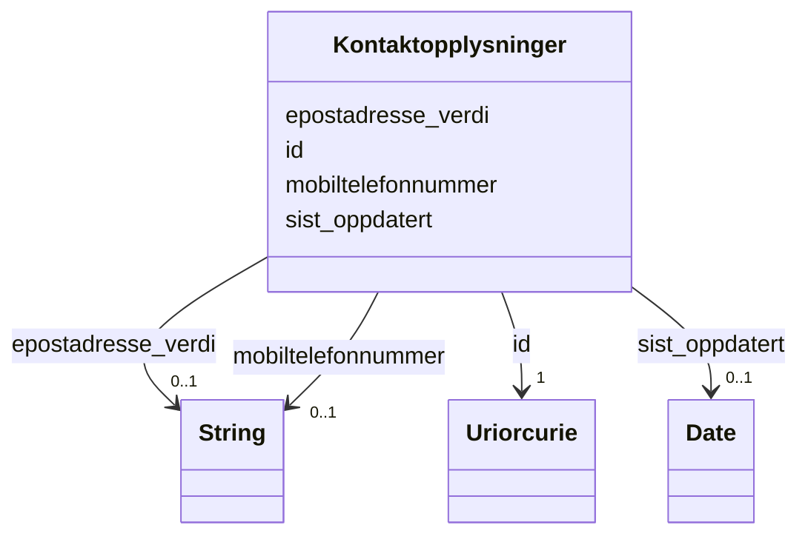

# Class: Kontaktopplysninger 


_Kontaktopplysningar (e-post og mobilnummer) for digital kommunikasjon med det offentlege. Forvaltast av Kontakt- og reservasjonsregisteret (KRR)._


URI: [ngrp:Kontaktopplysninger](https://data.norge.no/vocabulary/ngr-person#Kontaktopplysninger)





<!-- no inheritance hierarchy -->

## Class Properties

| Property | Value |
| --- | --- |
| Class URI | [ngrp:Kontaktopplysninger](https://data.norge.no/vocabulary/ngr-person#Kontaktopplysninger) |


## Eigenskapar


  
  

  
  

  
  

  
  


  
  

  
  
    
  

  
  
    
  

  
  


### Anbefalt

| Namn | Kardinalitet og domene | Beskriving |
| --- | --- | --- |
| [epostadresse_verdi](epostadresse_verdi.md) | 0..1 <br/> [xsd:string](http://www.w3.org/2001/XMLSchema#string) | E-postadresse |
| [mobiltelefonnummer](mobiltelefonnummer.md) | 0..1 <br/> [xsd:string](http://www.w3.org/2001/XMLSchema#string) | Mobiltelefonnummer registrert i KRR |


  
  

  
  

  
  

  
  
    
  


### Valgfri

| Namn | Kardinalitet og domene | Beskriving |
| --- | --- | --- |
| [sist_oppdatert](sist_oppdatert.md) | 0..1 <br/> [xsd:date](http://www.w3.org/2001/XMLSchema#date) | Dato kontaktopplysningane sist vart oppdatert |


  
  
  
  
    
  

  
  
  
    
      
    
      
    
      
    
  
  

  
  
  
    
      
    
      
    
      
    
  
  

  
  
  
    
      
    
      
    
      
    
  
  


### Andre

| Namn | Kardinalitet og domene | Beskriving |
| --- | --- | --- |
| [id](id.md) | 1 <br/> [xsd:anyURI](http://www.w3.org/2001/XMLSchema#anyURI) | URI-identifikator for ressursen |


## Usages

| used by | used in | type | used |
| ---  | --- | --- | --- |
| [PersonContainer](personcontainer.md) | [kontaktopplysningar](kontaktopplysningar.md) | range | [Kontaktopplysninger](kontaktopplysninger.md) |
| [Person](person.md) | [har_kontaktopplysninger](har_kontaktopplysninger.md) | range | [Kontaktopplysninger](kontaktopplysninger.md) |


## Identifier and Mapping Information


### Schema Source


* from schema: https://data.norge.no/ngr/ngr-person


## Mappings

| Mapping Type | Mapped Value |
| ---  | ---  |
| self | ngrp:Kontaktopplysninger |
| native | https://data.norge.no/ngr/ngr-person/Kontaktopplysninger |


## Examples
### Example: Kontaktopplysninger-kontakt-1

```yaml
id: ngrp:eksempel/kontakt-1
epostadresse_verdi: kari.nordmann@example.no
mobiltelefonnummer: '99012345'
sist_oppdatert: '2024-03-15'

```


## LinkML Source

<!-- TODO: investigate https://stackoverflow.com/questions/37606292/how-to-create-tabbed-code-blocks-in-mkdocs-or-sphinx -->

### Direct

<details>
```yaml
name: Kontaktopplysninger
description: Kontaktopplysningar (e-post og mobilnummer) for digital kommunikasjon
  med det offentlege. Forvaltast av Kontakt- og reservasjonsregisteret (KRR).
from_schema: https://data.norge.no/ngr/ngr-person
rank: 1000
slots:
- id
- epostadresse_verdi
- mobiltelefonnummer
- sist_oppdatert
slot_usage:
  epostadresse_verdi:
    name: epostadresse_verdi
    in_subset:
    - Anbefalt
  mobiltelefonnummer:
    name: mobiltelefonnummer
    in_subset:
    - Anbefalt
  sist_oppdatert:
    name: sist_oppdatert
    in_subset:
    - Valgfri
class_uri: ngrp:Kontaktopplysninger

```
</details>

### Induced

<details>
```yaml
name: Kontaktopplysninger
description: Kontaktopplysningar (e-post og mobilnummer) for digital kommunikasjon
  med det offentlege. Forvaltast av Kontakt- og reservasjonsregisteret (KRR).
from_schema: https://data.norge.no/ngr/ngr-person
rank: 1000
slot_usage:
  epostadresse_verdi:
    name: epostadresse_verdi
    in_subset:
    - Anbefalt
  mobiltelefonnummer:
    name: mobiltelefonnummer
    in_subset:
    - Anbefalt
  sist_oppdatert:
    name: sist_oppdatert
    in_subset:
    - Valgfri
attributes:
  id:
    name: id
    description: URI-identifikator for ressursen.
    from_schema: https://data.norge.no/ngr/ngr-person
    rank: 1000
    identifier: true
    owner: Kontaktopplysninger
    domain_of:
    - Person
    - Personnavn
    - Folkeregisteridentifikator
    - Personidentifikasjon
    - FalskIdentitet
    - Identifikasjonsdokument
    - Identitetsgrunnlag
    - Kjoenn
    - Sivilstand
    - Personstatus
    - Statsborgerskap
    - Opphold
    - Foedsel
    - Dodsfall
    - KontaktinformasjonDoedsbo
    - ForeldreansvarForelder
    - ForeldreansvarBarn
    - FamilierelasjonForelder
    - FamilierelasjonBarn
    - FamilierelasjonEktefelle
    - InnflyttingTilNorge
    - UtflyttingFraNorge
    - GeografiskAdresse
    - Adressebeskyttelse
    - Verge
    - RettsligHandleevne
    - ReservasjonMotKommunikasjonPaaNett
    - Kontaktopplysninger
    - SpraakForElektroniskKommunikasjon
    range: uriorcurie
    required: true
  epostadresse_verdi:
    name: epostadresse_verdi
    description: E-postadresse.
    in_subset:
    - Anbefalt
    from_schema: https://data.norge.no/ngr/ngr-person
    rank: 1000
    slot_uri: ngrp:epostadresse
    owner: Kontaktopplysninger
    domain_of:
    - KontaktinformasjonDoedsbo
    - Kontaktopplysninger
    range: string
  mobiltelefonnummer:
    name: mobiltelefonnummer
    description: Mobiltelefonnummer registrert i KRR.
    in_subset:
    - Anbefalt
    from_schema: https://data.norge.no/ngr/ngr-person
    rank: 1000
    slot_uri: ngrp:mobiltelefonnummer
    owner: Kontaktopplysninger
    domain_of:
    - Kontaktopplysninger
    range: string
  sist_oppdatert:
    name: sist_oppdatert
    description: Dato kontaktopplysningane sist vart oppdatert.
    in_subset:
    - Valgfri
    from_schema: https://data.norge.no/ngr/ngr-person
    rank: 1000
    slot_uri: ngrp:sistOppdatert
    owner: Kontaktopplysninger
    domain_of:
    - Kontaktopplysninger
    range: date
class_uri: ngrp:Kontaktopplysninger

```
</details>