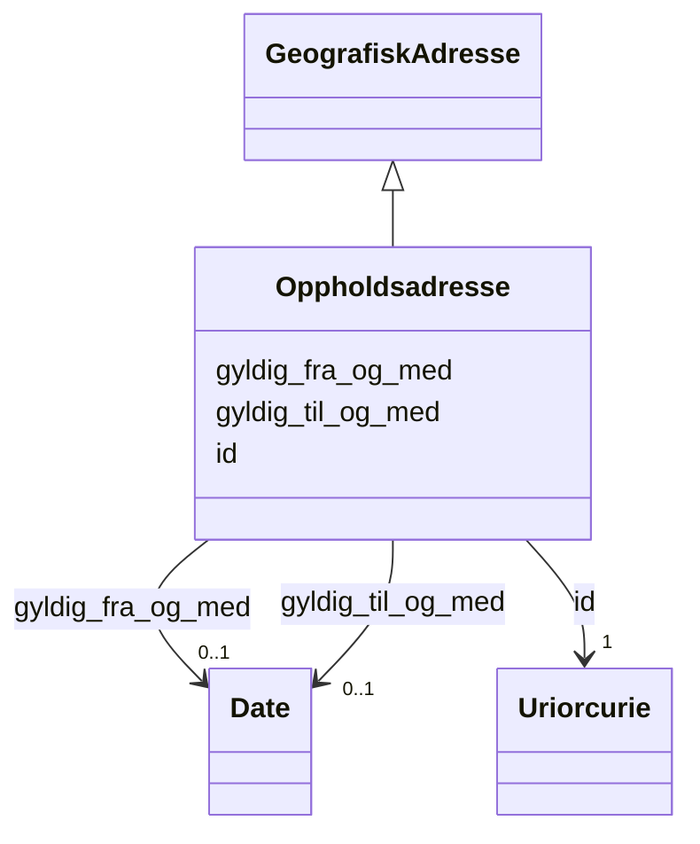

# Class: Oppholdsadresse 


_Adressa der personen faktisk oppheld seg (ikkje nødvendigvis bustadsadressa)._


URI: [ngrp:Oppholdsadresse](https://data.norge.no/vocabulary/ngr-person#Oppholdsadresse)





## Inheritance
* [GeografiskAdresse](geografiskadresse.md)
    * **Oppholdsadresse**


## Class Properties

| Property | Value |
| --- | --- |
| Class URI | [ngrp:Oppholdsadresse](https://data.norge.no/vocabulary/ngr-person#Oppholdsadresse) |


## Eigenskapar


  
  

  
  


  
  
    
  

  
  


### Anbefalt

| Namn | Kardinalitet og domene | Beskriving |
| --- | --- | --- |
| [gyldig_fra_og_med](gyldig_fra_og_med.md) | 0..1 <br/> [xsd:date](http://www.w3.org/2001/XMLSchema#date) | Dato opplysinga er gyldig frå og med |


  
  

  
  
    
  


### Valgfri

| Namn | Kardinalitet og domene | Beskriving |
| --- | --- | --- |
| [gyldig_til_og_med](gyldig_til_og_med.md) | 0..1 <br/> [xsd:date](http://www.w3.org/2001/XMLSchema#date) | Dato opplysinga er gyldig til og med |


  
  
  
    
      
    
      
    
      
    
  
  

  
  
  
    
      
    
      
    
      
    
  
  


### Arva

| Namn | Kardinalitet og domene | Beskriving | Frå |
| --- | --- | --- | --- || [id](id.md) | 1 <br/> [xsd:anyURI](http://www.w3.org/2001/XMLSchema#anyURI) | URI-identifikator for ressursen | [GeografiskAdresse](geografiskadresse.md) |


## Usages

| used by | used in | type | used |
| ---  | --- | --- | --- |
| [PersonContainer](personcontainer.md) | [oppholdsadresser](oppholdsadresser.md) | range | [Oppholdsadresse](oppholdsadresse.md) |
| [Person](person.md) | [oppholder_seg_paa](oppholder_seg_paa.md) | range | [Oppholdsadresse](oppholdsadresse.md) |


## Identifier and Mapping Information


### Schema Source


* from schema: https://data.norge.no/ngr/ngr-person


## Mappings

| Mapping Type | Mapped Value |
| ---  | ---  |
| self | ngrp:Oppholdsadresse |
| native | https://data.norge.no/ngr/ngr-person/Oppholdsadresse |


## LinkML Source

<!-- TODO: investigate https://stackoverflow.com/questions/37606292/how-to-create-tabbed-code-blocks-in-mkdocs-or-sphinx -->

### Direct

<details>
```yaml
name: Oppholdsadresse
description: Adressa der personen faktisk oppheld seg (ikkje nødvendigvis bustadsadressa).
from_schema: https://data.norge.no/ngr/ngr-person
rank: 1000
is_a: GeografiskAdresse
slots:
- gyldig_fra_og_med
- gyldig_til_og_med
slot_usage:
  gyldig_fra_og_med:
    name: gyldig_fra_og_med
    in_subset:
    - Anbefalt
  gyldig_til_og_med:
    name: gyldig_til_og_med
    in_subset:
    - Valgfri
class_uri: ngrp:Oppholdsadresse

```
</details>

### Induced

<details>
```yaml
name: Oppholdsadresse
description: Adressa der personen faktisk oppheld seg (ikkje nødvendigvis bustadsadressa).
from_schema: https://data.norge.no/ngr/ngr-person
rank: 1000
is_a: GeografiskAdresse
slot_usage:
  gyldig_fra_og_med:
    name: gyldig_fra_og_med
    in_subset:
    - Anbefalt
  gyldig_til_og_med:
    name: gyldig_til_og_med
    in_subset:
    - Valgfri
attributes:
  gyldig_fra_og_med:
    name: gyldig_fra_og_med
    description: Dato opplysinga er gyldig frå og med.
    in_subset:
    - Anbefalt
    from_schema: https://data.norge.no/ngr/ngr-person
    rank: 1000
    slot_uri: ngrp:gyldigFraOgMed
    owner: Oppholdsadresse
    domain_of:
    - Kjoenn
    - Sivilstand
    - Personstatus
    - Statsborgerskap
    - Opphold
    - Bostedsadresse
    - Postadresse
    - Oppholdsadresse
    - ReservasjonMotKommunikasjonPaaNett
    range: date
  gyldig_til_og_med:
    name: gyldig_til_og_med
    description: Dato opplysinga er gyldig til og med.
    in_subset:
    - Valgfri
    from_schema: https://data.norge.no/ngr/ngr-person
    rank: 1000
    slot_uri: ngrp:gyldigTilOgMed
    owner: Oppholdsadresse
    domain_of:
    - Statsborgerskap
    - Opphold
    - Bostedsadresse
    - Postadresse
    - Oppholdsadresse
    range: date
  id:
    name: id
    description: URI-identifikator for ressursen.
    from_schema: https://data.norge.no/ngr/ngr-person
    rank: 1000
    identifier: true
    owner: Oppholdsadresse
    domain_of:
    - Person
    - Personnavn
    - Folkeregisteridentifikator
    - Personidentifikasjon
    - FalskIdentitet
    - Identifikasjonsdokument
    - Identitetsgrunnlag
    - Kjoenn
    - Sivilstand
    - Personstatus
    - Statsborgerskap
    - Opphold
    - Foedsel
    - Dodsfall
    - KontaktinformasjonDoedsbo
    - ForeldreansvarForelder
    - ForeldreansvarBarn
    - FamilierelasjonForelder
    - FamilierelasjonBarn
    - FamilierelasjonEktefelle
    - InnflyttingTilNorge
    - UtflyttingFraNorge
    - GeografiskAdresse
    - Adressebeskyttelse
    - Verge
    - RettsligHandleevne
    - ReservasjonMotKommunikasjonPaaNett
    - Kontaktopplysninger
    - SpraakForElektroniskKommunikasjon
    range: uriorcurie
    required: true
class_uri: ngrp:Oppholdsadresse

```
</details>