# Class: PersonContainer 


_Rotklasse for NGR-person-datafiler. Held flate lister av alle instansierbare klassar; referansar mellom objekt brukar URI-lenking._


URI: [https://data.norge.no/ngr/ngr-person/PersonContainer](https://data.norge.no/ngr/ngr-person/PersonContainer)

```mermaid
 classDiagram
    class PersonContainer
    click PersonContainer href "../PersonContainer/"
      PersonContainer : adressebeskyttelse
        
          
    
        
        
        PersonContainer --> "*" Adressebeskyttelse : adressebeskyttelse
        click Adressebeskyttelse href "../Adressebeskyttelse/"
    

        
      PersonContainer : bostedsadresser
        
          
    
        
        
        PersonContainer --> "*" Bostedsadresse : bostedsadresser
        click Bostedsadresse href "../Bostedsadresse/"
    

        
      PersonContainer : dnummer
        
          
    
        
        
        PersonContainer --> "*" DNummer : dnummer
        click DNummer href "../DNummer/"
    

        
      PersonContainer : dodsfall
        
          
    
        
        
        PersonContainer --> "*" Dodsfall : dodsfall
        click Dodsfall href "../Dodsfall/"
    

        
      PersonContainer : falskIdentitetar
        
          
    
        
        
        PersonContainer --> "*" FalskIdentitet : falskIdentitetar
        click FalskIdentitet href "../FalskIdentitet/"
    

        
      PersonContainer : familierelasjonBarn
        
          
    
        
        
        PersonContainer --> "*" FamilierelasjonBarn : familierelasjonBarn
        click FamilierelasjonBarn href "../FamilierelasjonBarn/"
    

        
      PersonContainer : familierelasjonEktefelle
        
          
    
        
        
        PersonContainer --> "*" FamilierelasjonEktefelle : familierelasjonEktefelle
        click FamilierelasjonEktefelle href "../FamilierelasjonEktefelle/"
    

        
      PersonContainer : familierelasjonForelder
        
          
    
        
        
        PersonContainer --> "*" FamilierelasjonForelder : familierelasjonForelder
        click FamilierelasjonForelder href "../FamilierelasjonForelder/"
    

        
      PersonContainer : foedselsnummer
        
          
    
        
        
        PersonContainer --> "*" Foedselsnummer : foedselsnummer
        click Foedselsnummer href "../Foedselsnummer/"
    

        
      PersonContainer : foedslar
        
          
    
        
        
        PersonContainer --> "*" Foedsel : foedslar
        click Foedsel href "../Foedsel/"
    

        
      PersonContainer : foreldreansvarBarn
        
          
    
        
        
        PersonContainer --> "*" ForeldreansvarBarn : foreldreansvarBarn
        click ForeldreansvarBarn href "../ForeldreansvarBarn/"
    

        
      PersonContainer : foreldreansvarForelder
        
          
    
        
        
        PersonContainer --> "*" ForeldreansvarForelder : foreldreansvarForelder
        click ForeldreansvarForelder href "../ForeldreansvarForelder/"
    

        
      PersonContainer : identifikasjonsdokument
        
          
    
        
        
        PersonContainer --> "*" Identifikasjonsdokument : identifikasjonsdokument
        click Identifikasjonsdokument href "../Identifikasjonsdokument/"
    

        
      PersonContainer : identitetsgrunnlag
        
          
    
        
        
        PersonContainer --> "*" Identitetsgrunnlag : identitetsgrunnlag
        click Identitetsgrunnlag href "../Identitetsgrunnlag/"
    

        
      PersonContainer : innflytting
        
          
    
        
        
        PersonContainer --> "*" InnflyttingTilNorge : innflytting
        click InnflyttingTilNorge href "../InnflyttingTilNorge/"
    

        
      PersonContainer : kjoenn
        
          
    
        
        
        PersonContainer --> "*" Kjoenn : kjoenn
        click Kjoenn href "../Kjoenn/"
    

        
      PersonContainer : kontaktinformasjonDoedsbo
        
          
    
        
        
        PersonContainer --> "*" KontaktinformasjonDoedsbo : kontaktinformasjonDoedsbo
        click KontaktinformasjonDoedsbo href "../KontaktinformasjonDoedsbo/"
    

        
      PersonContainer : kontaktopplysningar
        
          
    
        
        
        PersonContainer --> "*" Kontaktopplysninger : kontaktopplysningar
        click Kontaktopplysninger href "../Kontaktopplysninger/"
    

        
      PersonContainer : opphold
        
          
    
        
        
        PersonContainer --> "*" Opphold : opphold
        click Opphold href "../Opphold/"
    

        
      PersonContainer : oppholdsadresser
        
          
    
        
        
        PersonContainer --> "*" Oppholdsadresse : oppholdsadresser
        click Oppholdsadresse href "../Oppholdsadresse/"
    

        
      PersonContainer : personar
        
          
    
        
        
        PersonContainer --> "*" Person : personar
        click Person href "../Person/"
    

        
      PersonContainer : personidentifikasjonar
        
          
    
        
        
        PersonContainer --> "*" Personidentifikasjon : personidentifikasjonar
        click Personidentifikasjon href "../Personidentifikasjon/"
    

        
      PersonContainer : personnavn
        
          
    
        
        
        PersonContainer --> "*" Personnavn : personnavn
        click Personnavn href "../Personnavn/"
    

        
      PersonContainer : personstatus
        
          
    
        
        
        PersonContainer --> "*" Personstatus : personstatus
        click Personstatus href "../Personstatus/"
    

        
      PersonContainer : postadresser
        
          
    
        
        
        PersonContainer --> "*" Postadresse : postadresser
        click Postadresse href "../Postadresse/"
    

        
      PersonContainer : reservasjonar
        
          
    
        
        
        PersonContainer --> "*" ReservasjonMotKommunikasjonPaaNett : reservasjonar
        click ReservasjonMotKommunikasjonPaaNett href "../ReservasjonMotKommunikasjonPaaNett/"
    

        
      PersonContainer : rettsligHandleevne
        
          
    
        
        
        PersonContainer --> "*" RettsligHandleevne : rettsligHandleevne
        click RettsligHandleevne href "../RettsligHandleevne/"
    

        
      PersonContainer : sivilstand
        
          
    
        
        
        PersonContainer --> "*" Sivilstand : sivilstand
        click Sivilstand href "../Sivilstand/"
    

        
      PersonContainer : spraak
        
          
    
        
        
        PersonContainer --> "*" SpraakForElektroniskKommunikasjon : spraak
        click SpraakForElektroniskKommunikasjon href "../SpraakForElektroniskKommunikasjon/"
    

        
      PersonContainer : statsborgerskap
        
          
    
        
        
        PersonContainer --> "*" Statsborgerskap : statsborgerskap
        click Statsborgerskap href "../Statsborgerskap/"
    

        
      PersonContainer : utflytting
        
          
    
        
        
        PersonContainer --> "*" UtflyttingFraNorge : utflytting
        click UtflyttingFraNorge href "../UtflyttingFraNorge/"
    

        
      PersonContainer : verger
        
          
    
        
        
        PersonContainer --> "*" Verge : verger
        click Verge href "../Verge/"
    

        
      
```





<!-- no inheritance hierarchy -->

## Class Properties

| Property | Value |
| --- | --- |
| Tree Root | Yes |


## Eigenskapar


  
  

  
  

  
  

  
  

  
  

  
  

  
  

  
  

  
  

  
  

  
  

  
  

  
  

  
  

  
  

  
  

  
  

  
  

  
  

  
  

  
  

  
  

  
  

  
  

  
  

  
  

  
  

  
  

  
  

  
  

  
  

  
  


  
  

  
  

  
  

  
  

  
  

  
  

  
  

  
  

  
  

  
  

  
  

  
  

  
  

  
  

  
  

  
  

  
  

  
  

  
  

  
  

  
  

  
  

  
  

  
  

  
  

  
  

  
  

  
  

  
  

  
  

  
  

  
  


  
  

  
  

  
  

  
  

  
  

  
  

  
  

  
  

  
  

  
  

  
  

  
  

  
  

  
  

  
  

  
  

  
  

  
  

  
  

  
  

  
  

  
  

  
  

  
  

  
  

  
  

  
  

  
  

  
  

  
  

  
  

  
  


  
  
  
  
    
  

  
  
  
  
    
  

  
  
  
  
    
  

  
  
  
  
    
  

  
  
  
  
    
  

  
  
  
  
    
  

  
  
  
  
    
  

  
  
  
  
    
  

  
  
  
  
    
  

  
  
  
  
    
  

  
  
  
  
    
  

  
  
  
  
    
  

  
  
  
  
    
  

  
  
  
  
    
  

  
  
  
  
    
  

  
  
  
  
    
  

  
  
  
  
    
  

  
  
  
  
    
  

  
  
  
  
    
  

  
  
  
  
    
  

  
  
  
  
    
  

  
  
  
  
    
  

  
  
  
  
    
  

  
  
  
  
    
  

  
  
  
  
    
  

  
  
  
  
    
  

  
  
  
  
    
  

  
  
  
  
    
  

  
  
  
  
    
  

  
  
  
  
    
  

  
  
  
  
    
  

  
  
  
  
    
  


### Andre

| Namn | Kardinalitet og domene | Beskriving |
| --- | --- | --- |
| [personar](personar.md) | * <br/> [Person](person.md) |  |
| [personnavn](personnavn.md) | * <br/> [Personnavn](personnavn.md) |  |
| [foedselsnummer](foedselsnummer.md) | * <br/> [Foedselsnummer](foedselsnummer.md) |  |
| [dnummer](dnummer.md) | * <br/> [DNummer](dnummer.md) |  |
| [personidentifikasjonar](personidentifikasjonar.md) | * <br/> [Personidentifikasjon](personidentifikasjon.md) |  |
| [falskIdentitetar](falskidentitetar.md) | * <br/> [FalskIdentitet](falskidentitet.md) |  |
| [identifikasjonsdokument](identifikasjonsdokument.md) | * <br/> [Identifikasjonsdokument](identifikasjonsdokument.md) |  |
| [identitetsgrunnlag](identitetsgrunnlag.md) | * <br/> [Identitetsgrunnlag](identitetsgrunnlag.md) |  |
| [kjoenn](kjoenn.md) | * <br/> [Kjoenn](kjoenn.md) |  |
| [sivilstand](sivilstand.md) | * <br/> [Sivilstand](sivilstand.md) |  |
| [personstatus](personstatus.md) | * <br/> [Personstatus](personstatus.md) |  |
| [statsborgerskap](statsborgerskap.md) | * <br/> [Statsborgerskap](statsborgerskap.md) |  |
| [opphold](opphold.md) | * <br/> [Opphold](opphold.md) |  |
| [foedslar](foedslar.md) | * <br/> [Foedsel](foedsel.md) |  |
| [foreldreansvarForelder](foreldreansvarforelder.md) | * <br/> [ForeldreansvarForelder](foreldreansvarforelder.md) |  |
| [foreldreansvarBarn](foreldreansvarbarn.md) | * <br/> [ForeldreansvarBarn](foreldreansvarbarn.md) |  |
| [familierelasjonForelder](familierelasjonforelder.md) | * <br/> [FamilierelasjonForelder](familierelasjonforelder.md) |  |
| [familierelasjonBarn](familierelasjonbarn.md) | * <br/> [FamilierelasjonBarn](familierelasjonbarn.md) |  |
| [familierelasjonEktefelle](familierelasjonektefelle.md) | * <br/> [FamilierelasjonEktefelle](familierelasjonektefelle.md) |  |
| [dodsfall](dodsfall.md) | * <br/> [Dodsfall](dodsfall.md) |  |
| [kontaktinformasjonDoedsbo](kontaktinformasjondoedsbo.md) | * <br/> [KontaktinformasjonDoedsbo](kontaktinformasjondoedsbo.md) |  |
| [innflytting](innflytting.md) | * <br/> [InnflyttingTilNorge](innflyttingtilnorge.md) |  |
| [utflytting](utflytting.md) | * <br/> [UtflyttingFraNorge](utflyttingfranorge.md) |  |
| [adressebeskyttelse](adressebeskyttelse.md) | * <br/> [Adressebeskyttelse](adressebeskyttelse.md) |  |
| [bostedsadresser](bostedsadresser.md) | * <br/> [Bostedsadresse](bostedsadresse.md) |  |
| [postadresser](postadresser.md) | * <br/> [Postadresse](postadresse.md) |  |
| [oppholdsadresser](oppholdsadresser.md) | * <br/> [Oppholdsadresse](oppholdsadresse.md) |  |
| [verger](verger.md) | * <br/> [Verge](verge.md) |  |
| [rettsligHandleevne](rettslighandleevne.md) | * <br/> [RettsligHandleevne](rettslighandleevne.md) |  |
| [reservasjonar](reservasjonar.md) | * <br/> [ReservasjonMotKommunikasjonPaaNett](reservasjonmotkommunikasjonpaanett.md) |  |
| [kontaktopplysningar](kontaktopplysningar.md) | * <br/> [Kontaktopplysninger](kontaktopplysninger.md) |  |
| [spraak](spraak.md) | * <br/> [SpraakForElektroniskKommunikasjon](spraakforelektroniskkommunikasjon.md) |  |


## Identifier and Mapping Information


### Schema Source


* from schema: https://data.norge.no/ngr/ngr-person


## Mappings

| Mapping Type | Mapped Value |
| ---  | ---  |
| self | https://data.norge.no/ngr/ngr-person/PersonContainer |
| native | https://data.norge.no/ngr/ngr-person/PersonContainer |


## LinkML Source

<!-- TODO: investigate https://stackoverflow.com/questions/37606292/how-to-create-tabbed-code-blocks-in-mkdocs-or-sphinx -->

### Direct

<details>
```yaml
name: PersonContainer
description: Rotklasse for NGR-person-datafiler. Held flate lister av alle instansierbare
  klassar; referansar mellom objekt brukar URI-lenking.
from_schema: https://data.norge.no/ngr/ngr-person
rank: 1000
attributes:
  personar:
    name: personar
    from_schema: https://data.norge.no/ngr/ngr-person
    rank: 1000
    domain_of:
    - PersonContainer
    range: Person
    multivalued: true
    inlined_as_list: true
  personnavn:
    name: personnavn
    from_schema: https://data.norge.no/ngr/ngr-person
    rank: 1000
    domain_of:
    - PersonContainer
    range: Personnavn
    multivalued: true
    inlined_as_list: true
  foedselsnummer:
    name: foedselsnummer
    from_schema: https://data.norge.no/ngr/ngr-person
    rank: 1000
    domain_of:
    - PersonContainer
    range: Foedselsnummer
    multivalued: true
    inlined_as_list: true
  dnummer:
    name: dnummer
    from_schema: https://data.norge.no/ngr/ngr-person
    rank: 1000
    domain_of:
    - PersonContainer
    range: DNummer
    multivalued: true
    inlined_as_list: true
  personidentifikasjonar:
    name: personidentifikasjonar
    from_schema: https://data.norge.no/ngr/ngr-person
    rank: 1000
    domain_of:
    - PersonContainer
    range: Personidentifikasjon
    multivalued: true
    inlined_as_list: true
  falskIdentitetar:
    name: falskIdentitetar
    from_schema: https://data.norge.no/ngr/ngr-person
    rank: 1000
    domain_of:
    - PersonContainer
    range: FalskIdentitet
    multivalued: true
    inlined_as_list: true
  identifikasjonsdokument:
    name: identifikasjonsdokument
    from_schema: https://data.norge.no/ngr/ngr-person
    rank: 1000
    domain_of:
    - PersonContainer
    range: Identifikasjonsdokument
    multivalued: true
    inlined_as_list: true
  identitetsgrunnlag:
    name: identitetsgrunnlag
    from_schema: https://data.norge.no/ngr/ngr-person
    rank: 1000
    domain_of:
    - PersonContainer
    range: Identitetsgrunnlag
    multivalued: true
    inlined_as_list: true
  kjoenn:
    name: kjoenn
    from_schema: https://data.norge.no/ngr/ngr-person
    rank: 1000
    domain_of:
    - PersonContainer
    range: Kjoenn
    multivalued: true
    inlined_as_list: true
  sivilstand:
    name: sivilstand
    from_schema: https://data.norge.no/ngr/ngr-person
    rank: 1000
    domain_of:
    - PersonContainer
    range: Sivilstand
    multivalued: true
    inlined_as_list: true
  personstatus:
    name: personstatus
    from_schema: https://data.norge.no/ngr/ngr-person
    rank: 1000
    domain_of:
    - PersonContainer
    range: Personstatus
    multivalued: true
    inlined_as_list: true
  statsborgerskap:
    name: statsborgerskap
    from_schema: https://data.norge.no/ngr/ngr-person
    rank: 1000
    domain_of:
    - PersonContainer
    range: Statsborgerskap
    multivalued: true
    inlined_as_list: true
  opphold:
    name: opphold
    from_schema: https://data.norge.no/ngr/ngr-person
    rank: 1000
    domain_of:
    - PersonContainer
    range: Opphold
    multivalued: true
    inlined_as_list: true
  foedslar:
    name: foedslar
    from_schema: https://data.norge.no/ngr/ngr-person
    rank: 1000
    domain_of:
    - PersonContainer
    range: Foedsel
    multivalued: true
    inlined_as_list: true
  foreldreansvarForelder:
    name: foreldreansvarForelder
    from_schema: https://data.norge.no/ngr/ngr-person
    rank: 1000
    domain_of:
    - PersonContainer
    range: ForeldreansvarForelder
    multivalued: true
    inlined_as_list: true
  foreldreansvarBarn:
    name: foreldreansvarBarn
    from_schema: https://data.norge.no/ngr/ngr-person
    rank: 1000
    domain_of:
    - PersonContainer
    range: ForeldreansvarBarn
    multivalued: true
    inlined_as_list: true
  familierelasjonForelder:
    name: familierelasjonForelder
    from_schema: https://data.norge.no/ngr/ngr-person
    rank: 1000
    domain_of:
    - PersonContainer
    range: FamilierelasjonForelder
    multivalued: true
    inlined_as_list: true
  familierelasjonBarn:
    name: familierelasjonBarn
    from_schema: https://data.norge.no/ngr/ngr-person
    rank: 1000
    domain_of:
    - PersonContainer
    range: FamilierelasjonBarn
    multivalued: true
    inlined_as_list: true
  familierelasjonEktefelle:
    name: familierelasjonEktefelle
    from_schema: https://data.norge.no/ngr/ngr-person
    rank: 1000
    domain_of:
    - PersonContainer
    range: FamilierelasjonEktefelle
    multivalued: true
    inlined_as_list: true
  dodsfall:
    name: dodsfall
    from_schema: https://data.norge.no/ngr/ngr-person
    rank: 1000
    domain_of:
    - PersonContainer
    range: Dodsfall
    multivalued: true
    inlined_as_list: true
  kontaktinformasjonDoedsbo:
    name: kontaktinformasjonDoedsbo
    from_schema: https://data.norge.no/ngr/ngr-person
    rank: 1000
    domain_of:
    - PersonContainer
    range: KontaktinformasjonDoedsbo
    multivalued: true
    inlined_as_list: true
  innflytting:
    name: innflytting
    from_schema: https://data.norge.no/ngr/ngr-person
    rank: 1000
    domain_of:
    - PersonContainer
    range: InnflyttingTilNorge
    multivalued: true
    inlined_as_list: true
  utflytting:
    name: utflytting
    from_schema: https://data.norge.no/ngr/ngr-person
    rank: 1000
    domain_of:
    - PersonContainer
    range: UtflyttingFraNorge
    multivalued: true
    inlined_as_list: true
  adressebeskyttelse:
    name: adressebeskyttelse
    from_schema: https://data.norge.no/ngr/ngr-person
    rank: 1000
    domain_of:
    - PersonContainer
    range: Adressebeskyttelse
    multivalued: true
    inlined_as_list: true
  bostedsadresser:
    name: bostedsadresser
    from_schema: https://data.norge.no/ngr/ngr-person
    rank: 1000
    domain_of:
    - PersonContainer
    range: Bostedsadresse
    multivalued: true
    inlined_as_list: true
  postadresser:
    name: postadresser
    from_schema: https://data.norge.no/ngr/ngr-person
    rank: 1000
    domain_of:
    - PersonContainer
    range: Postadresse
    multivalued: true
    inlined_as_list: true
  oppholdsadresser:
    name: oppholdsadresser
    from_schema: https://data.norge.no/ngr/ngr-person
    rank: 1000
    domain_of:
    - PersonContainer
    range: Oppholdsadresse
    multivalued: true
    inlined_as_list: true
  verger:
    name: verger
    from_schema: https://data.norge.no/ngr/ngr-person
    rank: 1000
    domain_of:
    - PersonContainer
    range: Verge
    multivalued: true
    inlined_as_list: true
  rettsligHandleevne:
    name: rettsligHandleevne
    from_schema: https://data.norge.no/ngr/ngr-person
    rank: 1000
    domain_of:
    - PersonContainer
    range: RettsligHandleevne
    multivalued: true
    inlined_as_list: true
  reservasjonar:
    name: reservasjonar
    from_schema: https://data.norge.no/ngr/ngr-person
    rank: 1000
    domain_of:
    - PersonContainer
    range: ReservasjonMotKommunikasjonPaaNett
    multivalued: true
    inlined_as_list: true
  kontaktopplysningar:
    name: kontaktopplysningar
    from_schema: https://data.norge.no/ngr/ngr-person
    rank: 1000
    domain_of:
    - PersonContainer
    range: Kontaktopplysninger
    multivalued: true
    inlined_as_list: true
  spraak:
    name: spraak
    from_schema: https://data.norge.no/ngr/ngr-person
    rank: 1000
    domain_of:
    - PersonContainer
    range: SpraakForElektroniskKommunikasjon
    multivalued: true
    inlined_as_list: true
tree_root: true

```
</details>

### Induced

<details>
```yaml
name: PersonContainer
description: Rotklasse for NGR-person-datafiler. Held flate lister av alle instansierbare
  klassar; referansar mellom objekt brukar URI-lenking.
from_schema: https://data.norge.no/ngr/ngr-person
rank: 1000
attributes:
  personar:
    name: personar
    from_schema: https://data.norge.no/ngr/ngr-person
    rank: 1000
    owner: PersonContainer
    domain_of:
    - PersonContainer
    range: Person
    multivalued: true
    inlined: true
    inlined_as_list: true
  personnavn:
    name: personnavn
    from_schema: https://data.norge.no/ngr/ngr-person
    rank: 1000
    owner: PersonContainer
    domain_of:
    - PersonContainer
    range: Personnavn
    multivalued: true
    inlined: true
    inlined_as_list: true
  foedselsnummer:
    name: foedselsnummer
    from_schema: https://data.norge.no/ngr/ngr-person
    rank: 1000
    owner: PersonContainer
    domain_of:
    - PersonContainer
    range: Foedselsnummer
    multivalued: true
    inlined: true
    inlined_as_list: true
  dnummer:
    name: dnummer
    from_schema: https://data.norge.no/ngr/ngr-person
    rank: 1000
    owner: PersonContainer
    domain_of:
    - PersonContainer
    range: DNummer
    multivalued: true
    inlined: true
    inlined_as_list: true
  personidentifikasjonar:
    name: personidentifikasjonar
    from_schema: https://data.norge.no/ngr/ngr-person
    rank: 1000
    owner: PersonContainer
    domain_of:
    - PersonContainer
    range: Personidentifikasjon
    multivalued: true
    inlined: true
    inlined_as_list: true
  falskIdentitetar:
    name: falskIdentitetar
    from_schema: https://data.norge.no/ngr/ngr-person
    rank: 1000
    owner: PersonContainer
    domain_of:
    - PersonContainer
    range: FalskIdentitet
    multivalued: true
    inlined: true
    inlined_as_list: true
  identifikasjonsdokument:
    name: identifikasjonsdokument
    from_schema: https://data.norge.no/ngr/ngr-person
    rank: 1000
    owner: PersonContainer
    domain_of:
    - PersonContainer
    range: Identifikasjonsdokument
    multivalued: true
    inlined: true
    inlined_as_list: true
  identitetsgrunnlag:
    name: identitetsgrunnlag
    from_schema: https://data.norge.no/ngr/ngr-person
    rank: 1000
    owner: PersonContainer
    domain_of:
    - PersonContainer
    range: Identitetsgrunnlag
    multivalued: true
    inlined: true
    inlined_as_list: true
  kjoenn:
    name: kjoenn
    from_schema: https://data.norge.no/ngr/ngr-person
    rank: 1000
    owner: PersonContainer
    domain_of:
    - PersonContainer
    range: Kjoenn
    multivalued: true
    inlined: true
    inlined_as_list: true
  sivilstand:
    name: sivilstand
    from_schema: https://data.norge.no/ngr/ngr-person
    rank: 1000
    owner: PersonContainer
    domain_of:
    - PersonContainer
    range: Sivilstand
    multivalued: true
    inlined: true
    inlined_as_list: true
  personstatus:
    name: personstatus
    from_schema: https://data.norge.no/ngr/ngr-person
    rank: 1000
    owner: PersonContainer
    domain_of:
    - PersonContainer
    range: Personstatus
    multivalued: true
    inlined: true
    inlined_as_list: true
  statsborgerskap:
    name: statsborgerskap
    from_schema: https://data.norge.no/ngr/ngr-person
    rank: 1000
    owner: PersonContainer
    domain_of:
    - PersonContainer
    range: Statsborgerskap
    multivalued: true
    inlined: true
    inlined_as_list: true
  opphold:
    name: opphold
    from_schema: https://data.norge.no/ngr/ngr-person
    rank: 1000
    owner: PersonContainer
    domain_of:
    - PersonContainer
    range: Opphold
    multivalued: true
    inlined: true
    inlined_as_list: true
  foedslar:
    name: foedslar
    from_schema: https://data.norge.no/ngr/ngr-person
    rank: 1000
    owner: PersonContainer
    domain_of:
    - PersonContainer
    range: Foedsel
    multivalued: true
    inlined: true
    inlined_as_list: true
  foreldreansvarForelder:
    name: foreldreansvarForelder
    from_schema: https://data.norge.no/ngr/ngr-person
    rank: 1000
    owner: PersonContainer
    domain_of:
    - PersonContainer
    range: ForeldreansvarForelder
    multivalued: true
    inlined: true
    inlined_as_list: true
  foreldreansvarBarn:
    name: foreldreansvarBarn
    from_schema: https://data.norge.no/ngr/ngr-person
    rank: 1000
    owner: PersonContainer
    domain_of:
    - PersonContainer
    range: ForeldreansvarBarn
    multivalued: true
    inlined: true
    inlined_as_list: true
  familierelasjonForelder:
    name: familierelasjonForelder
    from_schema: https://data.norge.no/ngr/ngr-person
    rank: 1000
    owner: PersonContainer
    domain_of:
    - PersonContainer
    range: FamilierelasjonForelder
    multivalued: true
    inlined: true
    inlined_as_list: true
  familierelasjonBarn:
    name: familierelasjonBarn
    from_schema: https://data.norge.no/ngr/ngr-person
    rank: 1000
    owner: PersonContainer
    domain_of:
    - PersonContainer
    range: FamilierelasjonBarn
    multivalued: true
    inlined: true
    inlined_as_list: true
  familierelasjonEktefelle:
    name: familierelasjonEktefelle
    from_schema: https://data.norge.no/ngr/ngr-person
    rank: 1000
    owner: PersonContainer
    domain_of:
    - PersonContainer
    range: FamilierelasjonEktefelle
    multivalued: true
    inlined: true
    inlined_as_list: true
  dodsfall:
    name: dodsfall
    from_schema: https://data.norge.no/ngr/ngr-person
    rank: 1000
    owner: PersonContainer
    domain_of:
    - PersonContainer
    range: Dodsfall
    multivalued: true
    inlined: true
    inlined_as_list: true
  kontaktinformasjonDoedsbo:
    name: kontaktinformasjonDoedsbo
    from_schema: https://data.norge.no/ngr/ngr-person
    rank: 1000
    owner: PersonContainer
    domain_of:
    - PersonContainer
    range: KontaktinformasjonDoedsbo
    multivalued: true
    inlined: true
    inlined_as_list: true
  innflytting:
    name: innflytting
    from_schema: https://data.norge.no/ngr/ngr-person
    rank: 1000
    owner: PersonContainer
    domain_of:
    - PersonContainer
    range: InnflyttingTilNorge
    multivalued: true
    inlined: true
    inlined_as_list: true
  utflytting:
    name: utflytting
    from_schema: https://data.norge.no/ngr/ngr-person
    rank: 1000
    owner: PersonContainer
    domain_of:
    - PersonContainer
    range: UtflyttingFraNorge
    multivalued: true
    inlined: true
    inlined_as_list: true
  adressebeskyttelse:
    name: adressebeskyttelse
    from_schema: https://data.norge.no/ngr/ngr-person
    rank: 1000
    owner: PersonContainer
    domain_of:
    - PersonContainer
    range: Adressebeskyttelse
    multivalued: true
    inlined: true
    inlined_as_list: true
  bostedsadresser:
    name: bostedsadresser
    from_schema: https://data.norge.no/ngr/ngr-person
    rank: 1000
    owner: PersonContainer
    domain_of:
    - PersonContainer
    range: Bostedsadresse
    multivalued: true
    inlined: true
    inlined_as_list: true
  postadresser:
    name: postadresser
    from_schema: https://data.norge.no/ngr/ngr-person
    rank: 1000
    owner: PersonContainer
    domain_of:
    - PersonContainer
    range: Postadresse
    multivalued: true
    inlined: true
    inlined_as_list: true
  oppholdsadresser:
    name: oppholdsadresser
    from_schema: https://data.norge.no/ngr/ngr-person
    rank: 1000
    owner: PersonContainer
    domain_of:
    - PersonContainer
    range: Oppholdsadresse
    multivalued: true
    inlined: true
    inlined_as_list: true
  verger:
    name: verger
    from_schema: https://data.norge.no/ngr/ngr-person
    rank: 1000
    owner: PersonContainer
    domain_of:
    - PersonContainer
    range: Verge
    multivalued: true
    inlined: true
    inlined_as_list: true
  rettsligHandleevne:
    name: rettsligHandleevne
    from_schema: https://data.norge.no/ngr/ngr-person
    rank: 1000
    owner: PersonContainer
    domain_of:
    - PersonContainer
    range: RettsligHandleevne
    multivalued: true
    inlined: true
    inlined_as_list: true
  reservasjonar:
    name: reservasjonar
    from_schema: https://data.norge.no/ngr/ngr-person
    rank: 1000
    owner: PersonContainer
    domain_of:
    - PersonContainer
    range: ReservasjonMotKommunikasjonPaaNett
    multivalued: true
    inlined: true
    inlined_as_list: true
  kontaktopplysningar:
    name: kontaktopplysningar
    from_schema: https://data.norge.no/ngr/ngr-person
    rank: 1000
    owner: PersonContainer
    domain_of:
    - PersonContainer
    range: Kontaktopplysninger
    multivalued: true
    inlined: true
    inlined_as_list: true
  spraak:
    name: spraak
    from_schema: https://data.norge.no/ngr/ngr-person
    rank: 1000
    owner: PersonContainer
    domain_of:
    - PersonContainer
    range: SpraakForElektroniskKommunikasjon
    multivalued: true
    inlined: true
    inlined_as_list: true
tree_root: true

```
</details>