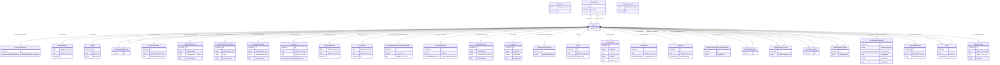

```mermaid
erDiagram
Adressebeskyttelse {
    uriorcurie id  
    AdressebeskyttelseGradering adressebeskyttelse_gradering  
}
Bostedsadresse {
    date gyldig_fra_og_med  
    date gyldig_til_og_med  
    uriorcurie id  
}
DNummer {
    string identifikatornummer  
    uriorcurie id  
}
Dodsfall {
    uriorcurie id  
    date doedsdato  
    string doedssted  
}
FalskIdentitet {
    uriorcurie id  
    boolean er_falsk  
    boolean rett_identitet_er_ukjent  
}
FamilierelasjonBarn {
    uriorcurie id  
}
FamilierelasjonEktefelle {
    uriorcurie id  
}
FamilierelasjonForelder {
    uriorcurie id  
    string foreldrerelasjon_type  
}
Foedsel {
    uriorcurie id  
    string foedested  
    integer foedselsaar  
    date foedselsdato  
}
Foedselsnummer {
    string identifikatornummer  
    uriorcurie id  
}
Folkeregisteridentifikator {
    uriorcurie id  
    string identifikatornummer  
}
ForeldreansvarBarn {
    uriorcurie id  
}
ForeldreansvarForelder {
    uriorcurie id  
    string ansvarsstatus  
}
Identifikasjonsdokument {
    uriorcurie id  
    string dokumentnummer  
    IdentifikasjonsdokumentType dokumenttype  
    date utloepsdato  
    string utstederland  
    date utstedtdato  
}
Identitetsgrunnlag {
    uriorcurie id  
    string identitetsgrunnlag_kilde  
    string identitetsgrunnlag_status  
}
InnflyttingTilNorge {
    uriorcurie id  
    string fraflyttingsland  
    string fraflyttingssted_i_utlandet  
    date innflyttingsdato  
}
Kjoenn {
    uriorcurie id  
    date gyldig_fra_og_med  
    KjoennKode kjoenn_kode  
}
KontaktinformasjonDoedsbo {
    uriorcurie id  
    string epostadresse_verdi  
    string navn  
    string telefonnummer  
}
Kontaktopplysninger {
    uriorcurie id  
    string epostadresse_verdi  
    string mobiltelefonnummer  
    date sist_oppdatert  
}
Opphold {
    uriorcurie id  
    date gyldig_fra_og_med  
    date gyldig_til_og_med  
    OppholdstypeKode oppholds_type  
}
Oppholdsadresse {
    date gyldig_fra_og_med  
    date gyldig_til_og_med  
    uriorcurie id  
}
Person {
    uriorcurie id  
}
Personidentifikasjon {
    uriorcurie id  
    string identifikasjonstype  
    string identifikatornummer  
}
Personnavn {
    uriorcurie id  
    string etternavn  
    string forkortet_navn  
    string fornavn  
    string mellomnavn  
}
Personstatus {
    uriorcurie id  
    date gyldig_fra_og_med  
    PersonstatusType personstatus_type  
}
Postadresse {
    date gyldig_fra_og_med  
    date gyldig_til_og_med  
    uriorcurie id  
}
ReservasjonMotKommunikasjonPaaNett {
    uriorcurie id  
    boolean er_reservert  
    date gyldig_fra_og_med  
}
RettsligHandleevne {
    uriorcurie id  
    string omfang  
    RettsligHandleevneType rettslig_handleevne_type  
}
Sivilstand {
    uriorcurie id  
    date gyldig_fra_og_med  
    SivilstandType sivilstand_type  
}
SpraakForElektroniskKommunikasjon {
    uriorcurie id  
    string spraakkode  
}
Statsborgerskap {
    uriorcurie id  
    date gyldig_fra_og_med  
    date gyldig_til_og_med  
    string landkode  
}
UtflyttingFraNorge {
    uriorcurie id  
    string tilflyttingsland  
    string tilflyttingssted_i_utlandet  
    date utflyttingsdato  
}
Verge {
    uriorcurie id  
    string embete  
    VergetypeKode vergetype  
}

FalskIdentitet ||--|o Person : "rett_identitet"
FamilierelasjonBarn ||--|| Person : "er_av_type_person"
FamilierelasjonEktefelle ||--|| Person : "er_av_type_person"
FamilierelasjonForelder ||--|| Person : "er_av_type_person"
ForeldreansvarBarn ||--|| Person : "er_av_type_person"
ForeldreansvarForelder ||--|| Person : "er_av_type_person"
Person ||--|o Adressebeskyttelse : "har_adressebeskyttelse"
Person ||--|o Bostedsadresse : "har_bosted_paa"
Person ||--|o Dodsfall : "har_dodsfall"
Person ||--|o FalskIdentitet : "har_falsk_identitet"
Person ||--|o FamilierelasjonEktefelle : "har_familierelasjon_ektefelle"
Person ||--|o Identitetsgrunnlag : "har_identitetsgrunnlag"
Person ||--|o InnflyttingTilNorge : "har_innflytting_til_norge"
Person ||--|o KontaktinformasjonDoedsbo : "har_kontaktinformasjon_doedsbo"
Person ||--|o Kontaktopplysninger : "har_kontaktopplysninger"
Person ||--|o Opphold : "har_lovlig_opphold"
Person ||--|o Oppholdsadresse : "oppholder_seg_paa"
Person ||--|o Postadresse : "mottar_post_paa"
Person ||--|o ReservasjonMotKommunikasjonPaaNett : "har_reservasjon_mot_kommunikasjon"
Person ||--|o RettsligHandleevne : "har_rettslig_handleevne"
Person ||--|o UtflyttingFraNorge : "har_utflytting_fra_norge"
Person ||--|| Foedsel : "har_foedsel"
Person ||--|| Folkeregisteridentifikator : "har_folkeregisteridentifikator"
Person ||--|| Kjoenn : "har_kjoenn"
Person ||--|| Personnavn : "har_personnavn"
Person ||--|| Personstatus : "har_personstatus"
Person ||--|| Sivilstand : "har_sivilstand"
Person ||--|| SpraakForElektroniskKommunikasjon : "har_valgt_spraak"
Person ||--}o FamilierelasjonBarn : "har_familierelasjon_barn"
Person ||--}o FamilierelasjonForelder : "har_familierelasjon_forelder"
Person ||--}o ForeldreansvarBarn : "har_foreldreansvar_barn"
Person ||--}o ForeldreansvarForelder : "har_foreldreansvar_forelder"
Person ||--}o Identifikasjonsdokument : "har_utenlandsk_identifikasjonsdokument"
Person ||--}o Personidentifikasjon : "har_personidentifikasjon"
Person ||--}o Verge : "har_verge"
Person ||--}| Statsborgerskap : "har_statsborgerskap"
Sivilstand ||--|o Person : "relatert_ved_sivilstand"
Verge ||--|| Person : "er_av_type_person"

```

