# ngr-virksomhet

```mermaid
erDiagram
Aktivitet {
    uriorcurie id  
    string aktivitet_beskrivelse  
}
Beliggenhetsadresse {
    uriorcurie id  
}
Forretningsadresse {
    uriorcurie id  
}
Hovedenhet {
    date stiftelsesdato  
    uriorcurie id  
    integer antall_ansatte  
    string navn  
    string organisasjonsnummer  
}
Kontaktinformasjon {
    uriorcurie id  
    string epostadresse  
    string mobiltelefonnummer  
    string nettside  
    string telefonnummer  
}
Naeringskode {
    uriorcurie id  
    boolean er_hovednaeringskode  
    string naeringskode_beskrivelse  
    string naeringskode_kode  
}
Organisasjonsform {
    uriorcurie id  
    string organisasjonsform_beskrivelse  
    string organisasjonsform_kode  
}
Person {
    uriorcurie id  
}
Postadresse {
    uriorcurie id  
}
Prokura {
    uriorcurie id  
    string prokura_bestemmelse  
}
RolleIVirksomhet {
    uriorcurie id  
    RolleType rollebetegnelse  
}
Rolleinnehaver {
    uriorcurie id  
    string rolleinnehaver_navn  
}
Sektorkode {
    uriorcurie id  
    string sektorkode_beskrivelse  
    string sektorkode_kode  
}
Signaturrett {
    uriorcurie id  
    string signaturrett_bestemmelse  
}
Tilstand {
    uriorcurie id  
    date gyldig_fra  
    date gyldig_til  
    TilstandType tilstandstype  
}
Underenhet {
    dateList eierskiftedatoer  
    date nedleggelsesdato  
    date oppstartsdato  
    uriorcurie id  
    integer antall_ansatte  
    string navn  
    string organisasjonsnummer  
}
Varslingsadresse {
    uriorcurie id  
    VarslingType varslingstype  
    string varslingsverdi  
}

Hovedenhet ||--|o Forretningsadresse : "har_forretningsadresse"
Hovedenhet ||--|o Kontaktinformasjon : "har_kontaktinformasjon"
Hovedenhet ||--|o Postadresse : "mottar_post_paa"
Hovedenhet ||--|o Sektorkode : "er_klassifisert_i_sektorkode"
Hovedenhet ||--|o Signaturrett : "har_bestemmelser_om_signaturrett"
Hovedenhet ||--|| Aktivitet : "utoevar_aktivitet"
Hovedenhet ||--|| Organisasjonsform : "er_klassifisert_som_organisasjonsform"
Hovedenhet ||--|| Varslingsadresse : "har_varslingsadresse"
Hovedenhet ||--}o Prokura : "har_bestemmelser_om_prokura"
Hovedenhet ||--}o Tilstand : "har_tilstand"
Hovedenhet ||--}| Naeringskode : "er_klassifisert_i_naeringskode"
Hovedenhet ||--}| RolleIVirksomhet : "har_rolle_i_virksomhet"
RolleIVirksomhet ||--}o Rolleinnehaver : "har_rolleinnehaver"
Rolleinnehaver ||--|o Person : "kan_vaere_av_type_person"
Underenhet ||--|o Kontaktinformasjon : "har_kontaktinformasjon"
Underenhet ||--|o Postadresse : "mottar_post_paa"
Underenhet ||--|| Beliggenhetsadresse : "har_beliggenhetsadresse"
Underenhet ||--|| Organisasjonsform : "er_klassifisert_som_organisasjonsform"
Underenhet ||--|| Varslingsadresse : "har_varslingsadresse"
Underenhet ||--}o Tilstand : "har_tilstand"
Underenhet ||--}| Naeringskode : "er_klassifisert_i_naeringskode"

```

Domenemodell for verksemdsdata basert på Nasjonale grunndata (utkast). Modellerer Virksomhet med Underenhet og Hovudeining, roller, adresser og klassifikasjonar frå Enhetsregisteret. Basert på https://informasjonsforvaltning.github.io/nasjonale-grunndata/

URI: https://data.norge.no/linkml/ngr-virksomhet

Name: ngr-virksomhet

## Classes

| Class | Description |
| --- | --- |
| [Aktivitet](klasser/aktivitet.md) | Skildring av kva aktivitet ei hovudeining utøver |
| [GeografiskAdresse](klasser/geografiskadresse.md) | Abstrakt klasse for geografiske adresser |
| &nbsp;&nbsp;&nbsp;&nbsp;&nbsp;&nbsp;&nbsp;&nbsp;[Beliggenhetsadresse](klasser/beliggenhetsadresse.md) | Beliggenheitsadressa til underleininga – den fysiske adressa der aktiviteten ... |
| &nbsp;&nbsp;&nbsp;&nbsp;&nbsp;&nbsp;&nbsp;&nbsp;[Forretningsadresse](klasser/forretningsadresse.md) | Forretningsadressa til hovudeininga – adressa der hovudkontoret held til |
| &nbsp;&nbsp;&nbsp;&nbsp;&nbsp;&nbsp;&nbsp;&nbsp;[Postadresse](klasser/postadresse.md) | Postadressa verksemda mottar post på |
| [Kontaktinformasjon](klasser/kontaktinformasjon.md) | Kontaktinformasjon for verksemda registrert i Enhetsregisteret |
| [Naeringskode](klasser/naeringskode.md) | Næringskode basert på SSBs Standard for næringsgruppering (SN2007/NACE) |
| [Organisasjonsform](klasser/organisasjonsform.md) | Klassifikasjon av juridisk organisasjonsform (t |
| [Person](klasser/person.md) | Ein fysisk person |
| [Prokura](klasser/prokura.md) | Prokura gjev ein person fullmakt til å handle på vegne av verksemda i nærings... |
| [Rolleinnehaver](klasser/rolleinnehaver.md) | Den som innehar ein rolle i ei verksemd |
| [RolleIVirksomhet](klasser/rolleivirksomhet.md) | Ein definert rolle i ei hovudeining (t |
| [Sektorkode](klasser/sektorkode.md) | Institusjonell sektorkode som klassifiserer kva sektor verksemda tilhøyrer (t |
| [Signaturrett](klasser/signaturrett.md) | Bestemmelse om kven som har rett til å signere på vegne av verksemda (t |
| [Tilstand](klasser/tilstand.md) | Registrert tilstand (status) for ei verksemd i Enhetsregisteret, med gyldighe... |
| [Varslingsadresse](klasser/varslingsadresse.md) | Offisiell varslingsadresse for verksemda – e-post eller mobilnummer som vert ... |
| [Virksomhet](klasser/virksomhet.md) | Abstrakt overklasse for alle einingar registrert i Enhetsregisteret |
| &nbsp;&nbsp;&nbsp;&nbsp;&nbsp;&nbsp;&nbsp;&nbsp;[Hovedenhet](klasser/hovedenhet.md) | Ei hovudeining er den juridiske eininga registrert i Enhetsregisteret (t |
| &nbsp;&nbsp;&nbsp;&nbsp;&nbsp;&nbsp;&nbsp;&nbsp;[Underenhet](klasser/underenhet.md) | Ei underleining er ein geografisk lokasjon der aktiviteten til ei hovudeining... |
| [VirksomhetContainer](klasser/virksomhetcontainer.md) | Rotklasse for NGR-virksomhet-datafiler |

## Slots

| Slot | Description |
| --- | --- |
| [aktivitet_beskrivelse](klasser/aktivitet_beskrivelse.md) | Skildring av kva aktivitet verksemda utøver (formålsparagraf o |
| [aktivitetar](klasser/aktivitetar.md) |  |
| [antall_ansatte](klasser/antall_ansatte.md) | Antal tilsette i verksemda (rapportert til a-ordninga) |
| [beliggenhetsadresser](klasser/beliggenhetsadresser.md) |  |
| [eierskiftedatoer](klasser/eierskiftedatoer.md) | Dato(ar) for eigarskifte i underleininga |
| [epostadresse](klasser/epostadresse.md) | E-postadresse for verksemda |
| [er_hovednaeringskode](klasser/er_hovednaeringskode.md) | Om dette er hovudnæringskoden til verksemda |
| [er_klassifisert_i_naeringskode](klasser/er_klassifisert_i_naeringskode.md) | Næringskode(r) verksemda er klassifisert under (1–3) |
| [er_klassifisert_i_sektorkode](klasser/er_klassifisert_i_sektorkode.md) | Institusjonell sektorkode for hovudeininga |
| [er_klassifisert_som_organisasjonsform](klasser/er_klassifisert_som_organisasjonsform.md) | Organisasjonsform (juridisk form) for verksemda |
| [forretningsadresser](klasser/forretningsadresser.md) |  |
| [gyldig_fra](klasser/gyldig_fra.md) | Datoen tilstanden vart gyldig frå |
| [gyldig_til](klasser/gyldig_til.md) | Datoen tilstanden vart gyldig til |
| [har_beliggenhetsadresse](klasser/har_beliggenhetsadresse.md) | Beliggenheitsadressa til underleininga |
| [har_bestemmelser_om_prokura](klasser/har_bestemmelser_om_prokura.md) | Prokurabestemmelse(r) for hovudeininga |
| [har_bestemmelser_om_signaturrett](klasser/har_bestemmelser_om_signaturrett.md) | Bestemmelse om signaturrett for hovudeininga |
| [har_forretningsadresse](klasser/har_forretningsadresse.md) | Forretningsadressa (hovudkontor) til hovudeininga |
| [har_kontaktinformasjon](klasser/har_kontaktinformasjon.md) | Kontaktinformasjon registrert på verksemda |
| [har_rolle_i_virksomhet](klasser/har_rolle_i_virksomhet.md) | Roller registrert i hovudeininga (minimum 1) |
| [har_rolleinnehaver](klasser/har_rolleinnehaver.md) | Rolleinnehavar(ar) for denne rolla |
| [har_tilstand](klasser/har_tilstand.md) | Registrert tilstand (status) for verksemda, inkl |
| [har_varslingsadresse](klasser/har_varslingsadresse.md) | Offisiell varslingsadresse for offentlege meldingar |
| [hovedenheter](klasser/hovedenheter.md) |  |
| [id](klasser/id.md) | URI-identifikator for ressursen |
| [kan_vaere_av_type_person](klasser/kan_vaere_av_type_person.md) | Personen som er rolleinnehavar (frå Folkeregisteret) |
| [kontaktinformasjon](klasser/kontaktinformasjon.md) |  |
| [mobiltelefonnummer](klasser/mobiltelefonnummer.md) | Mobiltelefonnummer for verksemda |
| [mottar_post_paa](klasser/mottar_post_paa.md) | Postadressa verksemda mottar post på |
| [naeringskode_beskrivelse](klasser/naeringskode_beskrivelse.md) | Tekstleg skildring av næringskoden |
| [naeringskode_kode](klasser/naeringskode_kode.md) | NACE-kode for næringsgruppering (t |
| [naeringskoder](klasser/naeringskoder.md) |  |
| [navn](klasser/navn.md) | Registrert namn på verksemda i Enhetsregisteret |
| [nedleggelsesdato](klasser/nedleggelsesdato.md) | Datoen underleininga vart lagt ned |
| [nettside](klasser/nettside.md) | URL til nettsida til verksemda |
| [oppstartsdato](klasser/oppstartsdato.md) | Datoen underleininga vart oppretta/starta |
| [organisasjonsform_beskrivelse](klasser/organisasjonsform_beskrivelse.md) | Tekstleg skildring av organisasjonsforma |
| [organisasjonsform_kode](klasser/organisasjonsform_kode.md) | Kode for organisasjonsform (t |
| [organisasjonsformer](klasser/organisasjonsformer.md) |  |
| [organisasjonsnummer](klasser/organisasjonsnummer.md) | Niesifra organisasjonsnummer tildelt av Enhetsregisteret |
| [postadresser](klasser/postadresser.md) |  |
| [prokura_bestemmelse](klasser/prokura_bestemmelse.md) | Tekstleg bestemmelse om prokura og kven som er tildelt den |
| [prokuraer](klasser/prokuraer.md) |  |
| [rollebetegnelse](klasser/rollebetegnelse.md) | Kva type rolle dette er (dagleg leiar, styreleiar o |
| [rolleinnehaver_navn](klasser/rolleinnehaver_navn.md) | Namn på rolleinnehavar (nyttes for institusjonelle rollehavarar) |
| [rolleinnehavere](klasser/rolleinnehavere.md) |  |
| [rollerIVirksomhet](klasser/rollerivirksomhet.md) |  |
| [sektorkode_beskrivelse](klasser/sektorkode_beskrivelse.md) | Tekstleg skildring av sektorkoden |
| [sektorkode_kode](klasser/sektorkode_kode.md) | Institusjonell sektorkode (t |
| [sektorkoder](klasser/sektorkoder.md) |  |
| [signaturrett_bestemmelse](klasser/signaturrett_bestemmelse.md) | Tekstleg bestemmelse om signaturrett (t |
| [signaturrettar](klasser/signaturrettar.md) |  |
| [stiftelsesdato](klasser/stiftelsesdato.md) | Datoen hovudeininga vart stifta |
| [telefonnummer](klasser/telefonnummer.md) | Telefonnummer for verksemda |
| [tilstander](klasser/tilstander.md) |  |
| [tilstandstype](klasser/tilstandstype.md) | Type tilstand (AKTIV, UNDER_KONKURS o |
| [underenheter](klasser/underenheter.md) |  |
| [utoevar_aktivitet](klasser/utoevar_aktivitet.md) | Aktiviteten hovudeininga utøver |
| [varslingsadresser](klasser/varslingsadresser.md) |  |
| [varslingstype](klasser/varslingstype.md) | Kanaltype for varsling (EPOST eller MOBILTELEFON) |
| [varslingsverdi](klasser/varslingsverdi.md) | Verdien for varslingskanalen (e-postadresse eller mobilnummer) |

## Enumerations

| Enumeration | Description |
| --- | --- |
| [RolleType](klasser/rolletype.md) | Type rolle ein person eller eining kan ha i ei verksemd |
| [TilstandType](klasser/tilstandtype.md) | Status for ei verksemd registrert i Enhetsregisteret |
| [VarslingType](klasser/varslingtype.md) | Kanaltype for varsling til verksemda |

## Types

| Type | Description |
| --- | --- |
| [Boolean](klasser/boolean.md) | A binary (true or false) value |
| [Curie](klasser/curie.md) | a compact URI |
| [Date](klasser/date.md) | a date (year, month and day) in an idealized calendar |
| [DateOrDatetime](klasser/dateordatetime.md) | Either a date or a datetime |
| [Datetime](klasser/datetime.md) | The combination of a date and time |
| [Decimal](klasser/decimal.md) | A real number with arbitrary precision that conforms to the xsd:decimal speci... |
| [Double](klasser/double.md) | A real number that conforms to the xsd:double specification |
| [Float](klasser/float.md) | A real number that conforms to the xsd:float specification |
| [Integer](klasser/integer.md) | An integer |
| [Jsonpath](klasser/jsonpath.md) | A string encoding a JSON Path |
| [Jsonpointer](klasser/jsonpointer.md) | A string encoding a JSON Pointer |
| [Ncname](klasser/ncname.md) | Prefix part of CURIE |
| [Nodeidentifier](klasser/nodeidentifier.md) | A URI, CURIE or BNODE that represents a node in a model |
| [Objectidentifier](klasser/objectidentifier.md) | A URI or CURIE that represents an object in the model |
| [Sparqlpath](klasser/sparqlpath.md) | A string encoding a SPARQL Property Path |
| [String](klasser/string.md) | A character string |
| [Time](klasser/time.md) | A time object represents a (local) time of day, independent of any particular... |
| [Uri](klasser/uri.md) | a complete URI |
| [Uriorcurie](klasser/uriorcurie.md) | a URI or a CURIE |

## Subsets

| Subset | Description |
| --- | --- |
| [Anbefalt](klasser/anbefalt.md) | Anbefalte eigenskapar i domenemodellen |
| [Obligatorisk](klasser/obligatorisk.md) | Obligatoriske eigenskapar i domenemodellen |
| [Valgfri](klasser/valgfri.md) | Valfrie eigenskapar i domenemodellen |

## Artifacts

| Artefakt | Fil |
|----------|-----|
| SHACL shapes | [ngr-virksomhet-shapes.ttl](ngr-virksomhet-shapes.ttl) |
| JSON-LD kontekst | [ngr-virksomhet-context.jsonld](ngr-virksomhet-context.jsonld) |
| JSON Schema | [ngr-virksomhet-schema.json](ngr-virksomhet-schema.json) |
| OWL ontologi | [ngr-virksomhet-ontology.ttl](ngr-virksomhet-ontology.ttl) |
| RDF/Turtle skjema | [ngr-virksomhet-schema.ttl](ngr-virksomhet-schema.ttl) |
| Python-klasser | [ngr-virksomhet-model.py](ngr-virksomhet-model.py) |
| ER-diagram (Mermaid) | [ngr-virksomhet-erdiagram.md](ngr-virksomhet-erdiagram.md) |
| Eksempeldata (Turtle) | [ngr-virksomhet-eksempel.ttl](ngr-virksomhet-eksempel.ttl) |
