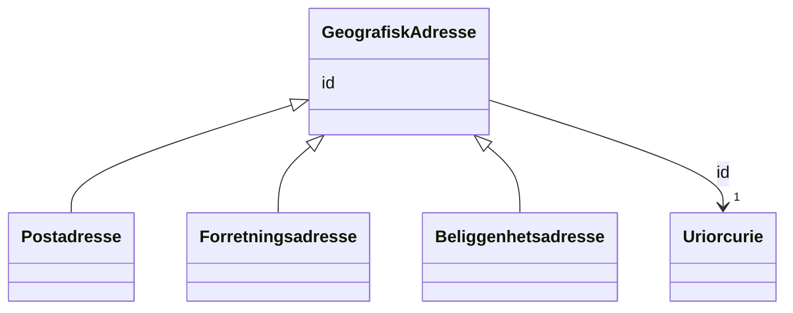

# Class: GeografiskAdresse 


_Abstrakt klasse for geografiske adresser. Tilhøyrer Domene adresse og forvaltast av Matrikkelen. Enhetsregisteret nyttar Kartverket som kjelde til vegadresse, og gjer jamnleg vask mot Posten sitt adresseregister._


* __NOTE__: this is an abstract class and should not be instantiated directly


URI: [ngrv:GeografiskAdresse](https://data.norge.no/vocabulary/ngr-virksomhet#GeografiskAdresse)





## Inheritance
* **GeografiskAdresse**
    * [Postadresse](postadresse.md)
    * [Forretningsadresse](forretningsadresse.md)
    * [Beliggenhetsadresse](beliggenhetsadresse.md)


## Class Properties

| Property | Value |
| --- | --- |
| Class URI | [ngrv:GeografiskAdresse](https://data.norge.no/vocabulary/ngr-virksomhet#GeografiskAdresse) |


## Eigenskapar


  
  


  
  


  
  


  
  
  
  
    
  


### Andre

| Namn | Kardinalitet og domene | Beskriving |
| --- | --- | --- |
| [id](id.md) | 1 <br/> [xsd:anyURI](http://www.w3.org/2001/XMLSchema#anyURI) | URI-identifikator for ressursen |


## Identifier and Mapping Information


### Schema Source


* from schema: https://data.norge.no/linkml/ngr-virksomhet


## Mappings

| Mapping Type | Mapped Value |
| ---  | ---  |
| self | ngrv:GeografiskAdresse |
| native | https://data.norge.no/linkml/ngr-virksomhet/GeografiskAdresse |


## LinkML Source

<!-- TODO: investigate https://stackoverflow.com/questions/37606292/how-to-create-tabbed-code-blocks-in-mkdocs-or-sphinx -->

### Direct

<details>
```yaml
name: GeografiskAdresse
description: Abstrakt klasse for geografiske adresser. Tilhøyrer Domene adresse og
  forvaltast av Matrikkelen. Enhetsregisteret nyttar Kartverket som kjelde til vegadresse,
  og gjer jamnleg vask mot Posten sitt adresseregister.
from_schema: https://data.norge.no/linkml/ngr-virksomhet
rank: 1000
abstract: true
slots:
- id
class_uri: ngrv:GeografiskAdresse

```
</details>

### Induced

<details>
```yaml
name: GeografiskAdresse
description: Abstrakt klasse for geografiske adresser. Tilhøyrer Domene adresse og
  forvaltast av Matrikkelen. Enhetsregisteret nyttar Kartverket som kjelde til vegadresse,
  og gjer jamnleg vask mot Posten sitt adresseregister.
from_schema: https://data.norge.no/linkml/ngr-virksomhet
rank: 1000
abstract: true
attributes:
  id:
    name: id
    description: URI-identifikator for ressursen.
    from_schema: https://data.norge.no/linkml/ngr-virksomhet
    rank: 1000
    identifier: true
    alias: id
    owner: GeografiskAdresse
    domain_of:
    - Virksomhet
    - Tilstand
    - Organisasjonsform
    - Naeringskode
    - Sektorkode
    - Kontaktinformasjon
    - Varslingsadresse
    - Aktivitet
    - RolleIVirksomhet
    - Rolleinnehaver
    - Signaturrett
    - Prokura
    - GeografiskAdresse
    - Person
    range: uriorcurie
    required: true
class_uri: ngrv:GeografiskAdresse

```
</details>