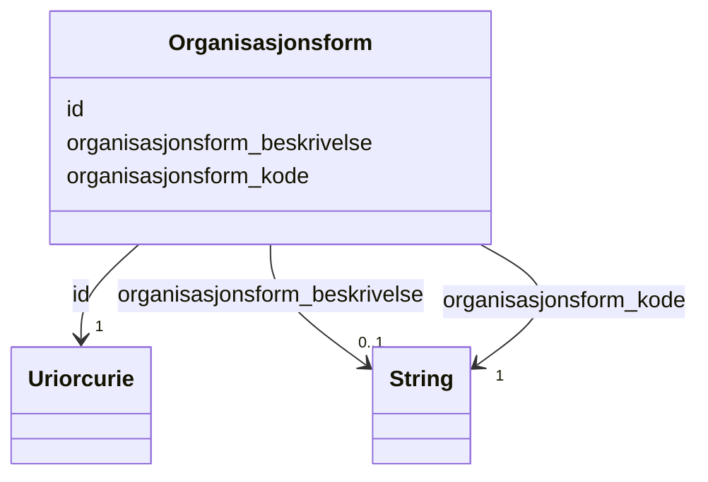

# Class: Organisasjonsform 


_Klassifikasjon av juridisk organisasjonsform (t.d. AS, ENK, BA, NUF). Kodeverk forvalta av Enhetsregisteret._


URI: [ngrv:Organisasjonsform](https://data.norge.no/vocabulary/ngr-virksomhet#Organisasjonsform)





<!-- no inheritance hierarchy -->

## Class Properties

| Property | Value |
| --- | --- |
| Class URI | [ngrv:Organisasjonsform](https://data.norge.no/vocabulary/ngr-virksomhet#Organisasjonsform) |


## Eigenskapar


  
  

  
  
    
  

  
  


### Obligatorisk

| Namn | Kardinalitet og domene | Beskriving |
| --- | --- | --- |
| [organisasjonsform_kode](organisasjonsform_kode.md) | 1 <br/> [xsd:string](http://www.w3.org/2001/XMLSchema#string) | Kode for organisasjonsform (t |


  
  

  
  

  
  
    
  


### Anbefalt

| Namn | Kardinalitet og domene | Beskriving |
| --- | --- | --- |
| [organisasjonsform_beskrivelse](organisasjonsform_beskrivelse.md) | 0..1 <br/> [xsd:string](http://www.w3.org/2001/XMLSchema#string) | Tekstleg skildring av organisasjonsforma |


  
  

  
  

  
  


  
  
  
  
    
  

  
  
  
    
      
    
      
    
      
    
  
  

  
  
  
    
      
    
      
    
      
    
  
  


### Andre

| Namn | Kardinalitet og domene | Beskriving |
| --- | --- | --- |
| [id](id.md) | 1 <br/> [xsd:anyURI](http://www.w3.org/2001/XMLSchema#anyURI) | URI-identifikator for ressursen |


## Usages

| used by | used in | type | used |
| ---  | --- | --- | --- |
| [VirksomhetContainer](virksomhetcontainer.md) | [organisasjonsformer](organisasjonsformer.md) | range | [Organisasjonsform](organisasjonsform.md) |
| [Virksomhet](virksomhet.md) | [er_klassifisert_som_organisasjonsform](er_klassifisert_som_organisasjonsform.md) | range | [Organisasjonsform](organisasjonsform.md) |
| [Underenhet](underenhet.md) | [er_klassifisert_som_organisasjonsform](er_klassifisert_som_organisasjonsform.md) | range | [Organisasjonsform](organisasjonsform.md) |
| [Hovedenhet](hovedenhet.md) | [er_klassifisert_som_organisasjonsform](er_klassifisert_som_organisasjonsform.md) | range | [Organisasjonsform](organisasjonsform.md) |


## Identifier and Mapping Information


### Schema Source


* from schema: https://data.norge.no/linkml/ngr-virksomhet


## Mappings

| Mapping Type | Mapped Value |
| ---  | ---  |
| self | ngrv:Organisasjonsform |
| native | https://data.norge.no/linkml/ngr-virksomhet/Organisasjonsform |


## LinkML Source

<!-- TODO: investigate https://stackoverflow.com/questions/37606292/how-to-create-tabbed-code-blocks-in-mkdocs-or-sphinx -->

### Direct

<details>
```yaml
name: Organisasjonsform
description: Klassifikasjon av juridisk organisasjonsform (t.d. AS, ENK, BA, NUF).
  Kodeverk forvalta av Enhetsregisteret.
from_schema: https://data.norge.no/linkml/ngr-virksomhet
rank: 1000
slots:
- id
- organisasjonsform_kode
- organisasjonsform_beskrivelse
slot_usage:
  organisasjonsform_kode:
    name: organisasjonsform_kode
    in_subset:
    - Obligatorisk
    required: true
  organisasjonsform_beskrivelse:
    name: organisasjonsform_beskrivelse
    in_subset:
    - Anbefalt
class_uri: ngrv:Organisasjonsform

```
</details>

### Induced

<details>
```yaml
name: Organisasjonsform
description: Klassifikasjon av juridisk organisasjonsform (t.d. AS, ENK, BA, NUF).
  Kodeverk forvalta av Enhetsregisteret.
from_schema: https://data.norge.no/linkml/ngr-virksomhet
rank: 1000
slot_usage:
  organisasjonsform_kode:
    name: organisasjonsform_kode
    in_subset:
    - Obligatorisk
    required: true
  organisasjonsform_beskrivelse:
    name: organisasjonsform_beskrivelse
    in_subset:
    - Anbefalt
attributes:
  id:
    name: id
    description: URI-identifikator for ressursen.
    from_schema: https://data.norge.no/linkml/ngr-virksomhet
    rank: 1000
    identifier: true
    alias: id
    owner: Organisasjonsform
    domain_of:
    - Virksomhet
    - Tilstand
    - Organisasjonsform
    - Naeringskode
    - Sektorkode
    - Kontaktinformasjon
    - Varslingsadresse
    - Aktivitet
    - RolleIVirksomhet
    - Rolleinnehaver
    - Signaturrett
    - Prokura
    - GeografiskAdresse
    - Person
    range: uriorcurie
    required: true
  organisasjonsform_kode:
    name: organisasjonsform_kode
    description: Kode for organisasjonsform (t.d. AS, ENK, BA, NUF).
    in_subset:
    - Obligatorisk
    from_schema: https://data.norge.no/linkml/ngr-virksomhet
    rank: 1000
    slot_uri: ngrv:organisasjonsformKode
    alias: organisasjonsform_kode
    owner: Organisasjonsform
    domain_of:
    - Organisasjonsform
    range: string
    required: true
  organisasjonsform_beskrivelse:
    name: organisasjonsform_beskrivelse
    description: Tekstleg skildring av organisasjonsforma.
    in_subset:
    - Anbefalt
    from_schema: https://data.norge.no/linkml/ngr-virksomhet
    rank: 1000
    slot_uri: ngrv:organisasjonsformBeskrivelse
    alias: organisasjonsform_beskrivelse
    owner: Organisasjonsform
    domain_of:
    - Organisasjonsform
    range: string
class_uri: ngrv:Organisasjonsform

```
</details>