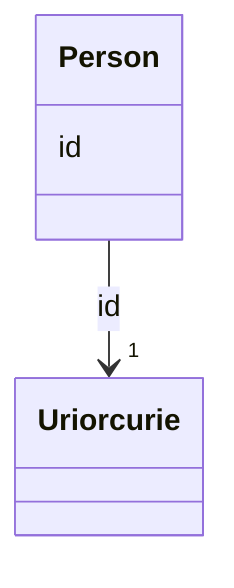

# Class: Person 


_Ein fysisk person. Tilhøyrer Domene person og forvaltast av Folkeregisteret. Enhetsregisteret nyttar kopi av data frå Folkeregisteret._


URI: [ngrv:Person](https://data.norge.no/vocabulary/ngr-virksomhet#Person)





<!-- no inheritance hierarchy -->

## Class Properties

| Property | Value |
| --- | --- |
| Class URI | [ngrv:Person](https://data.norge.no/vocabulary/ngr-virksomhet#Person) |


## Eigenskapar


  
  


  
  


  
  


  
  
  
  
    
  


### Andre

| Namn | Kardinalitet og domene | Beskriving |
| --- | --- | --- |
| [id](id.md) | 1 <br/> [xsd:anyURI](http://www.w3.org/2001/XMLSchema#anyURI) | URI-identifikator for ressursen |


## Usages

| used by | used in | type | used |
| ---  | --- | --- | --- |
| [Rolleinnehaver](rolleinnehaver.md) | [kan_vaere_av_type_person](kan_vaere_av_type_person.md) | range | [Person](person.md) |


## Identifier and Mapping Information


### Schema Source


* from schema: https://data.norge.no/linkml/ngr-virksomhet


## Mappings

| Mapping Type | Mapped Value |
| ---  | ---  |
| self | ngrv:Person |
| native | https://data.norge.no/linkml/ngr-virksomhet/Person |


## LinkML Source

<!-- TODO: investigate https://stackoverflow.com/questions/37606292/how-to-create-tabbed-code-blocks-in-mkdocs-or-sphinx -->

### Direct

<details>
```yaml
name: Person
description: Ein fysisk person. Tilhøyrer Domene person og forvaltast av Folkeregisteret.
  Enhetsregisteret nyttar kopi av data frå Folkeregisteret.
from_schema: https://data.norge.no/linkml/ngr-virksomhet
rank: 1000
slots:
- id
class_uri: ngrv:Person

```
</details>

### Induced

<details>
```yaml
name: Person
description: Ein fysisk person. Tilhøyrer Domene person og forvaltast av Folkeregisteret.
  Enhetsregisteret nyttar kopi av data frå Folkeregisteret.
from_schema: https://data.norge.no/linkml/ngr-virksomhet
rank: 1000
attributes:
  id:
    name: id
    description: URI-identifikator for ressursen.
    from_schema: https://data.norge.no/linkml/ngr-virksomhet
    rank: 1000
    identifier: true
    alias: id
    owner: Person
    domain_of:
    - Virksomhet
    - Tilstand
    - Organisasjonsform
    - Naeringskode
    - Sektorkode
    - Kontaktinformasjon
    - Varslingsadresse
    - Aktivitet
    - RolleIVirksomhet
    - Rolleinnehaver
    - Signaturrett
    - Prokura
    - GeografiskAdresse
    - Person
    range: uriorcurie
    required: true
class_uri: ngrv:Person

```
</details>