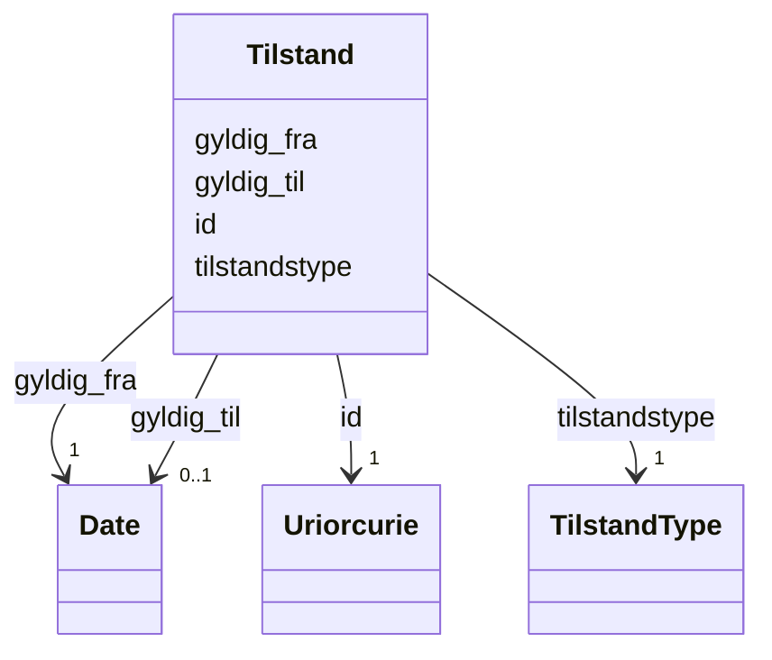

# Class: Tilstand 


_Registrert tilstand (status) for ei verksemd i Enhetsregisteret, med gyldigheitsperiode for historisk sporing._


URI: [ngrv:Tilstand](https://data.norge.no/vocabulary/ngr-virksomhet#Tilstand)





<!-- no inheritance hierarchy -->

## Class Properties

| Property | Value |
| --- | --- |
| Class URI | [ngrv:Tilstand](https://data.norge.no/vocabulary/ngr-virksomhet#Tilstand) |


## Eigenskapar


  
  

  
  
    
  

  
  
    
  

  
  


### Obligatorisk

| Namn | Kardinalitet og domene | Beskriving |
| --- | --- | --- |
| [tilstandstype](tilstandstype.md) | 1 <br/> [TilstandType](tilstandtype.md) | Type tilstand (AKTIV, UNDER_KONKURS o |
| [gyldig_fra](gyldig_fra.md) | 1 <br/> [xsd:date](http://www.w3.org/2001/XMLSchema#date) | Datoen tilstanden vart gyldig frå |


  
  

  
  

  
  

  
  


  
  

  
  

  
  

  
  
    
  


### Valgfri

| Namn | Kardinalitet og domene | Beskriving |
| --- | --- | --- |
| [gyldig_til](gyldig_til.md) | 0..1 <br/> [xsd:date](http://www.w3.org/2001/XMLSchema#date) | Datoen tilstanden vart gyldig til |


  
  
  
  
    
  

  
  
  
    
      
    
      
    
      
    
  
  

  
  
  
    
      
    
      
    
      
    
  
  

  
  
  
    
      
    
      
    
      
    
  
  


### Andre

| Namn | Kardinalitet og domene | Beskriving |
| --- | --- | --- |
| [id](id.md) | 1 <br/> [xsd:anyURI](http://www.w3.org/2001/XMLSchema#anyURI) | URI-identifikator for ressursen |


## Usages

| used by | used in | type | used |
| ---  | --- | --- | --- |
| [VirksomhetContainer](virksomhetcontainer.md) | [tilstander](tilstander.md) | range | [Tilstand](tilstand.md) |
| [Virksomhet](virksomhet.md) | [har_tilstand](har_tilstand.md) | range | [Tilstand](tilstand.md) |
| [Underenhet](underenhet.md) | [har_tilstand](har_tilstand.md) | range | [Tilstand](tilstand.md) |
| [Hovedenhet](hovedenhet.md) | [har_tilstand](har_tilstand.md) | range | [Tilstand](tilstand.md) |


## Identifier and Mapping Information


### Schema Source


* from schema: https://data.norge.no/linkml/ngr-virksomhet


## Mappings

| Mapping Type | Mapped Value |
| ---  | ---  |
| self | ngrv:Tilstand |
| native | https://data.norge.no/linkml/ngr-virksomhet/Tilstand |


## LinkML Source

<!-- TODO: investigate https://stackoverflow.com/questions/37606292/how-to-create-tabbed-code-blocks-in-mkdocs-or-sphinx -->

### Direct

<details>
```yaml
name: Tilstand
description: Registrert tilstand (status) for ei verksemd i Enhetsregisteret, med
  gyldigheitsperiode for historisk sporing.
from_schema: https://data.norge.no/linkml/ngr-virksomhet
rank: 1000
slots:
- id
- tilstandstype
- gyldig_fra
- gyldig_til
slot_usage:
  tilstandstype:
    name: tilstandstype
    in_subset:
    - Obligatorisk
    required: true
  gyldig_fra:
    name: gyldig_fra
    in_subset:
    - Obligatorisk
    required: true
  gyldig_til:
    name: gyldig_til
    in_subset:
    - Valgfri
class_uri: ngrv:Tilstand

```
</details>

### Induced

<details>
```yaml
name: Tilstand
description: Registrert tilstand (status) for ei verksemd i Enhetsregisteret, med
  gyldigheitsperiode for historisk sporing.
from_schema: https://data.norge.no/linkml/ngr-virksomhet
rank: 1000
slot_usage:
  tilstandstype:
    name: tilstandstype
    in_subset:
    - Obligatorisk
    required: true
  gyldig_fra:
    name: gyldig_fra
    in_subset:
    - Obligatorisk
    required: true
  gyldig_til:
    name: gyldig_til
    in_subset:
    - Valgfri
attributes:
  id:
    name: id
    description: URI-identifikator for ressursen.
    from_schema: https://data.norge.no/linkml/ngr-virksomhet
    rank: 1000
    identifier: true
    alias: id
    owner: Tilstand
    domain_of:
    - Virksomhet
    - Tilstand
    - Organisasjonsform
    - Naeringskode
    - Sektorkode
    - Kontaktinformasjon
    - Varslingsadresse
    - Aktivitet
    - RolleIVirksomhet
    - Rolleinnehaver
    - Signaturrett
    - Prokura
    - GeografiskAdresse
    - Person
    range: uriorcurie
    required: true
  tilstandstype:
    name: tilstandstype
    description: Type tilstand (AKTIV, UNDER_KONKURS o.l.).
    in_subset:
    - Obligatorisk
    from_schema: https://data.norge.no/linkml/ngr-virksomhet
    rank: 1000
    slot_uri: ngrv:tilstandstype
    alias: tilstandstype
    owner: Tilstand
    domain_of:
    - Tilstand
    range: TilstandType
    required: true
  gyldig_fra:
    name: gyldig_fra
    description: Datoen tilstanden vart gyldig frå.
    in_subset:
    - Obligatorisk
    from_schema: https://data.norge.no/linkml/ngr-virksomhet
    rank: 1000
    slot_uri: ngrv:gyldigFra
    alias: gyldig_fra
    owner: Tilstand
    domain_of:
    - Tilstand
    range: date
    required: true
  gyldig_til:
    name: gyldig_til
    description: Datoen tilstanden vart gyldig til.
    in_subset:
    - Valgfri
    from_schema: https://data.norge.no/linkml/ngr-virksomhet
    rank: 1000
    slot_uri: ngrv:gyldigTil
    alias: gyldig_til
    owner: Tilstand
    domain_of:
    - Tilstand
    range: date
class_uri: ngrv:Tilstand

```
</details>