# Class: Underenhet 


_Ei underleining er ein geografisk lokasjon der aktiviteten til ei hovudeining vert utøvd. Knyt seg til ei hovudeining via organisasjonsnummeret._


URI: [ngrv:Underenhet](https://data.norge.no/vocabulary/ngr-virksomhet#Underenhet)

```mermaid
 classDiagram
    class Underenhet
    click Underenhet href "../Underenhet/"
      Virksomhet <|-- Underenhet
        click Virksomhet href "../Virksomhet/"
      
      Underenhet : antall_ansatte
        
          
    
        
        
        Underenhet --> "0..1" Integer : antall_ansatte
        click Integer href "../http://www.w3.org/2001/XMLSchema#integer/"
    

        
      Underenhet : eierskiftedatoer
        
          
    
        
        
        Underenhet --> "*" Date : eierskiftedatoer
        click Date href "../http://www.w3.org/2001/XMLSchema#date/"
    

        
      Underenhet : er_klassifisert_i_naeringskode
        
          
    
        
        
        Underenhet --> "1..*" Naeringskode : er_klassifisert_i_naeringskode
        click Naeringskode href "../Naeringskode/"
    

        
      Underenhet : er_klassifisert_som_organisasjonsform
        
          
    
        
        
        Underenhet --> "1" Organisasjonsform : er_klassifisert_som_organisasjonsform
        click Organisasjonsform href "../Organisasjonsform/"
    

        
      Underenhet : har_beliggenhetsadresse
        
          
    
        
        
        Underenhet --> "1" Beliggenhetsadresse : har_beliggenhetsadresse
        click Beliggenhetsadresse href "../Beliggenhetsadresse/"
    

        
      Underenhet : har_kontaktinformasjon
        
          
    
        
        
        Underenhet --> "0..1" Kontaktinformasjon : har_kontaktinformasjon
        click Kontaktinformasjon href "../Kontaktinformasjon/"
    

        
      Underenhet : har_tilstand
        
          
    
        
        
        Underenhet --> "*" Tilstand : har_tilstand
        click Tilstand href "../Tilstand/"
    

        
      Underenhet : har_varslingsadresse
        
          
    
        
        
        Underenhet --> "1" Varslingsadresse : har_varslingsadresse
        click Varslingsadresse href "../Varslingsadresse/"
    

        
      Underenhet : id
        
          
    
        
        
        Underenhet --> "1" Uriorcurie : id
        click Uriorcurie href "../http://www.w3.org/2001/XMLSchema#anyURI/"
    

        
      Underenhet : mottar_post_paa
        
          
    
        
        
        Underenhet --> "0..1" Postadresse : mottar_post_paa
        click Postadresse href "../Postadresse/"
    

        
      Underenhet : navn
        
          
    
        
        
        Underenhet --> "1" String : navn
        click String href "../http://www.w3.org/2001/XMLSchema#string/"
    

        
      Underenhet : nedleggelsesdato
        
          
    
        
        
        Underenhet --> "0..1" Date : nedleggelsesdato
        click Date href "../http://www.w3.org/2001/XMLSchema#date/"
    

        
      Underenhet : oppstartsdato
        
          
    
        
        
        Underenhet --> "1" Date : oppstartsdato
        click Date href "../http://www.w3.org/2001/XMLSchema#date/"
    

        
      Underenhet : organisasjonsnummer
        
          
    
        
        
        Underenhet --> "1" String : organisasjonsnummer
        click String href "../http://www.w3.org/2001/XMLSchema#string/"
    

        
      
```





## Inheritance
* [Virksomhet](virksomhet.md)
    * **Underenhet**


## Class Properties

| Property | Value |
| --- | --- |
| Class URI | [ngrv:Underenhet](https://data.norge.no/vocabulary/ngr-virksomhet#Underenhet) |


## Eigenskapar


  
  
    
  

  
  

  
  

  
  
    
  


### Obligatorisk

| Namn | Kardinalitet og domene | Beskriving |
| --- | --- | --- |
| [oppstartsdato](oppstartsdato.md) | 1 <br/> [xsd:date](http://www.w3.org/2001/XMLSchema#date) | Datoen underleininga vart oppretta/starta |
| [har_beliggenhetsadresse](har_beliggenhetsadresse.md) | 1 <br/> [Beliggenhetsadresse](beliggenhetsadresse.md) | Beliggenheitsadressa til underleininga |


  
  

  
  

  
  

  
  


  
  

  
  
    
  

  
  
    
  

  
  


### Valgfri

| Namn | Kardinalitet og domene | Beskriving |
| --- | --- | --- |
| [eierskiftedatoer](eierskiftedatoer.md) | * <br/> [xsd:date](http://www.w3.org/2001/XMLSchema#date) | Dato(ar) for eigarskifte i underleininga |
| [nedleggelsesdato](nedleggelsesdato.md) | 0..1 <br/> [xsd:date](http://www.w3.org/2001/XMLSchema#date) | Datoen underleininga vart lagt ned |


  
  
  
    
      
    
      
    
      
    
  
  

  
  
  
    
      
    
      
    
      
    
  
  

  
  
  
    
      
    
      
    
      
    
  
  

  
  
  
    
      
    
      
    
      
    
  
  


### Arva

| Namn | Kardinalitet og domene | Beskriving | Frå |
| --- | --- | --- | --- || [id](id.md) | 1 <br/> [xsd:anyURI](http://www.w3.org/2001/XMLSchema#anyURI) | URI-identifikator for ressursen | [Virksomhet](virksomhet.md) |
| [organisasjonsnummer](organisasjonsnummer.md) | 1 <br/> [xsd:string](http://www.w3.org/2001/XMLSchema#string) | Niesifra organisasjonsnummer tildelt av Enhetsregisteret | [Virksomhet](virksomhet.md) |
| [navn](navn.md) | 1 <br/> [xsd:string](http://www.w3.org/2001/XMLSchema#string) | Registrert namn på verksemda i Enhetsregisteret | [Virksomhet](virksomhet.md) |
| [har_tilstand](har_tilstand.md) | * <br/> [Tilstand](tilstand.md) | Registrert tilstand (status) for verksemda, inkl | [Virksomhet](virksomhet.md) |
| [mottar_post_paa](mottar_post_paa.md) | 0..1 <br/> [Postadresse](postadresse.md) | Postadressa verksemda mottar post på | [Virksomhet](virksomhet.md) |
| [er_klassifisert_som_organisasjonsform](er_klassifisert_som_organisasjonsform.md) | 1 <br/> [Organisasjonsform](organisasjonsform.md) | Organisasjonsform (juridisk form) for verksemda | [Virksomhet](virksomhet.md) |
| [har_kontaktinformasjon](har_kontaktinformasjon.md) | 0..1 <br/> [Kontaktinformasjon](kontaktinformasjon.md) | Kontaktinformasjon registrert på verksemda | [Virksomhet](virksomhet.md) |
| [har_varslingsadresse](har_varslingsadresse.md) | 1 <br/> [Varslingsadresse](varslingsadresse.md) | Offisiell varslingsadresse for offentlege meldingar | [Virksomhet](virksomhet.md) |
| [er_klassifisert_i_naeringskode](er_klassifisert_i_naeringskode.md) | 1..* <br/> [Naeringskode](naeringskode.md) | Næringskode(r) verksemda er klassifisert under (1–3) | [Virksomhet](virksomhet.md) |
| [antall_ansatte](antall_ansatte.md) | 0..1 <br/> [xsd:integer](http://www.w3.org/2001/XMLSchema#integer) | Antal tilsette i verksemda (rapportert til a-ordninga) | [Virksomhet](virksomhet.md) |


## Usages

| used by | used in | type | used |
| ---  | --- | --- | --- |
| [VirksomhetContainer](virksomhetcontainer.md) | [underenheter](underenheter.md) | range | [Underenhet](underenhet.md) |


## Identifier and Mapping Information


### Schema Source


* from schema: https://data.norge.no/linkml/ngr-virksomhet


## Mappings

| Mapping Type | Mapped Value |
| ---  | ---  |
| self | ngrv:Underenhet |
| native | https://data.norge.no/linkml/ngr-virksomhet/Underenhet |


## LinkML Source

<!-- TODO: investigate https://stackoverflow.com/questions/37606292/how-to-create-tabbed-code-blocks-in-mkdocs-or-sphinx -->

### Direct

<details>
```yaml
name: Underenhet
description: Ei underleining er ein geografisk lokasjon der aktiviteten til ei hovudeining
  vert utøvd. Knyt seg til ei hovudeining via organisasjonsnummeret.
from_schema: https://data.norge.no/linkml/ngr-virksomhet
rank: 1000
is_a: Virksomhet
slots:
- oppstartsdato
- eierskiftedatoer
- nedleggelsesdato
- har_beliggenhetsadresse
slot_usage:
  oppstartsdato:
    name: oppstartsdato
    in_subset:
    - Obligatorisk
    required: true
  har_beliggenhetsadresse:
    name: har_beliggenhetsadresse
    in_subset:
    - Obligatorisk
    required: true
  eierskiftedatoer:
    name: eierskiftedatoer
    in_subset:
    - Valgfri
  nedleggelsesdato:
    name: nedleggelsesdato
    in_subset:
    - Valgfri
class_uri: ngrv:Underenhet

```
</details>

### Induced

<details>
```yaml
name: Underenhet
description: Ei underleining er ein geografisk lokasjon der aktiviteten til ei hovudeining
  vert utøvd. Knyt seg til ei hovudeining via organisasjonsnummeret.
from_schema: https://data.norge.no/linkml/ngr-virksomhet
rank: 1000
is_a: Virksomhet
slot_usage:
  oppstartsdato:
    name: oppstartsdato
    in_subset:
    - Obligatorisk
    required: true
  har_beliggenhetsadresse:
    name: har_beliggenhetsadresse
    in_subset:
    - Obligatorisk
    required: true
  eierskiftedatoer:
    name: eierskiftedatoer
    in_subset:
    - Valgfri
  nedleggelsesdato:
    name: nedleggelsesdato
    in_subset:
    - Valgfri
attributes:
  oppstartsdato:
    name: oppstartsdato
    description: Datoen underleininga vart oppretta/starta.
    in_subset:
    - Obligatorisk
    from_schema: https://data.norge.no/linkml/ngr-virksomhet
    rank: 1000
    slot_uri: ngrv:oppstartsdato
    alias: oppstartsdato
    owner: Underenhet
    domain_of:
    - Underenhet
    range: date
    required: true
  eierskiftedatoer:
    name: eierskiftedatoer
    description: Dato(ar) for eigarskifte i underleininga.
    in_subset:
    - Valgfri
    from_schema: https://data.norge.no/linkml/ngr-virksomhet
    rank: 1000
    slot_uri: ngrv:eierskiftedato
    alias: eierskiftedatoer
    owner: Underenhet
    domain_of:
    - Underenhet
    range: date
    multivalued: true
  nedleggelsesdato:
    name: nedleggelsesdato
    description: Datoen underleininga vart lagt ned.
    in_subset:
    - Valgfri
    from_schema: https://data.norge.no/linkml/ngr-virksomhet
    rank: 1000
    slot_uri: ngrv:nedleggelsesdato
    alias: nedleggelsesdato
    owner: Underenhet
    domain_of:
    - Underenhet
    range: date
  har_beliggenhetsadresse:
    name: har_beliggenhetsadresse
    description: Beliggenheitsadressa til underleininga.
    in_subset:
    - Obligatorisk
    from_schema: https://data.norge.no/linkml/ngr-virksomhet
    rank: 1000
    slot_uri: ngrv:harBeliggenhetsadresse
    alias: har_beliggenhetsadresse
    owner: Underenhet
    domain_of:
    - Underenhet
    range: Beliggenhetsadresse
    required: true
  id:
    name: id
    description: URI-identifikator for ressursen.
    from_schema: https://data.norge.no/linkml/ngr-virksomhet
    rank: 1000
    identifier: true
    alias: id
    owner: Underenhet
    domain_of:
    - Virksomhet
    - Tilstand
    - Organisasjonsform
    - Naeringskode
    - Sektorkode
    - Kontaktinformasjon
    - Varslingsadresse
    - Aktivitet
    - RolleIVirksomhet
    - Rolleinnehaver
    - Signaturrett
    - Prokura
    - GeografiskAdresse
    - Person
    range: uriorcurie
    required: true
  organisasjonsnummer:
    name: organisasjonsnummer
    description: Niesifra organisasjonsnummer tildelt av Enhetsregisteret.
    in_subset:
    - Obligatorisk
    from_schema: https://data.norge.no/linkml/ngr-virksomhet
    rank: 1000
    slot_uri: ngrv:organisasjonsnummer
    alias: organisasjonsnummer
    owner: Underenhet
    domain_of:
    - Virksomhet
    range: string
    required: true
  navn:
    name: navn
    description: Registrert namn på verksemda i Enhetsregisteret.
    in_subset:
    - Obligatorisk
    from_schema: https://data.norge.no/linkml/ngr-virksomhet
    rank: 1000
    slot_uri: ngrv:navn
    alias: navn
    owner: Underenhet
    domain_of:
    - Virksomhet
    range: string
    required: true
  har_tilstand:
    name: har_tilstand
    description: Registrert tilstand (status) for verksemda, inkl. historikk.
    in_subset:
    - Anbefalt
    from_schema: https://data.norge.no/linkml/ngr-virksomhet
    rank: 1000
    slot_uri: ngrv:harTilstand
    alias: har_tilstand
    owner: Underenhet
    domain_of:
    - Virksomhet
    range: Tilstand
    multivalued: true
  mottar_post_paa:
    name: mottar_post_paa
    description: Postadressa verksemda mottar post på.
    in_subset:
    - Anbefalt
    from_schema: https://data.norge.no/linkml/ngr-virksomhet
    rank: 1000
    slot_uri: ngrv:mottarPostPaa
    alias: mottar_post_paa
    owner: Underenhet
    domain_of:
    - Virksomhet
    range: Postadresse
  er_klassifisert_som_organisasjonsform:
    name: er_klassifisert_som_organisasjonsform
    description: Organisasjonsform (juridisk form) for verksemda.
    in_subset:
    - Obligatorisk
    from_schema: https://data.norge.no/linkml/ngr-virksomhet
    rank: 1000
    slot_uri: ngrv:erKlassifisertSomOrganisasjonsform
    alias: er_klassifisert_som_organisasjonsform
    owner: Underenhet
    domain_of:
    - Virksomhet
    range: Organisasjonsform
    required: true
  har_kontaktinformasjon:
    name: har_kontaktinformasjon
    description: Kontaktinformasjon registrert på verksemda.
    in_subset:
    - Valgfri
    from_schema: https://data.norge.no/linkml/ngr-virksomhet
    rank: 1000
    slot_uri: ngrv:harKontaktinformasjon
    alias: har_kontaktinformasjon
    owner: Underenhet
    domain_of:
    - Virksomhet
    range: Kontaktinformasjon
  har_varslingsadresse:
    name: har_varslingsadresse
    description: Offisiell varslingsadresse for offentlege meldingar.
    in_subset:
    - Obligatorisk
    from_schema: https://data.norge.no/linkml/ngr-virksomhet
    rank: 1000
    slot_uri: ngrv:harVarslingsadresse
    alias: har_varslingsadresse
    owner: Underenhet
    domain_of:
    - Virksomhet
    range: Varslingsadresse
    required: true
  er_klassifisert_i_naeringskode:
    name: er_klassifisert_i_naeringskode
    description: Næringskode(r) verksemda er klassifisert under (1–3).
    in_subset:
    - Obligatorisk
    from_schema: https://data.norge.no/linkml/ngr-virksomhet
    rank: 1000
    slot_uri: ngrv:erKlassifisertINaeringskode
    alias: er_klassifisert_i_naeringskode
    owner: Underenhet
    domain_of:
    - Virksomhet
    range: Naeringskode
    required: true
    multivalued: true
    minimum_cardinality: 1
  antall_ansatte:
    name: antall_ansatte
    description: Antal tilsette i verksemda (rapportert til a-ordninga).
    in_subset:
    - Valgfri
    from_schema: https://data.norge.no/linkml/ngr-virksomhet
    rank: 1000
    slot_uri: ngrv:antallAnsatte
    alias: antall_ansatte
    owner: Underenhet
    domain_of:
    - Virksomhet
    range: integer
class_uri: ngrv:Underenhet

```
</details>