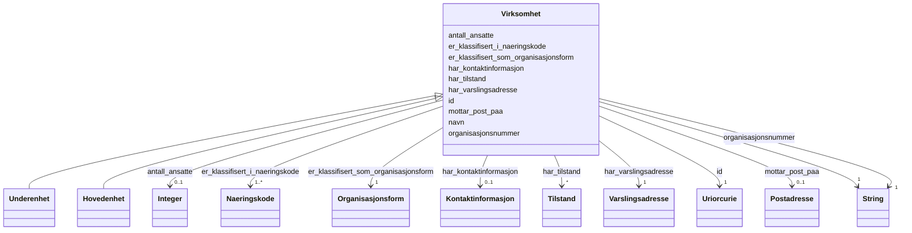

# Class: Virksomhet 


_Abstrakt overklasse for alle einingar registrert i Enhetsregisteret. Ei verksemd er alltid anten ei underleining eller ei hovudeining._


* __NOTE__: this is an abstract class and should not be instantiated directly


URI: [ngrv:Virksomhet](https://data.norge.no/vocabulary/ngr-virksomhet#Virksomhet)





## Inheritance
* **Virksomhet**
    * [Underenhet](underenhet.md)
    * [Hovedenhet](hovedenhet.md)


## Class Properties

| Property | Value |
| --- | --- |
| Class URI | [ngrv:Virksomhet](https://data.norge.no/vocabulary/ngr-virksomhet#Virksomhet) |


## Eigenskapar


  
  

  
  
    
  

  
  
    
  

  
  

  
  

  
  
    
  

  
  

  
  
    
  

  
  
    
  

  
  


### Obligatorisk

| Namn | Kardinalitet og domene | Beskriving |
| --- | --- | --- |
| [organisasjonsnummer](organisasjonsnummer.md) | 1 <br/> [xsd:string](http://www.w3.org/2001/XMLSchema#string) | Niesifra organisasjonsnummer tildelt av Enhetsregisteret |
| [navn](navn.md) | 1 <br/> [xsd:string](http://www.w3.org/2001/XMLSchema#string) | Registrert namn på verksemda i Enhetsregisteret |
| [er_klassifisert_som_organisasjonsform](er_klassifisert_som_organisasjonsform.md) | 1 <br/> [Organisasjonsform](organisasjonsform.md) | Organisasjonsform (juridisk form) for verksemda |
| [har_varslingsadresse](har_varslingsadresse.md) | 1 <br/> [Varslingsadresse](varslingsadresse.md) | Offisiell varslingsadresse for offentlege meldingar |
| [er_klassifisert_i_naeringskode](er_klassifisert_i_naeringskode.md) | 1..* <br/> [Naeringskode](naeringskode.md) | Næringskode(r) verksemda er klassifisert under (1–3) |


  
  

  
  

  
  

  
  
    
  

  
  
    
  

  
  

  
  

  
  

  
  

  
  


### Anbefalt

| Namn | Kardinalitet og domene | Beskriving |
| --- | --- | --- |
| [har_tilstand](har_tilstand.md) | * <br/> [Tilstand](tilstand.md) | Registrert tilstand (status) for verksemda, inkl |
| [mottar_post_paa](mottar_post_paa.md) | 0..1 <br/> [Postadresse](postadresse.md) | Postadressa verksemda mottar post på |


  
  

  
  

  
  

  
  

  
  

  
  

  
  
    
  

  
  

  
  

  
  
    
  


### Valgfri

| Namn | Kardinalitet og domene | Beskriving |
| --- | --- | --- |
| [har_kontaktinformasjon](har_kontaktinformasjon.md) | 0..1 <br/> [Kontaktinformasjon](kontaktinformasjon.md) | Kontaktinformasjon registrert på verksemda |
| [antall_ansatte](antall_ansatte.md) | 0..1 <br/> [xsd:integer](http://www.w3.org/2001/XMLSchema#integer) | Antal tilsette i verksemda (rapportert til a-ordninga) |


  
  
  
  
    
  

  
  
  
    
      
    
      
    
      
    
  
  

  
  
  
    
      
    
      
    
      
    
  
  

  
  
  
    
      
    
      
    
      
    
  
  

  
  
  
    
      
    
      
    
      
    
  
  

  
  
  
    
      
    
      
    
      
    
  
  

  
  
  
    
      
    
      
    
      
    
  
  

  
  
  
    
      
    
      
    
      
    
  
  

  
  
  
    
      
    
      
    
      
    
  
  

  
  
  
    
      
    
      
    
      
    
  
  


### Andre

| Namn | Kardinalitet og domene | Beskriving |
| --- | --- | --- |
| [id](id.md) | 1 <br/> [xsd:anyURI](http://www.w3.org/2001/XMLSchema#anyURI) | URI-identifikator for ressursen |


## Identifier and Mapping Information


### Schema Source


* from schema: https://data.norge.no/linkml/ngr-virksomhet


## Mappings

| Mapping Type | Mapped Value |
| ---  | ---  |
| self | ngrv:Virksomhet |
| native | https://data.norge.no/linkml/ngr-virksomhet/Virksomhet |


## LinkML Source

<!-- TODO: investigate https://stackoverflow.com/questions/37606292/how-to-create-tabbed-code-blocks-in-mkdocs-or-sphinx -->

### Direct

<details>
```yaml
name: Virksomhet
description: Abstrakt overklasse for alle einingar registrert i Enhetsregisteret.
  Ei verksemd er alltid anten ei underleining eller ei hovudeining.
from_schema: https://data.norge.no/linkml/ngr-virksomhet
rank: 1000
abstract: true
slots:
- id
- organisasjonsnummer
- navn
- har_tilstand
- mottar_post_paa
- er_klassifisert_som_organisasjonsform
- har_kontaktinformasjon
- har_varslingsadresse
- er_klassifisert_i_naeringskode
- antall_ansatte
slot_usage:
  organisasjonsnummer:
    name: organisasjonsnummer
    in_subset:
    - Obligatorisk
    required: true
  navn:
    name: navn
    in_subset:
    - Obligatorisk
    required: true
  er_klassifisert_som_organisasjonsform:
    name: er_klassifisert_som_organisasjonsform
    in_subset:
    - Obligatorisk
    required: true
  har_varslingsadresse:
    name: har_varslingsadresse
    in_subset:
    - Obligatorisk
    required: true
  er_klassifisert_i_naeringskode:
    name: er_klassifisert_i_naeringskode
    in_subset:
    - Obligatorisk
    required: true
    minimum_cardinality: 1
  har_tilstand:
    name: har_tilstand
    in_subset:
    - Anbefalt
  mottar_post_paa:
    name: mottar_post_paa
    in_subset:
    - Anbefalt
  har_kontaktinformasjon:
    name: har_kontaktinformasjon
    in_subset:
    - Valgfri
  antall_ansatte:
    name: antall_ansatte
    in_subset:
    - Valgfri
class_uri: ngrv:Virksomhet

```
</details>

### Induced

<details>
```yaml
name: Virksomhet
description: Abstrakt overklasse for alle einingar registrert i Enhetsregisteret.
  Ei verksemd er alltid anten ei underleining eller ei hovudeining.
from_schema: https://data.norge.no/linkml/ngr-virksomhet
rank: 1000
abstract: true
slot_usage:
  organisasjonsnummer:
    name: organisasjonsnummer
    in_subset:
    - Obligatorisk
    required: true
  navn:
    name: navn
    in_subset:
    - Obligatorisk
    required: true
  er_klassifisert_som_organisasjonsform:
    name: er_klassifisert_som_organisasjonsform
    in_subset:
    - Obligatorisk
    required: true
  har_varslingsadresse:
    name: har_varslingsadresse
    in_subset:
    - Obligatorisk
    required: true
  er_klassifisert_i_naeringskode:
    name: er_klassifisert_i_naeringskode
    in_subset:
    - Obligatorisk
    required: true
    minimum_cardinality: 1
  har_tilstand:
    name: har_tilstand
    in_subset:
    - Anbefalt
  mottar_post_paa:
    name: mottar_post_paa
    in_subset:
    - Anbefalt
  har_kontaktinformasjon:
    name: har_kontaktinformasjon
    in_subset:
    - Valgfri
  antall_ansatte:
    name: antall_ansatte
    in_subset:
    - Valgfri
attributes:
  id:
    name: id
    description: URI-identifikator for ressursen.
    from_schema: https://data.norge.no/linkml/ngr-virksomhet
    rank: 1000
    identifier: true
    alias: id
    owner: Virksomhet
    domain_of:
    - Virksomhet
    - Tilstand
    - Organisasjonsform
    - Naeringskode
    - Sektorkode
    - Kontaktinformasjon
    - Varslingsadresse
    - Aktivitet
    - RolleIVirksomhet
    - Rolleinnehaver
    - Signaturrett
    - Prokura
    - GeografiskAdresse
    - Person
    range: uriorcurie
    required: true
  organisasjonsnummer:
    name: organisasjonsnummer
    description: Niesifra organisasjonsnummer tildelt av Enhetsregisteret.
    in_subset:
    - Obligatorisk
    from_schema: https://data.norge.no/linkml/ngr-virksomhet
    rank: 1000
    slot_uri: ngrv:organisasjonsnummer
    alias: organisasjonsnummer
    owner: Virksomhet
    domain_of:
    - Virksomhet
    range: string
    required: true
  navn:
    name: navn
    description: Registrert namn på verksemda i Enhetsregisteret.
    in_subset:
    - Obligatorisk
    from_schema: https://data.norge.no/linkml/ngr-virksomhet
    rank: 1000
    slot_uri: ngrv:navn
    alias: navn
    owner: Virksomhet
    domain_of:
    - Virksomhet
    range: string
    required: true
  har_tilstand:
    name: har_tilstand
    description: Registrert tilstand (status) for verksemda, inkl. historikk.
    in_subset:
    - Anbefalt
    from_schema: https://data.norge.no/linkml/ngr-virksomhet
    rank: 1000
    slot_uri: ngrv:harTilstand
    alias: har_tilstand
    owner: Virksomhet
    domain_of:
    - Virksomhet
    range: Tilstand
    multivalued: true
  mottar_post_paa:
    name: mottar_post_paa
    description: Postadressa verksemda mottar post på.
    in_subset:
    - Anbefalt
    from_schema: https://data.norge.no/linkml/ngr-virksomhet
    rank: 1000
    slot_uri: ngrv:mottarPostPaa
    alias: mottar_post_paa
    owner: Virksomhet
    domain_of:
    - Virksomhet
    range: Postadresse
  er_klassifisert_som_organisasjonsform:
    name: er_klassifisert_som_organisasjonsform
    description: Organisasjonsform (juridisk form) for verksemda.
    in_subset:
    - Obligatorisk
    from_schema: https://data.norge.no/linkml/ngr-virksomhet
    rank: 1000
    slot_uri: ngrv:erKlassifisertSomOrganisasjonsform
    alias: er_klassifisert_som_organisasjonsform
    owner: Virksomhet
    domain_of:
    - Virksomhet
    range: Organisasjonsform
    required: true
  har_kontaktinformasjon:
    name: har_kontaktinformasjon
    description: Kontaktinformasjon registrert på verksemda.
    in_subset:
    - Valgfri
    from_schema: https://data.norge.no/linkml/ngr-virksomhet
    rank: 1000
    slot_uri: ngrv:harKontaktinformasjon
    alias: har_kontaktinformasjon
    owner: Virksomhet
    domain_of:
    - Virksomhet
    range: Kontaktinformasjon
  har_varslingsadresse:
    name: har_varslingsadresse
    description: Offisiell varslingsadresse for offentlege meldingar.
    in_subset:
    - Obligatorisk
    from_schema: https://data.norge.no/linkml/ngr-virksomhet
    rank: 1000
    slot_uri: ngrv:harVarslingsadresse
    alias: har_varslingsadresse
    owner: Virksomhet
    domain_of:
    - Virksomhet
    range: Varslingsadresse
    required: true
  er_klassifisert_i_naeringskode:
    name: er_klassifisert_i_naeringskode
    description: Næringskode(r) verksemda er klassifisert under (1–3).
    in_subset:
    - Obligatorisk
    from_schema: https://data.norge.no/linkml/ngr-virksomhet
    rank: 1000
    slot_uri: ngrv:erKlassifisertINaeringskode
    alias: er_klassifisert_i_naeringskode
    owner: Virksomhet
    domain_of:
    - Virksomhet
    range: Naeringskode
    required: true
    multivalued: true
    minimum_cardinality: 1
  antall_ansatte:
    name: antall_ansatte
    description: Antal tilsette i verksemda (rapportert til a-ordninga).
    in_subset:
    - Valgfri
    from_schema: https://data.norge.no/linkml/ngr-virksomhet
    rank: 1000
    slot_uri: ngrv:antallAnsatte
    alias: antall_ansatte
    owner: Virksomhet
    domain_of:
    - Virksomhet
    range: integer
class_uri: ngrv:Virksomhet

```
</details>