# Class: VirksomhetContainer 


_Rotklasse for NGR-virksomhet-datafiler. Held flate lister av alle instansierbare klassar; referansar mellom objekt brukar URI-lenking._


URI: [https://data.norge.no/linkml/ngr-virksomhet/VirksomhetContainer](https://data.norge.no/linkml/ngr-virksomhet/VirksomhetContainer)

```mermaid
 classDiagram
    class VirksomhetContainer
    click VirksomhetContainer href "../VirksomhetContainer/"
      VirksomhetContainer : aktivitetar
        
          
    
        
        
        VirksomhetContainer --> "*" Aktivitet : aktivitetar
        click Aktivitet href "../Aktivitet/"
    

        
      VirksomhetContainer : beliggenhetsadresser
        
          
    
        
        
        VirksomhetContainer --> "*" Beliggenhetsadresse : beliggenhetsadresser
        click Beliggenhetsadresse href "../Beliggenhetsadresse/"
    

        
      VirksomhetContainer : forretningsadresser
        
          
    
        
        
        VirksomhetContainer --> "*" Forretningsadresse : forretningsadresser
        click Forretningsadresse href "../Forretningsadresse/"
    

        
      VirksomhetContainer : hovedenheter
        
          
    
        
        
        VirksomhetContainer --> "*" Hovedenhet : hovedenheter
        click Hovedenhet href "../Hovedenhet/"
    

        
      VirksomhetContainer : kontaktinformasjon
        
          
    
        
        
        VirksomhetContainer --> "*" Kontaktinformasjon : kontaktinformasjon
        click Kontaktinformasjon href "../Kontaktinformasjon/"
    

        
      VirksomhetContainer : naeringskoder
        
          
    
        
        
        VirksomhetContainer --> "*" Naeringskode : naeringskoder
        click Naeringskode href "../Naeringskode/"
    

        
      VirksomhetContainer : organisasjonsformer
        
          
    
        
        
        VirksomhetContainer --> "*" Organisasjonsform : organisasjonsformer
        click Organisasjonsform href "../Organisasjonsform/"
    

        
      VirksomhetContainer : postadresser
        
          
    
        
        
        VirksomhetContainer --> "*" Postadresse : postadresser
        click Postadresse href "../Postadresse/"
    

        
      VirksomhetContainer : prokuraer
        
          
    
        
        
        VirksomhetContainer --> "*" Prokura : prokuraer
        click Prokura href "../Prokura/"
    

        
      VirksomhetContainer : rolleinnehavere
        
          
    
        
        
        VirksomhetContainer --> "*" Rolleinnehaver : rolleinnehavere
        click Rolleinnehaver href "../Rolleinnehaver/"
    

        
      VirksomhetContainer : rollerIVirksomhet
        
          
    
        
        
        VirksomhetContainer --> "*" RolleIVirksomhet : rollerIVirksomhet
        click RolleIVirksomhet href "../RolleIVirksomhet/"
    

        
      VirksomhetContainer : sektorkoder
        
          
    
        
        
        VirksomhetContainer --> "*" Sektorkode : sektorkoder
        click Sektorkode href "../Sektorkode/"
    

        
      VirksomhetContainer : signaturrettar
        
          
    
        
        
        VirksomhetContainer --> "*" Signaturrett : signaturrettar
        click Signaturrett href "../Signaturrett/"
    

        
      VirksomhetContainer : tilstander
        
          
    
        
        
        VirksomhetContainer --> "*" Tilstand : tilstander
        click Tilstand href "../Tilstand/"
    

        
      VirksomhetContainer : underenheter
        
          
    
        
        
        VirksomhetContainer --> "*" Underenhet : underenheter
        click Underenhet href "../Underenhet/"
    

        
      VirksomhetContainer : varslingsadresser
        
          
    
        
        
        VirksomhetContainer --> "*" Varslingsadresse : varslingsadresser
        click Varslingsadresse href "../Varslingsadresse/"
    

        
      
```





<!-- no inheritance hierarchy -->

## Class Properties

| Property | Value |
| --- | --- |
| Tree Root | Yes |


## Eigenskapar


  
  

  
  

  
  

  
  

  
  

  
  

  
  

  
  

  
  

  
  

  
  

  
  

  
  

  
  

  
  

  
  


  
  

  
  

  
  

  
  

  
  

  
  

  
  

  
  

  
  

  
  

  
  

  
  

  
  

  
  

  
  

  
  


  
  

  
  

  
  

  
  

  
  

  
  

  
  

  
  

  
  

  
  

  
  

  
  

  
  

  
  

  
  

  
  


  
  
  
  
    
  

  
  
  
  
    
  

  
  
  
  
    
  

  
  
  
  
    
  

  
  
  
  
    
  

  
  
  
  
    
  

  
  
  
  
    
  

  
  
  
  
    
  

  
  
  
  
    
  

  
  
  
  
    
  

  
  
  
  
    
  

  
  
  
  
    
  

  
  
  
  
    
  

  
  
  
  
    
  

  
  
  
  
    
  

  
  
  
  
    
  


### Andre

| Namn | Kardinalitet og domene | Beskriving |
| --- | --- | --- |
| [underenheter](underenheter.md) | * <br/> [Underenhet](underenhet.md) |  |
| [hovedenheter](hovedenheter.md) | * <br/> [Hovedenhet](hovedenhet.md) |  |
| [tilstander](tilstander.md) | * <br/> [Tilstand](tilstand.md) |  |
| [organisasjonsformer](organisasjonsformer.md) | * <br/> [Organisasjonsform](organisasjonsform.md) |  |
| [naeringskoder](naeringskoder.md) | * <br/> [Naeringskode](naeringskode.md) |  |
| [kontaktinformasjon](kontaktinformasjon.md) | * <br/> [Kontaktinformasjon](kontaktinformasjon.md) |  |
| [varslingsadresser](varslingsadresser.md) | * <br/> [Varslingsadresse](varslingsadresse.md) |  |
| [aktivitetar](aktivitetar.md) | * <br/> [Aktivitet](aktivitet.md) |  |
| [sektorkoder](sektorkoder.md) | * <br/> [Sektorkode](sektorkode.md) |  |
| [rollerIVirksomhet](rollerivirksomhet.md) | * <br/> [RolleIVirksomhet](rolleivirksomhet.md) |  |
| [rolleinnehavere](rolleinnehavere.md) | * <br/> [Rolleinnehaver](rolleinnehaver.md) |  |
| [signaturrettar](signaturrettar.md) | * <br/> [Signaturrett](signaturrett.md) |  |
| [prokuraer](prokuraer.md) | * <br/> [Prokura](prokura.md) |  |
| [postadresser](postadresser.md) | * <br/> [Postadresse](postadresse.md) |  |
| [forretningsadresser](forretningsadresser.md) | * <br/> [Forretningsadresse](forretningsadresse.md) |  |
| [beliggenhetsadresser](beliggenhetsadresser.md) | * <br/> [Beliggenhetsadresse](beliggenhetsadresse.md) |  |


## Identifier and Mapping Information


### Schema Source


* from schema: https://data.norge.no/linkml/ngr-virksomhet


## Mappings

| Mapping Type | Mapped Value |
| ---  | ---  |
| self | https://data.norge.no/linkml/ngr-virksomhet/VirksomhetContainer |
| native | https://data.norge.no/linkml/ngr-virksomhet/VirksomhetContainer |


## LinkML Source

<!-- TODO: investigate https://stackoverflow.com/questions/37606292/how-to-create-tabbed-code-blocks-in-mkdocs-or-sphinx -->

### Direct

<details>
```yaml
name: VirksomhetContainer
description: Rotklasse for NGR-virksomhet-datafiler. Held flate lister av alle instansierbare
  klassar; referansar mellom objekt brukar URI-lenking.
from_schema: https://data.norge.no/linkml/ngr-virksomhet
rank: 1000
attributes:
  underenheter:
    name: underenheter
    from_schema: https://data.norge.no/linkml/ngr-virksomhet
    rank: 1000
    domain_of:
    - VirksomhetContainer
    range: Underenhet
    multivalued: true
    inlined: true
    inlined_as_list: true
  hovedenheter:
    name: hovedenheter
    from_schema: https://data.norge.no/linkml/ngr-virksomhet
    rank: 1000
    domain_of:
    - VirksomhetContainer
    range: Hovedenhet
    multivalued: true
    inlined: true
    inlined_as_list: true
  tilstander:
    name: tilstander
    from_schema: https://data.norge.no/linkml/ngr-virksomhet
    rank: 1000
    domain_of:
    - VirksomhetContainer
    range: Tilstand
    multivalued: true
    inlined: true
    inlined_as_list: true
  organisasjonsformer:
    name: organisasjonsformer
    from_schema: https://data.norge.no/linkml/ngr-virksomhet
    rank: 1000
    domain_of:
    - VirksomhetContainer
    range: Organisasjonsform
    multivalued: true
    inlined: true
    inlined_as_list: true
  naeringskoder:
    name: naeringskoder
    from_schema: https://data.norge.no/linkml/ngr-virksomhet
    rank: 1000
    domain_of:
    - VirksomhetContainer
    range: Naeringskode
    multivalued: true
    inlined: true
    inlined_as_list: true
  kontaktinformasjon:
    name: kontaktinformasjon
    from_schema: https://data.norge.no/linkml/ngr-virksomhet
    rank: 1000
    domain_of:
    - VirksomhetContainer
    range: Kontaktinformasjon
    multivalued: true
    inlined: true
    inlined_as_list: true
  varslingsadresser:
    name: varslingsadresser
    from_schema: https://data.norge.no/linkml/ngr-virksomhet
    rank: 1000
    domain_of:
    - VirksomhetContainer
    range: Varslingsadresse
    multivalued: true
    inlined: true
    inlined_as_list: true
  aktivitetar:
    name: aktivitetar
    from_schema: https://data.norge.no/linkml/ngr-virksomhet
    rank: 1000
    domain_of:
    - VirksomhetContainer
    range: Aktivitet
    multivalued: true
    inlined: true
    inlined_as_list: true
  sektorkoder:
    name: sektorkoder
    from_schema: https://data.norge.no/linkml/ngr-virksomhet
    rank: 1000
    domain_of:
    - VirksomhetContainer
    range: Sektorkode
    multivalued: true
    inlined: true
    inlined_as_list: true
  rollerIVirksomhet:
    name: rollerIVirksomhet
    from_schema: https://data.norge.no/linkml/ngr-virksomhet
    rank: 1000
    domain_of:
    - VirksomhetContainer
    range: RolleIVirksomhet
    multivalued: true
    inlined: true
    inlined_as_list: true
  rolleinnehavere:
    name: rolleinnehavere
    from_schema: https://data.norge.no/linkml/ngr-virksomhet
    rank: 1000
    domain_of:
    - VirksomhetContainer
    range: Rolleinnehaver
    multivalued: true
    inlined: true
    inlined_as_list: true
  signaturrettar:
    name: signaturrettar
    from_schema: https://data.norge.no/linkml/ngr-virksomhet
    rank: 1000
    domain_of:
    - VirksomhetContainer
    range: Signaturrett
    multivalued: true
    inlined: true
    inlined_as_list: true
  prokuraer:
    name: prokuraer
    from_schema: https://data.norge.no/linkml/ngr-virksomhet
    rank: 1000
    domain_of:
    - VirksomhetContainer
    range: Prokura
    multivalued: true
    inlined: true
    inlined_as_list: true
  postadresser:
    name: postadresser
    from_schema: https://data.norge.no/linkml/ngr-virksomhet
    rank: 1000
    domain_of:
    - VirksomhetContainer
    range: Postadresse
    multivalued: true
    inlined: true
    inlined_as_list: true
  forretningsadresser:
    name: forretningsadresser
    from_schema: https://data.norge.no/linkml/ngr-virksomhet
    rank: 1000
    domain_of:
    - VirksomhetContainer
    range: Forretningsadresse
    multivalued: true
    inlined: true
    inlined_as_list: true
  beliggenhetsadresser:
    name: beliggenhetsadresser
    from_schema: https://data.norge.no/linkml/ngr-virksomhet
    rank: 1000
    domain_of:
    - VirksomhetContainer
    range: Beliggenhetsadresse
    multivalued: true
    inlined: true
    inlined_as_list: true
tree_root: true

```
</details>

### Induced

<details>
```yaml
name: VirksomhetContainer
description: Rotklasse for NGR-virksomhet-datafiler. Held flate lister av alle instansierbare
  klassar; referansar mellom objekt brukar URI-lenking.
from_schema: https://data.norge.no/linkml/ngr-virksomhet
rank: 1000
attributes:
  underenheter:
    name: underenheter
    from_schema: https://data.norge.no/linkml/ngr-virksomhet
    rank: 1000
    alias: underenheter
    owner: VirksomhetContainer
    domain_of:
    - VirksomhetContainer
    range: Underenhet
    multivalued: true
    inlined_as_list: true
  hovedenheter:
    name: hovedenheter
    from_schema: https://data.norge.no/linkml/ngr-virksomhet
    rank: 1000
    alias: hovedenheter
    owner: VirksomhetContainer
    domain_of:
    - VirksomhetContainer
    range: Hovedenhet
    multivalued: true
    inlined_as_list: true
  tilstander:
    name: tilstander
    from_schema: https://data.norge.no/linkml/ngr-virksomhet
    rank: 1000
    alias: tilstander
    owner: VirksomhetContainer
    domain_of:
    - VirksomhetContainer
    range: Tilstand
    multivalued: true
    inlined_as_list: true
  organisasjonsformer:
    name: organisasjonsformer
    from_schema: https://data.norge.no/linkml/ngr-virksomhet
    rank: 1000
    alias: organisasjonsformer
    owner: VirksomhetContainer
    domain_of:
    - VirksomhetContainer
    range: Organisasjonsform
    multivalued: true
    inlined_as_list: true
  naeringskoder:
    name: naeringskoder
    from_schema: https://data.norge.no/linkml/ngr-virksomhet
    rank: 1000
    alias: naeringskoder
    owner: VirksomhetContainer
    domain_of:
    - VirksomhetContainer
    range: Naeringskode
    multivalued: true
    inlined_as_list: true
  kontaktinformasjon:
    name: kontaktinformasjon
    from_schema: https://data.norge.no/linkml/ngr-virksomhet
    rank: 1000
    alias: kontaktinformasjon
    owner: VirksomhetContainer
    domain_of:
    - VirksomhetContainer
    range: Kontaktinformasjon
    multivalued: true
    inlined_as_list: true
  varslingsadresser:
    name: varslingsadresser
    from_schema: https://data.norge.no/linkml/ngr-virksomhet
    rank: 1000
    alias: varslingsadresser
    owner: VirksomhetContainer
    domain_of:
    - VirksomhetContainer
    range: Varslingsadresse
    multivalued: true
    inlined_as_list: true
  aktivitetar:
    name: aktivitetar
    from_schema: https://data.norge.no/linkml/ngr-virksomhet
    rank: 1000
    alias: aktivitetar
    owner: VirksomhetContainer
    domain_of:
    - VirksomhetContainer
    range: Aktivitet
    multivalued: true
    inlined_as_list: true
  sektorkoder:
    name: sektorkoder
    from_schema: https://data.norge.no/linkml/ngr-virksomhet
    rank: 1000
    alias: sektorkoder
    owner: VirksomhetContainer
    domain_of:
    - VirksomhetContainer
    range: Sektorkode
    multivalued: true
    inlined_as_list: true
  rollerIVirksomhet:
    name: rollerIVirksomhet
    from_schema: https://data.norge.no/linkml/ngr-virksomhet
    rank: 1000
    alias: rollerIVirksomhet
    owner: VirksomhetContainer
    domain_of:
    - VirksomhetContainer
    range: RolleIVirksomhet
    multivalued: true
    inlined_as_list: true
  rolleinnehavere:
    name: rolleinnehavere
    from_schema: https://data.norge.no/linkml/ngr-virksomhet
    rank: 1000
    alias: rolleinnehavere
    owner: VirksomhetContainer
    domain_of:
    - VirksomhetContainer
    range: Rolleinnehaver
    multivalued: true
    inlined_as_list: true
  signaturrettar:
    name: signaturrettar
    from_schema: https://data.norge.no/linkml/ngr-virksomhet
    rank: 1000
    alias: signaturrettar
    owner: VirksomhetContainer
    domain_of:
    - VirksomhetContainer
    range: Signaturrett
    multivalued: true
    inlined_as_list: true
  prokuraer:
    name: prokuraer
    from_schema: https://data.norge.no/linkml/ngr-virksomhet
    rank: 1000
    alias: prokuraer
    owner: VirksomhetContainer
    domain_of:
    - VirksomhetContainer
    range: Prokura
    multivalued: true
    inlined_as_list: true
  postadresser:
    name: postadresser
    from_schema: https://data.norge.no/linkml/ngr-virksomhet
    rank: 1000
    alias: postadresser
    owner: VirksomhetContainer
    domain_of:
    - VirksomhetContainer
    range: Postadresse
    multivalued: true
    inlined_as_list: true
  forretningsadresser:
    name: forretningsadresser
    from_schema: https://data.norge.no/linkml/ngr-virksomhet
    rank: 1000
    alias: forretningsadresser
    owner: VirksomhetContainer
    domain_of:
    - VirksomhetContainer
    range: Forretningsadresse
    multivalued: true
    inlined_as_list: true
  beliggenhetsadresser:
    name: beliggenhetsadresser
    from_schema: https://data.norge.no/linkml/ngr-virksomhet
    rank: 1000
    alias: beliggenhetsadresser
    owner: VirksomhetContainer
    domain_of:
    - VirksomhetContainer
    range: Beliggenhetsadresse
    multivalued: true
    inlined_as_list: true
tree_root: true

```
</details>