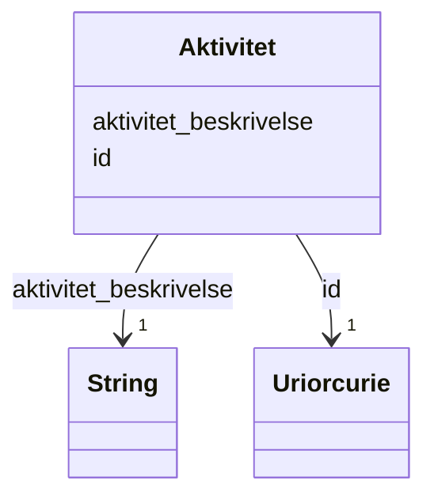

# Class: Aktivitet 


_Skildring av kva aktivitet ei hovudeining utøver. Svarer til formålsparagrafen eller føremålet til verksemda._


URI: [ngrv:Aktivitet](https://data.norge.no/vocabulary/ngr-virksomhet#Aktivitet)





<!-- no inheritance hierarchy -->

## Class Properties

| Property | Value |
| --- | --- |
| Class URI | [ngrv:Aktivitet](https://data.norge.no/vocabulary/ngr-virksomhet#Aktivitet) |


## Eigenskapar


  
  

  
  
    
  


### Obligatorisk

| Namn | Kardinalitet og domene | Beskriving |
| --- | --- | --- |
| [aktivitet_beskrivelse](aktivitet_beskrivelse.md) | 1 <br/> [xsd:string](http://www.w3.org/2001/XMLSchema#string) | Skildring av kva aktivitet verksemda utøver (formålsparagraf o |


  
  

  
  


  
  

  
  


  
  
  
  
    
  

  
  
  
    
      
    
      
    
      
    
  
  


### Andre

| Namn | Kardinalitet og domene | Beskriving |
| --- | --- | --- |
| [id](id.md) | 1 <br/> [xsd:anyURI](http://www.w3.org/2001/XMLSchema#anyURI) | URI-identifikator for ressursen |


## Usages

| used by | used in | type | used |
| ---  | --- | --- | --- |
| [VirksomhetContainer](virksomhetcontainer.md) | [aktivitetar](aktivitetar.md) | range | [Aktivitet](aktivitet.md) |
| [Hovedenhet](hovedenhet.md) | [utoevar_aktivitet](utoevar_aktivitet.md) | range | [Aktivitet](aktivitet.md) |


## Identifier and Mapping Information


### Schema Source


* from schema: https://data.norge.no/ngr/ngr-virksomhet


## Mappings

| Mapping Type | Mapped Value |
| ---  | ---  |
| self | ngrv:Aktivitet |
| native | https://data.norge.no/ngr/ngr-virksomhet/Aktivitet |


## Examples
### Example: Aktivitet-aktivitet-1

```yaml
id: ngrv:eksempel/aktivitet-1
aktivitet_beskrivelse: Utvikling og sal av programvare for norsk offentleg sektor.

```


## LinkML Source

<!-- TODO: investigate https://stackoverflow.com/questions/37606292/how-to-create-tabbed-code-blocks-in-mkdocs-or-sphinx -->

### Direct

<details>
```yaml
name: Aktivitet
description: Skildring av kva aktivitet ei hovudeining utøver. Svarer til formålsparagrafen
  eller føremålet til verksemda.
from_schema: https://data.norge.no/ngr/ngr-virksomhet
rank: 1000
slots:
- id
- aktivitet_beskrivelse
slot_usage:
  aktivitet_beskrivelse:
    name: aktivitet_beskrivelse
    in_subset:
    - Obligatorisk
    required: true
class_uri: ngrv:Aktivitet

```
</details>

### Induced

<details>
```yaml
name: Aktivitet
description: Skildring av kva aktivitet ei hovudeining utøver. Svarer til formålsparagrafen
  eller føremålet til verksemda.
from_schema: https://data.norge.no/ngr/ngr-virksomhet
rank: 1000
slot_usage:
  aktivitet_beskrivelse:
    name: aktivitet_beskrivelse
    in_subset:
    - Obligatorisk
    required: true
attributes:
  id:
    name: id
    description: URI-identifikator for ressursen.
    from_schema: https://data.norge.no/ngr/ngr-virksomhet
    rank: 1000
    identifier: true
    owner: Aktivitet
    domain_of:
    - Virksomhet
    - Tilstand
    - Organisasjonsform
    - Naeringskode
    - Sektorkode
    - Kontaktinformasjon
    - Varslingsadresse
    - Aktivitet
    - RolleIVirksomhet
    - Rolleinnehaver
    - Signaturrett
    - Prokura
    - GeografiskAdresse
    - Person
    range: uriorcurie
    required: true
  aktivitet_beskrivelse:
    name: aktivitet_beskrivelse
    description: Skildring av kva aktivitet verksemda utøver (formålsparagraf o.l.).
    in_subset:
    - Obligatorisk
    from_schema: https://data.norge.no/ngr/ngr-virksomhet
    rank: 1000
    slot_uri: ngrv:aktivitetBeskrivelse
    owner: Aktivitet
    domain_of:
    - Aktivitet
    range: string
    required: true
class_uri: ngrv:Aktivitet

```
</details>