# Class: Hovedenhet 


_Ei hovudeining er den juridiske eininga registrert i Enhetsregisteret (t.d. AS, ENK, BA). Kan ha undereiningar og rolleinnehavarar._


URI: [ngrv:Hovedenhet](https://data.norge.no/vocabulary/ngr-virksomhet#Hovedenhet)

```mermaid
 classDiagram
    class Hovedenhet
    click Hovedenhet href "../Hovedenhet/"
      Virksomhet <|-- Hovedenhet
        click Virksomhet href "../Virksomhet/"
      
      Hovedenhet : antall_ansatte
        
          
    
        
        
        Hovedenhet --> "0..1" Integer : antall_ansatte
        click Integer href "../http://www.w3.org/2001/XMLSchema#integer/"
    

        
      Hovedenhet : er_klassifisert_i_naeringskode
        
          
    
        
        
        Hovedenhet --> "1..*" Naeringskode : er_klassifisert_i_naeringskode
        click Naeringskode href "../Naeringskode/"
    

        
      Hovedenhet : er_klassifisert_i_sektorkode
        
          
    
        
        
        Hovedenhet --> "0..1" Sektorkode : er_klassifisert_i_sektorkode
        click Sektorkode href "../Sektorkode/"
    

        
      Hovedenhet : er_klassifisert_som_organisasjonsform
        
          
    
        
        
        Hovedenhet --> "1" Organisasjonsform : er_klassifisert_som_organisasjonsform
        click Organisasjonsform href "../Organisasjonsform/"
    

        
      Hovedenhet : har_bestemmelser_om_prokura
        
          
    
        
        
        Hovedenhet --> "*" Prokura : har_bestemmelser_om_prokura
        click Prokura href "../Prokura/"
    

        
      Hovedenhet : har_bestemmelser_om_signaturrett
        
          
    
        
        
        Hovedenhet --> "0..1" Signaturrett : har_bestemmelser_om_signaturrett
        click Signaturrett href "../Signaturrett/"
    

        
      Hovedenhet : har_forretningsadresse
        
          
    
        
        
        Hovedenhet --> "0..1" Forretningsadresse : har_forretningsadresse
        click Forretningsadresse href "../Forretningsadresse/"
    

        
      Hovedenhet : har_kontaktinformasjon
        
          
    
        
        
        Hovedenhet --> "0..1" Kontaktinformasjon : har_kontaktinformasjon
        click Kontaktinformasjon href "../Kontaktinformasjon/"
    

        
      Hovedenhet : har_rolle_i_virksomhet
        
          
    
        
        
        Hovedenhet --> "1..*" RolleIVirksomhet : har_rolle_i_virksomhet
        click RolleIVirksomhet href "../RolleIVirksomhet/"
    

        
      Hovedenhet : har_tilstand
        
          
    
        
        
        Hovedenhet --> "*" Tilstand : har_tilstand
        click Tilstand href "../Tilstand/"
    

        
      Hovedenhet : har_varslingsadresse
        
          
    
        
        
        Hovedenhet --> "1" Varslingsadresse : har_varslingsadresse
        click Varslingsadresse href "../Varslingsadresse/"
    

        
      Hovedenhet : id
        
          
    
        
        
        Hovedenhet --> "1" Uriorcurie : id
        click Uriorcurie href "../http://www.w3.org/2001/XMLSchema#anyURI/"
    

        
      Hovedenhet : mottar_post_paa
        
          
    
        
        
        Hovedenhet --> "0..1" Postadresse : mottar_post_paa
        click Postadresse href "../Postadresse/"
    

        
      Hovedenhet : navn
        
          
    
        
        
        Hovedenhet --> "1" String : navn
        click String href "../http://www.w3.org/2001/XMLSchema#string/"
    

        
      Hovedenhet : organisasjonsnummer
        
          
    
        
        
        Hovedenhet --> "1" String : organisasjonsnummer
        click String href "../http://www.w3.org/2001/XMLSchema#string/"
    

        
      Hovedenhet : stiftelsesdato
        
          
    
        
        
        Hovedenhet --> "0..1" Date : stiftelsesdato
        click Date href "../http://www.w3.org/2001/XMLSchema#date/"
    

        
      Hovedenhet : utoevar_aktivitet
        
          
    
        
        
        Hovedenhet --> "1" Aktivitet : utoevar_aktivitet
        click Aktivitet href "../Aktivitet/"
    

        
      
```





## Inheritance
* [Virksomhet](virksomhet.md)
    * **Hovedenhet**


## Class Properties

| Property | Value |
| --- | --- |
| Class URI | [ngrv:Hovedenhet](https://data.norge.no/vocabulary/ngr-virksomhet#Hovedenhet) |


## Eigenskapar


  
  
    
  

  
  

  
  
    
  

  
  

  
  

  
  

  
  


### Obligatorisk

| Namn | Kardinalitet og domene | Beskriving |
| --- | --- | --- |
| [utoevar_aktivitet](utoevar_aktivitet.md) | 1 <br/> [Aktivitet](aktivitet.md) | Aktiviteten hovudeininga utøver |
| [har_rolle_i_virksomhet](har_rolle_i_virksomhet.md) | 1..* <br/> [RolleIVirksomhet](rolleivirksomhet.md) | Roller registrert i hovudeininga (minimum 1) |


  
  

  
  
    
  

  
  

  
  

  
  

  
  
    
  

  
  


### Anbefalt

| Namn | Kardinalitet og domene | Beskriving |
| --- | --- | --- |
| [er_klassifisert_i_sektorkode](er_klassifisert_i_sektorkode.md) | 0..1 <br/> [Sektorkode](sektorkode.md) | Institusjonell sektorkode for hovudeininga |
| [stiftelsesdato](stiftelsesdato.md) | 0..1 <br/> [xsd:date](http://www.w3.org/2001/XMLSchema#date) | Datoen hovudeininga vart stifta |


  
  

  
  

  
  

  
  
    
  

  
  
    
  

  
  

  
  
    
  


### Valgfri

| Namn | Kardinalitet og domene | Beskriving |
| --- | --- | --- |
| [har_bestemmelser_om_signaturrett](har_bestemmelser_om_signaturrett.md) | 0..1 <br/> [Signaturrett](signaturrett.md) | Bestemmelse om signaturrett for hovudeininga |
| [har_bestemmelser_om_prokura](har_bestemmelser_om_prokura.md) | * <br/> [Prokura](prokura.md) | Prokurabestemmelse(r) for hovudeininga |
| [har_forretningsadresse](har_forretningsadresse.md) | 0..1 <br/> [Forretningsadresse](forretningsadresse.md) | Forretningsadressa (hovudkontor) til hovudeininga |


  
  
  
    
      
    
      
    
      
    
  
  

  
  
  
    
      
    
      
    
      
    
  
  

  
  
  
    
      
    
      
    
      
    
  
  

  
  
  
    
      
    
      
    
      
    
  
  

  
  
  
    
      
    
      
    
      
    
  
  

  
  
  
    
      
    
      
    
      
    
  
  

  
  
  
    
      
    
      
    
      
    
  
  


### Arva

| Namn | Kardinalitet og domene | Beskriving | Frå |
| --- | --- | --- | --- || [id](id.md) | 1 <br/> [xsd:anyURI](http://www.w3.org/2001/XMLSchema#anyURI) | URI-identifikator for ressursen | [Virksomhet](virksomhet.md) |
| [organisasjonsnummer](organisasjonsnummer.md) | 1 <br/> [xsd:string](http://www.w3.org/2001/XMLSchema#string) | Niesifra organisasjonsnummer tildelt av Enhetsregisteret | [Virksomhet](virksomhet.md) |
| [navn](navn.md) | 1 <br/> [xsd:string](http://www.w3.org/2001/XMLSchema#string) | Registrert namn på verksemda i Enhetsregisteret | [Virksomhet](virksomhet.md) |
| [har_tilstand](har_tilstand.md) | * <br/> [Tilstand](tilstand.md) | Registrert tilstand (status) for verksemda, inkl | [Virksomhet](virksomhet.md) |
| [mottar_post_paa](mottar_post_paa.md) | 0..1 <br/> [Postadresse](postadresse.md) | Postadressa verksemda mottar post på | [Virksomhet](virksomhet.md) |
| [er_klassifisert_som_organisasjonsform](er_klassifisert_som_organisasjonsform.md) | 1 <br/> [Organisasjonsform](organisasjonsform.md) | Organisasjonsform (juridisk form) for verksemda | [Virksomhet](virksomhet.md) |
| [har_kontaktinformasjon](har_kontaktinformasjon.md) | 0..1 <br/> [Kontaktinformasjon](kontaktinformasjon.md) | Kontaktinformasjon registrert på verksemda | [Virksomhet](virksomhet.md) |
| [har_varslingsadresse](har_varslingsadresse.md) | 1 <br/> [Varslingsadresse](varslingsadresse.md) | Offisiell varslingsadresse for offentlege meldingar | [Virksomhet](virksomhet.md) |
| [er_klassifisert_i_naeringskode](er_klassifisert_i_naeringskode.md) | 1..* <br/> [Naeringskode](naeringskode.md) | Næringskode(r) verksemda er klassifisert under (1–3) | [Virksomhet](virksomhet.md) |
| [antall_ansatte](antall_ansatte.md) | 0..1 <br/> [xsd:integer](http://www.w3.org/2001/XMLSchema#integer) | Antal tilsette i verksemda (rapportert til a-ordninga) | [Virksomhet](virksomhet.md) |


## Usages

| used by | used in | type | used |
| ---  | --- | --- | --- |
| [VirksomhetContainer](virksomhetcontainer.md) | [hovedenheter](hovedenheter.md) | range | [Hovedenhet](hovedenhet.md) |


## Identifier and Mapping Information


### Schema Source


* from schema: https://data.norge.no/ngr/ngr-virksomhet


## Mappings

| Mapping Type | Mapped Value |
| ---  | ---  |
| self | ngrv:Hovedenhet |
| native | https://data.norge.no/ngr/ngr-virksomhet/Hovedenhet |


## Examples
### Example: Hovedenhet-hovudeining-987654321

```yaml
id: ngrv:eksempel/hovudeining-987654321
organisasjonsnummer: '987654321'
navn: Eksempel AS
er_klassifisert_som_organisasjonsform: ngrv:eksempel/orgform-as
har_varslingsadresse: ngrv:eksempel/varsling-1
er_klassifisert_i_naeringskode:
- ngrv:eksempel/naeringskode-62010
har_tilstand:
- ngrv:eksempel/tilstand-1
har_kontaktinformasjon: ngrv:eksempel/kontakt-1
mottar_post_paa: ngrv:eksempel/postadresse-1
stiftelsesdato: '2010-03-15'
har_forretningsadresse: ngrv:eksempel/forretningsadresse-1
utoevar_aktivitet: ngrv:eksempel/aktivitet-1
er_klassifisert_i_sektorkode: ngrv:eksempel/sektorkode-2100
har_rolle_i_virksomhet:
- ngrv:eksempel/rolle-dagligleder
- ngrv:eksempel/rolle-styreleder
har_bestemmelser_om_signaturrett: ngrv:eksempel/signaturrett-1

```


## LinkML Source

<!-- TODO: investigate https://stackoverflow.com/questions/37606292/how-to-create-tabbed-code-blocks-in-mkdocs-or-sphinx -->

### Direct

<details>
```yaml
name: Hovedenhet
description: Ei hovudeining er den juridiske eininga registrert i Enhetsregisteret
  (t.d. AS, ENK, BA). Kan ha undereiningar og rolleinnehavarar.
from_schema: https://data.norge.no/ngr/ngr-virksomhet
rank: 1000
is_a: Virksomhet
slots:
- utoevar_aktivitet
- er_klassifisert_i_sektorkode
- har_rolle_i_virksomhet
- har_bestemmelser_om_signaturrett
- har_bestemmelser_om_prokura
- stiftelsesdato
- har_forretningsadresse
slot_usage:
  utoevar_aktivitet:
    name: utoevar_aktivitet
    in_subset:
    - Obligatorisk
    required: true
  har_rolle_i_virksomhet:
    name: har_rolle_i_virksomhet
    in_subset:
    - Obligatorisk
    required: true
    minimum_cardinality: 1
  er_klassifisert_i_sektorkode:
    name: er_klassifisert_i_sektorkode
    in_subset:
    - Anbefalt
  stiftelsesdato:
    name: stiftelsesdato
    in_subset:
    - Anbefalt
  har_bestemmelser_om_signaturrett:
    name: har_bestemmelser_om_signaturrett
    in_subset:
    - Valgfri
  har_bestemmelser_om_prokura:
    name: har_bestemmelser_om_prokura
    in_subset:
    - Valgfri
  har_forretningsadresse:
    name: har_forretningsadresse
    in_subset:
    - Valgfri
class_uri: ngrv:Hovedenhet

```
</details>

### Induced

<details>
```yaml
name: Hovedenhet
description: Ei hovudeining er den juridiske eininga registrert i Enhetsregisteret
  (t.d. AS, ENK, BA). Kan ha undereiningar og rolleinnehavarar.
from_schema: https://data.norge.no/ngr/ngr-virksomhet
rank: 1000
is_a: Virksomhet
slot_usage:
  utoevar_aktivitet:
    name: utoevar_aktivitet
    in_subset:
    - Obligatorisk
    required: true
  har_rolle_i_virksomhet:
    name: har_rolle_i_virksomhet
    in_subset:
    - Obligatorisk
    required: true
    minimum_cardinality: 1
  er_klassifisert_i_sektorkode:
    name: er_klassifisert_i_sektorkode
    in_subset:
    - Anbefalt
  stiftelsesdato:
    name: stiftelsesdato
    in_subset:
    - Anbefalt
  har_bestemmelser_om_signaturrett:
    name: har_bestemmelser_om_signaturrett
    in_subset:
    - Valgfri
  har_bestemmelser_om_prokura:
    name: har_bestemmelser_om_prokura
    in_subset:
    - Valgfri
  har_forretningsadresse:
    name: har_forretningsadresse
    in_subset:
    - Valgfri
attributes:
  utoevar_aktivitet:
    name: utoevar_aktivitet
    description: Aktiviteten hovudeininga utøver.
    in_subset:
    - Obligatorisk
    from_schema: https://data.norge.no/ngr/ngr-virksomhet
    rank: 1000
    slot_uri: ngrv:utoevarAktivitet
    owner: Hovedenhet
    domain_of:
    - Hovedenhet
    range: Aktivitet
    required: true
  er_klassifisert_i_sektorkode:
    name: er_klassifisert_i_sektorkode
    description: Institusjonell sektorkode for hovudeininga.
    in_subset:
    - Anbefalt
    from_schema: https://data.norge.no/ngr/ngr-virksomhet
    rank: 1000
    slot_uri: ngrv:erKlassifisertISektorkode
    owner: Hovedenhet
    domain_of:
    - Hovedenhet
    range: Sektorkode
  har_rolle_i_virksomhet:
    name: har_rolle_i_virksomhet
    description: Roller registrert i hovudeininga (minimum 1).
    in_subset:
    - Obligatorisk
    from_schema: https://data.norge.no/ngr/ngr-virksomhet
    rank: 1000
    slot_uri: ngrv:harRolleIVirksomhet
    owner: Hovedenhet
    domain_of:
    - Hovedenhet
    range: RolleIVirksomhet
    required: true
    multivalued: true
    minimum_cardinality: 1
  har_bestemmelser_om_signaturrett:
    name: har_bestemmelser_om_signaturrett
    description: Bestemmelse om signaturrett for hovudeininga.
    in_subset:
    - Valgfri
    from_schema: https://data.norge.no/ngr/ngr-virksomhet
    rank: 1000
    slot_uri: ngrv:harBestemmelserOmSignaturrett
    owner: Hovedenhet
    domain_of:
    - Hovedenhet
    range: Signaturrett
  har_bestemmelser_om_prokura:
    name: har_bestemmelser_om_prokura
    description: Prokurabestemmelse(r) for hovudeininga.
    in_subset:
    - Valgfri
    from_schema: https://data.norge.no/ngr/ngr-virksomhet
    rank: 1000
    slot_uri: ngrv:harBestemmelserOmProkura
    owner: Hovedenhet
    domain_of:
    - Hovedenhet
    range: Prokura
    multivalued: true
  stiftelsesdato:
    name: stiftelsesdato
    description: Datoen hovudeininga vart stifta.
    in_subset:
    - Anbefalt
    from_schema: https://data.norge.no/ngr/ngr-virksomhet
    rank: 1000
    slot_uri: ngrv:stiftelsesdato
    owner: Hovedenhet
    domain_of:
    - Hovedenhet
    range: date
  har_forretningsadresse:
    name: har_forretningsadresse
    description: Forretningsadressa (hovudkontor) til hovudeininga.
    in_subset:
    - Valgfri
    from_schema: https://data.norge.no/ngr/ngr-virksomhet
    rank: 1000
    slot_uri: ngrv:harForretningsadresse
    owner: Hovedenhet
    domain_of:
    - Hovedenhet
    range: Forretningsadresse
  id:
    name: id
    description: URI-identifikator for ressursen.
    from_schema: https://data.norge.no/ngr/ngr-virksomhet
    rank: 1000
    identifier: true
    owner: Hovedenhet
    domain_of:
    - Virksomhet
    - Tilstand
    - Organisasjonsform
    - Naeringskode
    - Sektorkode
    - Kontaktinformasjon
    - Varslingsadresse
    - Aktivitet
    - RolleIVirksomhet
    - Rolleinnehaver
    - Signaturrett
    - Prokura
    - GeografiskAdresse
    - Person
    range: uriorcurie
    required: true
  organisasjonsnummer:
    name: organisasjonsnummer
    description: Niesifra organisasjonsnummer tildelt av Enhetsregisteret.
    in_subset:
    - Obligatorisk
    from_schema: https://data.norge.no/ngr/ngr-virksomhet
    rank: 1000
    slot_uri: ngrv:organisasjonsnummer
    owner: Hovedenhet
    domain_of:
    - Virksomhet
    range: string
    required: true
  navn:
    name: navn
    description: Registrert namn på verksemda i Enhetsregisteret.
    in_subset:
    - Obligatorisk
    from_schema: https://data.norge.no/ngr/ngr-virksomhet
    rank: 1000
    slot_uri: ngrv:navn
    owner: Hovedenhet
    domain_of:
    - Virksomhet
    range: string
    required: true
  har_tilstand:
    name: har_tilstand
    description: Registrert tilstand (status) for verksemda, inkl. historikk.
    in_subset:
    - Anbefalt
    from_schema: https://data.norge.no/ngr/ngr-virksomhet
    rank: 1000
    slot_uri: ngrv:harTilstand
    owner: Hovedenhet
    domain_of:
    - Virksomhet
    range: Tilstand
    multivalued: true
  mottar_post_paa:
    name: mottar_post_paa
    description: Postadressa verksemda mottar post på.
    in_subset:
    - Anbefalt
    from_schema: https://data.norge.no/ngr/ngr-virksomhet
    rank: 1000
    slot_uri: ngrv:mottarPostPaa
    owner: Hovedenhet
    domain_of:
    - Virksomhet
    range: Postadresse
  er_klassifisert_som_organisasjonsform:
    name: er_klassifisert_som_organisasjonsform
    description: Organisasjonsform (juridisk form) for verksemda.
    in_subset:
    - Obligatorisk
    from_schema: https://data.norge.no/ngr/ngr-virksomhet
    rank: 1000
    slot_uri: ngrv:erKlassifisertSomOrganisasjonsform
    owner: Hovedenhet
    domain_of:
    - Virksomhet
    range: Organisasjonsform
    required: true
  har_kontaktinformasjon:
    name: har_kontaktinformasjon
    description: Kontaktinformasjon registrert på verksemda.
    in_subset:
    - Valgfri
    from_schema: https://data.norge.no/ngr/ngr-virksomhet
    rank: 1000
    slot_uri: ngrv:harKontaktinformasjon
    owner: Hovedenhet
    domain_of:
    - Virksomhet
    range: Kontaktinformasjon
  har_varslingsadresse:
    name: har_varslingsadresse
    description: Offisiell varslingsadresse for offentlege meldingar.
    in_subset:
    - Obligatorisk
    from_schema: https://data.norge.no/ngr/ngr-virksomhet
    rank: 1000
    slot_uri: ngrv:harVarslingsadresse
    owner: Hovedenhet
    domain_of:
    - Virksomhet
    range: Varslingsadresse
    required: true
  er_klassifisert_i_naeringskode:
    name: er_klassifisert_i_naeringskode
    description: Næringskode(r) verksemda er klassifisert under (1–3).
    in_subset:
    - Obligatorisk
    from_schema: https://data.norge.no/ngr/ngr-virksomhet
    rank: 1000
    slot_uri: ngrv:erKlassifisertINaeringskode
    owner: Hovedenhet
    domain_of:
    - Virksomhet
    range: Naeringskode
    required: true
    multivalued: true
    minimum_cardinality: 1
  antall_ansatte:
    name: antall_ansatte
    description: Antal tilsette i verksemda (rapportert til a-ordninga).
    in_subset:
    - Valgfri
    from_schema: https://data.norge.no/ngr/ngr-virksomhet
    rank: 1000
    slot_uri: ngrv:antallAnsatte
    owner: Hovedenhet
    domain_of:
    - Virksomhet
    range: integer
class_uri: ngrv:Hovedenhet

```
</details>