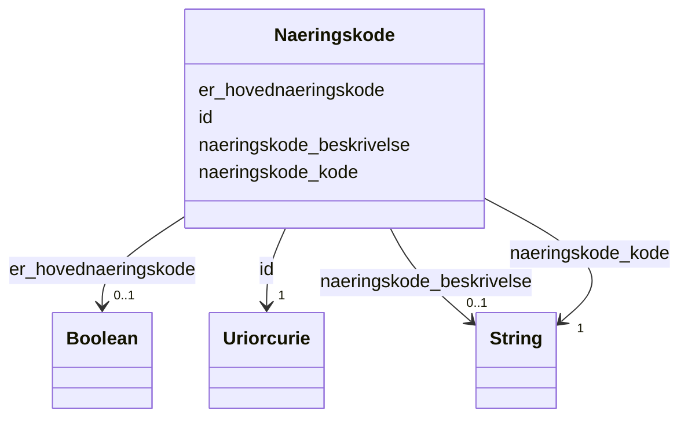

# Class: Naeringskode 


_Næringskode basert på SSBs Standard for næringsgruppering (SN2007/NACE). Ei verksemd kan ha 1–3 næringskoder._


URI: [ngrv:Naeringskode](https://data.norge.no/vocabulary/ngr-virksomhet#Naeringskode)





<!-- no inheritance hierarchy -->

## Class Properties

| Property | Value |
| --- | --- |
| Class URI | [ngrv:Naeringskode](https://data.norge.no/vocabulary/ngr-virksomhet#Naeringskode) |


## Eigenskapar


  
  

  
  
    
  

  
  

  
  


### Obligatorisk

| Namn | Kardinalitet og domene | Beskriving |
| --- | --- | --- |
| [naeringskode_kode](naeringskode_kode.md) | 1 <br/> [xsd:string](http://www.w3.org/2001/XMLSchema#string) | NACE-kode for næringsgruppering (t |


  
  

  
  

  
  
    
  

  
  
    
  


### Anbefalt

| Namn | Kardinalitet og domene | Beskriving |
| --- | --- | --- |
| [naeringskode_beskrivelse](naeringskode_beskrivelse.md) | 0..1 <br/> [xsd:string](http://www.w3.org/2001/XMLSchema#string) | Tekstleg skildring av næringskoden |
| [er_hovednaeringskode](er_hovednaeringskode.md) | 0..1 <br/> [xsd:boolean](http://www.w3.org/2001/XMLSchema#boolean) | Om dette er hovudnæringskoden til verksemda |


  
  

  
  

  
  

  
  


  
  
  
  
    
  

  
  
  
    
      
    
      
    
      
    
  
  

  
  
  
    
      
    
      
    
      
    
  
  

  
  
  
    
      
    
      
    
      
    
  
  


### Andre

| Namn | Kardinalitet og domene | Beskriving |
| --- | --- | --- |
| [id](id.md) | 1 <br/> [xsd:anyURI](http://www.w3.org/2001/XMLSchema#anyURI) | URI-identifikator for ressursen |


## Usages

| used by | used in | type | used |
| ---  | --- | --- | --- |
| [VirksomhetContainer](virksomhetcontainer.md) | [naeringskoder](naeringskoder.md) | range | [Naeringskode](naeringskode.md) |
| [Virksomhet](virksomhet.md) | [er_klassifisert_i_naeringskode](er_klassifisert_i_naeringskode.md) | range | [Naeringskode](naeringskode.md) |
| [Underenhet](underenhet.md) | [er_klassifisert_i_naeringskode](er_klassifisert_i_naeringskode.md) | range | [Naeringskode](naeringskode.md) |
| [Hovedenhet](hovedenhet.md) | [er_klassifisert_i_naeringskode](er_klassifisert_i_naeringskode.md) | range | [Naeringskode](naeringskode.md) |


## Identifier and Mapping Information


### Schema Source


* from schema: https://data.norge.no/ngr/ngr-virksomhet


## Mappings

| Mapping Type | Mapped Value |
| ---  | ---  |
| self | ngrv:Naeringskode |
| native | https://data.norge.no/ngr/ngr-virksomhet/Naeringskode |


## Examples
### Example: Naeringskode-naeringskode-62010

```yaml
id: ngrv:eksempel/naeringskode-62010
naeringskode_kode: '62.010'
naeringskode_beskrivelse: Utvikling og produksjon av programvare
er_hovednaeringskode: true

```


## LinkML Source

<!-- TODO: investigate https://stackoverflow.com/questions/37606292/how-to-create-tabbed-code-blocks-in-mkdocs-or-sphinx -->

### Direct

<details>
```yaml
name: Naeringskode
description: Næringskode basert på SSBs Standard for næringsgruppering (SN2007/NACE).
  Ei verksemd kan ha 1–3 næringskoder.
from_schema: https://data.norge.no/ngr/ngr-virksomhet
rank: 1000
slots:
- id
- naeringskode_kode
- naeringskode_beskrivelse
- er_hovednaeringskode
slot_usage:
  naeringskode_kode:
    name: naeringskode_kode
    in_subset:
    - Obligatorisk
    required: true
  naeringskode_beskrivelse:
    name: naeringskode_beskrivelse
    in_subset:
    - Anbefalt
  er_hovednaeringskode:
    name: er_hovednaeringskode
    in_subset:
    - Anbefalt
class_uri: ngrv:Naeringskode

```
</details>

### Induced

<details>
```yaml
name: Naeringskode
description: Næringskode basert på SSBs Standard for næringsgruppering (SN2007/NACE).
  Ei verksemd kan ha 1–3 næringskoder.
from_schema: https://data.norge.no/ngr/ngr-virksomhet
rank: 1000
slot_usage:
  naeringskode_kode:
    name: naeringskode_kode
    in_subset:
    - Obligatorisk
    required: true
  naeringskode_beskrivelse:
    name: naeringskode_beskrivelse
    in_subset:
    - Anbefalt
  er_hovednaeringskode:
    name: er_hovednaeringskode
    in_subset:
    - Anbefalt
attributes:
  id:
    name: id
    description: URI-identifikator for ressursen.
    from_schema: https://data.norge.no/ngr/ngr-virksomhet
    rank: 1000
    identifier: true
    owner: Naeringskode
    domain_of:
    - Virksomhet
    - Tilstand
    - Organisasjonsform
    - Naeringskode
    - Sektorkode
    - Kontaktinformasjon
    - Varslingsadresse
    - Aktivitet
    - RolleIVirksomhet
    - Rolleinnehaver
    - Signaturrett
    - Prokura
    - GeografiskAdresse
    - Person
    range: uriorcurie
    required: true
  naeringskode_kode:
    name: naeringskode_kode
    description: NACE-kode for næringsgruppering (t.d. 62.010).
    in_subset:
    - Obligatorisk
    from_schema: https://data.norge.no/ngr/ngr-virksomhet
    rank: 1000
    slot_uri: ngrv:naeringskodeKode
    owner: Naeringskode
    domain_of:
    - Naeringskode
    range: string
    required: true
  naeringskode_beskrivelse:
    name: naeringskode_beskrivelse
    description: Tekstleg skildring av næringskoden.
    in_subset:
    - Anbefalt
    from_schema: https://data.norge.no/ngr/ngr-virksomhet
    rank: 1000
    slot_uri: ngrv:naeringskodeBeskrivelse
    owner: Naeringskode
    domain_of:
    - Naeringskode
    range: string
  er_hovednaeringskode:
    name: er_hovednaeringskode
    description: Om dette er hovudnæringskoden til verksemda.
    in_subset:
    - Anbefalt
    from_schema: https://data.norge.no/ngr/ngr-virksomhet
    rank: 1000
    slot_uri: ngrv:erHovednaeringskode
    owner: Naeringskode
    domain_of:
    - Naeringskode
    range: boolean
class_uri: ngrv:Naeringskode

```
</details>