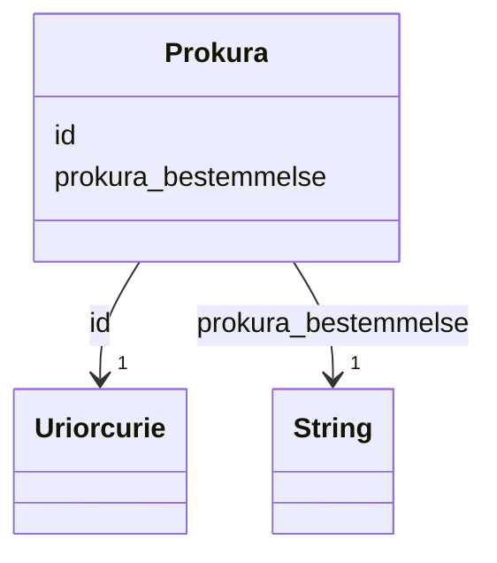

# Class: Prokura 


_Prokura gjev ein person fullmakt til å handle på vegne av verksemda i næringssaker. Verksemda kan ha fleire prokuraistar._


URI: [ngrv:Prokura](https://data.norge.no/vocabulary/ngr-virksomhet#Prokura)





<!-- no inheritance hierarchy -->

## Class Properties

| Property | Value |
| --- | --- |
| Class URI | [ngrv:Prokura](https://data.norge.no/vocabulary/ngr-virksomhet#Prokura) |


## Eigenskapar


  
  

  
  
    
  


### Obligatorisk

| Namn | Kardinalitet og domene | Beskriving |
| --- | --- | --- |
| [prokura_bestemmelse](prokura_bestemmelse.md) | 1 <br/> [xsd:string](http://www.w3.org/2001/XMLSchema#string) | Tekstleg bestemmelse om prokura og kven som er tildelt den |


  
  

  
  


  
  

  
  


  
  
  
  
    
  

  
  
  
    
      
    
      
    
      
    
  
  


### Andre

| Namn | Kardinalitet og domene | Beskriving |
| --- | --- | --- |
| [id](id.md) | 1 <br/> [xsd:anyURI](http://www.w3.org/2001/XMLSchema#anyURI) | URI-identifikator for ressursen |


## Usages

| used by | used in | type | used |
| ---  | --- | --- | --- |
| [VirksomhetContainer](virksomhetcontainer.md) | [prokuraer](prokuraer.md) | range | [Prokura](prokura.md) |
| [Hovedenhet](hovedenhet.md) | [har_bestemmelser_om_prokura](har_bestemmelser_om_prokura.md) | range | [Prokura](prokura.md) |


## Identifier and Mapping Information


### Schema Source


* from schema: https://data.norge.no/ngr/ngr-virksomhet


## Mappings

| Mapping Type | Mapped Value |
| ---  | ---  |
| self | ngrv:Prokura |
| native | https://data.norge.no/ngr/ngr-virksomhet/Prokura |


## LinkML Source

<!-- TODO: investigate https://stackoverflow.com/questions/37606292/how-to-create-tabbed-code-blocks-in-mkdocs-or-sphinx -->

### Direct

<details>
```yaml
name: Prokura
description: Prokura gjev ein person fullmakt til å handle på vegne av verksemda i
  næringssaker. Verksemda kan ha fleire prokuraistar.
from_schema: https://data.norge.no/ngr/ngr-virksomhet
rank: 1000
slots:
- id
- prokura_bestemmelse
slot_usage:
  prokura_bestemmelse:
    name: prokura_bestemmelse
    in_subset:
    - Obligatorisk
    required: true
class_uri: ngrv:Prokura

```
</details>

### Induced

<details>
```yaml
name: Prokura
description: Prokura gjev ein person fullmakt til å handle på vegne av verksemda i
  næringssaker. Verksemda kan ha fleire prokuraistar.
from_schema: https://data.norge.no/ngr/ngr-virksomhet
rank: 1000
slot_usage:
  prokura_bestemmelse:
    name: prokura_bestemmelse
    in_subset:
    - Obligatorisk
    required: true
attributes:
  id:
    name: id
    description: URI-identifikator for ressursen.
    from_schema: https://data.norge.no/ngr/ngr-virksomhet
    rank: 1000
    identifier: true
    owner: Prokura
    domain_of:
    - Virksomhet
    - Tilstand
    - Organisasjonsform
    - Naeringskode
    - Sektorkode
    - Kontaktinformasjon
    - Varslingsadresse
    - Aktivitet
    - RolleIVirksomhet
    - Rolleinnehaver
    - Signaturrett
    - Prokura
    - GeografiskAdresse
    - Person
    range: uriorcurie
    required: true
  prokura_bestemmelse:
    name: prokura_bestemmelse
    description: Tekstleg bestemmelse om prokura og kven som er tildelt den.
    in_subset:
    - Obligatorisk
    from_schema: https://data.norge.no/ngr/ngr-virksomhet
    rank: 1000
    slot_uri: ngrv:prokurabEstemmelse
    owner: Prokura
    domain_of:
    - Prokura
    range: string
    required: true
class_uri: ngrv:Prokura

```
</details>