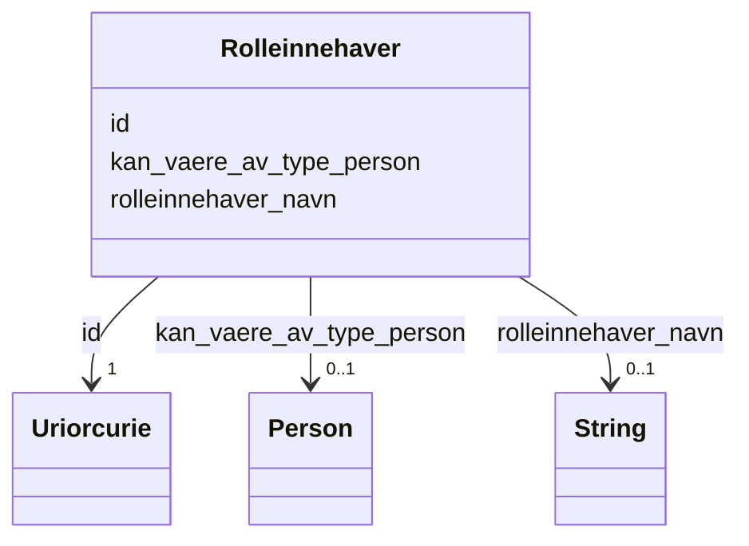

# Class: Rolleinnehaver 


_Den som innehar ein rolle i ei verksemd. Kan vere ein fysisk person (frå Folkeregisteret) eller ei anna eining._


URI: [ngrv:Rolleinnehaver](https://data.norge.no/vocabulary/ngr-virksomhet#Rolleinnehaver)





<!-- no inheritance hierarchy -->

## Class Properties

| Property | Value |
| --- | --- |
| Class URI | [ngrv:Rolleinnehaver](https://data.norge.no/vocabulary/ngr-virksomhet#Rolleinnehaver) |


## Eigenskapar


  
  

  
  

  
  


  
  

  
  
    
  

  
  


### Anbefalt

| Namn | Kardinalitet og domene | Beskriving |
| --- | --- | --- |
| [kan_vaere_av_type_person](kan_vaere_av_type_person.md) | 0..1 <br/> [Person](person.md) | Personen som er rolleinnehavar (frå Folkeregisteret) |


  
  

  
  

  
  
    
  


### Valgfri

| Namn | Kardinalitet og domene | Beskriving |
| --- | --- | --- |
| [rolleinnehaver_navn](rolleinnehaver_navn.md) | 0..1 <br/> [xsd:string](http://www.w3.org/2001/XMLSchema#string) | Namn på rolleinnehavar (nyttes for institusjonelle rollehavarar) |


  
  
  
  
    
  

  
  
  
    
      
    
      
    
      
    
  
  

  
  
  
    
      
    
      
    
      
    
  
  


### Andre

| Namn | Kardinalitet og domene | Beskriving |
| --- | --- | --- |
| [id](id.md) | 1 <br/> [xsd:anyURI](http://www.w3.org/2001/XMLSchema#anyURI) | URI-identifikator for ressursen |


## Usages

| used by | used in | type | used |
| ---  | --- | --- | --- |
| [VirksomhetContainer](virksomhetcontainer.md) | [rolleinnehavere](rolleinnehavere.md) | range | [Rolleinnehaver](rolleinnehaver.md) |
| [RolleIVirksomhet](rolleivirksomhet.md) | [har_rolleinnehaver](har_rolleinnehaver.md) | range | [Rolleinnehaver](rolleinnehaver.md) |


## Identifier and Mapping Information


### Schema Source


* from schema: https://data.norge.no/ngr/ngr-virksomhet


## Mappings

| Mapping Type | Mapped Value |
| ---  | ---  |
| self | ngrv:Rolleinnehaver |
| native | https://data.norge.no/ngr/ngr-virksomhet/Rolleinnehaver |


## Examples
### Example: Rolleinnehaver-rolleinnehaver-1

```yaml
id: ngrv:eksempel/rolleinnehaver-1
kan_vaere_av_type_person: ngrv:eksempel/person-1

```
### Example: Rolleinnehaver-rolleinnehaver-2

```yaml
id: ngrv:eksempel/rolleinnehaver-2
rolleinnehaver_navn: Kari Nordmann

```


## LinkML Source

<!-- TODO: investigate https://stackoverflow.com/questions/37606292/how-to-create-tabbed-code-blocks-in-mkdocs-or-sphinx -->

### Direct

<details>
```yaml
name: Rolleinnehaver
description: Den som innehar ein rolle i ei verksemd. Kan vere ein fysisk person (frå
  Folkeregisteret) eller ei anna eining.
from_schema: https://data.norge.no/ngr/ngr-virksomhet
rank: 1000
slots:
- id
- kan_vaere_av_type_person
- rolleinnehaver_navn
slot_usage:
  kan_vaere_av_type_person:
    name: kan_vaere_av_type_person
    in_subset:
    - Anbefalt
  rolleinnehaver_navn:
    name: rolleinnehaver_navn
    in_subset:
    - Valgfri
class_uri: ngrv:Rolleinnehaver

```
</details>

### Induced

<details>
```yaml
name: Rolleinnehaver
description: Den som innehar ein rolle i ei verksemd. Kan vere ein fysisk person (frå
  Folkeregisteret) eller ei anna eining.
from_schema: https://data.norge.no/ngr/ngr-virksomhet
rank: 1000
slot_usage:
  kan_vaere_av_type_person:
    name: kan_vaere_av_type_person
    in_subset:
    - Anbefalt
  rolleinnehaver_navn:
    name: rolleinnehaver_navn
    in_subset:
    - Valgfri
attributes:
  id:
    name: id
    description: URI-identifikator for ressursen.
    from_schema: https://data.norge.no/ngr/ngr-virksomhet
    rank: 1000
    identifier: true
    owner: Rolleinnehaver
    domain_of:
    - Virksomhet
    - Tilstand
    - Organisasjonsform
    - Naeringskode
    - Sektorkode
    - Kontaktinformasjon
    - Varslingsadresse
    - Aktivitet
    - RolleIVirksomhet
    - Rolleinnehaver
    - Signaturrett
    - Prokura
    - GeografiskAdresse
    - Person
    range: uriorcurie
    required: true
  kan_vaere_av_type_person:
    name: kan_vaere_av_type_person
    description: Personen som er rolleinnehavar (frå Folkeregisteret).
    in_subset:
    - Anbefalt
    from_schema: https://data.norge.no/ngr/ngr-virksomhet
    rank: 1000
    slot_uri: ngrv:kanVaereAvTypePerson
    owner: Rolleinnehaver
    domain_of:
    - Rolleinnehaver
    range: Person
  rolleinnehaver_navn:
    name: rolleinnehaver_navn
    description: Namn på rolleinnehavar (nyttes for institusjonelle rollehavarar).
    in_subset:
    - Valgfri
    from_schema: https://data.norge.no/ngr/ngr-virksomhet
    rank: 1000
    slot_uri: ngrv:rolleinnehaverNavn
    owner: Rolleinnehaver
    domain_of:
    - Rolleinnehaver
    range: string
class_uri: ngrv:Rolleinnehaver

```
</details>