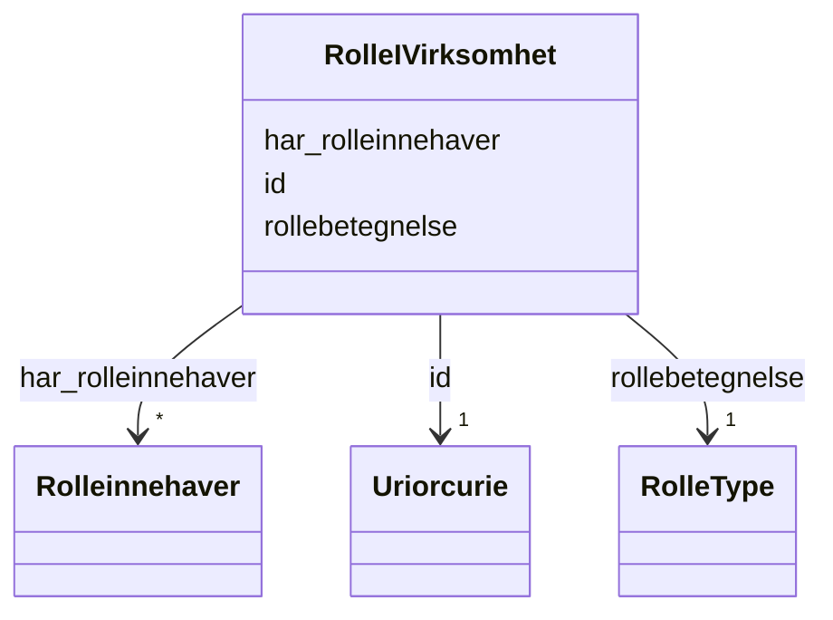

# Class: RolleIVirksomhet 


_Ein definert rolle i ei hovudeining (t.d. dagleg leiar, styreleiar). Kvar rolle kan ha éin eller fleire rolleinnehavarar._


URI: [ngrv:RolleIVirksomhet](https://data.norge.no/vocabulary/ngr-virksomhet#RolleIVirksomhet)





<!-- no inheritance hierarchy -->

## Class Properties

| Property | Value |
| --- | --- |
| Class URI | [ngrv:RolleIVirksomhet](https://data.norge.no/vocabulary/ngr-virksomhet#RolleIVirksomhet) |


## Eigenskapar


  
  

  
  
    
  

  
  


### Obligatorisk

| Namn | Kardinalitet og domene | Beskriving |
| --- | --- | --- |
| [rollebetegnelse](rollebetegnelse.md) | 1 <br/> [RolleType](rolletype.md) | Kva type rolle dette er (dagleg leiar, styreleiar o |


  
  

  
  

  
  
    
  


### Anbefalt

| Namn | Kardinalitet og domene | Beskriving |
| --- | --- | --- |
| [har_rolleinnehaver](har_rolleinnehaver.md) | * <br/> [Rolleinnehaver](rolleinnehaver.md) | Rolleinnehavar(ar) for denne rolla |


  
  

  
  

  
  


  
  
  
  
    
  

  
  
  
    
      
    
      
    
      
    
  
  

  
  
  
    
      
    
      
    
      
    
  
  


### Andre

| Namn | Kardinalitet og domene | Beskriving |
| --- | --- | --- |
| [id](id.md) | 1 <br/> [xsd:anyURI](http://www.w3.org/2001/XMLSchema#anyURI) | URI-identifikator for ressursen |


## Usages

| used by | used in | type | used |
| ---  | --- | --- | --- |
| [VirksomhetContainer](virksomhetcontainer.md) | [rollerIVirksomhet](rollerivirksomhet.md) | range | [RolleIVirksomhet](rolleivirksomhet.md) |
| [Hovedenhet](hovedenhet.md) | [har_rolle_i_virksomhet](har_rolle_i_virksomhet.md) | range | [RolleIVirksomhet](rolleivirksomhet.md) |


## Identifier and Mapping Information


### Schema Source


* from schema: https://data.norge.no/ngr/ngr-virksomhet


## Mappings

| Mapping Type | Mapped Value |
| ---  | ---  |
| self | ngrv:RolleIVirksomhet |
| native | https://data.norge.no/ngr/ngr-virksomhet/RolleIVirksomhet |


## Examples
### Example: RolleIVirksomhet-rolle-dagligleder

```yaml
id: ngrv:eksempel/rolle-dagligleder
rollebetegnelse: DAGLIG_LEDER
har_rolleinnehaver:
- ngrv:eksempel/rolleinnehaver-1

```
### Example: RolleIVirksomhet-rolle-styreleder

```yaml
id: ngrv:eksempel/rolle-styreleder
rollebetegnelse: STYRELEDER
har_rolleinnehaver:
- ngrv:eksempel/rolleinnehaver-2

```


## LinkML Source

<!-- TODO: investigate https://stackoverflow.com/questions/37606292/how-to-create-tabbed-code-blocks-in-mkdocs-or-sphinx -->

### Direct

<details>
```yaml
name: RolleIVirksomhet
description: Ein definert rolle i ei hovudeining (t.d. dagleg leiar, styreleiar).
  Kvar rolle kan ha éin eller fleire rolleinnehavarar.
from_schema: https://data.norge.no/ngr/ngr-virksomhet
rank: 1000
slots:
- id
- rollebetegnelse
- har_rolleinnehaver
slot_usage:
  rollebetegnelse:
    name: rollebetegnelse
    in_subset:
    - Obligatorisk
    required: true
  har_rolleinnehaver:
    name: har_rolleinnehaver
    in_subset:
    - Anbefalt
class_uri: ngrv:RolleIVirksomhet

```
</details>

### Induced

<details>
```yaml
name: RolleIVirksomhet
description: Ein definert rolle i ei hovudeining (t.d. dagleg leiar, styreleiar).
  Kvar rolle kan ha éin eller fleire rolleinnehavarar.
from_schema: https://data.norge.no/ngr/ngr-virksomhet
rank: 1000
slot_usage:
  rollebetegnelse:
    name: rollebetegnelse
    in_subset:
    - Obligatorisk
    required: true
  har_rolleinnehaver:
    name: har_rolleinnehaver
    in_subset:
    - Anbefalt
attributes:
  id:
    name: id
    description: URI-identifikator for ressursen.
    from_schema: https://data.norge.no/ngr/ngr-virksomhet
    rank: 1000
    identifier: true
    owner: RolleIVirksomhet
    domain_of:
    - Virksomhet
    - Tilstand
    - Organisasjonsform
    - Naeringskode
    - Sektorkode
    - Kontaktinformasjon
    - Varslingsadresse
    - Aktivitet
    - RolleIVirksomhet
    - Rolleinnehaver
    - Signaturrett
    - Prokura
    - GeografiskAdresse
    - Person
    range: uriorcurie
    required: true
  rollebetegnelse:
    name: rollebetegnelse
    description: Kva type rolle dette er (dagleg leiar, styreleiar o.l.).
    in_subset:
    - Obligatorisk
    from_schema: https://data.norge.no/ngr/ngr-virksomhet
    rank: 1000
    slot_uri: ngrv:rollebetegnelse
    owner: RolleIVirksomhet
    domain_of:
    - RolleIVirksomhet
    range: RolleType
    required: true
  har_rolleinnehaver:
    name: har_rolleinnehaver
    description: Rolleinnehavar(ar) for denne rolla.
    in_subset:
    - Anbefalt
    from_schema: https://data.norge.no/ngr/ngr-virksomhet
    rank: 1000
    slot_uri: ngrv:harRolleinnehaver
    owner: RolleIVirksomhet
    domain_of:
    - RolleIVirksomhet
    range: Rolleinnehaver
    multivalued: true
class_uri: ngrv:RolleIVirksomhet

```
</details>