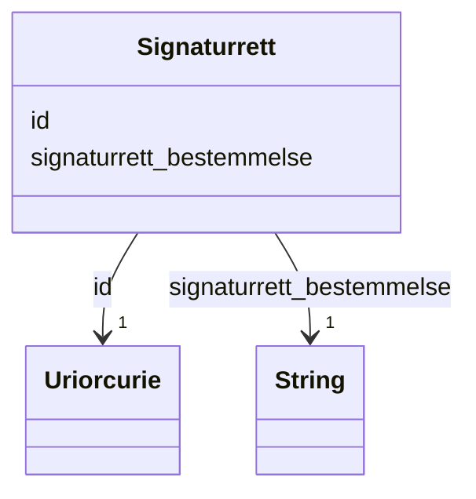

# Class: Signaturrett 


_Bestemmelse om kven som har rett til å signere på vegne av verksemda (t.d. "Styret i fellesskap" eller "Dagleg leiar aleine")._


URI: [ngrv:Signaturrett](https://data.norge.no/vocabulary/ngr-virksomhet#Signaturrett)





<!-- no inheritance hierarchy -->

## Class Properties

| Property | Value |
| --- | --- |
| Class URI | [ngrv:Signaturrett](https://data.norge.no/vocabulary/ngr-virksomhet#Signaturrett) |


## Eigenskapar


  
  

  
  
    
  


### Obligatorisk

| Namn | Kardinalitet og domene | Beskriving |
| --- | --- | --- |
| [signaturrett_bestemmelse](signaturrett_bestemmelse.md) | 1 <br/> [xsd:string](http://www.w3.org/2001/XMLSchema#string) | Tekstleg bestemmelse om signaturrett (t |


  
  

  
  


  
  

  
  


  
  
  
  
    
  

  
  
  
    
      
    
      
    
      
    
  
  


### Andre

| Namn | Kardinalitet og domene | Beskriving |
| --- | --- | --- |
| [id](id.md) | 1 <br/> [xsd:anyURI](http://www.w3.org/2001/XMLSchema#anyURI) | URI-identifikator for ressursen |


## Usages

| used by | used in | type | used |
| ---  | --- | --- | --- |
| [VirksomhetContainer](virksomhetcontainer.md) | [signaturrettar](signaturrettar.md) | range | [Signaturrett](signaturrett.md) |
| [Hovedenhet](hovedenhet.md) | [har_bestemmelser_om_signaturrett](har_bestemmelser_om_signaturrett.md) | range | [Signaturrett](signaturrett.md) |


## Identifier and Mapping Information


### Schema Source


* from schema: https://data.norge.no/ngr/ngr-virksomhet


## Mappings

| Mapping Type | Mapped Value |
| ---  | ---  |
| self | ngrv:Signaturrett |
| native | https://data.norge.no/ngr/ngr-virksomhet/Signaturrett |


## Examples
### Example: Signaturrett-signaturrett-1

```yaml
id: ngrv:eksempel/signaturrett-1
signaturrett_bestemmelse: Styret i fellesskap

```


## LinkML Source

<!-- TODO: investigate https://stackoverflow.com/questions/37606292/how-to-create-tabbed-code-blocks-in-mkdocs-or-sphinx -->

### Direct

<details>
```yaml
name: Signaturrett
description: Bestemmelse om kven som har rett til å signere på vegne av verksemda
  (t.d. "Styret i fellesskap" eller "Dagleg leiar aleine").
from_schema: https://data.norge.no/ngr/ngr-virksomhet
rank: 1000
slots:
- id
- signaturrett_bestemmelse
slot_usage:
  signaturrett_bestemmelse:
    name: signaturrett_bestemmelse
    in_subset:
    - Obligatorisk
    required: true
class_uri: ngrv:Signaturrett

```
</details>

### Induced

<details>
```yaml
name: Signaturrett
description: Bestemmelse om kven som har rett til å signere på vegne av verksemda
  (t.d. "Styret i fellesskap" eller "Dagleg leiar aleine").
from_schema: https://data.norge.no/ngr/ngr-virksomhet
rank: 1000
slot_usage:
  signaturrett_bestemmelse:
    name: signaturrett_bestemmelse
    in_subset:
    - Obligatorisk
    required: true
attributes:
  id:
    name: id
    description: URI-identifikator for ressursen.
    from_schema: https://data.norge.no/ngr/ngr-virksomhet
    rank: 1000
    identifier: true
    owner: Signaturrett
    domain_of:
    - Virksomhet
    - Tilstand
    - Organisasjonsform
    - Naeringskode
    - Sektorkode
    - Kontaktinformasjon
    - Varslingsadresse
    - Aktivitet
    - RolleIVirksomhet
    - Rolleinnehaver
    - Signaturrett
    - Prokura
    - GeografiskAdresse
    - Person
    range: uriorcurie
    required: true
  signaturrett_bestemmelse:
    name: signaturrett_bestemmelse
    description: Tekstleg bestemmelse om signaturrett (t.d. 'Styret i fellesskap').
    in_subset:
    - Obligatorisk
    from_schema: https://data.norge.no/ngr/ngr-virksomhet
    rank: 1000
    slot_uri: ngrv:signaturrettBestemmelse
    owner: Signaturrett
    domain_of:
    - Signaturrett
    range: string
    required: true
class_uri: ngrv:Signaturrett

```
</details>