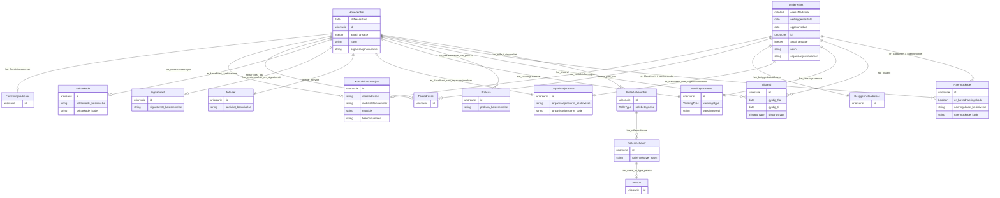

```mermaid
erDiagram
Aktivitet {
    uriorcurie id  
    string aktivitet_beskrivelse  
}
Beliggenhetsadresse {
    uriorcurie id  
}
Forretningsadresse {
    uriorcurie id  
}
Hovedenhet {
    date stiftelsesdato  
    uriorcurie id  
    integer antall_ansatte  
    string navn  
    string organisasjonsnummer  
}
Kontaktinformasjon {
    uriorcurie id  
    string epostadresse  
    string mobiltelefonnummer  
    string nettside  
    string telefonnummer  
}
Naeringskode {
    uriorcurie id  
    boolean er_hovednaeringskode  
    string naeringskode_beskrivelse  
    string naeringskode_kode  
}
Organisasjonsform {
    uriorcurie id  
    string organisasjonsform_beskrivelse  
    string organisasjonsform_kode  
}
Person {
    uriorcurie id  
}
Postadresse {
    uriorcurie id  
}
Prokura {
    uriorcurie id  
    string prokura_bestemmelse  
}
RolleIVirksomhet {
    uriorcurie id  
    RolleType rollebetegnelse  
}
Rolleinnehaver {
    uriorcurie id  
    string rolleinnehaver_navn  
}
Sektorkode {
    uriorcurie id  
    string sektorkode_beskrivelse  
    string sektorkode_kode  
}
Signaturrett {
    uriorcurie id  
    string signaturrett_bestemmelse  
}
Tilstand {
    uriorcurie id  
    date gyldig_fra  
    date gyldig_til  
    TilstandType tilstandstype  
}
Underenhet {
    dateList eierskiftedatoer  
    date nedleggelsesdato  
    date oppstartsdato  
    uriorcurie id  
    integer antall_ansatte  
    string navn  
    string organisasjonsnummer  
}
Varslingsadresse {
    uriorcurie id  
    VarslingType varslingstype  
    string varslingsverdi  
}

Hovedenhet ||--|o Forretningsadresse : "har_forretningsadresse"
Hovedenhet ||--|o Kontaktinformasjon : "har_kontaktinformasjon"
Hovedenhet ||--|o Postadresse : "mottar_post_paa"
Hovedenhet ||--|o Sektorkode : "er_klassifisert_i_sektorkode"
Hovedenhet ||--|o Signaturrett : "har_bestemmelser_om_signaturrett"
Hovedenhet ||--|| Aktivitet : "utoevar_aktivitet"
Hovedenhet ||--|| Organisasjonsform : "er_klassifisert_som_organisasjonsform"
Hovedenhet ||--|| Varslingsadresse : "har_varslingsadresse"
Hovedenhet ||--}o Prokura : "har_bestemmelser_om_prokura"
Hovedenhet ||--}o Tilstand : "har_tilstand"
Hovedenhet ||--}| Naeringskode : "er_klassifisert_i_naeringskode"
Hovedenhet ||--}| RolleIVirksomhet : "har_rolle_i_virksomhet"
RolleIVirksomhet ||--}o Rolleinnehaver : "har_rolleinnehaver"
Rolleinnehaver ||--|o Person : "kan_vaere_av_type_person"
Underenhet ||--|o Kontaktinformasjon : "har_kontaktinformasjon"
Underenhet ||--|o Postadresse : "mottar_post_paa"
Underenhet ||--|| Beliggenhetsadresse : "har_beliggenhetsadresse"
Underenhet ||--|| Organisasjonsform : "er_klassifisert_som_organisasjonsform"
Underenhet ||--|| Varslingsadresse : "har_varslingsadresse"
Underenhet ||--}o Tilstand : "har_tilstand"
Underenhet ||--}| Naeringskode : "er_klassifisert_i_naeringskode"


```
