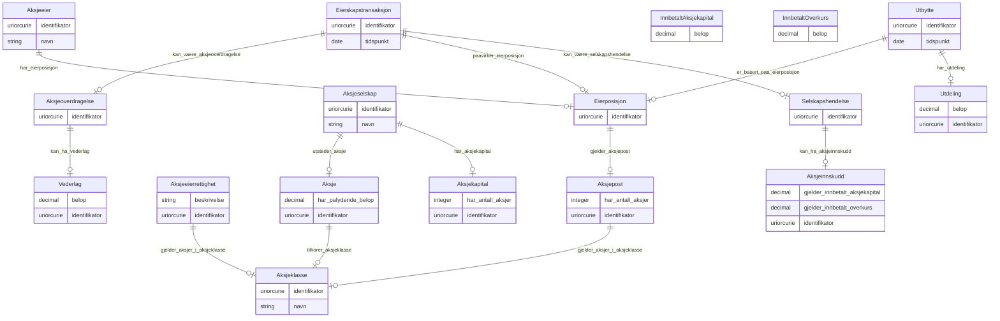

# register-over-aksjeeiere

LinkML-modell for aksjeselskap, aksjar, eigarskap og eigarskapshendingar. Modellen er tilpassa RDF-generering, SHACL og Ontodia-visualisering.

URI: https://example.no/ontology/aksje-eierskap

Name: register-over-aksjeeiere

## Classes

### Andre

| Class | Description |
| --- | --- |
| [Aksje](klasser/aksje.md) | Ei enkelt aksje utstedt av eit aksjeselskap |
| [Aksjeeier](klasser/aksjeeier.md) | Person eller organisasjon som eig aksjar |
| [Aksjeeierrettighet](klasser/aksjeeierrettighet.md) | Rettigheiter knytt til aksjar, til dømes stemmerett |
| [Aksjeinnskudd](klasser/aksjeinnskudd.md) | Innskot knytt til aksjar i samband med selskapshending |
| [Aksjekapital](klasser/aksjekapital.md) | Den registrerte aksjekapitalen i eit aksjeselskap |
| [Aksjeklasse](klasser/aksjeklasse.md) | Klasse aksjar høyrer til, med eigne rettigheiter |
| [Aksjeoverdragelse](klasser/aksjeoverdragelse.md) | Overdraging av aksjar mellom partar |
| [Aksjepost](klasser/aksjepost.md) | Samling aksjar eigd av ein aksjeeigar |
| [Aksjeselskap](klasser/aksjeselskap.md) | Selskap som utsteder aksjar og har aksjekapital |
| [Eierposisjon](klasser/eierposisjon.md) | Eierens samla posisjon i eit selskap |
| [Eierskapstransaksjon](klasser/eierskapstransaksjon.md) | Transaksjon som påverkar eigarskap i selskapet |
| [InnbetaltAksjekapital](klasser/innbetaltaksjekapital.md) | Innbetalt aksjekapital |
| [InnbetaltOverkurs](klasser/innbetaltoverkurs.md) | Innbetalt overkurs utover pålydande |
| [Selskapshendelse](klasser/selskapshendelse.md) | Hending som påverkar selskapet sitt eigarskap eller kapital |
| [Tidspunkt](klasser/tidspunkt.md) | Tidspunkt for ei hending |
| [Utbytte](klasser/utbytte.md) | Utbytte knytt til ein eigarposisjon |
| [Utdeling](klasser/utdeling.md) | Konkret utdeling av verdiar til aksjeeigarar |
| [Vederlag](klasser/vederlag.md) | Vederlag knytt til ei aksjeoverdraging |

## Slots

| Slot | Description |
| --- | --- |
| [aksjeeiere](klasser/aksjeeiere.md) |  |
| [aksjeeierrettigheter](klasser/aksjeeierrettigheter.md) |  |
| [aksjeinnskudder](klasser/aksjeinnskudder.md) |  |
| [aksjekapitaler](klasser/aksjekapitaler.md) |  |
| [aksjeklasser](klasser/aksjeklasser.md) |  |
| [aksjeoverdragelser](klasser/aksjeoverdragelser.md) |  |
| [aksjeposter](klasser/aksjeposter.md) |  |
| [aksjer](klasser/aksjer.md) |  |
| [aksjeselskaper](klasser/aksjeselskaper.md) |  |
| [antall](klasser/antall.md) | Numerisk verdi |
| [belop](klasser/belop.md) | Monetært beløp |
| [beskrivelse](klasser/beskrivelse.md) | Tekstleg forklaring av instansen |
| [dato](klasser/dato.md) | Kalenderdato |
| [eierposisjoner](klasser/eierposisjoner.md) |  |
| [eierskapstransaksjoner](klasser/eierskapstransaksjoner.md) |  |
| [er_basert_paa_eierposisjon](klasser/er_basert_paa_eierposisjon.md) | Utbytte knytt til eigarposisjonen |
| [gjelder_aksjepost](klasser/gjelder_aksjepost.md) | Aksjepost som inngår i eigarposisjonen |
| [gjelder_aksjer_i_aksjeklasse](klasser/gjelder_aksjer_i_aksjeklasse.md) | Rettigheiter knytt til aksjeklassen |
| [gjelder_innbetalt_aksjekapital](klasser/gjelder_innbetalt_aksjekapital.md) | Innbetalt aksjekapital |
| [gjelder_innbetalt_overkurs](klasser/gjelder_innbetalt_overkurs.md) | Innbetalt overkurs |
| [har_aksjekapital](klasser/har_aksjekapital.md) | Aksjekapital som høyrer til selskapet |
| [har_antall_aksjer](klasser/har_antall_aksjer.md) | Tal aksjar |
| [har_eierposisjon](klasser/har_eierposisjon.md) | Eierposisjon aksjeeigaren har |
| [har_palydende_belop](klasser/har_palydende_belop.md) | Pålydande verdi for aksja |
| [har_utdeling](klasser/har_utdeling.md) | Utdeling knytt til utbyttet |
| [identifikator](klasser/identifikator.md) | Global identifikator for instansen |
| [innbetalt_aksjekapitaler](klasser/innbetalt_aksjekapitaler.md) |  |
| [innbetalt_overkurser](klasser/innbetalt_overkurser.md) |  |
| [kan_ha_aksjeinnskudd](klasser/kan_ha_aksjeinnskudd.md) | Aksjeinnskot i selskapshending |
| [kan_ha_vederlag](klasser/kan_ha_vederlag.md) | Vederlag for aksjeoverdraging |
| [kan_vaere_aksjeoverdragelse](klasser/kan_vaere_aksjeoverdragelse.md) | Aksjeoverdraging i transaksjonen |
| [kan_vaere_selskapshendelse](klasser/kan_vaere_selskapshendelse.md) | Selskapshendelse i transaksjonen |
| [navn](klasser/navn.md) | Namn på instansen |
| [paavirker_eierposisjon](klasser/paavirker_eierposisjon.md) | Eierskapstransaksjon knytt til eigarposisjonen |
| [selskapshendelser](klasser/selskapshendelser.md) |  |
| [tidspunkt](klasser/tidspunkt.md) | Tidspunkt for utbytte/eierskapstransaksjon |
| [tilhorer_aksjeklasse](klasser/tilhorer_aksjeklasse.md) | Klassen aksja høyrer til |
| [utbytter](klasser/utbytter.md) |  |
| [utdelinger](klasser/utdelinger.md) |  |
| [utsteder_aksje](klasser/utsteder_aksje.md) | Aksje utstedt av selskapet |
| [vederlager](klasser/vederlager.md) |  |

## Enumerations

| Enumeration | Description |
| --- | --- |

## Types

| Type | Description |
| --- | --- |

## Subsets

| Subset | Description |
| --- | --- |

## Generated artifacts

| Artefakt | Fil |
|----------|-----|
| SHACL shapes | [register-over-aksjeeiere-shapes.ttl](register-over-aksjeeiere-shapes.ttl) |
| JSON-LD kontekst | [register-over-aksjeeiere-context.jsonld](register-over-aksjeeiere-context.jsonld) |
| JSON Schema | [register-over-aksjeeiere-schema.json](register-over-aksjeeiere-schema.json) |
| OWL ontologi | [register-over-aksjeeiere-ontology.ttl](register-over-aksjeeiere-ontology.ttl) |
| RDF/Turtle skjema | [register-over-aksjeeiere-schema.ttl](register-over-aksjeeiere-schema.ttl) |
| Python-klasser | [register-over-aksjeeiere-model.py](register-over-aksjeeiere-model.py) |
| Protobuf-skjema | [register-over-aksjeeiere-schema.proto](register-over-aksjeeiere-schema.proto) |
| ER-diagram (Mermaid) | [register-over-aksjeeiere-erdiagram.md](register-over-aksjeeiere-erdiagram.md) |
| Eksempeldata (Turtle) | [register-over-aksjeeiere-eksempel.ttl](register-over-aksjeeiere-eksempel.ttl) |
| PlantUML-diagram | [register-over-aksjeeiere.svg](diagrams/register-over-aksjeeiere.svg) · [register-over-aksjeeiere.puml](diagrams/register-over-aksjeeiere.puml) |
