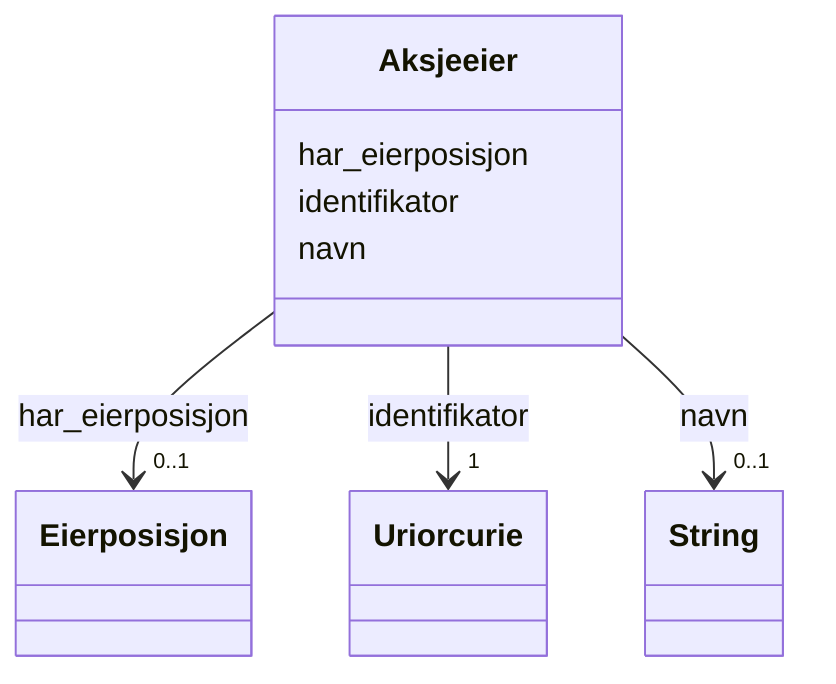

# Class: Aksjeeier 


_Person eller organisasjon som eig aksjar._


URI: [https://data.norge.no/linkml/register-over-aksjeeiere/:Aksjeeier](https://data.norge.no/linkml/register-over-aksjeeiere/:Aksjeeier)





<!-- no inheritance hierarchy -->

## Eigenskapar


  
  

  
  

  
  


  
  

  
  

  
  


  
  

  
  

  
  


  
  
  
  
    
  

  
  
  
  
    
  

  
  
  
  
    
  


### Andre

| Namn | Kardinalitet og domene | Beskriving |
| --- | --- | --- |
| [identifikator](identifikator.md) | 1 <br/> [xsd:anyURI](http://www.w3.org/2001/XMLSchema#anyURI) | Global identifikator for instansen |
| [navn](navn.md) | 0..1 <br/> [xsd:string](http://www.w3.org/2001/XMLSchema#string) | Namn på instansen |
| [har_eierposisjon](har_eierposisjon.md) | 0..1 <br/> [Eierposisjon](eierposisjon.md) | Eierposisjon aksjeeigaren har |


## Usages

| used by | used in | type | used |
| ---  | --- | --- | --- |
| [AksjeeierContainer](aksjeeiercontainer.md) | [aksjeeiere](aksjeeiere.md) | range | [Aksjeeier](aksjeeier.md) |
| [Aksjeeier](aksjeeier.md) | [har_eierposisjon](har_eierposisjon.md) | domain | [Aksjeeier](aksjeeier.md) |


## Identifier and Mapping Information


### Schema Source


* from schema: https://example.no/ontology/aksje-eierskap


## Mappings

| Mapping Type | Mapped Value |
| ---  | ---  |
| self | https://data.norge.no/linkml/register-over-aksjeeiere/:Aksjeeier |
| native | https://data.norge.no/linkml/register-over-aksjeeiere/:Aksjeeier |


## Examples
### Example: Aksjeeier-Aksjeeier1

```yaml
identifikator: aksje:Aksjeeier1
navn: Ola Nordmann
har_eierposisjon: aksje:Eierposisjon1

```


## LinkML Source

<!-- TODO: investigate https://stackoverflow.com/questions/37606292/how-to-create-tabbed-code-blocks-in-mkdocs-or-sphinx -->

### Direct

<details>
```yaml
name: Aksjeeier
description: Person eller organisasjon som eig aksjar.
from_schema: https://example.no/ontology/aksje-eierskap
rank: 1000
slots:
- identifikator
- navn
- har_eierposisjon

```
</details>

### Induced

<details>
```yaml
name: Aksjeeier
description: Person eller organisasjon som eig aksjar.
from_schema: https://example.no/ontology/aksje-eierskap
rank: 1000
attributes:
  identifikator:
    name: identifikator
    description: Global identifikator for instansen.
    from_schema: https://example.no/ontology/aksje-eierskap
    rank: 1000
    identifier: true
    owner: Aksjeeier
    domain_of:
    - Aksjeselskap
    - Aksjekapital
    - Aksje
    - Aksjeklasse
    - Aksjeeierrettighet
    - Aksjeeier
    - Eierposisjon
    - Aksjepost
    - Utbytte
    - Utdeling
    - Eierskapstransaksjon
    - Aksjeoverdragelse
    - Vederlag
    - Selskapshendelse
    - Aksjeinnskudd
    range: uriorcurie
    required: true
  navn:
    name: navn
    description: Namn på instansen.
    from_schema: https://example.no/ontology/aksje-eierskap
    rank: 1000
    owner: Aksjeeier
    domain_of:
    - Aksjeselskap
    - Aksjeklasse
    - Aksjeeier
    range: string
    inlined: true
  har_eierposisjon:
    name: har_eierposisjon
    description: Eierposisjon aksjeeigaren har.
    from_schema: https://example.no/ontology/aksje-eierskap
    rank: 1000
    domain: Aksjeeier
    owner: Aksjeeier
    domain_of:
    - Aksjeeier
    range: Eierposisjon

```
</details>