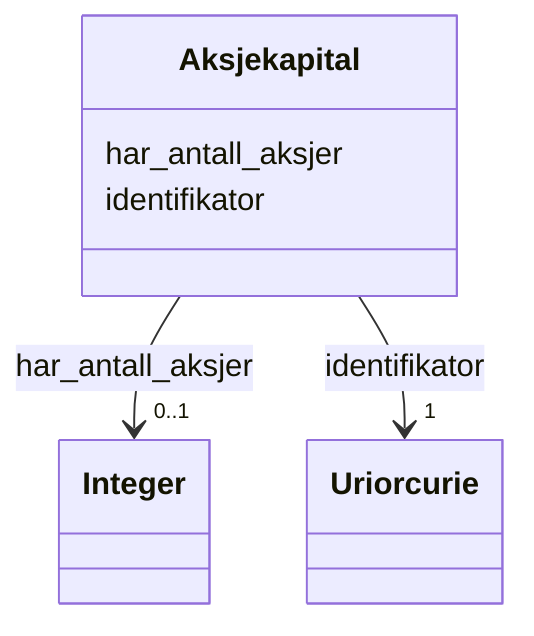

# Class: Aksjekapital 


_Den registrerte aksjekapitalen i eit aksjeselskap._


URI: [aksje:Aksjekapital](https://example.no/ontology/aksje#Aksjekapital)





<!-- no inheritance hierarchy -->

## Eigenskapar


  
  

  
  


  
  

  
  


  
  

  
  


  
  
  
  
    
  

  
  
  
  
    
  


### Andre

| Namn | Kardinalitet og domene | Beskriving |
| --- | --- | --- |
| [identifikator](identifikator.md) | 1 <br/> [xsd:anyURI](http://www.w3.org/2001/XMLSchema#anyURI) | Global identifikator for instansen |
| [har_antall_aksjer](har_antall_aksjer.md) | 0..1 <br/> [xsd:integer](http://www.w3.org/2001/XMLSchema#integer) | Tal aksjar |


## Usages

| used by | used in | type | used |
| ---  | --- | --- | --- |
| [Containerklasse](containerklasse.md) | [aksjekapitaler](aksjekapitaler.md) | range | [Aksjekapital](aksjekapital.md) |
| [Aksjeselskap](aksjeselskap.md) | [har_aksjekapital](har_aksjekapital.md) | range | [Aksjekapital](aksjekapital.md) |


## Identifier and Mapping Information


### Schema Source


* from schema: https://example.no/ontology/aksje-eierskap


## Mappings

| Mapping Type | Mapped Value |
| ---  | ---  |
| self | aksje:Aksjekapital |
| native | aksje:Aksjekapital |


## LinkML Source

<!-- TODO: investigate https://stackoverflow.com/questions/37606292/how-to-create-tabbed-code-blocks-in-mkdocs-or-sphinx -->

### Direct

<details>
```yaml
name: Aksjekapital
description: Den registrerte aksjekapitalen i eit aksjeselskap.
from_schema: https://example.no/ontology/aksje-eierskap
rank: 1000
slots:
- identifikator
- har_antall_aksjer

```
</details>

### Induced

<details>
```yaml
name: Aksjekapital
description: Den registrerte aksjekapitalen i eit aksjeselskap.
from_schema: https://example.no/ontology/aksje-eierskap
rank: 1000
attributes:
  identifikator:
    name: identifikator
    description: Global identifikator for instansen.
    from_schema: https://example.no/ontology/aksje-eierskap
    rank: 1000
    identifier: true
    alias: identifikator
    owner: Aksjekapital
    domain_of:
    - Containerklasse
    - Aksjeselskap
    - Aksjekapital
    - Aksje
    - Aksjeklasse
    - Aksjeeierrettighet
    - Aksjeeier
    - Eierposisjon
    - Aksjepost
    - Utbytte
    - Utdeling
    - Eierskapstransaksjon
    - Aksjeoverdragelse
    - Vederlag
    - Selskapshendelse
    - Aksjeinnskudd
    range: uriorcurie
    required: true
  har_antall_aksjer:
    name: har_antall_aksjer
    description: Tal aksjar.
    from_schema: https://example.no/ontology/aksje-eierskap
    rank: 1000
    alias: har_antall_aksjer
    owner: Aksjekapital
    domain_of:
    - Aksjekapital
    - Aksjepost
    range: integer
    inlined: true

```
</details>