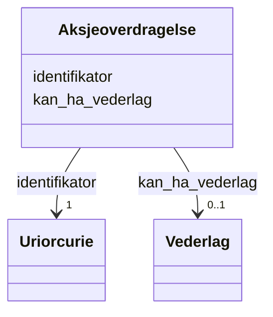

# Class: Aksjeoverdragelse 


_Overdraging av aksjar mellom partar._


URI: [aksje:Aksjeoverdragelse](https://example.no/ontology/aksje#Aksjeoverdragelse)





<!-- no inheritance hierarchy -->

## Eigenskapar


  
  

  
  


  
  

  
  


  
  

  
  


  
  
  
  
    
  

  
  
  
  
    
  


### Andre

| Namn | Kardinalitet og domene | Beskriving |
| --- | --- | --- |
| [identifikator](identifikator.md) | 1 <br/> [xsd:anyURI](http://www.w3.org/2001/XMLSchema#anyURI) | Global identifikator for instansen |
| [kan_ha_vederlag](kan_ha_vederlag.md) | 0..1 <br/> [Vederlag](vederlag.md) | Vederlag for aksjeoverdraging |


## Usages

| used by | used in | type | used |
| ---  | --- | --- | --- |
| [Containerklasse](containerklasse.md) | [aksjeoverdragelser](aksjeoverdragelser.md) | range | [Aksjeoverdragelse](aksjeoverdragelse.md) |
| [Eierskapstransaksjon](eierskapstransaksjon.md) | [kan_vaere_aksjeoverdragelse](kan_vaere_aksjeoverdragelse.md) | range | [Aksjeoverdragelse](aksjeoverdragelse.md) |
| [Aksjeoverdragelse](aksjeoverdragelse.md) | [kan_ha_vederlag](kan_ha_vederlag.md) | domain | [Aksjeoverdragelse](aksjeoverdragelse.md) |


## Identifier and Mapping Information


### Schema Source


* from schema: https://example.no/ontology/aksje-eierskap


## Mappings

| Mapping Type | Mapped Value |
| ---  | ---  |
| self | aksje:Aksjeoverdragelse |
| native | aksje:Aksjeoverdragelse |


## LinkML Source

<!-- TODO: investigate https://stackoverflow.com/questions/37606292/how-to-create-tabbed-code-blocks-in-mkdocs-or-sphinx -->

### Direct

<details>
```yaml
name: Aksjeoverdragelse
description: Overdraging av aksjar mellom partar.
from_schema: https://example.no/ontology/aksje-eierskap
rank: 1000
slots:
- identifikator
- kan_ha_vederlag

```
</details>

### Induced

<details>
```yaml
name: Aksjeoverdragelse
description: Overdraging av aksjar mellom partar.
from_schema: https://example.no/ontology/aksje-eierskap
rank: 1000
attributes:
  identifikator:
    name: identifikator
    description: Global identifikator for instansen.
    from_schema: https://example.no/ontology/aksje-eierskap
    rank: 1000
    identifier: true
    alias: identifikator
    owner: Aksjeoverdragelse
    domain_of:
    - Containerklasse
    - Aksjeselskap
    - Aksjekapital
    - Aksje
    - Aksjeklasse
    - Aksjeeierrettighet
    - Aksjeeier
    - Eierposisjon
    - Aksjepost
    - Utbytte
    - Utdeling
    - Eierskapstransaksjon
    - Aksjeoverdragelse
    - Vederlag
    - Selskapshendelse
    - Aksjeinnskudd
    range: uriorcurie
    required: true
  kan_ha_vederlag:
    name: kan_ha_vederlag
    description: Vederlag for aksjeoverdraging.
    from_schema: https://example.no/ontology/aksje-eierskap
    rank: 1000
    domain: Aksjeoverdragelse
    alias: kan_ha_vederlag
    owner: Aksjeoverdragelse
    domain_of:
    - Aksjeoverdragelse
    range: Vederlag

```
</details>