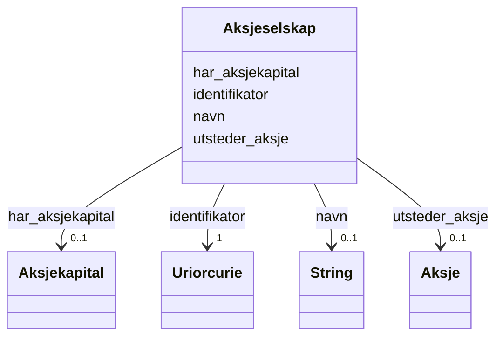

# Class: Aksjeselskap 


_Selskap som utsteder aksjar og har aksjekapital._


URI: [https://data.norge.no/linkml/register-over-aksjeeiere/:Aksjeselskap](https://data.norge.no/linkml/register-over-aksjeeiere/:Aksjeselskap)





<!-- no inheritance hierarchy -->

## Eigenskapar


  
  

  
  

  
  

  
  


  
  

  
  

  
  

  
  


  
  

  
  

  
  

  
  


  
  
  
  
    
  

  
  
  
  
    
  

  
  
  
  
    
  

  
  
  
  
    
  


### Andre

| Namn | Kardinalitet og domene | Beskriving |
| --- | --- | --- |
| [identifikator](identifikator.md) | 1 <br/> [xsd:anyURI](http://www.w3.org/2001/XMLSchema#anyURI) | Global identifikator for instansen |
| [navn](navn.md) | 0..1 <br/> [xsd:string](http://www.w3.org/2001/XMLSchema#string) | Namn på instansen |
| [har_aksjekapital](har_aksjekapital.md) | 0..1 <br/> [Aksjekapital](aksjekapital.md) | Aksjekapital som høyrer til selskapet |
| [utsteder_aksje](utsteder_aksje.md) | 0..1 <br/> [Aksje](aksje.md) | Aksje utstedt av selskapet |


## Usages

| used by | used in | type | used |
| ---  | --- | --- | --- |
| [AksjeeierContainer](aksjeeiercontainer.md) | [aksjeselskaper](aksjeselskaper.md) | range | [Aksjeselskap](aksjeselskap.md) |
| [Aksjeselskap](aksjeselskap.md) | [har_aksjekapital](har_aksjekapital.md) | domain | [Aksjeselskap](aksjeselskap.md) |
| [Aksjeselskap](aksjeselskap.md) | [utsteder_aksje](utsteder_aksje.md) | domain | [Aksjeselskap](aksjeselskap.md) |


## Identifier and Mapping Information


### Schema Source


* from schema: https://example.no/ontology/aksje-eierskap


## Mappings

| Mapping Type | Mapped Value |
| ---  | ---  |
| self | https://data.norge.no/linkml/register-over-aksjeeiere/:Aksjeselskap |
| native | https://data.norge.no/linkml/register-over-aksjeeiere/:Aksjeselskap |


## LinkML Source

<!-- TODO: investigate https://stackoverflow.com/questions/37606292/how-to-create-tabbed-code-blocks-in-mkdocs-or-sphinx -->

### Direct

<details>
```yaml
name: Aksjeselskap
description: Selskap som utsteder aksjar og har aksjekapital.
from_schema: https://example.no/ontology/aksje-eierskap
rank: 1000
slots:
- identifikator
- navn
- har_aksjekapital
- utsteder_aksje

```
</details>

### Induced

<details>
```yaml
name: Aksjeselskap
description: Selskap som utsteder aksjar og har aksjekapital.
from_schema: https://example.no/ontology/aksje-eierskap
rank: 1000
attributes:
  identifikator:
    name: identifikator
    description: Global identifikator for instansen.
    from_schema: https://example.no/ontology/aksje-eierskap
    rank: 1000
    identifier: true
    owner: Aksjeselskap
    domain_of:
    - Aksjeselskap
    - Aksjekapital
    - Aksje
    - Aksjeklasse
    - Aksjeeierrettighet
    - Aksjeeier
    - Eierposisjon
    - Aksjepost
    - Utbytte
    - Utdeling
    - Eierskapstransaksjon
    - Aksjeoverdragelse
    - Vederlag
    - Selskapshendelse
    - Aksjeinnskudd
    range: uriorcurie
    required: true
  navn:
    name: navn
    description: Namn på instansen.
    from_schema: https://example.no/ontology/aksje-eierskap
    rank: 1000
    owner: Aksjeselskap
    domain_of:
    - Aksjeselskap
    - Aksjeklasse
    - Aksjeeier
    range: string
    inlined: true
  har_aksjekapital:
    name: har_aksjekapital
    description: Aksjekapital som høyrer til selskapet.
    from_schema: https://example.no/ontology/aksje-eierskap
    rank: 1000
    domain: Aksjeselskap
    owner: Aksjeselskap
    domain_of:
    - Aksjeselskap
    range: Aksjekapital
  utsteder_aksje:
    name: utsteder_aksje
    description: Aksje utstedt av selskapet
    from_schema: https://example.no/ontology/aksje-eierskap
    rank: 1000
    domain: Aksjeselskap
    owner: Aksjeselskap
    domain_of:
    - Aksjeselskap
    range: Aksje

```
</details>