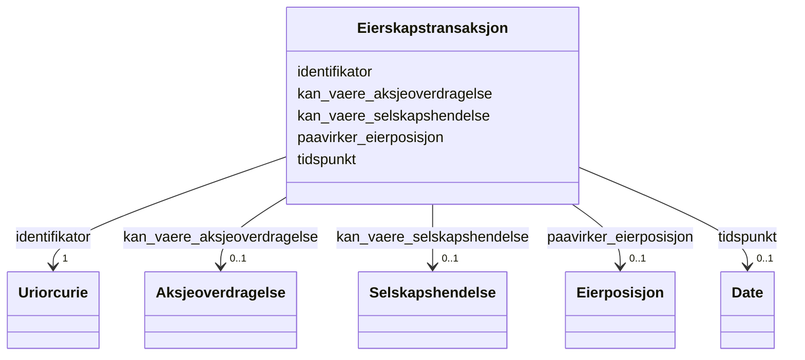

# Class: Eierskapstransaksjon 


_Transaksjon som påverkar eigarskap i selskapet._


URI: [aksje:Eierskapstransaksjon](https://example.no/ontology/aksje#Eierskapstransaksjon)





<!-- no inheritance hierarchy -->

## Eigenskapar


  
  

  
  

  
  

  
  

  
  


  
  

  
  

  
  

  
  

  
  


  
  

  
  

  
  

  
  

  
  


  
  
  
  
    
  

  
  
  
  
    
  

  
  
  
  
    
  

  
  
  
  
    
  

  
  
  
  
    
  


### Andre

| Namn | Kardinalitet og domene | Beskriving |
| --- | --- | --- |
| [identifikator](identifikator.md) | 1 <br/> [xsd:anyURI](http://www.w3.org/2001/XMLSchema#anyURI) | Global identifikator for instansen |
| [tidspunkt](tidspunkt.md) | 0..1 <br/> [xsd:date](http://www.w3.org/2001/XMLSchema#date) | Tidspunkt for utbytte/eierskapstransaksjon |
| [kan_vaere_aksjeoverdragelse](kan_vaere_aksjeoverdragelse.md) | 0..1 <br/> [Aksjeoverdragelse](aksjeoverdragelse.md) | Aksjeoverdraging i transaksjonen |
| [kan_vaere_selskapshendelse](kan_vaere_selskapshendelse.md) | 0..1 <br/> [Selskapshendelse](selskapshendelse.md) | Selskapshendelse i transaksjonen |
| [paavirker_eierposisjon](paavirker_eierposisjon.md) | 0..1 <br/> [Eierposisjon](eierposisjon.md) | Eierskapstransaksjon knytt til eigarposisjonen |


## Usages

| used by | used in | type | used |
| ---  | --- | --- | --- |
| [Containerklasse](containerklasse.md) | [eierskapstransaksjoner](eierskapstransaksjoner.md) | range | [Eierskapstransaksjon](eierskapstransaksjon.md) |
| [Eierskapstransaksjon](eierskapstransaksjon.md) | [kan_vaere_aksjeoverdragelse](kan_vaere_aksjeoverdragelse.md) | domain | [Eierskapstransaksjon](eierskapstransaksjon.md) |
| [Eierskapstransaksjon](eierskapstransaksjon.md) | [kan_vaere_selskapshendelse](kan_vaere_selskapshendelse.md) | domain | [Eierskapstransaksjon](eierskapstransaksjon.md) |
| [Eierskapstransaksjon](eierskapstransaksjon.md) | [paavirker_eierposisjon](paavirker_eierposisjon.md) | domain | [Eierskapstransaksjon](eierskapstransaksjon.md) |


## Identifier and Mapping Information


### Schema Source


* from schema: https://example.no/ontology/aksje-eierskap


## Mappings

| Mapping Type | Mapped Value |
| ---  | ---  |
| self | aksje:Eierskapstransaksjon |
| native | aksje:Eierskapstransaksjon |


## LinkML Source

<!-- TODO: investigate https://stackoverflow.com/questions/37606292/how-to-create-tabbed-code-blocks-in-mkdocs-or-sphinx -->

### Direct

<details>
```yaml
name: Eierskapstransaksjon
description: Transaksjon som påverkar eigarskap i selskapet.
from_schema: https://example.no/ontology/aksje-eierskap
rank: 1000
slots:
- identifikator
- tidspunkt
- kan_vaere_aksjeoverdragelse
- kan_vaere_selskapshendelse
- paavirker_eierposisjon

```
</details>

### Induced

<details>
```yaml
name: Eierskapstransaksjon
description: Transaksjon som påverkar eigarskap i selskapet.
from_schema: https://example.no/ontology/aksje-eierskap
rank: 1000
attributes:
  identifikator:
    name: identifikator
    description: Global identifikator for instansen.
    from_schema: https://example.no/ontology/aksje-eierskap
    rank: 1000
    identifier: true
    alias: identifikator
    owner: Eierskapstransaksjon
    domain_of:
    - Containerklasse
    - Aksjeselskap
    - Aksjekapital
    - Aksje
    - Aksjeklasse
    - Aksjeeierrettighet
    - Aksjeeier
    - Eierposisjon
    - Aksjepost
    - Utbytte
    - Utdeling
    - Eierskapstransaksjon
    - Aksjeoverdragelse
    - Vederlag
    - Selskapshendelse
    - Aksjeinnskudd
    range: uriorcurie
    required: true
  tidspunkt:
    name: tidspunkt
    description: Tidspunkt for utbytte/eierskapstransaksjon.
    from_schema: https://example.no/ontology/aksje-eierskap
    rank: 1000
    alias: tidspunkt
    owner: Eierskapstransaksjon
    domain_of:
    - Utbytte
    - Eierskapstransaksjon
    range: date
    inlined: true
  kan_vaere_aksjeoverdragelse:
    name: kan_vaere_aksjeoverdragelse
    description: Aksjeoverdraging i transaksjonen.
    from_schema: https://example.no/ontology/aksje-eierskap
    rank: 1000
    domain: Eierskapstransaksjon
    alias: kan_vaere_aksjeoverdragelse
    owner: Eierskapstransaksjon
    domain_of:
    - Eierskapstransaksjon
    range: Aksjeoverdragelse
  kan_vaere_selskapshendelse:
    name: kan_vaere_selskapshendelse
    description: Selskapshendelse i transaksjonen.
    from_schema: https://example.no/ontology/aksje-eierskap
    rank: 1000
    domain: Eierskapstransaksjon
    alias: kan_vaere_selskapshendelse
    owner: Eierskapstransaksjon
    domain_of:
    - Eierskapstransaksjon
    range: Selskapshendelse
  paavirker_eierposisjon:
    name: paavirker_eierposisjon
    description: Eierskapstransaksjon knytt til eigarposisjonen.
    from_schema: https://example.no/ontology/aksje-eierskap
    rank: 1000
    domain: Eierskapstransaksjon
    alias: paavirker_eierposisjon
    owner: Eierskapstransaksjon
    domain_of:
    - Eierskapstransaksjon
    range: Eierposisjon

```
</details>