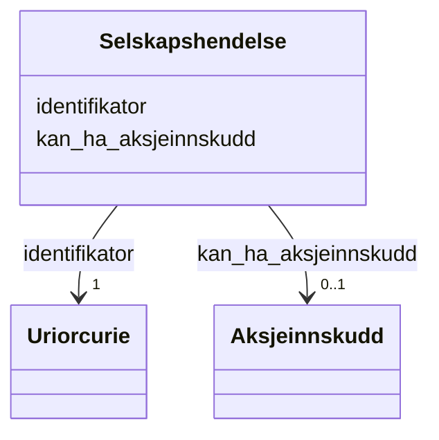

# Class: Selskapshendelse 


_Hending som påverkar selskapet sitt eigarskap eller kapital._


URI: [aksje:Selskapshendelse](https://example.no/ontology/aksje#Selskapshendelse)





<!-- no inheritance hierarchy -->

## Eigenskapar


  
  

  
  


  
  

  
  


  
  

  
  


  
  
  
  
    
  

  
  
  
  
    
  


### Andre

| Namn | Kardinalitet og domene | Beskriving |
| --- | --- | --- |
| [identifikator](identifikator.md) | 1 <br/> [xsd:anyURI](http://www.w3.org/2001/XMLSchema#anyURI) | Global identifikator for instansen |
| [kan_ha_aksjeinnskudd](kan_ha_aksjeinnskudd.md) | 0..1 <br/> [Aksjeinnskudd](aksjeinnskudd.md) | Aksjeinnskot i selskapshending |


## Usages

| used by | used in | type | used |
| ---  | --- | --- | --- |
| [Containerklasse](containerklasse.md) | [selskapshendelser](selskapshendelser.md) | range | [Selskapshendelse](selskapshendelse.md) |
| [Eierskapstransaksjon](eierskapstransaksjon.md) | [kan_vaere_selskapshendelse](kan_vaere_selskapshendelse.md) | range | [Selskapshendelse](selskapshendelse.md) |
| [Selskapshendelse](selskapshendelse.md) | [kan_ha_aksjeinnskudd](kan_ha_aksjeinnskudd.md) | domain | [Selskapshendelse](selskapshendelse.md) |


## Identifier and Mapping Information


### Schema Source


* from schema: https://example.no/ontology/aksje-eierskap


## Mappings

| Mapping Type | Mapped Value |
| ---  | ---  |
| self | aksje:Selskapshendelse |
| native | aksje:Selskapshendelse |


## LinkML Source

<!-- TODO: investigate https://stackoverflow.com/questions/37606292/how-to-create-tabbed-code-blocks-in-mkdocs-or-sphinx -->

### Direct

<details>
```yaml
name: Selskapshendelse
description: Hending som påverkar selskapet sitt eigarskap eller kapital.
from_schema: https://example.no/ontology/aksje-eierskap
rank: 1000
slots:
- identifikator
- kan_ha_aksjeinnskudd

```
</details>

### Induced

<details>
```yaml
name: Selskapshendelse
description: Hending som påverkar selskapet sitt eigarskap eller kapital.
from_schema: https://example.no/ontology/aksje-eierskap
rank: 1000
attributes:
  identifikator:
    name: identifikator
    description: Global identifikator for instansen.
    from_schema: https://example.no/ontology/aksje-eierskap
    rank: 1000
    identifier: true
    alias: identifikator
    owner: Selskapshendelse
    domain_of:
    - Containerklasse
    - Aksjeselskap
    - Aksjekapital
    - Aksje
    - Aksjeklasse
    - Aksjeeierrettighet
    - Aksjeeier
    - Eierposisjon
    - Aksjepost
    - Utbytte
    - Utdeling
    - Eierskapstransaksjon
    - Aksjeoverdragelse
    - Vederlag
    - Selskapshendelse
    - Aksjeinnskudd
    range: uriorcurie
    required: true
  kan_ha_aksjeinnskudd:
    name: kan_ha_aksjeinnskudd
    description: Aksjeinnskot i selskapshending.
    from_schema: https://example.no/ontology/aksje-eierskap
    rank: 1000
    domain: Selskapshendelse
    alias: kan_ha_aksjeinnskudd
    owner: Selskapshendelse
    domain_of:
    - Selskapshendelse
    range: Aksjeinnskudd

```
</details>