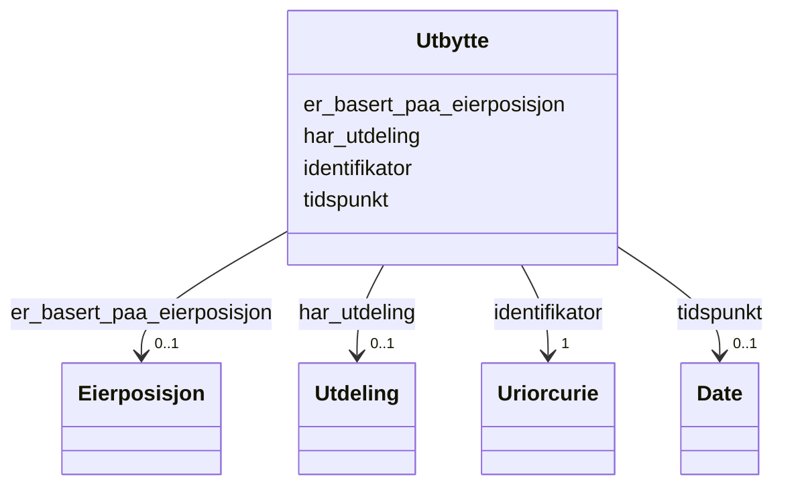

# Class: Utbytte 


_Utbytte knytt til ein eigarposisjon._


URI: [https://data.norge.no/oreg/register-over-aksjeeiere/:Utbytte](https://data.norge.no/oreg/register-over-aksjeeiere/:Utbytte)





<!-- no inheritance hierarchy -->

## Eigenskapar


  
  

  
  

  
  

  
  


  
  

  
  

  
  

  
  


  
  

  
  

  
  

  
  


  
  
  
  
    
  

  
  
  
  
    
  

  
  
  
  
    
  

  
  
  
  
    
  


### Andre

| Namn | Kardinalitet og domene | Beskriving |
| --- | --- | --- |
| [identifikator](identifikator.md) | 1 <br/> [xsd:anyURI](http://www.w3.org/2001/XMLSchema#anyURI) | Global identifikator for instansen |
| [tidspunkt](tidspunkt.md) | 0..1 <br/> [xsd:date](http://www.w3.org/2001/XMLSchema#date) | Tidspunkt for utbytte/eierskapstransaksjon |
| [har_utdeling](har_utdeling.md) | 0..1 <br/> [Utdeling](utdeling.md) | Utdeling knytt til utbyttet |
| [er_basert_paa_eierposisjon](er_basert_paa_eierposisjon.md) | 0..1 <br/> [Eierposisjon](eierposisjon.md) | Utbytte knytt til eigarposisjonen |


## Usages

| used by | used in | type | used |
| ---  | --- | --- | --- |
| [AksjeeierContainer](aksjeeiercontainer.md) | [utbytter](utbytter.md) | range | [Utbytte](utbytte.md) |
| [Utbytte](utbytte.md) | [har_utdeling](har_utdeling.md) | domain | [Utbytte](utbytte.md) |
| [Utbytte](utbytte.md) | [er_basert_paa_eierposisjon](er_basert_paa_eierposisjon.md) | domain | [Utbytte](utbytte.md) |


## Identifier and Mapping Information


### Schema Source


* from schema: https://example.no/ontology/aksje-eierskap


## Mappings

| Mapping Type | Mapped Value |
| ---  | ---  |
| self | https://data.norge.no/oreg/register-over-aksjeeiere/:Utbytte |
| native | https://data.norge.no/oreg/register-over-aksjeeiere/:Utbytte |


## Examples
### Example: Utbytte-Utbytte1

```yaml
identifikator: aksje:Utbytte1
tidspunkt: '2026-03-01'
har_utdeling: aksje:Utdeling1
er_basert_paa_eierposisjon: aksje:Eierposisjon1

```


## LinkML Source

<!-- TODO: investigate https://stackoverflow.com/questions/37606292/how-to-create-tabbed-code-blocks-in-mkdocs-or-sphinx -->

### Direct

<details>
```yaml
name: Utbytte
description: Utbytte knytt til ein eigarposisjon.
from_schema: https://example.no/ontology/aksje-eierskap
rank: 1000
slots:
- identifikator
- tidspunkt
- har_utdeling
- er_basert_paa_eierposisjon

```
</details>

### Induced

<details>
```yaml
name: Utbytte
description: Utbytte knytt til ein eigarposisjon.
from_schema: https://example.no/ontology/aksje-eierskap
rank: 1000
attributes:
  identifikator:
    name: identifikator
    description: Global identifikator for instansen.
    from_schema: https://example.no/ontology/aksje-eierskap
    rank: 1000
    identifier: true
    owner: Utbytte
    domain_of:
    - Aksjeselskap
    - Aksjekapital
    - Aksje
    - Aksjeklasse
    - Aksjeeierrettighet
    - Aksjeeier
    - Eierposisjon
    - Aksjepost
    - Utbytte
    - Utdeling
    - Eierskapstransaksjon
    - Aksjeoverdragelse
    - Vederlag
    - Selskapshendelse
    - Aksjeinnskudd
    range: uriorcurie
    required: true
  tidspunkt:
    name: tidspunkt
    description: Tidspunkt for utbytte/eierskapstransaksjon.
    from_schema: https://example.no/ontology/aksje-eierskap
    rank: 1000
    owner: Utbytte
    domain_of:
    - Utbytte
    - Eierskapstransaksjon
    range: date
    inlined: true
  har_utdeling:
    name: har_utdeling
    description: Utdeling knytt til utbyttet.
    from_schema: https://example.no/ontology/aksje-eierskap
    rank: 1000
    domain: Utbytte
    owner: Utbytte
    domain_of:
    - Utbytte
    range: Utdeling
  er_basert_paa_eierposisjon:
    name: er_basert_paa_eierposisjon
    description: Utbytte knytt til eigarposisjonen.
    from_schema: https://example.no/ontology/aksje-eierskap
    rank: 1000
    domain: Utbytte
    owner: Utbytte
    domain_of:
    - Utbytte
    range: Eierposisjon

```
</details>