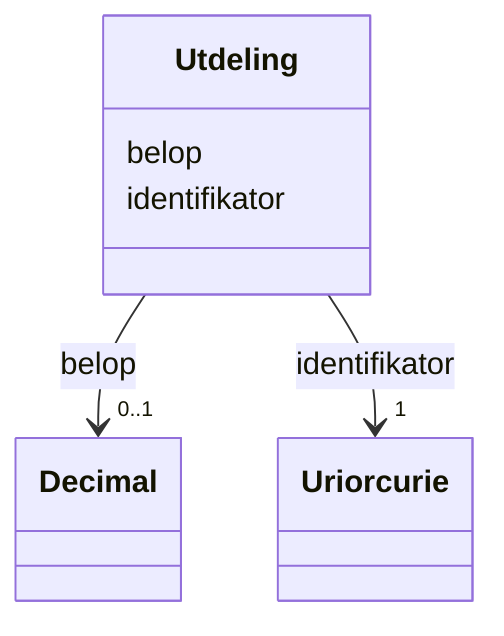

# Class: Utdeling 


_Konkret utdeling av verdiar til aksjeeigarar._


URI: [https://data.norge.no/oreg/register-over-aksjeeiere/:Utdeling](https://data.norge.no/oreg/register-over-aksjeeiere/:Utdeling)





<!-- no inheritance hierarchy -->

## Eigenskapar


  
  

  
  


  
  

  
  


  
  

  
  


  
  
  
  
    
  

  
  
  
  
    
  


### Andre

| Namn | Kardinalitet og domene | Beskriving |
| --- | --- | --- |
| [identifikator](identifikator.md) | 1 <br/> [xsd:anyURI](http://www.w3.org/2001/XMLSchema#anyURI) | Global identifikator for instansen |
| [belop](belop.md) | 0..1 <br/> [xsd:decimal](http://www.w3.org/2001/XMLSchema#decimal) | Monetært beløp |


## Usages

| used by | used in | type | used |
| ---  | --- | --- | --- |
| [AksjeeierContainer](aksjeeiercontainer.md) | [utdelinger](utdelinger.md) | range | [Utdeling](utdeling.md) |
| [Utbytte](utbytte.md) | [har_utdeling](har_utdeling.md) | range | [Utdeling](utdeling.md) |


## Identifier and Mapping Information


### Schema Source


* from schema: https://example.no/ontology/aksje-eierskap


## Mappings

| Mapping Type | Mapped Value |
| ---  | ---  |
| self | https://data.norge.no/oreg/register-over-aksjeeiere/:Utdeling |
| native | https://data.norge.no/oreg/register-over-aksjeeiere/:Utdeling |


## Examples
### Example: Utdeling-Utdeling1

```yaml
identifikator: aksje:Utdeling1
belop: 5000.0

```


## LinkML Source

<!-- TODO: investigate https://stackoverflow.com/questions/37606292/how-to-create-tabbed-code-blocks-in-mkdocs-or-sphinx -->

### Direct

<details>
```yaml
name: Utdeling
description: Konkret utdeling av verdiar til aksjeeigarar.
from_schema: https://example.no/ontology/aksje-eierskap
rank: 1000
slots:
- identifikator
- belop

```
</details>

### Induced

<details>
```yaml
name: Utdeling
description: Konkret utdeling av verdiar til aksjeeigarar.
from_schema: https://example.no/ontology/aksje-eierskap
rank: 1000
attributes:
  identifikator:
    name: identifikator
    description: Global identifikator for instansen.
    from_schema: https://example.no/ontology/aksje-eierskap
    rank: 1000
    identifier: true
    owner: Utdeling
    domain_of:
    - Aksjeselskap
    - Aksjekapital
    - Aksje
    - Aksjeklasse
    - Aksjeeierrettighet
    - Aksjeeier
    - Eierposisjon
    - Aksjepost
    - Utbytte
    - Utdeling
    - Eierskapstransaksjon
    - Aksjeoverdragelse
    - Vederlag
    - Selskapshendelse
    - Aksjeinnskudd
    range: uriorcurie
    required: true
  belop:
    name: belop
    description: Monetært beløp.
    from_schema: https://example.no/ontology/aksje-eierskap
    rank: 1000
    owner: Utdeling
    domain_of:
    - Utdeling
    - Vederlag
    - InnbetaltAksjekapital
    - InnbetaltOverkurs
    range: decimal
    inlined: true

```
</details>