# Class: AksjeeierContainer 


_Containerklasse for alle forretningsobjekt i modellen. Gjer det mogleg å ha fleire instansar av kvar klasse i ei datafil._

__


URI: [schema:Thing](http://schema.org/Thing)

```mermaid
 classDiagram
    class AksjeeierContainer
    click AksjeeierContainer href "../AksjeeierContainer/"
      AksjeeierContainer : aksjeeiere
        
          
    
        
        
        AksjeeierContainer --> "*" Aksjeeier : aksjeeiere
        click Aksjeeier href "../Aksjeeier/"
    

        
      AksjeeierContainer : aksjeeierrettigheter
        
          
    
        
        
        AksjeeierContainer --> "*" Aksjeeierrettighet : aksjeeierrettigheter
        click Aksjeeierrettighet href "../Aksjeeierrettighet/"
    

        
      AksjeeierContainer : aksjeinnskudder
        
          
    
        
        
        AksjeeierContainer --> "*" Aksjeinnskudd : aksjeinnskudder
        click Aksjeinnskudd href "../Aksjeinnskudd/"
    

        
      AksjeeierContainer : aksjekapitaler
        
          
    
        
        
        AksjeeierContainer --> "*" Aksjekapital : aksjekapitaler
        click Aksjekapital href "../Aksjekapital/"
    

        
      AksjeeierContainer : aksjeklasser
        
          
    
        
        
        AksjeeierContainer --> "*" Aksjeklasse : aksjeklasser
        click Aksjeklasse href "../Aksjeklasse/"
    

        
      AksjeeierContainer : aksjeoverdragelser
        
          
    
        
        
        AksjeeierContainer --> "*" Aksjeoverdragelse : aksjeoverdragelser
        click Aksjeoverdragelse href "../Aksjeoverdragelse/"
    

        
      AksjeeierContainer : aksjeposter
        
          
    
        
        
        AksjeeierContainer --> "*" Aksjepost : aksjeposter
        click Aksjepost href "../Aksjepost/"
    

        
      AksjeeierContainer : aksjer
        
          
    
        
        
        AksjeeierContainer --> "*" Aksje : aksjer
        click Aksje href "../Aksje/"
    

        
      AksjeeierContainer : aksjeselskaper
        
          
    
        
        
        AksjeeierContainer --> "*" Aksjeselskap : aksjeselskaper
        click Aksjeselskap href "../Aksjeselskap/"
    

        
      AksjeeierContainer : eierposisjoner
        
          
    
        
        
        AksjeeierContainer --> "*" Eierposisjon : eierposisjoner
        click Eierposisjon href "../Eierposisjon/"
    

        
      AksjeeierContainer : eierskapstransaksjoner
        
          
    
        
        
        AksjeeierContainer --> "*" Eierskapstransaksjon : eierskapstransaksjoner
        click Eierskapstransaksjon href "../Eierskapstransaksjon/"
    

        
      AksjeeierContainer : innbetalt_aksjekapitaler
        
          
    
        
        
        AksjeeierContainer --> "*" InnbetaltAksjekapital : innbetalt_aksjekapitaler
        click InnbetaltAksjekapital href "../InnbetaltAksjekapital/"
    

        
      AksjeeierContainer : innbetalt_overkurser
        
          
    
        
        
        AksjeeierContainer --> "*" InnbetaltOverkurs : innbetalt_overkurser
        click InnbetaltOverkurs href "../InnbetaltOverkurs/"
    

        
      AksjeeierContainer : selskapshendelser
        
          
    
        
        
        AksjeeierContainer --> "*" Selskapshendelse : selskapshendelser
        click Selskapshendelse href "../Selskapshendelse/"
    

        
      AksjeeierContainer : utbytter
        
          
    
        
        
        AksjeeierContainer --> "*" Utbytte : utbytter
        click Utbytte href "../Utbytte/"
    

        
      AksjeeierContainer : utdelinger
        
          
    
        
        
        AksjeeierContainer --> "*" Utdeling : utdelinger
        click Utdeling href "../Utdeling/"
    

        
      AksjeeierContainer : vederlager
        
          
    
        
        
        AksjeeierContainer --> "*" Vederlag : vederlager
        click Vederlag href "../Vederlag/"
    

        
      
```





<!-- no inheritance hierarchy -->

## Class Properties

| Property | Value |
| --- | --- |
| Class URI | [schema:Thing](http://schema.org/Thing) |
| Tree Root | Yes |


## Eigenskapar


  
  

  
  

  
  

  
  

  
  

  
  

  
  

  
  

  
  

  
  

  
  

  
  

  
  

  
  

  
  

  
  

  
  


  
  

  
  

  
  

  
  

  
  

  
  

  
  

  
  

  
  

  
  

  
  

  
  

  
  

  
  

  
  

  
  

  
  


  
  

  
  

  
  

  
  

  
  

  
  

  
  

  
  

  
  

  
  

  
  

  
  

  
  

  
  

  
  

  
  

  
  


  
  
  
  
    
  

  
  
  
  
    
  

  
  
  
  
    
  

  
  
  
  
    
  

  
  
  
  
    
  

  
  
  
  
    
  

  
  
  
  
    
  

  
  
  
  
    
  

  
  
  
  
    
  

  
  
  
  
    
  

  
  
  
  
    
  

  
  
  
  
    
  

  
  
  
  
    
  

  
  
  
  
    
  

  
  
  
  
    
  

  
  
  
  
    
  

  
  
  
  
    
  


### Andre

| Namn | Kardinalitet og domene | Beskriving |
| --- | --- | --- |
| [aksjeselskaper](aksjeselskaper.md) | * <br/> [Aksjeselskap](aksjeselskap.md) |  |
| [aksjekapitaler](aksjekapitaler.md) | * <br/> [Aksjekapital](aksjekapital.md) |  |
| [aksjer](aksjer.md) | * <br/> [Aksje](aksje.md) |  |
| [aksjeklasser](aksjeklasser.md) | * <br/> [Aksjeklasse](aksjeklasse.md) |  |
| [aksjeeierrettigheter](aksjeeierrettigheter.md) | * <br/> [Aksjeeierrettighet](aksjeeierrettighet.md) |  |
| [aksjeeiere](aksjeeiere.md) | * <br/> [Aksjeeier](aksjeeier.md) |  |
| [aksjeposter](aksjeposter.md) | * <br/> [Aksjepost](aksjepost.md) |  |
| [eierposisjoner](eierposisjoner.md) | * <br/> [Eierposisjon](eierposisjon.md) |  |
| [eierskapstransaksjoner](eierskapstransaksjoner.md) | * <br/> [Eierskapstransaksjon](eierskapstransaksjon.md) |  |
| [aksjeoverdragelser](aksjeoverdragelser.md) | * <br/> [Aksjeoverdragelse](aksjeoverdragelse.md) |  |
| [vederlager](vederlager.md) | * <br/> [Vederlag](vederlag.md) |  |
| [selskapshendelser](selskapshendelser.md) | * <br/> [Selskapshendelse](selskapshendelse.md) |  |
| [aksjeinnskudder](aksjeinnskudder.md) | * <br/> [Aksjeinnskudd](aksjeinnskudd.md) |  |
| [utbytter](utbytter.md) | * <br/> [Utbytte](utbytte.md) |  |
| [utdelinger](utdelinger.md) | * <br/> [Utdeling](utdeling.md) |  |
| [innbetalt_aksjekapitaler](innbetalt_aksjekapitaler.md) | * <br/> [InnbetaltAksjekapital](innbetaltaksjekapital.md) |  |
| [innbetalt_overkurser](innbetalt_overkurser.md) | * <br/> [InnbetaltOverkurs](innbetaltoverkurs.md) |  |


## Identifier and Mapping Information


### Schema Source


* from schema: https://example.no/ontology/aksje-eierskap


## Mappings

| Mapping Type | Mapped Value |
| ---  | ---  |
| self | schema:Thing |
| native | https://data.norge.no/oreg/register-over-aksjeeiere/:AksjeeierContainer |


## LinkML Source

<!-- TODO: investigate https://stackoverflow.com/questions/37606292/how-to-create-tabbed-code-blocks-in-mkdocs-or-sphinx -->

### Direct

<details>
```yaml
name: AksjeeierContainer
description: 'Containerklasse for alle forretningsobjekt i modellen. Gjer det mogleg
  å ha fleire instansar av kvar klasse i ei datafil.

  '
from_schema: https://example.no/ontology/aksje-eierskap
rank: 1000
attributes:
  aksjeselskaper:
    name: aksjeselskaper
    from_schema: https://example.no/ontology/aksje-eierskap
    rank: 1000
    domain_of:
    - AksjeeierContainer
    range: Aksjeselskap
    multivalued: true
    inlined: true
    inlined_as_list: true
  aksjekapitaler:
    name: aksjekapitaler
    from_schema: https://example.no/ontology/aksje-eierskap
    rank: 1000
    domain_of:
    - AksjeeierContainer
    range: Aksjekapital
    multivalued: true
    inlined: true
    inlined_as_list: true
  aksjer:
    name: aksjer
    from_schema: https://example.no/ontology/aksje-eierskap
    rank: 1000
    domain_of:
    - AksjeeierContainer
    range: Aksje
    multivalued: true
    inlined: true
    inlined_as_list: true
  aksjeklasser:
    name: aksjeklasser
    from_schema: https://example.no/ontology/aksje-eierskap
    rank: 1000
    domain_of:
    - AksjeeierContainer
    range: Aksjeklasse
    multivalued: true
    inlined: true
    inlined_as_list: true
  aksjeeierrettigheter:
    name: aksjeeierrettigheter
    from_schema: https://example.no/ontology/aksje-eierskap
    rank: 1000
    domain_of:
    - AksjeeierContainer
    range: Aksjeeierrettighet
    multivalued: true
    inlined: true
    inlined_as_list: true
  aksjeeiere:
    name: aksjeeiere
    from_schema: https://example.no/ontology/aksje-eierskap
    rank: 1000
    domain_of:
    - AksjeeierContainer
    range: Aksjeeier
    multivalued: true
    inlined: true
    inlined_as_list: true
  aksjeposter:
    name: aksjeposter
    from_schema: https://example.no/ontology/aksje-eierskap
    rank: 1000
    domain_of:
    - AksjeeierContainer
    range: Aksjepost
    multivalued: true
    inlined: true
    inlined_as_list: true
  eierposisjoner:
    name: eierposisjoner
    from_schema: https://example.no/ontology/aksje-eierskap
    rank: 1000
    domain_of:
    - AksjeeierContainer
    range: Eierposisjon
    multivalued: true
    inlined: true
    inlined_as_list: true
  eierskapstransaksjoner:
    name: eierskapstransaksjoner
    from_schema: https://example.no/ontology/aksje-eierskap
    rank: 1000
    domain_of:
    - AksjeeierContainer
    range: Eierskapstransaksjon
    multivalued: true
    inlined: true
    inlined_as_list: true
  aksjeoverdragelser:
    name: aksjeoverdragelser
    from_schema: https://example.no/ontology/aksje-eierskap
    rank: 1000
    domain_of:
    - AksjeeierContainer
    range: Aksjeoverdragelse
    multivalued: true
    inlined: true
    inlined_as_list: true
  vederlager:
    name: vederlager
    from_schema: https://example.no/ontology/aksje-eierskap
    rank: 1000
    domain_of:
    - AksjeeierContainer
    range: Vederlag
    multivalued: true
    inlined: true
    inlined_as_list: true
  selskapshendelser:
    name: selskapshendelser
    from_schema: https://example.no/ontology/aksje-eierskap
    rank: 1000
    domain_of:
    - AksjeeierContainer
    range: Selskapshendelse
    multivalued: true
    inlined: true
    inlined_as_list: true
  aksjeinnskudder:
    name: aksjeinnskudder
    from_schema: https://example.no/ontology/aksje-eierskap
    rank: 1000
    domain_of:
    - AksjeeierContainer
    range: Aksjeinnskudd
    multivalued: true
    inlined: true
    inlined_as_list: true
  utbytter:
    name: utbytter
    from_schema: https://example.no/ontology/aksje-eierskap
    rank: 1000
    domain_of:
    - AksjeeierContainer
    range: Utbytte
    multivalued: true
    inlined: true
    inlined_as_list: true
  utdelinger:
    name: utdelinger
    from_schema: https://example.no/ontology/aksje-eierskap
    rank: 1000
    domain_of:
    - AksjeeierContainer
    range: Utdeling
    multivalued: true
    inlined: true
    inlined_as_list: true
  innbetalt_aksjekapitaler:
    name: innbetalt_aksjekapitaler
    from_schema: https://example.no/ontology/aksje-eierskap
    rank: 1000
    domain_of:
    - AksjeeierContainer
    range: InnbetaltAksjekapital
    multivalued: true
    inlined: true
    inlined_as_list: true
  innbetalt_overkurser:
    name: innbetalt_overkurser
    from_schema: https://example.no/ontology/aksje-eierskap
    rank: 1000
    domain_of:
    - AksjeeierContainer
    range: InnbetaltOverkurs
    multivalued: true
    inlined: true
    inlined_as_list: true
class_uri: schema:Thing
tree_root: true

```
</details>

### Induced

<details>
```yaml
name: AksjeeierContainer
description: 'Containerklasse for alle forretningsobjekt i modellen. Gjer det mogleg
  å ha fleire instansar av kvar klasse i ei datafil.

  '
from_schema: https://example.no/ontology/aksje-eierskap
rank: 1000
attributes:
  aksjeselskaper:
    name: aksjeselskaper
    from_schema: https://example.no/ontology/aksje-eierskap
    rank: 1000
    owner: AksjeeierContainer
    domain_of:
    - AksjeeierContainer
    range: Aksjeselskap
    multivalued: true
    inlined: true
    inlined_as_list: true
  aksjekapitaler:
    name: aksjekapitaler
    from_schema: https://example.no/ontology/aksje-eierskap
    rank: 1000
    owner: AksjeeierContainer
    domain_of:
    - AksjeeierContainer
    range: Aksjekapital
    multivalued: true
    inlined: true
    inlined_as_list: true
  aksjer:
    name: aksjer
    from_schema: https://example.no/ontology/aksje-eierskap
    rank: 1000
    owner: AksjeeierContainer
    domain_of:
    - AksjeeierContainer
    range: Aksje
    multivalued: true
    inlined: true
    inlined_as_list: true
  aksjeklasser:
    name: aksjeklasser
    from_schema: https://example.no/ontology/aksje-eierskap
    rank: 1000
    owner: AksjeeierContainer
    domain_of:
    - AksjeeierContainer
    range: Aksjeklasse
    multivalued: true
    inlined: true
    inlined_as_list: true
  aksjeeierrettigheter:
    name: aksjeeierrettigheter
    from_schema: https://example.no/ontology/aksje-eierskap
    rank: 1000
    owner: AksjeeierContainer
    domain_of:
    - AksjeeierContainer
    range: Aksjeeierrettighet
    multivalued: true
    inlined: true
    inlined_as_list: true
  aksjeeiere:
    name: aksjeeiere
    from_schema: https://example.no/ontology/aksje-eierskap
    rank: 1000
    owner: AksjeeierContainer
    domain_of:
    - AksjeeierContainer
    range: Aksjeeier
    multivalued: true
    inlined: true
    inlined_as_list: true
  aksjeposter:
    name: aksjeposter
    from_schema: https://example.no/ontology/aksje-eierskap
    rank: 1000
    owner: AksjeeierContainer
    domain_of:
    - AksjeeierContainer
    range: Aksjepost
    multivalued: true
    inlined: true
    inlined_as_list: true
  eierposisjoner:
    name: eierposisjoner
    from_schema: https://example.no/ontology/aksje-eierskap
    rank: 1000
    owner: AksjeeierContainer
    domain_of:
    - AksjeeierContainer
    range: Eierposisjon
    multivalued: true
    inlined: true
    inlined_as_list: true
  eierskapstransaksjoner:
    name: eierskapstransaksjoner
    from_schema: https://example.no/ontology/aksje-eierskap
    rank: 1000
    owner: AksjeeierContainer
    domain_of:
    - AksjeeierContainer
    range: Eierskapstransaksjon
    multivalued: true
    inlined: true
    inlined_as_list: true
  aksjeoverdragelser:
    name: aksjeoverdragelser
    from_schema: https://example.no/ontology/aksje-eierskap
    rank: 1000
    owner: AksjeeierContainer
    domain_of:
    - AksjeeierContainer
    range: Aksjeoverdragelse
    multivalued: true
    inlined: true
    inlined_as_list: true
  vederlager:
    name: vederlager
    from_schema: https://example.no/ontology/aksje-eierskap
    rank: 1000
    owner: AksjeeierContainer
    domain_of:
    - AksjeeierContainer
    range: Vederlag
    multivalued: true
    inlined: true
    inlined_as_list: true
  selskapshendelser:
    name: selskapshendelser
    from_schema: https://example.no/ontology/aksje-eierskap
    rank: 1000
    owner: AksjeeierContainer
    domain_of:
    - AksjeeierContainer
    range: Selskapshendelse
    multivalued: true
    inlined: true
    inlined_as_list: true
  aksjeinnskudder:
    name: aksjeinnskudder
    from_schema: https://example.no/ontology/aksje-eierskap
    rank: 1000
    owner: AksjeeierContainer
    domain_of:
    - AksjeeierContainer
    range: Aksjeinnskudd
    multivalued: true
    inlined: true
    inlined_as_list: true
  utbytter:
    name: utbytter
    from_schema: https://example.no/ontology/aksje-eierskap
    rank: 1000
    owner: AksjeeierContainer
    domain_of:
    - AksjeeierContainer
    range: Utbytte
    multivalued: true
    inlined: true
    inlined_as_list: true
  utdelinger:
    name: utdelinger
    from_schema: https://example.no/ontology/aksje-eierskap
    rank: 1000
    owner: AksjeeierContainer
    domain_of:
    - AksjeeierContainer
    range: Utdeling
    multivalued: true
    inlined: true
    inlined_as_list: true
  innbetalt_aksjekapitaler:
    name: innbetalt_aksjekapitaler
    from_schema: https://example.no/ontology/aksje-eierskap
    rank: 1000
    owner: AksjeeierContainer
    domain_of:
    - AksjeeierContainer
    range: InnbetaltAksjekapital
    multivalued: true
    inlined: true
    inlined_as_list: true
  innbetalt_overkurser:
    name: innbetalt_overkurser
    from_schema: https://example.no/ontology/aksje-eierskap
    rank: 1000
    owner: AksjeeierContainer
    domain_of:
    - AksjeeierContainer
    range: InnbetaltOverkurs
    multivalued: true
    inlined: true
    inlined_as_list: true
class_uri: schema:Thing
tree_root: true

```
</details>