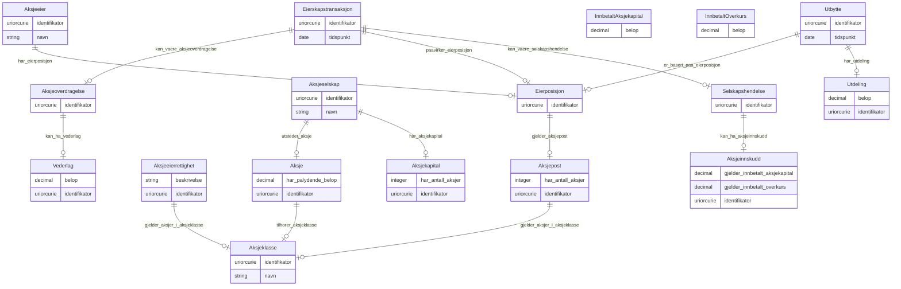

```mermaid
erDiagram
Aksje {
    decimal har_palydende_belop  
    uriorcurie identifikator  
}
Aksjeeier {
    uriorcurie identifikator  
    string navn  
}
Aksjeeierrettighet {
    string beskrivelse  
    uriorcurie identifikator  
}
Aksjeinnskudd {
    decimal gjelder_innbetalt_aksjekapital  
    decimal gjelder_innbetalt_overkurs  
    uriorcurie identifikator  
}
Aksjekapital {
    integer har_antall_aksjer  
    uriorcurie identifikator  
}
Aksjeklasse {
    uriorcurie identifikator  
    string navn  
}
Aksjeoverdragelse {
    uriorcurie identifikator  
}
Aksjepost {
    integer har_antall_aksjer  
    uriorcurie identifikator  
}
Aksjeselskap {
    uriorcurie identifikator  
    string navn  
}

Eierposisjon {
    uriorcurie identifikator  
}
Eierskapstransaksjon {
    uriorcurie identifikator  
    date tidspunkt  
}
InnbetaltAksjekapital {
    decimal belop  
}
InnbetaltOverkurs {
    decimal belop  
}
Selskapshendelse {
    uriorcurie identifikator  
}
Utbytte {
    uriorcurie identifikator  
    date tidspunkt  
}
Utdeling {
    decimal belop  
    uriorcurie identifikator  
}
Vederlag {
    decimal belop  
    uriorcurie identifikator  
}

Aksje ||--|o Aksjeklasse : "tilhorer_aksjeklasse"
Aksjeeier ||--|o Eierposisjon : "har_eierposisjon"
Aksjeeierrettighet ||--|o Aksjeklasse : "gjelder_aksjer_i_aksjeklasse"
Aksjeoverdragelse ||--|o Vederlag : "kan_ha_vederlag"
Aksjepost ||--|o Aksjeklasse : "gjelder_aksjer_i_aksjeklasse"
Aksjeselskap ||--|o Aksje : "utsteder_aksje"
Aksjeselskap ||--|o Aksjekapital : "har_aksjekapital"
Eierposisjon ||--|o Aksjepost : "gjelder_aksjepost"
Eierskapstransaksjon ||--|o Aksjeoverdragelse : "kan_vaere_aksjeoverdragelse"
Eierskapstransaksjon ||--|o Eierposisjon : "paavirker_eierposisjon"
Eierskapstransaksjon ||--|o Selskapshendelse : "kan_vaere_selskapshendelse"
Selskapshendelse ||--|o Aksjeinnskudd : "kan_ha_aksjeinnskudd"
Utbytte ||--|o Eierposisjon : "er_basert_paa_eierposisjon"
Utbytte ||--|o Utdeling : "har_utdeling"

```

