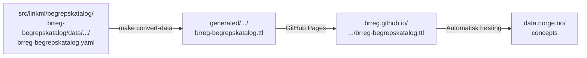

# Publiser til Felles Begrepskatalog

Denne rettleiinga viser korleis begrepsdefinisjonar i `src/linkml/begrepskatalog/<katalog>/data/` vert
konvertert til SKOS/Turtle og automatisk publisert til
[Felles Begrepskatalog](https://data.norge.no/concepts) via eit høstingsendepunkt
på GitHub Pages.

---

## Oversikt



Repoet skil mellom to typar YAML-filer:

| Katalog | Føremål | Publiserast? |
|---|---|---|
| `src/linkml/<domene>/<modell>/examples/` | Illustrative døme — viser gyldig datafil, nyttast i gen-doc | **Nei** |
| `src/linkml/<domene>/<modell>/data/` | Reelle produksjonsdata — det som vert publisert | **Ja** |

Eksempelfiler skal **aldri** sendast til Felles Begrepskatalog. Berre filer
under `data/` vert konverterte og publiserte.

---

## Føresetnader

```bash
make check-prereqs
make mcp-val-build   # byggjer mcp-linkml-validator (trengst for validering)
```

---

## Dagleg arbeidsflyt — redigere begrep

Når du redigerer eksisterande begrep i `src/linkml/begrepskatalog/brreg-begrepskatalog/data/brreg-begrepskatalog/brreg-begrepskatalog.yaml`:

**1. Gjer endringa i datafila:**

```yaml
# src/linkml/begrepskatalog/brreg-begrepskatalog/data/brreg-begrepskatalog/brreg-begrepskatalog.yaml
begrep:
  - id: https://begrep.brreg.no/foretaksnavn
    anbefalt_term:
      - foretaksnavn
    ...
```

**2. Valider skjema og datafil i eitt steg:**

```bash
make mcp-validate \
  SCHEMA=src/linkml/begrepskatalog/brreg-begrepskatalog/brreg-begrepskatalog-schema.yaml \
  POLICY=felles-begrepskatalog \
  INSTANCE=src/linkml/begrepskatalog/brreg-begrepskatalog/data/brreg-begrepskatalog/brreg-begrepskatalog.yaml
```

Alle feil (`severity: error`) må rettast. Åtvaringar (`warning`) bør rettast,
men blokkerer ikkje publisering.

**3. Push til `main`:**

CI-pipelinen køyrer same validering automatisk og publiserer ny `.ttl`-fil
til GitHub Pages. Felles Begrepskatalog høstar oppdateringa ved neste syklus.

!!! note "Kva policyen sjekkar"
    `felles-begrepskatalog`-policyen validerer at:

    - Skjemaet importerer SKOS-AP-NO-Begrep
    - `Begrep`-klassen har alle obligatoriske felt (`skos:prefLabel`, `dct:identifier`,
      `dct:publisher`, `dcat:contactPoint`, definisjon)
    - `Samling`-klassen har alle obligatoriske felt
    - `dct:publisher`-verdien er ein gyldig `data.norge.no/organizations/<orgnr>`-URI

---

## Legg til eit nytt begrep

**1. Vel ein stabil slug** — sluggen vert del av ein permanent URI.
Val av slug er uforanderleg etter første publisering.

**2. Legg til i `src/linkml/begrepskatalog/brreg-begrepskatalog/data/brreg-begrepskatalog/brreg-begrepskatalog.yaml`:**

```yaml
begrep:
  - id: https://begrep.brreg.no/<slug>
    anbefalt_term:
      - <norsk term>
    har_definisjon:
      - https://begrep.brreg.no/def/<slug>-nb
    identifikator_literal: "https://begrep.brreg.no/<slug>"
    kontaktpunkt_vcard:
      - https://begrep.brreg.no/kontakt/begrepsansvarleg
    utgjevar: https://data.norge.no/organizations/974760673
    fagomrade:
      - https://psi.norge.no/los/tema/<los-tema>

definisjoner:
  - id: https://begrep.brreg.no/def/<slug>-nb
    tekst: <definisjonsteikst på bokmål>
    kjelde_relasjon: https://data.norge.no/vocabulary/relationship-with-source-type#self-composed
```

**3. Valider:**

```bash
make mcp-validate \
  SCHEMA=src/linkml/begrepskatalog/brreg-begrepskatalog/brreg-begrepskatalog-schema.yaml \
  POLICY=felles-begrepskatalog \
  INSTANCE=src/linkml/begrepskatalog/brreg-begrepskatalog/data/brreg-begrepskatalog/brreg-begrepskatalog.yaml
```

**4. Push til `main` og vent på publisering.**

**5. Etter stadfesta publisering i Felles Begrepskatalog** — legg til URI-en i lock-fila:

```bash
echo "https://begrep.brreg.no/<slug>" >> \
  src/linkml/begrepskatalog/brreg-begrepskatalog/published-uris.lock
```

---

## URI-stabilitet

Kvart begrep har ein permanent URI (`id:`-feltet). Denne URI-en vert generert
frå `id:` og lagt inn i den publiserte `.ttl`-fila som `dct:identifier`. Når
Felles Begrepskatalog høstar, knyter han metadataa til URI-en.

!!! warning "URI-ar er permanente etter første publisering"
    Viss ein URI vert endra etter publisering, vil Felles Begrepskatalog:

    - Opprette eit **nytt** begrep med ny URI
    - Behalde det **gamle** begrepet med gamal URI som ein separat oppføring

    Resultatet er duplikat i katalogen og øydelagde lenkjer.

### URI-registeret (`published-uris.lock`)

`src/linkml/begrepskatalog/brreg-begrepskatalog/published-uris.lock` sporar alle publiserte URI-ar:

```
# Publiserte URI-ar for brreg-begrepskatalog — IKKJE endre eller slett eksisterande linjer.
# Nye URI-ar leggast til nedst etter publisering.
https://begrep.brreg.no/foretaksnavn
https://begrep.brreg.no/nestleder
```

CI-pipelinen feilar ein PR dersom ei URI i lock-fila manglar frå datafila —
dette fangar opp utilsikta sletting av publiserte begrep.

### Deprecere eit begrep

Dersom eit begrep faktisk må erstattast (feil namn, omdefiniering):

1. **Behald** det opphavlege begrepet i datafila — slett det ikkje
2. Legg til `er_erstatta_av: <ny-uri>` på det gamle begrepet
3. Legg til `erstattar: <gamal-uri>` på det nye begrepet
4. Vurder `euvoc_status: deprecated` på det gamle begrepet

---

## Registrering av høstingsendepunkt (éin gong)

Registrering krev **ID-porten-innlogging** og **Altinn-rolle** for organisasjonen.

**Steg 1** — Logg inn på
[registrering.fellesdatakatalog.digdir.no](https://registrering.fellesdatakatalog.digdir.no)
med ID-porten (sikkerheitsnivå 3) og verifiser at organisasjonen di er synleg.

> Nødvendig Altinn-rolle: sjå
> [data.norge.no/nb/docs/sharing-data/login-and-access](https://data.norge.no/nb/docs/sharing-data/login-and-access)

**Steg 2** — Navigér til
[admin.fellesdatakatalog.digdir.no/data-sources](https://admin.fellesdatakatalog.digdir.no/data-sources)
og legg til ny datakjelde:

| Felt | Verdi |
|---|---|
| **Utgjevar** | Registerenheten i Brønnøysund (974760673) |
| **Katalogtype** | Begreper |
| **Datakildentype** | SKOS-AP-NO |
| **Format** | Turtle |
| **Datakjelde-URL** | `https://brreg.github.io/linkml-datamodellering-no/begrepskatalog/brreg-begrepskatalog/brreg-begrepskatalog.ttl` |
| **Autentisering** | (tomt — endepunktet er offentleg) |

**Steg 3** — Klikk **«Høst»** for umiddelbar høsting utan å vente på neste
automatiske syklus. Behandlingstida er typisk nokre minutt.

**Steg 4** — Verifiser på [data.norge.no/concepts](https://data.norge.no/concepts)
at begrepene visast med rett definisjon, utgjevar og kontaktpunkt.

---

## CI-pipeline

Følgjande køyrer automatisk ved push til `main` når `src/linkml/begrepskatalog/**` er endra:

| Jobb | Steg | Resultat ved feil |
|---|---|---|
| `validate` | `domain-validate-data` | Feiler viss datafila bryt `felles-begrepskatalog`-policyen |
| `validate` | `check-published-uris` | Feiler viss ei URI i lock-fila manglar frå datafila |
| `generate` | `domain-gen-data` | Publiserer ny `.ttl` til GitHub Pages |

Lokalt tilsvarar dette:

```bash
# Validering (same som CI):
make domain-validate-data DOMAIN=begrepskatalog
make check-published-uris

# Konvertering:
make convert-data
```

---

## Sett opp publisering for ny organisasjon

For å bruke same mønster for ein annan begrepskatalog:

**1.** Lag skjema etter `ny-begrepsmodell.md`.

**2.** Set `data_policy` i `manifest.yaml`:

```yaml
generators:
  ...
  example_rdf: true
data_policy: felles-begrepskatalog
```

**3.** Lag `src/linkml/begrepskatalog/<katalognavn>/data/<katalognavn>/<katalognavn>.yaml` med produksjonsdata.
Bruk `src/linkml/begrepskatalog/brreg-begrepskatalog/data/brreg-begrepskatalog/brreg-begrepskatalog.yaml` som mal.

**4.** Lag ei tom lock-fil:

```bash
cat > src/linkml/begrepskatalog/<katalognavn>/published-uris.lock << 'EOF'
# Publiserte URI-ar for <katalognavn> — IKKJE endre eller slett eksisterande linjer.
# Nye URI-ar leggast til nedst etter publisering.
EOF
```

**5.** Valider og push:

```bash
make mcp-validate \
  SCHEMA=src/linkml/begrepskatalog/<katalognavn>/<katalognavn>-schema.yaml \
  POLICY=felles-begrepskatalog \
  INSTANCE=src/linkml/begrepskatalog/<katalognavn>/data/<katalognavn>/<katalognavn>.yaml
```

**6.** Registrer høstingsendepunktet (sjå §Registrering av høstingsendepunkt).

**7.** Legg til publiserte URI-ar i lock-fila etter stadfesta publisering.

---

## Dokumenter publiseringa i portalen

Når begrepskatalogen er publisert og URI-ane er lagde inn i `published-uris.lock`,
oppdaterer portalen seg automatisk neste gong `make publish` køyrer.

`publish.sh` les `published-uris.lock` og legg automatisk til:

- Ein **informasjonsboks** øvst på skjema-sida med høstingsendepunktet
- Ei **«Publisert til»-kolonne** i domene-oversikta som lenkar til
  [data.norge.no/concepts](https://data.norge.no/concepts)

Det er ingen manuell dokumentasjonsoppdatering nødvendig — det held å halde
lock-fila oppdatert. For å sjå resultatet lokalt:

```bash
make publish && make docs-serve
```

---

## Sjå òg

- [Ny begrepskatalog](ny-begrepsmodell.md) — opprette nytt skjema
- [`felles-begrepskatalog.yaml`](https://github.com/brreg/linkml-datamodellering-no/blob/main/src/mcp-linkml-validator/policies/felles-begrepskatalog.yaml) — full policy-definisjon
- [`specs/publisering-felles-begrepskatalog.md`](https://github.com/brreg/linkml-datamodellering-no/blob/main/specs/publisering-felles-begrepskatalog.md) — teknisk spesifikasjon
- [SKOS-AP-NO-Begrep-spesifikasjonen](https://informasjonsforvaltning.github.io/skos-ap-no-begrep/)
- [Dele data — data.norge.no](https://data.norge.no/nb/docs/sharing-data)
