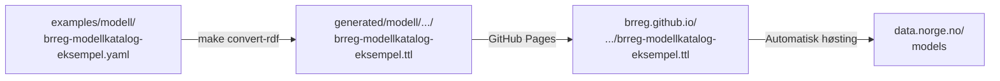

# Publiser til Felles Datakatalog

Denne rettleiinga viser korleis informasjonsmodellar frå dette repoet vert
skildra i ModelDCAT-AP-NO-format og publisert til
[Felles Datakatalog](https://data.norge.no/models) via eit høstingsendepunkt
på GitHub Pages.

---

## Oversikt



Katalogfila (`examples/modell/brreg-modellkatalog-eksempel.yaml`) er eit register
over dei publiserte informasjonsmodellane og vert konvertert til Turtle ved hjelp av
`brreg-modellkatalog-schema.yaml` som importerer ModelDCAT-AP-NO.

---

## Føresetnader

```bash
make check-prereqs
make mcp-val-build   # byggjer mcp-linkml-validator (trengst for validering)
```

---

## Dagleg arbeidsflyt — oppdatere katalogen

Når du redigerer eksisterande oppføringer i
`examples/modell/brreg-modellkatalog-eksempel.yaml`:

**1. Gjer endringa i katalogfila:**

```yaml
informasjonsmodellar:
  - id: https://brreg.no/modellkatalogar/brreg-modellkatalog/ngr-adresse
    tittel:
      - "@value": "Nasjonale grunndata – Adresse"
        "@language": "nb"
    ...
```

**2. Valider skjema og katalogfil:**

```bash
make mcp-validate \
  SCHEMA=src/linkml/modellkatalog/brreg-modellkatalog/brreg-modellkatalog-schema.yaml \
  POLICY=felles-datakatalog \
  INSTANCE=examples/modell/brreg-modellkatalog-eksempel.yaml
```

**3. Push til `main`:**

CI-pipelinen køyrer same validering automatisk og publiserer ny `.ttl`-fil
til GitHub Pages. Felles Datakatalog høstar oppdateringa ved neste syklus.

!!! note "Kva policyen sjekkar"
    `felles-datakatalog`-policyen validerer at:

    - Skjemaet importerer ModelDCAT-AP-NO
    - `Modellkatalog` har alle obligatoriske felt (`dct:title`, `dct:description`,
      `dct:identifier`, `dct:publisher`, `dcat:contactPoint`, `dct:hasPart`)
    - `Informasjonsmodell` har alle obligatoriske felt
    - `dct:publisher`-verdien er ein gyldig `data.norge.no/organizations/<orgnr>`-URI

---

## Legg til ein ny informasjonsmodell

**1. Vel ein stabil URI-slug** — sluggen vert del av ein permanent URI.
Val av slug er uforanderleg etter første publisering.

**2. Legg til i `examples/modell/brreg-modellkatalog-eksempel.yaml`:**

```yaml
informasjonsmodellar:
  - id: https://brreg.no/modellkatalogar/brreg-modellkatalog/<slug>
    tittel:
      - "@value": "<norsk tittel>"
        "@language": "nb"
    beskrivelse:
      - "@value": "<beskriving>"
        "@language": "nb"
    utgiver: https://data.norge.no/organizations/974760673
    identifikator_literal: "https://brreg.no/modellkatalogar/brreg-modellkatalog/<slug>"
    informasjonsmodellidentifikator: "https://brreg.github.io/linkml-datamodellering-no/<domene>/<skjema>/"
    kontaktpunkt:
      - https://brreg.no/kontakt/modellforvaltning
    tema:
      - https://psi.norge.no/los/tema/<los-tema>
    lisens: http://publications.europa.eu/resource/authority/licence/CC_BY_4_0
```

**3.** Legg til URI-en i `har_del:` og `modell:`-lista på `Modellkatalog`-oppføringa.

**4. Valider og push til `main`.**

**5. Etter stadfesta publisering** — legg til URI-en i lock-fila:

```bash
echo "https://brreg.no/modellkatalogar/brreg-modellkatalog/<slug>" >> \
  src/linkml/modellkatalog/brreg-modellkatalog/published-uris.lock
```

---

## URI-stabilitet

Kvar `Informasjonsmodell` og `Modellkatalog` har ein permanent URI (`id:`-feltet).

!!! warning "URI-ar er permanente etter første publisering"
    Viss ein URI vert endra etter publisering, vil Felles Datakatalog opprette ein
    ny oppføring og behalde den gamle som ein separat post — duplikat og øydelagde
    lenkjer vert resultatet.

### URI-registeret (`published-uris.lock`)

`src/linkml/modellkatalog/brreg-modellkatalog/published-uris.lock` sporar alle publiserte
URI-ar. CI-pipelinen feilar ein PR dersom ei URI i lock-fila manglar frå katalogfila.

---

## Registrering av høstingsendepunkt (éin gong)

Registrering krev **ID-porten-innlogging** og **Altinn-rolle** for organisasjonen.

**Steg 1** — Logg inn på [data.norge.no/publishing](https://data.norge.no/publishing)
med ID-porten og verifiser at Registerenheten i Brønnøysund er synleg.

**Steg 2** — Legg til ny datakjelde:

| Felt | Verdi |
|---|---|
| **Utgjevar** | Registerenheten i Brønnøysund (974760673) |
| **Katalogtype** | Informasjonsmodellar |
| **Datakildentype** | ModelDCAT-AP-NO |
| **Format** | Turtle |
| **Datakjelde-URL** | `https://brreg.github.io/linkml-datamodellering-no/modell/brreg-modellkatalog/brreg-modellkatalog-eksempel.ttl` |
| **Autentisering** | (tomt — endepunktet er offentleg) |

**Steg 3** — Klikk **«Høst»** for umiddelbar høsting. Verifiser på
[data.norge.no/models](https://data.norge.no/models) at modellane viser seg
med riktig utgjevar, tittel og LOS-tema.

---

## CI-pipeline

Følgjande køyrer automatisk ved push til `main` når `src/linkml/modellkatalog/**`
eller `examples/modell/**` er endra:

| Jobb | Steg | Resultat ved feil |
|---|---|---|
| `validate` | `domain-validate-bronze` | Feiler viss skjemaet bryt bronsekrava |
| `validate` | `domain-validate-data` | Feiler viss katalogfila bryt `felles-datakatalog`-policyen |
| `validate` | `check-published-uris` | Feiler viss ei URI i lock-fila manglar frå katalogfila |
| `generate` | `domain-gen-rdf` | Publiserer ny `.ttl` til GitHub Pages |

Lokalt:

```bash
# Validering:
make domain-validate-data DOMAIN=modellkatalog
make check-published-uris

# Konvertering og forhåndsvis:
make modell && make publish && make docs-serve
```

---

## Dokumenter publiseringa i portalen

Når ei ny informasjonsmodell er publisert og URI-en er lagd inn i
`published-uris.lock`, køyr:

```bash
make publish
```

`publish.sh` les lock-fila og legg automatisk til informasjonsboks og
«Publisert til»-kolonne i den genererte skjema-sida i portalen.

---

## Sjå òg

- [Ny domenemodell](ny-domenemodell.md) — opprette nytt skjema
- [`felles-datakatalog.yaml`](https://github.com/brreg/linkml-datamodellering-no/blob/main/src/mcp-linkml-validator/policies/felles-datakatalog.yaml) — full policy-definisjon
- [`specs/publisering-felles-datakatalog.md`](https://github.com/brreg/linkml-datamodellering-no/blob/main/specs/publisering-felles-datakatalog.md) — teknisk spesifikasjon
- [ModelDCAT-AP-NO-spesifikasjonen](https://data.norge.no/specification/modelldcat-ap-no)
- [Felles Datakatalog — modellar](https://data.norge.no/models)
