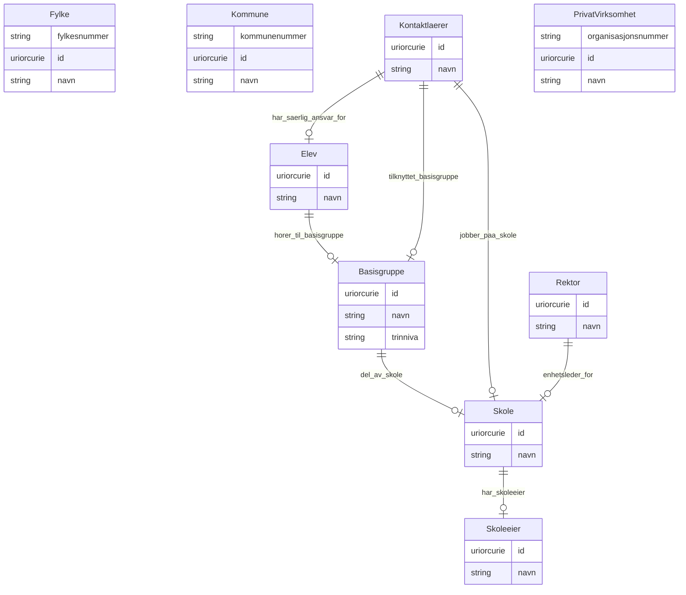

# samt-bu

Ontodia-vennlig LinkML-modell for skoler

URI: https://example.no/ontology/samt-bu-skole

Name: skole_ontologi

## Classes

### Andre

| Class | Description |
| --- | --- |
| [Basisgruppe](klasser/basisgruppe.md) | Skoleklasse som hovedsaklig samler elever i ulike fag |
| [Elev](klasser/elev.md) | En person som går på skole |
| [Fylke](klasser/fylke.md) | Fylke (etter norrønt fylki) er en betegnelse på et undernasjonalt, regionalt ... |
| [Kommune](klasser/kommune.md) | En kommune er et geografisk avgrenset område som utgjør en egen politisk og a... |
| [Kontaktlaerer](klasser/kontaktlaerer.md) | En lærer med ansvar for ei basisgruppe og er skolens kontaktpunkt for elevane... |
| [Person](klasser/person.md) | Eit menneske individ |
| [PrivatVirksomhet](klasser/privatvirksomhet.md) | Virksomhet, eller foretak, er betegnelser for en juridisk person eller en org... |
| [Rektor](klasser/rektor.md) | Høgaste akademiske leder av en skole |
| [Skole](klasser/skole.md) | En skole er en privat eller offentlig institusjon eller et lærested hvor lære... |
| [Skoleeier](klasser/skoleeier.md) | Superklasse for alle typer skoleeiere |

## Slots

| Slot | Description |
| --- | --- |
| [basisgrupper](klasser/basisgrupper.md) |  |
| [brukertilbakemeldinger](klasser/brukertilbakemeldinger.md) |  |
| [dataset_metadata](klasser/dataset_metadata.md) |  |
| [datasettdistribusjoner](klasser/datasettdistribusjoner.md) |  |
| [del_av_skole](klasser/del_av_skole.md) | Skolen basisgruppa tilhører |
| [elever](klasser/elever.md) |  |
| [enhetsleder_for](klasser/enhetsleder_for.md) | Enhet rektor er enhetsleder for |
| [fylker](klasser/fylker.md) |  |
| [fylkesnummer](klasser/fylkesnummer.md) | Fylkesnummer er definerte identifikasjonskoder for Norges fylker og to territ... |
| [gjeldende_lovgivninger](klasser/gjeldende_lovgivninger.md) |  |
| [grupper](klasser/grupper.md) |  |
| [har_saerlig_ansvar_for](klasser/har_saerlig_ansvar_for.md) | Elev kontaktlæreren har særlig ansvar for |
| [har_skoleeier](klasser/har_skoleeier.md) | Skoleeier for skolen |
| [horer_til_basisgruppe](klasser/horer_til_basisgruppe.md) | Basisgruppe elev tilhører |
| [id](klasser/id.md) |  |
| [jobber_paa_skole](klasser/jobber_paa_skole.md) | Skolen kontaktlæreren jobber på |
| [kommunenummer](klasser/kommunenummer.md) | Kommunenummer er en nummerrekke som identifiserer kommuner eller kommunefrie ... |
| [kommuner](klasser/kommuner.md) |  |
| [kontaktlaerere](klasser/kontaktlaerere.md) |  |
| [kontaktpunkter](klasser/kontaktpunkter.md) |  |
| [kvalitetsdimensjoner](klasser/kvalitetsdimensjoner.md) |  |
| [kvalitetsmaalinger](klasser/kvalitetsmaalinger.md) |  |
| [kvalitetsmerknader](klasser/kvalitetsmerknader.md) |  |
| [navn](klasser/navn.md) | Namn på ressursen |
| [organisasjoner](klasser/organisasjoner.md) |  |
| [organisasjonsnummer](klasser/organisasjonsnummer.md) | Organisasjonsnummer er i Norge et ni-sifret registreringsnummer som tildeles ... |
| [private_virksomheter](klasser/private_virksomheter.md) |  |
| [rektorer](klasser/rektorer.md) |  |
| [skoler](klasser/skoler.md) |  |
| [standarder](klasser/standarder.md) |  |
| [tekstdeler](klasser/tekstdeler.md) |  |
| [tidsromer](klasser/tidsromer.md) |  |
| [tilknyttet_basisgruppe](klasser/tilknyttet_basisgruppe.md) | Basisgruppe kontaktlærer er tilknyttet |
| [trinniva](klasser/trinniva.md) | Grunnskolen (6-15 år) er delt opp i 10 trinn, eit for kvart år |
| [utgivere](klasser/utgivere.md) |  |

## Enumerations

| Enumeration | Description |
| --- | --- |

## Types

| Type | Description |
| --- | --- |

## Subsets

| Subset | Description |
| --- | --- |
| [Anbefalt](klasser/anbefalt.md) | Anbefalte eigenskapar i ein AP-NO-profil |
| [Obligatorisk](klasser/obligatorisk.md) | Obligatoriske eigenskapar i ein AP-NO-profil |
| [Valgfri](klasser/valgfri.md) | Valfrie eigenskapar i ein AP-NO-profil |

## Generated artifacts

| Artefakt | Fil |
|----------|-----|
| SHACL shapes | [samt-bu-shapes.ttl](samt-bu-shapes.ttl) |
| JSON-LD kontekst | [samt-bu-context.jsonld](samt-bu-context.jsonld) |
| JSON Schema | [samt-bu-schema.json](samt-bu-schema.json) |
| OWL ontologi | [samt-bu-ontology.ttl](samt-bu-ontology.ttl) |
| Python-klasser | [samt-bu-model.py](samt-bu-model.py) |
| Protobuf-skjema | [samt-bu-schema.proto](samt-bu-schema.proto) |
| ER-diagram (Mermaid) | [samt-bu-erdiagram.md](samt-bu-erdiagram.md) |
| Eksempeldata (Turtle) | [samt-bu-eksempel.ttl](samt-bu-eksempel.ttl) |
| PlantUML-diagram | [samt-bu.svg](diagrams/samt-bu.svg) · [samt-bu.puml](diagrams/samt-bu.puml) |
