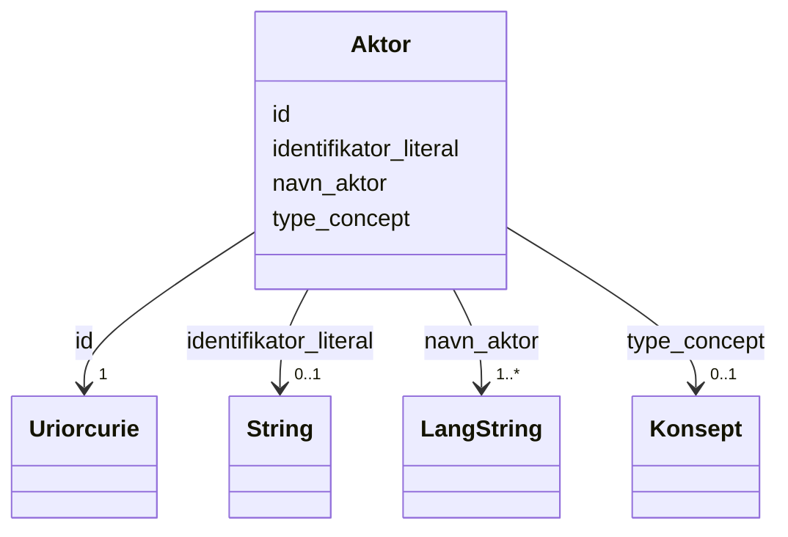

# Class: Aktor 


_Ein aktør (person, organisasjon eller system) med ansvar for ein ressurs._


URI: [foaf:Agent](http://xmlns.com/foaf/0.1/Agent)





<!-- no inheritance hierarchy -->

## Class Properties

| Property | Value |
| --- | --- |
| Class URI | [foaf:Agent](http://xmlns.com/foaf/0.1/Agent) |


## Eigenskapar


  
  

  
  
    
  

  
  

  
  


### Obligatorisk

| Namn | Kardinalitet og domene | Beskriving |
| --- | --- | --- |
| [navn_aktor](navn_aktor.md) | 1..* <br/> [LangString](langstring.md) | Namn på aktøren |


  
  

  
  

  
  

  
  


  
  

  
  

  
  

  
  


  
  
  
  
    
  

  
  
  
    
      
    
      
    
      
    
  
  

  
  
  
  
    
  

  
  
  
  
    
  


### Andre

| Namn | Kardinalitet og domene | Beskriving |
| --- | --- | --- |
| [id](id.md) | 1 <br/> [xsd:anyURI](http://www.w3.org/2001/XMLSchema#anyURI) | URI-identifikator for ressursen |
| [identifikator_literal](identifikator_literal.md) | 0..1 <br/> [xsd:string](http://www.w3.org/2001/XMLSchema#string) | Tekstleg identifikator for ressursen (dct:identifier) |
| [type_concept](type_concept.md) | 0..1 <br/> [Konsept](konsept.md) | Type ressurs frå eit kontrollert vokabular (dct:type) |


## Usages

| used by | used in | type | used |
| ---  | --- | --- | --- |
| [Datasett](datasett.md) | [utgiver](utgiver.md) | range | [Aktor](aktor.md) |
| [Datasett](datasett.md) | [produsent](produsent.md) | range | [Aktor](aktor.md) |
| [Datasettserie](datasettserie.md) | [utgiver](utgiver.md) | range | [Aktor](aktor.md) |
| [Datatjeneste](datatjeneste.md) | [utgiver](utgiver.md) | range | [Aktor](aktor.md) |
| [Katalog](katalog.md) | [utgiver](utgiver.md) | range | [Aktor](aktor.md) |
| [Katalog](katalog.md) | [produsent](produsent.md) | range | [Aktor](aktor.md) |
| [Containerklasse](containerklasse.md) | [utgivere](utgivere.md) | range | [Aktor](aktor.md) |
| [Containerklasse](containerklasse.md) | [organisasjoner](organisasjoner.md) | range | [Aktor](aktor.md) |
| [Containerklasse](containerklasse.md) | [grupper](grupper.md) | range | [Aktor](aktor.md) |


## See Also

* [https://data.norge.no/concepts/d85379a6-837b-3102-b202-999a99240d69](https://data.norge.no/concepts/d85379a6-837b-3102-b202-999a99240d69)


## Identifier and Mapping Information


### Schema Source


* from schema: https://data.norge.no/linkml/dcat-ap-no


## Mappings

| Mapping Type | Mapped Value |
| ---  | ---  |
| self | foaf:Agent |
| native | https://data.norge.no/linkml/dcat-ap-no/Aktor |


## LinkML Source

<!-- TODO: investigate https://stackoverflow.com/questions/37606292/how-to-create-tabbed-code-blocks-in-mkdocs-or-sphinx -->

### Direct

<details>
```yaml
name: Aktor
description: Ein aktør (person, organisasjon eller system) med ansvar for ein ressurs.
from_schema: https://data.norge.no/linkml/dcat-ap-no
see_also:
- https://data.norge.no/concepts/d85379a6-837b-3102-b202-999a99240d69
slots:
- id
- navn_aktor
- identifikator_literal
- type_concept
slot_usage:
  navn_aktor:
    name: navn_aktor
    in_subset:
    - Obligatorisk
    required: true
class_uri: foaf:Agent

```
</details>

### Induced

<details>
```yaml
name: Aktor
description: Ein aktør (person, organisasjon eller system) med ansvar for ein ressurs.
from_schema: https://data.norge.no/linkml/dcat-ap-no
see_also:
- https://data.norge.no/concepts/d85379a6-837b-3102-b202-999a99240d69
slot_usage:
  navn_aktor:
    name: navn_aktor
    in_subset:
    - Obligatorisk
    required: true
attributes:
  id:
    name: id
    description: URI-identifikator for ressursen.
    from_schema: https://data.norge.no/linkml/common-ap-no
    identifier: true
    alias: id
    owner: Aktor
    domain_of:
    - KatalogisertRessurs
    - Aktor
    - Kontaktopplysning
    - Tidsrom
    - RegulativRessurs
    - Identifikator
    - Rettighetserklaring
    - Sjekksum
    - Gebyr
    - Relasjon
    - Distribusjon
    - Datasett
    - Katalogpost
    - Mediatype
    - Konsept
    - Begrepssamling
    - Kvalitetsdimensjon
    - Kvalitetsmaal
    - Kvalitetsmerknad
    - Kvalitetsmaaling
    - Standard
    - Tekstdel
    - Containerklasse
    - Skole
    - Skoleeier
    - Basisgruppe
    - Person
    range: uriorcurie
    required: true
  navn_aktor:
    name: navn_aktor
    description: Namn på aktøren.
    in_subset:
    - Obligatorisk
    from_schema: https://data.norge.no/linkml/dcat-ap-no
    slot_uri: foaf:name
    alias: navn_aktor
    owner: Aktor
    domain_of:
    - Aktor
    range: LangString
    required: true
    multivalued: true
  identifikator_literal:
    name: identifikator_literal
    description: Tekstleg identifikator for ressursen (dct:identifier).
    from_schema: https://data.norge.no/linkml/common-ap-no
    slot_uri: dct:identifier
    alias: identifikator_literal
    owner: Aktor
    domain_of:
    - Aktor
    - RegulativRessurs
    - Datasett
    - Datatjeneste
    - Katalog
    range: string
  type_concept:
    name: type_concept
    description: Type ressurs frå eit kontrollert vokabular (dct:type).
    from_schema: https://data.norge.no/linkml/common-ap-no
    slot_uri: dct:type
    alias: type_concept
    owner: Aktor
    domain_of:
    - Aktor
    - RegulativRessurs
    - Datasett
    range: Konsept
class_uri: foaf:Agent

```
</details>