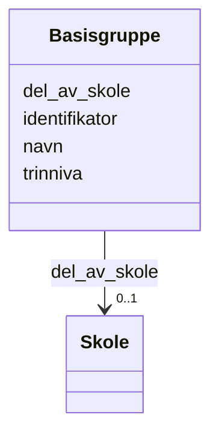

# Class: Basisgruppe 


_Skoleklasse som hovedsaklig samler elever i ulike fag._


URI: [samtbuskole:Basisgruppe](https://example.no/ontology/skole#Basisgruppe)





<!-- no inheritance hierarchy -->

## Eigenskapar


  
  

  
  

  
  

  
  


  
  

  
  

  
  

  
  


  
  

  
  

  
  

  
  


  
  
  
  
    
  

  
  
  
  
    
  

  
  
  
  
    
  

  
  
  
  
    
  


### Andre

| Namn | Kardinalitet og domene | Beskriving |
| --- | --- | --- |
| [identifikator](identifikator.md) | 1 <br/> [Uriorcurie](uriorcurie.md) | Global identifikator (CURIE/URI) |
| [navn](navn.md) | 0..1 <br/> [String](string.md) | Namn på ressursen |
| [trinniva](trinniva.md) | 0..1 <br/> [String](string.md) | Grunnskolen (6-15 år) er delt opp i 10 trinn, eit for kvart år |
| [del_av_skole](del_av_skole.md) | 0..1 <br/> [Skole](skole.md) | Skolen basisgruppa tilhører |


## Usages

| used by | used in | type | used |
| ---  | --- | --- | --- |
| [Containerklasse](containerklasse.md) | [basisgrupper](basisgrupper.md) | range | [Basisgruppe](basisgruppe.md) |
| [Basisgruppe](basisgruppe.md) | [del_av_skole](del_av_skole.md) | domain | [Basisgruppe](basisgruppe.md) |
| [Elev](elev.md) | [horer_til_basisgruppe](horer_til_basisgruppe.md) | range | [Basisgruppe](basisgruppe.md) |
| [Kontaktlaerer](kontaktlaerer.md) | [tilknyttet_basisgruppe](tilknyttet_basisgruppe.md) | range | [Basisgruppe](basisgruppe.md) |


## Identifier and Mapping Information


### Schema Source


* from schema: https://example.no/ontology/samt-bu-skole


## Mappings

| Mapping Type | Mapped Value |
| ---  | ---  |
| self | samtbuskole:Basisgruppe |
| native | samtbuskole:Basisgruppe |
| close | schema:EducationalOccupationalProgram, schema:Course |


## LinkML Source

<!-- TODO: investigate https://stackoverflow.com/questions/37606292/how-to-create-tabbed-code-blocks-in-mkdocs-or-sphinx -->

### Direct

<details>
```yaml
name: Basisgruppe
description: Skoleklasse som hovedsaklig samler elever i ulike fag.
from_schema: https://example.no/ontology/samt-bu-skole
close_mappings:
- schema:EducationalOccupationalProgram
- schema:Course
slots:
- identifikator
- navn
- trinniva
- del_av_skole

```
</details>

### Induced

<details>
```yaml
name: Basisgruppe
description: Skoleklasse som hovedsaklig samler elever i ulike fag.
from_schema: https://example.no/ontology/samt-bu-skole
close_mappings:
- schema:EducationalOccupationalProgram
- schema:Course
attributes:
  identifikator:
    name: identifikator
    description: Global identifikator (CURIE/URI).
    from_schema: https://example.no/ontology/samt-bu-skole
    rank: 1000
    identifier: true
    alias: identifikator
    owner: Basisgruppe
    domain_of:
    - Containerklasse
    - Skole
    - Skoleeier
    - Basisgruppe
    - Person
    range: uriorcurie
    required: true
  navn:
    name: navn
    description: Namn på ressursen.
    from_schema: https://example.no/ontology/samt-bu-skole
    rank: 1000
    alias: navn
    owner: Basisgruppe
    domain_of:
    - Skole
    - Skoleeier
    - Basisgruppe
    - Person
    range: string
  trinniva:
    name: trinniva
    description: Grunnskolen (6-15 år) er delt opp i 10 trinn, eit for kvart år.
    from_schema: https://example.no/ontology/samt-bu-skole
    rank: 1000
    alias: trinniva
    owner: Basisgruppe
    domain_of:
    - Basisgruppe
    range: string
  del_av_skole:
    name: del_av_skole
    description: Skolen basisgruppa tilhører
    from_schema: https://example.no/ontology/samt-bu-skole
    close_mappings:
    - schema:isPartOf
    rank: 1000
    domain: Basisgruppe
    slot_uri: org:unitOf
    alias: del_av_skole
    owner: Basisgruppe
    domain_of:
    - Basisgruppe
    range: Skole

```
</details>