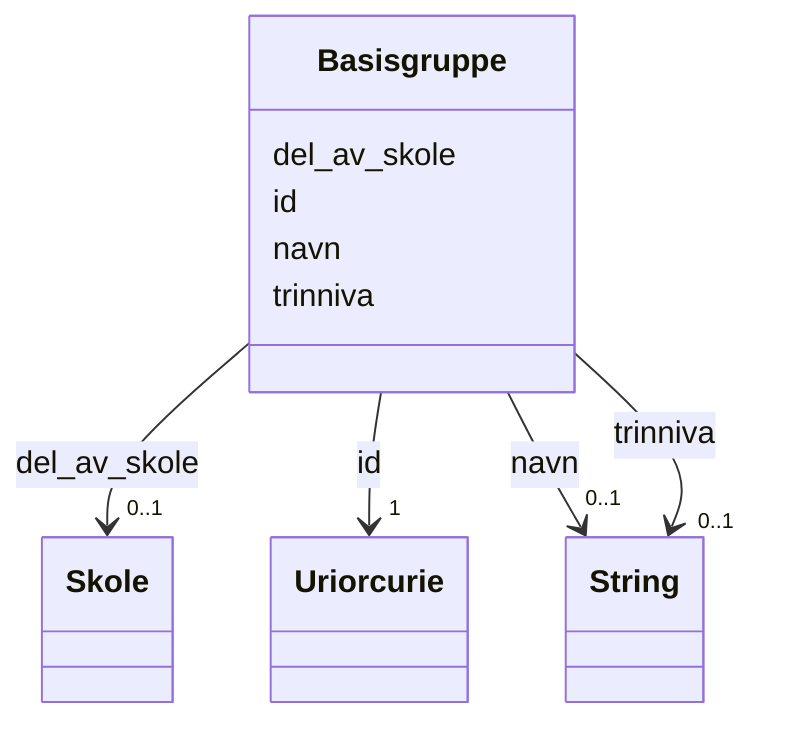

# Class: Basisgruppe 


_Skoleklasse som hovedsaklig samler elever i ulike fag._


URI: [samtbuskole:Basisgruppe](https://example.no/ontology/skole#Basisgruppe)





<!-- no inheritance hierarchy -->

## Eigenskapar


  
  

  
  

  
  

  
  


  
  

  
  

  
  

  
  


  
  

  
  

  
  

  
  


  
  
  
  
    
  

  
  
  
  
    
  

  
  
  
  
    
  

  
  
  
  
    
  


### Andre

| Namn | Kardinalitet og domene | Beskriving |
| --- | --- | --- |
| [id](id.md) | 1 <br/> [xsd:anyURI](http://www.w3.org/2001/XMLSchema#anyURI) | URI-identifikator for ressursen |
| [navn](navn.md) | 0..1 <br/> [xsd:string](http://www.w3.org/2001/XMLSchema#string) | Namn på ressursen |
| [trinniva](trinniva.md) | 0..1 <br/> [xsd:string](http://www.w3.org/2001/XMLSchema#string) | Grunnskolen (6-15 år) er delt opp i 10 trinn, eit for kvart år |
| [del_av_skole](del_av_skole.md) | 0..1 <br/> [Skole](skole.md) | Skolen basisgruppa tilhører |


## Usages

| used by | used in | type | used |
| ---  | --- | --- | --- |
| [SamtBuContainer](samtbucontainer.md) | [basisgrupper](basisgrupper.md) | range | [Basisgruppe](basisgruppe.md) |
| [Basisgruppe](basisgruppe.md) | [del_av_skole](del_av_skole.md) | domain | [Basisgruppe](basisgruppe.md) |
| [Elev](elev.md) | [horer_til_basisgruppe](horer_til_basisgruppe.md) | range | [Basisgruppe](basisgruppe.md) |
| [Kontaktlaerer](kontaktlaerer.md) | [tilknyttet_basisgruppe](tilknyttet_basisgruppe.md) | range | [Basisgruppe](basisgruppe.md) |


## Identifier and Mapping Information


### Schema Source


* from schema: https://example.no/ontology/samt-bu-skole


## Mappings

| Mapping Type | Mapped Value |
| ---  | ---  |
| self | samtbuskole:Basisgruppe |
| native | samtbuskole:Basisgruppe |
| close | schema:EducationalOccupationalProgram, schema:Course |


## Examples
### Example: Basisgruppe-basisgruppe-5A

```yaml
id: samtbuskole:basisgruppe-5A
navn: 5A
trinniva: '5'
del_av_skole: samtbuskole:skole-1

```
### Example: Basisgruppe-basisgruppe-6B

```yaml
id: samtbuskole:basisgruppe-6B
navn: 6B
trinniva: '6'
del_av_skole: samtbuskole:skole-2

```


## LinkML Source

<!-- TODO: investigate https://stackoverflow.com/questions/37606292/how-to-create-tabbed-code-blocks-in-mkdocs-or-sphinx -->

### Direct

<details>
```yaml
name: Basisgruppe
description: Skoleklasse som hovedsaklig samler elever i ulike fag.
from_schema: https://example.no/ontology/samt-bu-skole
close_mappings:
- schema:EducationalOccupationalProgram
- schema:Course
rank: 1000
slots:
- id
- navn
- trinniva
- del_av_skole

```
</details>

### Induced

<details>
```yaml
name: Basisgruppe
description: Skoleklasse som hovedsaklig samler elever i ulike fag.
from_schema: https://example.no/ontology/samt-bu-skole
close_mappings:
- schema:EducationalOccupationalProgram
- schema:Course
rank: 1000
attributes:
  id:
    name: id
    description: URI-identifikator for ressursen.
    from_schema: https://data.norge.no/ap-no/common-ap-no
    identifier: true
    owner: Basisgruppe
    domain_of:
    - KatalogisertRessurs
    - Aktor
    - Kontaktopplysning
    - Tidsrom
    - RegulativRessurs
    - Identifikator
    - Rettighetserklaring
    - Sjekksum
    - Gebyr
    - Relasjon
    - Distribusjon
    - Datasett
    - Katalogpost
    - Mediatype
    - Konsept
    - Begrepssamling
    - Kvalitetsdimensjon
    - Kvalitetsmaal
    - Kvalitetsmerknad
    - Kvalitetsmaaling
    - Standard
    - Tekstdel
    - SamtBuContainer
    - Skole
    - Skoleeier
    - Basisgruppe
    - Person
    range: uriorcurie
    required: true
  navn:
    name: navn
    description: Namn på ressursen.
    from_schema: https://example.no/ontology/samt-bu-skole
    rank: 1000
    owner: Basisgruppe
    domain_of:
    - Skole
    - Skoleeier
    - Basisgruppe
    - Person
    range: string
  trinniva:
    name: trinniva
    description: Grunnskolen (6-15 år) er delt opp i 10 trinn, eit for kvart år.
    from_schema: https://example.no/ontology/samt-bu-skole
    rank: 1000
    owner: Basisgruppe
    domain_of:
    - Basisgruppe
    range: string
  del_av_skole:
    name: del_av_skole
    description: Skolen basisgruppa tilhører
    from_schema: https://example.no/ontology/samt-bu-skole
    close_mappings:
    - schema:isPartOf
    rank: 1000
    domain: Basisgruppe
    slot_uri: org:unitOf
    owner: Basisgruppe
    domain_of:
    - Basisgruppe
    range: Skole

```
</details>