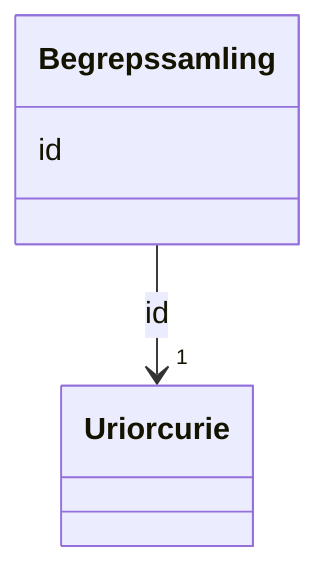

# Class: Begrepssamling 


_Ei SKOS-omgrepssamling (temavokabular)._


URI: [skos:ConceptScheme](http://www.w3.org/2004/02/skos/core#ConceptScheme)





<!-- no inheritance hierarchy -->

## Class Properties

| Property | Value |
| --- | --- |
| Class URI | [skos:ConceptScheme](http://www.w3.org/2004/02/skos/core#ConceptScheme) |


## Eigenskapar


  
  


  
  


  
  


  
  
  
  
    
  


### Andre

| Namn | Kardinalitet og domene | Beskriving |
| --- | --- | --- |
| [id](id.md) | 1 <br/> [xsd:anyURI](http://www.w3.org/2001/XMLSchema#anyURI) | URI-identifikator for ressursen |


## Usages

| used by | used in | type | used |
| ---  | --- | --- | --- |
| [Katalog](katalog.md) | [temaer](temaer.md) | range | [Begrepssamling](begrepssamling.md) |


## Identifier and Mapping Information


### Schema Source


* from schema: https://data.norge.no/linkml/common-ap-no


## Mappings

| Mapping Type | Mapped Value |
| ---  | ---  |
| self | skos:ConceptScheme |
| native | https://data.norge.no/linkml/common-ap-no/Begrepssamling |


## LinkML Source

<!-- TODO: investigate https://stackoverflow.com/questions/37606292/how-to-create-tabbed-code-blocks-in-mkdocs-or-sphinx -->

### Direct

<details>
```yaml
name: Begrepssamling
description: Ei SKOS-omgrepssamling (temavokabular).
from_schema: https://data.norge.no/linkml/common-ap-no
slots:
- id
class_uri: skos:ConceptScheme

```
</details>

### Induced

<details>
```yaml
name: Begrepssamling
description: Ei SKOS-omgrepssamling (temavokabular).
from_schema: https://data.norge.no/linkml/common-ap-no
attributes:
  id:
    name: id
    description: URI-identifikator for ressursen.
    from_schema: https://data.norge.no/linkml/common-ap-no
    identifier: true
    owner: Begrepssamling
    domain_of:
    - KatalogisertRessurs
    - Aktor
    - Kontaktopplysning
    - Tidsrom
    - RegulativRessurs
    - Identifikator
    - Rettighetserklaring
    - Sjekksum
    - Gebyr
    - Relasjon
    - Distribusjon
    - Datasett
    - Katalogpost
    - Mediatype
    - Konsept
    - Begrepssamling
    - Kvalitetsdimensjon
    - Kvalitetsmaal
    - Kvalitetsmerknad
    - Kvalitetsmaaling
    - Standard
    - Tekstdel
    - SamtBuContainer
    - Skole
    - Skoleeier
    - Basisgruppe
    - Person
    range: uriorcurie
    required: true
class_uri: skos:ConceptScheme

```
</details>