# Class: Containerklasse 


_Containerklasse for alle klasser som kan inngå i datasettet._


URI: [samtbuskole:Containerklasse](https://example.no/ontology/skole#Containerklasse)

```mermaid
 classDiagram
    class Containerklasse
    click Containerklasse href "../Containerklasse/"
      Containerklasse : basisgrupper
        
          
    
        
        
        Containerklasse --> "*" Basisgruppe : basisgrupper
        click Basisgruppe href "../Basisgruppe/"
    

        
      Containerklasse : brukertilbakemeldinger
        
          
    
        
        
        Containerklasse --> "*" Brukartilbakemelding : brukertilbakemeldinger
        click Brukartilbakemelding href "../Brukartilbakemelding/"
    

        
      Containerklasse : dataset_metadata
        
          
    
        
        
        Containerklasse --> "*" Datasett : dataset_metadata
        click Datasett href "../Datasett/"
    

        
      Containerklasse : datasettdistribusjoner
        
          
    
        
        
        Containerklasse --> "*" Distribusjon : datasettdistribusjoner
        click Distribusjon href "../Distribusjon/"
    

        
      Containerklasse : elever
        
          
    
        
        
        Containerklasse --> "*" Elev : elever
        click Elev href "../Elev/"
    

        
      Containerklasse : fylker
        
          
    
        
        
        Containerklasse --> "*" Fylke : fylker
        click Fylke href "../Fylke/"
    

        
      Containerklasse : gjeldende_lovgivninger
        
          
    
        
        
        Containerklasse --> "*" RegulativRessurs : gjeldende_lovgivninger
        click RegulativRessurs href "../RegulativRessurs/"
    

        
      Containerklasse : grupper
        
          
    
        
        
        Containerklasse --> "*" Aktor : grupper
        click Aktor href "../Aktor/"
    

        
      Containerklasse : identifikator
        
      Containerklasse : kommuner
        
          
    
        
        
        Containerklasse --> "*" Kommune : kommuner
        click Kommune href "../Kommune/"
    

        
      Containerklasse : kontaktlaerere
        
          
    
        
        
        Containerklasse --> "*" Kontaktlaerer : kontaktlaerere
        click Kontaktlaerer href "../Kontaktlaerer/"
    

        
      Containerklasse : kontaktpunkter
        
          
    
        
        
        Containerklasse --> "*" Kontaktopplysning : kontaktpunkter
        click Kontaktopplysning href "../Kontaktopplysning/"
    

        
      Containerklasse : kvalitetsdimensjoner
        
          
    
        
        
        Containerklasse --> "*" Kvalitetsdimensjon : kvalitetsdimensjoner
        click Kvalitetsdimensjon href "../Kvalitetsdimensjon/"
    

        
      Containerklasse : kvalitetsmaalinger
        
          
    
        
        
        Containerklasse --> "*" Kvalitetsmaaling : kvalitetsmaalinger
        click Kvalitetsmaaling href "../Kvalitetsmaaling/"
    

        
      Containerklasse : kvalitetsmerknader
        
          
    
        
        
        Containerklasse --> "*" Kvalitetsmerknad : kvalitetsmerknader
        click Kvalitetsmerknad href "../Kvalitetsmerknad/"
    

        
      Containerklasse : organisasjoner
        
          
    
        
        
        Containerklasse --> "*" Aktor : organisasjoner
        click Aktor href "../Aktor/"
    

        
      Containerklasse : private_virksomheter
        
          
    
        
        
        Containerklasse --> "*" PrivatVirksomhet : private_virksomheter
        click PrivatVirksomhet href "../PrivatVirksomhet/"
    

        
      Containerklasse : rektorer
        
          
    
        
        
        Containerklasse --> "*" Rektor : rektorer
        click Rektor href "../Rektor/"
    

        
      Containerklasse : skoler
        
          
    
        
        
        Containerklasse --> "*" Skole : skoler
        click Skole href "../Skole/"
    

        
      Containerklasse : standarder
        
          
    
        
        
        Containerklasse --> "*" Standard : standarder
        click Standard href "../Standard/"
    

        
      Containerklasse : tekstdeler
        
          
    
        
        
        Containerklasse --> "*" Tekstdel : tekstdeler
        click Tekstdel href "../Tekstdel/"
    

        
      Containerklasse : tidsromer
        
          
    
        
        
        Containerklasse --> "*" Tidsrom : tidsromer
        click Tidsrom href "../Tidsrom/"
    

        
      Containerklasse : utgivere
        
          
    
        
        
        Containerklasse --> "*" Aktor : utgivere
        click Aktor href "../Aktor/"
    

        
      
```





<!-- no inheritance hierarchy -->

## Class Properties

| Property | Value |
| --- | --- |
| Tree Root | Yes |


## Eigenskapar


  
  

  
  

  
  

  
  

  
  

  
  

  
  

  
  

  
  

  
  

  
  

  
  

  
  

  
  

  
  

  
  

  
  

  
  

  
  

  
  

  
  

  
  

  
  


  
  

  
  

  
  

  
  

  
  

  
  

  
  

  
  

  
  

  
  

  
  

  
  

  
  

  
  

  
  

  
  

  
  

  
  

  
  

  
  

  
  

  
  

  
  


  
  

  
  

  
  

  
  

  
  

  
  

  
  

  
  

  
  

  
  

  
  

  
  

  
  

  
  

  
  

  
  

  
  

  
  

  
  

  
  

  
  

  
  

  
  


  
  
  
  
    
  

  
  
  
  
    
  

  
  
  
  
    
  

  
  
  
  
    
  

  
  
  
  
    
  

  
  
  
  
    
  

  
  
  
  
    
  

  
  
  
  
    
  

  
  
  
  
    
  

  
  
  
  
    
  

  
  
  
  
    
  

  
  
  
  
    
  

  
  
  
  
    
  

  
  
  
  
    
  

  
  
  
  
    
  

  
  
  
  
    
  

  
  
  
  
    
  

  
  
  
  
    
  

  
  
  
  
    
  

  
  
  
  
    
  

  
  
  
  
    
  

  
  
  
  
    
  

  
  
  
  
    
  


### Andre

| Namn | Kardinalitet og domene | Beskriving |
| --- | --- | --- |
| [kontaktpunkter](kontaktpunkter.md) | * <br/> [Kontaktopplysning](kontaktopplysning.md) | Kontaktpunkt for datasettet |
| [utgivere](utgivere.md) | * <br/> [Aktor](aktor.md) | Utgjevarar av datasettet |
| [organisasjoner](organisasjoner.md) | * <br/> [Aktor](aktor.md) | Organisasjonar knytt til datasettet |
| [gjeldende_lovgivninger](gjeldende_lovgivninger.md) | * <br/> [RegulativRessurs](regulativressurs.md) | Gjeldande lovgiving for datasettet |
| [datasettdistribusjoner](datasettdistribusjoner.md) | * <br/> [Distribusjon](distribusjon.md) | Distribusjonar av datasettet |
| [dataset_metadata](dataset_metadata.md) | * <br/> [Datasett](datasett.md) | Metadata om datasettet |
| [kvalitetsmerknader](kvalitetsmerknader.md) | * <br/> [Kvalitetsmerknad](kvalitetsmerknad.md) | Kvalitetsmerknader for datasettet |
| [brukertilbakemeldinger](brukertilbakemeldinger.md) | * <br/> [Brukartilbakemelding](brukartilbakemelding.md) | Brukartilbakemeldingar for datasettet |
| [kvalitetsmaalinger](kvalitetsmaalinger.md) | * <br/> [Kvalitetsmaaling](kvalitetsmaaling.md) | Kvalitetsmålingar for datasettet |
| [grupper](grupper.md) | * <br/> [Aktor](aktor.md) | Grupper knytt til datasettet |
| [standarder](standarder.md) | * <br/> [Standard](standard.md) | Standardar datasettet følgjer |
| [kvalitetsdimensjoner](kvalitetsdimensjoner.md) | * <br/> [Kvalitetsdimensjon](kvalitetsdimensjon.md) | Kvalitetsdimensjoner for datasettet |
| [tidsromer](tidsromer.md) | * <br/> [Tidsrom](tidsrom.md) | Tidsrom for kvalitetsmerknad |
| [tekstdeler](tekstdeler.md) | * <br/> [Tekstdel](tekstdel.md) | Tekstdel for kvalitetsmerknad |
| [identifikator](identifikator.md) | 1 <br/> [Uriorcurie](uriorcurie.md) | Global identifikator (CURIE/URI) |
| [skoler](skoler.md) | * <br/> [Skole](skole.md) | Container slot for å legge tilrette for å kunne ha fleire instanser av skole ... |
| [kommuner](kommuner.md) | * <br/> [Kommune](kommune.md) | Container slot for å legge tilrette for å kunne ha fleire instanser av kommun... |
| [fylker](fylker.md) | * <br/> [Fylke](fylke.md) | Container slot for å legge tilrette for å kunne ha fleire instanser av fylke ... |
| [private_virksomheter](private_virksomheter.md) | * <br/> [PrivatVirksomhet](privatvirksomhet.md) | Container slot for å legge tilrette for å kunne ha fleire instanser av privat... |
| [basisgrupper](basisgrupper.md) | * <br/> [Basisgruppe](basisgruppe.md) | Container slot for å legge tilrette for å kunne ha fleire instanser av basisg... |
| [elever](elever.md) | * <br/> [Elev](elev.md) | Container slot for å legge tilrette for å kunne ha fleire instanser av elev i... |
| [rektorer](rektorer.md) | * <br/> [Rektor](rektor.md) | Container slot for å legge tilrette for å kunne ha fleire instanser av rektor... |
| [kontaktlaerere](kontaktlaerere.md) | * <br/> [Kontaktlaerer](kontaktlaerer.md) | Container slot for å legge tilrette for å kunne ha fleire instanser av kontak... |


## Identifier and Mapping Information


### Schema Source


* from schema: https://example.no/ontology/samt-bu-skole


## Mappings

| Mapping Type | Mapped Value |
| ---  | ---  |
| self | samtbuskole:Containerklasse |
| native | samtbuskole:Containerklasse |


## LinkML Source

<!-- TODO: investigate https://stackoverflow.com/questions/37606292/how-to-create-tabbed-code-blocks-in-mkdocs-or-sphinx -->

### Direct

<details>
```yaml
name: Containerklasse
description: Containerklasse for alle klasser som kan inngå i datasettet.
from_schema: https://example.no/ontology/samt-bu-skole
slots:
- kontaktpunkter
- utgivere
- organisasjoner
- gjeldende_lovgivninger
- datasettdistribusjoner
- dataset_metadata
- kvalitetsmerknader
- brukertilbakemeldinger
- kvalitetsmaalinger
- grupper
- standarder
- kvalitetsdimensjoner
- tidsromer
- tekstdeler
- identifikator
- skoler
- kommuner
- fylker
- private_virksomheter
- basisgrupper
- elever
- rektorer
- kontaktlaerere
tree_root: true

```
</details>

### Induced

<details>
```yaml
name: Containerklasse
description: Containerklasse for alle klasser som kan inngå i datasettet.
from_schema: https://example.no/ontology/samt-bu-skole
attributes:
  kontaktpunkter:
    name: kontaktpunkter
    description: Kontaktpunkt for datasettet.
    from_schema: https://example.no/ontology/samt-bu-skole
    rank: 1000
    alias: kontaktpunkter
    owner: Containerklasse
    domain_of:
    - Containerklasse
    range: Kontaktopplysning
    multivalued: true
    inlined: true
    inlined_as_list: true
  utgivere:
    name: utgivere
    description: Utgjevarar av datasettet.
    from_schema: https://example.no/ontology/samt-bu-skole
    rank: 1000
    alias: utgivere
    owner: Containerklasse
    domain_of:
    - Containerklasse
    range: Aktor
    multivalued: true
    inlined: true
    inlined_as_list: true
  organisasjoner:
    name: organisasjoner
    description: Organisasjonar knytt til datasettet.
    from_schema: https://example.no/ontology/samt-bu-skole
    rank: 1000
    alias: organisasjoner
    owner: Containerklasse
    domain_of:
    - Containerklasse
    range: Aktor
    multivalued: true
    inlined: true
    inlined_as_list: true
  gjeldende_lovgivninger:
    name: gjeldende_lovgivninger
    description: Gjeldande lovgiving for datasettet.
    from_schema: https://example.no/ontology/samt-bu-skole
    rank: 1000
    alias: gjeldende_lovgivninger
    owner: Containerklasse
    domain_of:
    - Containerklasse
    range: RegulativRessurs
    multivalued: true
    inlined: true
    inlined_as_list: true
  datasettdistribusjoner:
    name: datasettdistribusjoner
    description: Distribusjonar av datasettet.
    from_schema: https://example.no/ontology/samt-bu-skole
    rank: 1000
    alias: datasettdistribusjoner
    owner: Containerklasse
    domain_of:
    - Containerklasse
    range: Distribusjon
    multivalued: true
    inlined: true
    inlined_as_list: true
  dataset_metadata:
    name: dataset_metadata
    description: Metadata om datasettet.
    from_schema: https://example.no/ontology/samt-bu-skole
    rank: 1000
    alias: dataset_metadata
    owner: Containerklasse
    domain_of:
    - Containerklasse
    range: Datasett
    multivalued: true
    inlined: true
    inlined_as_list: true
  kvalitetsmerknader:
    name: kvalitetsmerknader
    description: Kvalitetsmerknader for datasettet.
    from_schema: https://example.no/ontology/samt-bu-skole
    rank: 1000
    alias: kvalitetsmerknader
    owner: Containerklasse
    domain_of:
    - Containerklasse
    range: Kvalitetsmerknad
    multivalued: true
    inlined: true
    inlined_as_list: true
  brukertilbakemeldinger:
    name: brukertilbakemeldinger
    description: Brukartilbakemeldingar for datasettet.
    from_schema: https://example.no/ontology/samt-bu-skole
    rank: 1000
    alias: brukertilbakemeldinger
    owner: Containerklasse
    domain_of:
    - Containerklasse
    range: Brukartilbakemelding
    multivalued: true
    inlined: true
    inlined_as_list: true
  kvalitetsmaalinger:
    name: kvalitetsmaalinger
    description: Kvalitetsmålingar for datasettet.
    from_schema: https://example.no/ontology/samt-bu-skole
    rank: 1000
    alias: kvalitetsmaalinger
    owner: Containerklasse
    domain_of:
    - Containerklasse
    range: Kvalitetsmaaling
    multivalued: true
    inlined: true
    inlined_as_list: true
  grupper:
    name: grupper
    description: Grupper knytt til datasettet.
    from_schema: https://example.no/ontology/samt-bu-skole
    rank: 1000
    alias: grupper
    owner: Containerklasse
    domain_of:
    - Containerklasse
    range: Aktor
    multivalued: true
    inlined: true
    inlined_as_list: true
  standarder:
    name: standarder
    description: Standardar datasettet følgjer.
    from_schema: https://example.no/ontology/samt-bu-skole
    rank: 1000
    alias: standarder
    owner: Containerklasse
    domain_of:
    - Containerklasse
    range: Standard
    multivalued: true
    inlined: true
    inlined_as_list: true
  kvalitetsdimensjoner:
    name: kvalitetsdimensjoner
    description: Kvalitetsdimensjoner for datasettet.
    from_schema: https://example.no/ontology/samt-bu-skole
    rank: 1000
    alias: kvalitetsdimensjoner
    owner: Containerklasse
    domain_of:
    - Containerklasse
    range: Kvalitetsdimensjon
    multivalued: true
    inlined: true
    inlined_as_list: true
  tidsromer:
    name: tidsromer
    description: Tidsrom for kvalitetsmerknad.
    from_schema: https://example.no/ontology/samt-bu-skole
    rank: 1000
    alias: tidsromer
    owner: Containerklasse
    domain_of:
    - Containerklasse
    range: Tidsrom
    multivalued: true
    inlined: true
    inlined_as_list: true
  tekstdeler:
    name: tekstdeler
    description: Tekstdel for kvalitetsmerknad.
    from_schema: https://example.no/ontology/samt-bu-skole
    rank: 1000
    alias: tekstdeler
    owner: Containerklasse
    domain_of:
    - Containerklasse
    range: Tekstdel
    multivalued: true
    inlined: true
    inlined_as_list: true
  identifikator:
    name: identifikator
    description: Global identifikator (CURIE/URI).
    from_schema: https://example.no/ontology/samt-bu-skole
    rank: 1000
    identifier: true
    alias: identifikator
    owner: Containerklasse
    domain_of:
    - Containerklasse
    - Skole
    - Skoleeier
    - Basisgruppe
    - Person
    range: uriorcurie
  skoler:
    name: skoler
    description: Container slot for å legge tilrette for å kunne ha fleire instanser
      av skole i ei datafil.
    from_schema: https://example.no/ontology/samt-bu-skole
    rank: 1000
    alias: skoler
    owner: Containerklasse
    domain_of:
    - Containerklasse
    range: Skole
    multivalued: true
    inlined: true
    inlined_as_list: true
  kommuner:
    name: kommuner
    description: Container slot for å legge tilrette for å kunne ha fleire instanser
      av kommune i ei datafil.
    from_schema: https://example.no/ontology/samt-bu-skole
    rank: 1000
    alias: kommuner
    owner: Containerklasse
    domain_of:
    - Containerklasse
    range: Kommune
    multivalued: true
    inlined: true
    inlined_as_list: true
  fylker:
    name: fylker
    description: Container slot for å legge tilrette for å kunne ha fleire instanser
      av fylke i ei datafil.
    from_schema: https://example.no/ontology/samt-bu-skole
    rank: 1000
    alias: fylker
    owner: Containerklasse
    domain_of:
    - Containerklasse
    range: Fylke
    multivalued: true
    inlined: true
    inlined_as_list: true
  private_virksomheter:
    name: private_virksomheter
    description: Container slot for å legge tilrette for å kunne ha fleire instanser
      av private_virksomheter i ei datafil.
    from_schema: https://example.no/ontology/samt-bu-skole
    rank: 1000
    alias: private_virksomheter
    owner: Containerklasse
    domain_of:
    - Containerklasse
    range: PrivatVirksomhet
    multivalued: true
    inlined: true
    inlined_as_list: true
  basisgrupper:
    name: basisgrupper
    description: Container slot for å legge tilrette for å kunne ha fleire instanser
      av basisgruppe i ei datafil.
    from_schema: https://example.no/ontology/samt-bu-skole
    rank: 1000
    alias: basisgrupper
    owner: Containerklasse
    domain_of:
    - Containerklasse
    range: Basisgruppe
    multivalued: true
    inlined: true
    inlined_as_list: true
  elever:
    name: elever
    description: Container slot for å legge tilrette for å kunne ha fleire instanser
      av elev i ei datafil.
    from_schema: https://example.no/ontology/samt-bu-skole
    rank: 1000
    alias: elever
    owner: Containerklasse
    domain_of:
    - Containerklasse
    range: Elev
    multivalued: true
    inlined: true
    inlined_as_list: true
  rektorer:
    name: rektorer
    description: Container slot for å legge tilrette for å kunne ha fleire instanser
      av rektor i ei datafil.
    from_schema: https://example.no/ontology/samt-bu-skole
    rank: 1000
    alias: rektorer
    owner: Containerklasse
    domain_of:
    - Containerklasse
    range: Rektor
    multivalued: true
    inlined: true
    inlined_as_list: true
  kontaktlaerere:
    name: kontaktlaerere
    description: Container slot for å legge tilrette for å kunne ha fleire instanser
      av kontaktlaerer i ei datafil.
    from_schema: https://example.no/ontology/samt-bu-skole
    rank: 1000
    alias: kontaktlaerere
    owner: Containerklasse
    domain_of:
    - Containerklasse
    range: Kontaktlaerer
    multivalued: true
    inlined: true
    inlined_as_list: true
tree_root: true

```
</details>