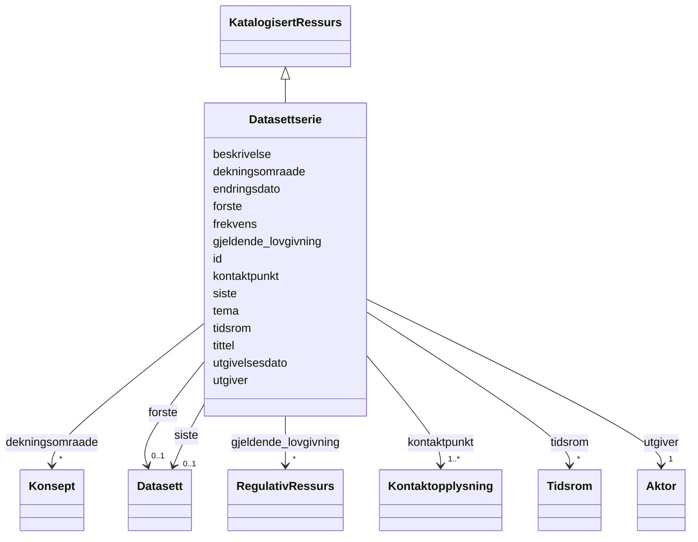

# Class: Datasettserie 


_Ei serie av relaterte datasett publisert separat men med felles metadata._


URI: [dcat:DatasetSeries](http://www.w3.org/ns/dcat#DatasetSeries)





## Inheritance
* [KatalogisertRessurs](katalogisertressurs.md)
    * **Datasettserie**


## Class Properties

| Property | Value |
| --- | --- |
| Class URI | [dcat:DatasetSeries](http://www.w3.org/ns/dcat#DatasetSeries) |


## Eigenskapar


  
  
    
  

  
  
    
  

  
  
    
  

  
  
    
  

  
  
    
  

  
  

  
  

  
  

  
  

  
  

  
  

  
  

  
  


### Obligatorisk

| Namn | Kardinalitet og domene | Beskriving |
| --- | --- | --- |
| [beskrivelse](beskrivelse.md) | 1..* <br/> [LangString](langstring.md) | Fritekstbeskrivelse av ressursen (dct:description) |
| [kontaktpunkt](kontaktpunkt.md) | 1..* <br/> [Kontaktopplysning](kontaktopplysning.md) | Kontaktinformasjon for hendvendelsar om ressursen |
| [tema](tema.md) | 1..* <br/> [String](string.md) | Tema frå eit kontrollert vokabular |
| [tittel](tittel.md) | 1..* <br/> [LangString](langstring.md) | Namn/tittel på ressursen (dct:title) |
| [utgiver](utgiver.md) | 1 <br/> [Aktor](aktor.md) | Aktøren som er ansvarleg for å tilgjengeleggjere ressursen |


  
  

  
  

  
  

  
  

  
  

  
  
    
  

  
  
    
  

  
  
    
  

  
  
    
  

  
  

  
  

  
  

  
  


### Anbefalt

| Namn | Kardinalitet og domene | Beskriving |
| --- | --- | --- |
| [dekningsomraade](dekningsomraade.md) | * <br/> [Konsept](konsept.md) | Geografisk dekningsområde (dct:spatial) |
| [gjeldende_lovgivning](gjeldende_lovgivning.md) | * <br/> [RegulativRessurs](regulativressurs.md) | Lovgjeving som gjeld for ressursen |
| [siste](siste.md) | 0..1 <br/> [Datasett](datasett.md) | Siste datasett i ei datasettserie |
| [tidsrom](tidsrom.md) | * <br/> [Tidsrom](tidsrom.md) | Tidsperiode ressursen dekkar |


  
  

  
  

  
  

  
  

  
  

  
  

  
  

  
  

  
  

  
  

  
  

  
  

  
  


  
  
  
    
      
    
      
    
      
    
  
  

  
  
  
    
      
    
      
    
      
    
  
  

  
  
  
    
      
    
      
    
      
    
  
  

  
  
  
    
      
    
      
    
      
    
  
  

  
  
  
    
      
    
      
    
      
    
  
  

  
  
  
    
      
    
      
    
      
    
  
  

  
  
  
    
      
    
      
    
      
    
  
  

  
  
  
    
      
    
      
    
      
    
  
  

  
  
  
    
      
    
      
    
      
    
  
  

  
  
  
  
    
  

  
  
  
  
    
  

  
  
  
  
    
  

  
  
  
  
    
  


### Andre

| Namn | Kardinalitet og domene | Beskriving |
| --- | --- | --- |
| [endringsdato](endringsdato.md) | 0..1 <br/> [Date](date.md) | Dato for siste endring av ressursen (dct:modified) |
| [frekvens](frekvens.md) | 0..1 <br/> [String](string.md) | Oppdateringsfrekvens for datasettet |
| [forste](forste.md) | 0..1 <br/> [Datasett](datasett.md) | Første datasett i ei datasettserie |
| [utgivelsesdato](utgivelsesdato.md) | 0..1 <br/> [Date](date.md) | Dato ressursen vart første gong publisert (dct:issued) |


### Arva

| Namn | Kardinalitet og domene | Beskriving | Frå |
| --- | --- | --- | --- || [id](id.md) | 1 <br/> [Uriorcurie](uriorcurie.md) | URI-identifikator for ressursen | [KatalogisertRessurs](katalogisertressurs.md) |


## Usages

| used by | used in | type | used |
| ---  | --- | --- | --- |
| [Datasett](datasett.md) | [i_serie](i_serie.md) | range | [Datasettserie](datasettserie.md) |


## Identifier and Mapping Information


### Schema Source


* from schema: https://example.no/ontology/samt-bu-skole


## Mappings

| Mapping Type | Mapped Value |
| ---  | ---  |
| self | dcat:DatasetSeries |
| native | samtbuskole:Datasettserie |


## LinkML Source

<!-- TODO: investigate https://stackoverflow.com/questions/37606292/how-to-create-tabbed-code-blocks-in-mkdocs-or-sphinx -->

### Direct

<details>
```yaml
name: Datasettserie
description: Ei serie av relaterte datasett publisert separat men med felles metadata.
from_schema: https://example.no/ontology/samt-bu-skole
is_a: KatalogisertRessurs
slots:
- beskrivelse
- kontaktpunkt
- tema
- tittel
- utgiver
- dekningsomraade
- gjeldende_lovgivning
- siste
- tidsrom
- endringsdato
- frekvens
- forste
- utgivelsesdato
slot_usage:
  beskrivelse:
    name: beskrivelse
    in_subset:
    - Obligatorisk
    required: true
  kontaktpunkt:
    name: kontaktpunkt
    in_subset:
    - Obligatorisk
    required: true
  tema:
    name: tema
    in_subset:
    - Obligatorisk
    required: true
  tittel:
    name: tittel
    in_subset:
    - Obligatorisk
    required: true
  utgiver:
    name: utgiver
    in_subset:
    - Obligatorisk
    required: true
  dekningsomraade:
    name: dekningsomraade
    in_subset:
    - Anbefalt
  gjeldende_lovgivning:
    name: gjeldende_lovgivning
    in_subset:
    - Anbefalt
  siste:
    name: siste
    in_subset:
    - Anbefalt
  tidsrom:
    name: tidsrom
    in_subset:
    - Anbefalt
class_uri: dcat:DatasetSeries

```
</details>

### Induced

<details>
```yaml
name: Datasettserie
description: Ei serie av relaterte datasett publisert separat men med felles metadata.
from_schema: https://example.no/ontology/samt-bu-skole
is_a: KatalogisertRessurs
slot_usage:
  beskrivelse:
    name: beskrivelse
    in_subset:
    - Obligatorisk
    required: true
  kontaktpunkt:
    name: kontaktpunkt
    in_subset:
    - Obligatorisk
    required: true
  tema:
    name: tema
    in_subset:
    - Obligatorisk
    required: true
  tittel:
    name: tittel
    in_subset:
    - Obligatorisk
    required: true
  utgiver:
    name: utgiver
    in_subset:
    - Obligatorisk
    required: true
  dekningsomraade:
    name: dekningsomraade
    in_subset:
    - Anbefalt
  gjeldende_lovgivning:
    name: gjeldende_lovgivning
    in_subset:
    - Anbefalt
  siste:
    name: siste
    in_subset:
    - Anbefalt
  tidsrom:
    name: tidsrom
    in_subset:
    - Anbefalt
attributes:
  beskrivelse:
    name: beskrivelse
    description: Fritekstbeskrivelse av ressursen (dct:description).
    in_subset:
    - Obligatorisk
    from_schema: https://example.no/ontology/samt-bu-skole
    rank: 1000
    slot_uri: dct:description
    alias: beskrivelse
    owner: Datasettserie
    domain_of:
    - RegulativRessurs
    - Gebyr
    - Distribusjon
    - Datasett
    - Datasettserie
    - Datatjeneste
    - Katalogpost
    - Katalog
    range: LangString
    required: true
    multivalued: true
  kontaktpunkt:
    name: kontaktpunkt
    description: Kontaktinformasjon for hendvendelsar om ressursen.
    in_subset:
    - Obligatorisk
    from_schema: https://example.no/ontology/samt-bu-skole
    rank: 1000
    slot_uri: dcat:contactPoint
    alias: kontaktpunkt
    owner: Datasettserie
    domain_of:
    - Datasett
    - Datasettserie
    - Datatjeneste
    - Katalog
    range: Kontaktopplysning
    required: true
    multivalued: true
  tema:
    name: tema
    description: Tema frå eit kontrollert vokabular.
    in_subset:
    - Obligatorisk
    from_schema: https://example.no/ontology/samt-bu-skole
    rank: 1000
    slot_uri: dcat:theme
    alias: tema
    owner: Datasettserie
    domain_of:
    - Datasett
    - Datasettserie
    - Datatjeneste
    range: string
    required: true
    multivalued: true
  tittel:
    name: tittel
    description: Namn/tittel på ressursen (dct:title).
    in_subset:
    - Obligatorisk
    from_schema: https://example.no/ontology/samt-bu-skole
    rank: 1000
    slot_uri: dct:title
    alias: tittel
    owner: Datasettserie
    domain_of:
    - RegulativRessurs
    - Distribusjon
    - Datasett
    - Datasettserie
    - Datatjeneste
    - Katalogpost
    - Katalog
    - Standard
    range: LangString
    required: true
    multivalued: true
  utgiver:
    name: utgiver
    description: Aktøren som er ansvarleg for å tilgjengeleggjere ressursen.
    in_subset:
    - Obligatorisk
    from_schema: https://example.no/ontology/samt-bu-skole
    rank: 1000
    slot_uri: dct:publisher
    alias: utgiver
    owner: Datasettserie
    domain_of:
    - Datasett
    - Datasettserie
    - Datatjeneste
    - Katalog
    range: Aktor
    required: true
  dekningsomraade:
    name: dekningsomraade
    description: Geografisk dekningsområde (dct:spatial).
    in_subset:
    - Anbefalt
    from_schema: https://example.no/ontology/samt-bu-skole
    rank: 1000
    slot_uri: dct:spatial
    alias: dekningsomraade
    owner: Datasettserie
    domain_of:
    - Datasett
    - Datasettserie
    - Katalog
    range: Konsept
    multivalued: true
  gjeldende_lovgivning:
    name: gjeldende_lovgivning
    description: Lovgjeving som gjeld for ressursen.
    in_subset:
    - Anbefalt
    from_schema: https://example.no/ontology/samt-bu-skole
    rank: 1000
    slot_uri: dcatap:applicableLegislation
    alias: gjeldende_lovgivning
    owner: Datasettserie
    domain_of:
    - Distribusjon
    - Datasett
    - Datasettserie
    - Datatjeneste
    - Katalog
    range: RegulativRessurs
    multivalued: true
  siste:
    name: siste
    description: Siste datasett i ei datasettserie.
    in_subset:
    - Anbefalt
    from_schema: https://example.no/ontology/samt-bu-skole
    rank: 1000
    slot_uri: dcat:last
    alias: siste
    owner: Datasettserie
    domain_of:
    - Datasettserie
    range: Datasett
  tidsrom:
    name: tidsrom
    description: Tidsperiode ressursen dekkar.
    in_subset:
    - Anbefalt
    from_schema: https://example.no/ontology/samt-bu-skole
    rank: 1000
    slot_uri: dct:temporal
    alias: tidsrom
    owner: Datasettserie
    domain_of:
    - Datasett
    - Datasettserie
    - Katalog
    range: Tidsrom
    multivalued: true
  endringsdato:
    name: endringsdato
    description: Dato for siste endring av ressursen (dct:modified).
    from_schema: https://example.no/ontology/samt-bu-skole
    rank: 1000
    slot_uri: dct:modified
    alias: endringsdato
    owner: Datasettserie
    domain_of:
    - Distribusjon
    - Datasett
    - Datasettserie
    - Katalogpost
    - Katalog
    range: date
  frekvens:
    name: frekvens
    annotations:
      gyldige_verdier:
        tag: gyldige_verdier
        value: dct:Frequency
    description: Oppdateringsfrekvens for datasettet.
    from_schema: https://example.no/ontology/samt-bu-skole
    rank: 1000
    slot_uri: dct:accrualPeriodicity
    alias: frekvens
    owner: Datasettserie
    domain_of:
    - Datasettserie
    range: string
  forste:
    name: forste
    description: Første datasett i ei datasettserie.
    from_schema: https://example.no/ontology/samt-bu-skole
    rank: 1000
    slot_uri: dcat:first
    alias: forste
    owner: Datasettserie
    domain_of:
    - Datasettserie
    range: Datasett
  utgivelsesdato:
    name: utgivelsesdato
    description: Dato ressursen vart første gong publisert (dct:issued).
    from_schema: https://example.no/ontology/samt-bu-skole
    rank: 1000
    slot_uri: dct:issued
    alias: utgivelsesdato
    owner: Datasettserie
    domain_of:
    - Distribusjon
    - Datasett
    - Datasettserie
    - Katalogpost
    - Katalog
    range: date
  id:
    name: id
    description: URI-identifikator for ressursen.
    from_schema: https://example.no/ontology/samt-bu-skole
    rank: 1000
    identifier: true
    alias: id
    owner: Datasettserie
    domain_of:
    - Spraak
    - Mediatype
    - Konsept
    - Begrepssamling
    - KatalogisertRessurs
    - Aktor
    - Kontaktopplysning
    - Tidsrom
    - RegulativRessurs
    - Identifikator
    - Rettighetserklaring
    - Sjekksum
    - Gebyr
    - Relasjon
    - Distribusjon
    - Datasett
    - Katalogpost
    - Kvalitetsdimensjon
    - Kvalitetsmaal
    - Kvalitetsmerknad
    - Kvalitetsmaaling
    - Standard
    - Tekstdel
    range: uriorcurie
    required: true
class_uri: dcat:DatasetSeries

```
</details>