# Class: Distribusjon 


_Ein spesifikk representasjon/nedlastbar form av eit datasett._


URI: [dcat:Distribution](http://www.w3.org/ns/dcat#Distribution)

```mermaid
 classDiagram
    class Distribusjon
    click Distribusjon href "../Distribusjon/"
      Distribusjon : beskrivelse
        
          
    
        
        
        Distribusjon --> "*" LangString : beskrivelse
        click LangString href "../LangString/"
    

        
      Distribusjon : dokumentasjon
        
          
    
        
        
        Distribusjon --> "*" Uri : dokumentasjon
        click Uri href "../http://www.w3.org/2001/XMLSchema#anyURI/"
    

        
      Distribusjon : endringsdato
        
          
    
        
        
        Distribusjon --> "0..1" Date : endringsdato
        click Date href "../http://www.w3.org/2001/XMLSchema#date/"
    

        
      Distribusjon : filstorrelse
        
          
    
        
        
        Distribusjon --> "0..1" NonNegativeInteger : filstorrelse
        click NonNegativeInteger href "../NonNegativeInteger/"
    

        
      Distribusjon : format
        
          
    
        
        
        Distribusjon --> "0..1" String : format
        click String href "../http://www.w3.org/2001/XMLSchema#string/"
    

        
      Distribusjon : gjeldende_lovgivning
        
          
    
        
        
        Distribusjon --> "*" RegulativRessurs : gjeldende_lovgivning
        click RegulativRessurs href "../RegulativRessurs/"
    

        
      Distribusjon : i_samsvar_med
        
          
    
        
        
        Distribusjon --> "*" Standard : i_samsvar_med
        click Standard href "../Standard/"
    

        
      Distribusjon : id
        
          
    
        
        
        Distribusjon --> "1" Uriorcurie : id
        click Uriorcurie href "../http://www.w3.org/2001/XMLSchema#anyURI/"
    

        
      Distribusjon : komprimeringsformat
        
          
    
        
        
        Distribusjon --> "0..1" Mediatype : komprimeringsformat
        click Mediatype href "../Mediatype/"
    

        
      Distribusjon : lisens
        
          
    
        
        
        Distribusjon --> "0..1" String : lisens
        click String href "../http://www.w3.org/2001/XMLSchema#string/"
    

        
      Distribusjon : medietype
        
          
    
        
        
        Distribusjon --> "0..1" Mediatype : medietype
        click Mediatype href "../Mediatype/"
    

        
      Distribusjon : nedlastningslenke
        
          
    
        
        
        Distribusjon --> "*" Uri : nedlastningslenke
        click Uri href "../http://www.w3.org/2001/XMLSchema#anyURI/"
    

        
      Distribusjon : pakkeformat
        
          
    
        
        
        Distribusjon --> "0..1" Mediatype : pakkeformat
        click Mediatype href "../Mediatype/"
    

        
      Distribusjon : policy
        
          
    
        
        
        Distribusjon --> "0..1" String : policy
        click String href "../http://www.w3.org/2001/XMLSchema#string/"
    

        
      Distribusjon : rettigheter
        
          
    
        
        
        Distribusjon --> "0..1" Rettighetserklaring : rettigheter
        click Rettighetserklaring href "../Rettighetserklaring/"
    

        
      Distribusjon : sjekksum
        
          
    
        
        
        Distribusjon --> "0..1" Sjekksum : sjekksum
        click Sjekksum href "../Sjekksum/"
    

        
      Distribusjon : spraak
        
          
    
        
        
        Distribusjon --> "*" Spraak : spraak
        click Spraak href "../Spraak/"
    

        
      Distribusjon : status
        
          
    
        
        
        Distribusjon --> "0..1" Konsept : status
        click Konsept href "../Konsept/"
    

        
      Distribusjon : tidsopplosning
        
          
    
        
        
        Distribusjon --> "0..1" Duration : tidsopplosning
        click Duration href "../Duration/"
    

        
      Distribusjon : tilgangs_url
        
          
    
        
        
        Distribusjon --> "1..*" Uri : tilgangs_url
        click Uri href "../http://www.w3.org/2001/XMLSchema#anyURI/"
    

        
      Distribusjon : tilgangstjeneste
        
          
    
        
        
        Distribusjon --> "*" Datatjeneste : tilgangstjeneste
        click Datatjeneste href "../Datatjeneste/"
    

        
      Distribusjon : tilgjengelighet
        
          
    
        
        
        Distribusjon --> "0..1" String : tilgjengelighet
        click String href "../http://www.w3.org/2001/XMLSchema#string/"
    

        
      Distribusjon : tittel
        
          
    
        
        
        Distribusjon --> "*" LangString : tittel
        click LangString href "../LangString/"
    

        
      Distribusjon : utgivelsesdato
        
          
    
        
        
        Distribusjon --> "0..1" Date : utgivelsesdato
        click Date href "../http://www.w3.org/2001/XMLSchema#date/"
    

        
      
```





<!-- no inheritance hierarchy -->

## Class Properties

| Property | Value |
| --- | --- |
| Class URI | [dcat:Distribution](http://www.w3.org/ns/dcat#Distribution) |


## Eigenskapar


  
  

  
  
    
  

  
  

  
  

  
  

  
  

  
  

  
  

  
  

  
  

  
  

  
  

  
  

  
  

  
  

  
  

  
  

  
  

  
  

  
  

  
  

  
  

  
  

  
  


### Obligatorisk

| Namn | Kardinalitet og domene | Beskriving |
| --- | --- | --- |
| [tilgangs_url](tilgangs_url.md) | 1..* <br/> [xsd:anyURI](http://www.w3.org/2001/XMLSchema#anyURI) | URL for tilgang til distribusjonen |


  
  

  
  

  
  
    
  

  
  
    
  

  
  
    
  

  
  
    
  

  
  
    
  

  
  

  
  

  
  

  
  

  
  

  
  

  
  

  
  

  
  

  
  

  
  

  
  

  
  

  
  

  
  

  
  

  
  


### Anbefalt

| Namn | Kardinalitet og domene | Beskriving |
| --- | --- | --- |
| [beskrivelse](beskrivelse.md) | * <br/> [LangString](langstring.md) | Fritekstbeskrivelse av ressursen (dct:description) |
| [format](format.md) | 0..1 <br/> [xsd:string](http://www.w3.org/2001/XMLSchema#string) | Filformat eller medietype (dct:format) |
| [lisens](lisens.md) | 0..1 <br/> [xsd:string](http://www.w3.org/2001/XMLSchema#string) | Lisens for bruk av ressursen |
| [status](status.md) | 0..1 <br/> [Konsept](konsept.md) | Status for ressursen frå eit kontrollert vokabular (adms:status) |
| [tilgjengelighet](tilgjengelighet.md) | 0..1 <br/> [xsd:string](http://www.w3.org/2001/XMLSchema#string) | Planlagt tilgjengelegheit for ressursen |


  
  

  
  

  
  

  
  

  
  

  
  

  
  

  
  

  
  

  
  

  
  

  
  

  
  

  
  

  
  

  
  

  
  

  
  

  
  

  
  

  
  

  
  

  
  

  
  


  
  
  
  
    
  

  
  
  
    
      
    
      
    
      
    
  
  

  
  
  
    
      
    
      
    
      
    
  
  

  
  
  
    
      
    
      
    
      
    
  
  

  
  
  
    
      
    
      
    
      
    
  
  

  
  
  
    
      
    
      
    
      
    
  
  

  
  
  
    
      
    
      
    
      
    
  
  

  
  
  
  
    
  

  
  
  
  
    
  

  
  
  
  
    
  

  
  
  
  
    
  

  
  
  
  
    
  

  
  
  
  
    
  

  
  
  
  
    
  

  
  
  
  
    
  

  
  
  
  
    
  

  
  
  
  
    
  

  
  
  
  
    
  

  
  
  
  
    
  

  
  
  
  
    
  

  
  
  
  
    
  

  
  
  
  
    
  

  
  
  
  
    
  

  
  
  
  
    
  


### Andre

| Namn | Kardinalitet og domene | Beskriving |
| --- | --- | --- |
| [id](id.md) | 1 <br/> [xsd:anyURI](http://www.w3.org/2001/XMLSchema#anyURI) | URI-identifikator for ressursen |
| [dokumentasjon](dokumentasjon.md) | * <br/> [xsd:anyURI](http://www.w3.org/2001/XMLSchema#anyURI) | Lenke til dokumentasjon om ressursen |
| [endringsdato](endringsdato.md) | 0..1 <br/> [xsd:date](http://www.w3.org/2001/XMLSchema#date) | Dato for siste endring av ressursen (dct:modified) |
| [filstorrelse](filstorrelse.md) | 0..1 <br/> [NonNegativeInteger](nonnegativeinteger.md) | Filstørrelse i bytes |
| [gjeldende_lovgivning](gjeldende_lovgivning.md) | * <br/> [RegulativRessurs](regulativressurs.md) | Lovgjeving som gjeld for ressursen |
| [i_samsvar_med](i_samsvar_med.md) | * <br/> [Standard](standard.md) | Standard ressursen er i samsvar med |
| [komprimeringsformat](komprimeringsformat.md) | 0..1 <br/> [Mediatype](mediatype.md) | Komprimeringsformat brukt i distribusjonen |
| [medietype](medietype.md) | 0..1 <br/> [Mediatype](mediatype.md) | Medietype i samsvar med IANA-registeret |
| [nedlastningslenke](nedlastningslenke.md) | * <br/> [xsd:anyURI](http://www.w3.org/2001/XMLSchema#anyURI) | Direkte nedlastingslenke for distribusjonsfila |
| [pakkeformat](pakkeformat.md) | 0..1 <br/> [Mediatype](mediatype.md) | Pakkeformat brukt i distribusjonen |
| [policy](policy.md) | 0..1 <br/> [xsd:string](http://www.w3.org/2001/XMLSchema#string) | ODRL-policy som regulerer bruk av ressursen |
| [rettigheter](rettigheter.md) | 0..1 <br/> [Rettighetserklaring](rettighetserklaring.md) | Rettar knytte til ressursen |
| [sjekksum](sjekksum.md) | 0..1 <br/> [Sjekksum](sjekksum.md) | Sjekksum for distribusjonsfila |
| [spraak](spraak.md) | * <br/> [Spraak](spraak.md) | Språk brukt i ressursen (dct:language) |
| [tidsopplosning](tidsopplosning.md) | 0..1 <br/> [Duration](duration.md) | Minste tidsoppløysing i datasettet |
| [tilgangstjeneste](tilgangstjeneste.md) | * <br/> [Datatjeneste](datatjeneste.md) | Datatjeneste som gjev tilgang til distribusjonen |
| [tittel](tittel.md) | * <br/> [LangString](langstring.md) | Namn/tittel på ressursen (dct:title) |
| [utgivelsesdato](utgivelsesdato.md) | 0..1 <br/> [xsd:date](http://www.w3.org/2001/XMLSchema#date) | Dato ressursen vart første gong publisert (dct:issued) |


## Usages

| used by | used in | type | used |
| ---  | --- | --- | --- |
| [Datasett](datasett.md) | [datasettdistribusjon](datasettdistribusjon.md) | range | [Distribusjon](distribusjon.md) |
| [Datasett](datasett.md) | [eksempeldata](eksempeldata.md) | range | [Distribusjon](distribusjon.md) |
| [SamtBuContainer](samtbucontainer.md) | [datasettdistribusjoner](datasettdistribusjoner.md) | range | [Distribusjon](distribusjon.md) |


## Identifier and Mapping Information


### Schema Source


* from schema: https://data.norge.no/linkml/dcat-ap-no


## Mappings

| Mapping Type | Mapped Value |
| ---  | ---  |
| self | dcat:Distribution |
| native | https://data.norge.no/linkml/dcat-ap-no/Distribusjon |


## LinkML Source

<!-- TODO: investigate https://stackoverflow.com/questions/37606292/how-to-create-tabbed-code-blocks-in-mkdocs-or-sphinx -->

### Direct

<details>
```yaml
name: Distribusjon
description: Ein spesifikk representasjon/nedlastbar form av eit datasett.
from_schema: https://data.norge.no/linkml/dcat-ap-no
slots:
- id
- tilgangs_url
- beskrivelse
- format
- lisens
- status
- tilgjengelighet
- dokumentasjon
- endringsdato
- filstorrelse
- gjeldende_lovgivning
- i_samsvar_med
- komprimeringsformat
- medietype
- nedlastningslenke
- pakkeformat
- policy
- rettigheter
- sjekksum
- spraak
- tidsopplosning
- tilgangstjeneste
- tittel
- utgivelsesdato
slot_usage:
  tilgangs_url:
    name: tilgangs_url
    in_subset:
    - Obligatorisk
    required: true
  beskrivelse:
    name: beskrivelse
    in_subset:
    - Anbefalt
  format:
    name: format
    in_subset:
    - Anbefalt
  lisens:
    name: lisens
    in_subset:
    - Anbefalt
  status:
    name: status
    in_subset:
    - Anbefalt
  tilgjengelighet:
    name: tilgjengelighet
    in_subset:
    - Anbefalt
class_uri: dcat:Distribution

```
</details>

### Induced

<details>
```yaml
name: Distribusjon
description: Ein spesifikk representasjon/nedlastbar form av eit datasett.
from_schema: https://data.norge.no/linkml/dcat-ap-no
slot_usage:
  tilgangs_url:
    name: tilgangs_url
    in_subset:
    - Obligatorisk
    required: true
  beskrivelse:
    name: beskrivelse
    in_subset:
    - Anbefalt
  format:
    name: format
    in_subset:
    - Anbefalt
  lisens:
    name: lisens
    in_subset:
    - Anbefalt
  status:
    name: status
    in_subset:
    - Anbefalt
  tilgjengelighet:
    name: tilgjengelighet
    in_subset:
    - Anbefalt
attributes:
  id:
    name: id
    description: URI-identifikator for ressursen.
    from_schema: https://data.norge.no/linkml/common-ap-no
    identifier: true
    owner: Distribusjon
    domain_of:
    - KatalogisertRessurs
    - Aktor
    - Kontaktopplysning
    - Tidsrom
    - RegulativRessurs
    - Identifikator
    - Rettighetserklaring
    - Sjekksum
    - Gebyr
    - Relasjon
    - Distribusjon
    - Datasett
    - Katalogpost
    - Mediatype
    - Konsept
    - Begrepssamling
    - Kvalitetsdimensjon
    - Kvalitetsmaal
    - Kvalitetsmerknad
    - Kvalitetsmaaling
    - Standard
    - Tekstdel
    - SamtBuContainer
    - Skole
    - Skoleeier
    - Basisgruppe
    - Person
    range: uriorcurie
    required: true
  tilgangs_url:
    name: tilgangs_url
    description: URL for tilgang til distribusjonen.
    in_subset:
    - Obligatorisk
    from_schema: https://data.norge.no/linkml/dcat-ap-no
    slot_uri: dcat:accessURL
    owner: Distribusjon
    domain_of:
    - Distribusjon
    range: uri
    required: true
    multivalued: true
  beskrivelse:
    name: beskrivelse
    description: Fritekstbeskrivelse av ressursen (dct:description).
    in_subset:
    - Anbefalt
    from_schema: https://data.norge.no/linkml/common-ap-no
    slot_uri: dct:description
    owner: Distribusjon
    domain_of:
    - RegulativRessurs
    - Gebyr
    - Distribusjon
    - Datasett
    - Datasettserie
    - Datatjeneste
    - Katalogpost
    - Katalog
    range: LangString
    multivalued: true
  format:
    name: format
    description: Filformat eller medietype (dct:format).
    in_subset:
    - Anbefalt
    from_schema: https://data.norge.no/linkml/common-ap-no
    slot_uri: dct:format
    owner: Distribusjon
    domain_of:
    - Distribusjon
    - Datatjeneste
    - Tekstdel
    range: string
  lisens:
    name: lisens
    description: Lisens for bruk av ressursen.
    in_subset:
    - Anbefalt
    from_schema: https://data.norge.no/linkml/dcat-ap-no
    slot_uri: dct:license
    owner: Distribusjon
    domain_of:
    - Distribusjon
    - Datatjeneste
    - Katalog
    range: string
  status:
    name: status
    description: Status for ressursen frå eit kontrollert vokabular (adms:status).
    in_subset:
    - Anbefalt
    from_schema: https://data.norge.no/linkml/common-ap-no
    slot_uri: adms:status
    owner: Distribusjon
    domain_of:
    - Distribusjon
    - Datatjeneste
    - Katalogpost
    range: Konsept
  tilgjengelighet:
    name: tilgjengelighet
    description: Planlagt tilgjengelegheit for ressursen.
    in_subset:
    - Anbefalt
    from_schema: https://data.norge.no/linkml/dcat-ap-no
    slot_uri: dcatap:availability
    owner: Distribusjon
    domain_of:
    - Distribusjon
    - Datatjeneste
    range: string
  dokumentasjon:
    name: dokumentasjon
    description: Lenke til dokumentasjon om ressursen.
    from_schema: https://data.norge.no/linkml/dcat-ap-no
    slot_uri: foaf:page
    owner: Distribusjon
    domain_of:
    - Gebyr
    - Distribusjon
    - Datasett
    - Datatjeneste
    range: uri
    multivalued: true
  endringsdato:
    name: endringsdato
    description: Dato for siste endring av ressursen (dct:modified).
    from_schema: https://data.norge.no/linkml/common-ap-no
    slot_uri: dct:modified
    owner: Distribusjon
    domain_of:
    - Distribusjon
    - Datasett
    - Datasettserie
    - Katalogpost
    - Katalog
    range: date
  filstorrelse:
    name: filstorrelse
    description: Filstørrelse i bytes.
    from_schema: https://data.norge.no/linkml/dcat-ap-no
    slot_uri: dcat:byteSize
    owner: Distribusjon
    domain_of:
    - Distribusjon
    range: NonNegativeInteger
  gjeldende_lovgivning:
    name: gjeldende_lovgivning
    description: Lovgjeving som gjeld for ressursen.
    from_schema: https://data.norge.no/linkml/dcat-ap-no
    slot_uri: dcatap:applicableLegislation
    owner: Distribusjon
    domain_of:
    - Distribusjon
    - Datasett
    - Datasettserie
    - Datatjeneste
    - Katalog
    range: RegulativRessurs
    multivalued: true
  i_samsvar_med:
    name: i_samsvar_med
    description: Standard ressursen er i samsvar med.
    from_schema: https://data.norge.no/linkml/dcat-ap-no
    slot_uri: dct:conformsTo
    owner: Distribusjon
    domain_of:
    - Distribusjon
    - Datasett
    - Datatjeneste
    - Katalogpost
    range: Standard
    multivalued: true
  komprimeringsformat:
    name: komprimeringsformat
    description: Komprimeringsformat brukt i distribusjonen.
    from_schema: https://data.norge.no/linkml/dcat-ap-no
    slot_uri: dcat:compressFormat
    owner: Distribusjon
    domain_of:
    - Distribusjon
    range: Mediatype
  medietype:
    name: medietype
    description: Medietype i samsvar med IANA-registeret.
    from_schema: https://data.norge.no/linkml/dcat-ap-no
    slot_uri: dcat:mediaType
    owner: Distribusjon
    domain_of:
    - Distribusjon
    range: Mediatype
  nedlastningslenke:
    name: nedlastningslenke
    description: Direkte nedlastingslenke for distribusjonsfila.
    from_schema: https://data.norge.no/linkml/dcat-ap-no
    slot_uri: dcat:downloadURL
    owner: Distribusjon
    domain_of:
    - Distribusjon
    range: uri
    multivalued: true
  pakkeformat:
    name: pakkeformat
    description: Pakkeformat brukt i distribusjonen.
    from_schema: https://data.norge.no/linkml/dcat-ap-no
    slot_uri: dcat:packageFormat
    owner: Distribusjon
    domain_of:
    - Distribusjon
    range: Mediatype
  policy:
    name: policy
    annotations:
      gyldige_verdier:
        tag: gyldige_verdier
        value: odrl:Policy
    description: ODRL-policy som regulerer bruk av ressursen.
    from_schema: https://data.norge.no/linkml/dcat-ap-no
    slot_uri: odrl:hasPolicy
    owner: Distribusjon
    domain_of:
    - Distribusjon
    range: string
  rettigheter:
    name: rettigheter
    description: Rettar knytte til ressursen.
    from_schema: https://data.norge.no/linkml/dcat-ap-no
    slot_uri: dct:rights
    owner: Distribusjon
    domain_of:
    - Distribusjon
    - Datatjeneste
    - Katalog
    range: Rettighetserklaring
  sjekksum:
    name: sjekksum
    description: Sjekksum for distribusjonsfila.
    from_schema: https://data.norge.no/linkml/dcat-ap-no
    slot_uri: spdx:checksum
    owner: Distribusjon
    domain_of:
    - Distribusjon
    range: Sjekksum
  spraak:
    name: spraak
    description: Språk brukt i ressursen (dct:language).
    from_schema: https://data.norge.no/linkml/common-ap-no
    slot_uri: dct:language
    owner: Distribusjon
    domain_of:
    - RegulativRessurs
    - Distribusjon
    - Datasett
    - Katalogpost
    - Katalog
    - Tekstdel
    range: Spraak
    multivalued: true
  tidsopplosning:
    name: tidsopplosning
    description: Minste tidsoppløysing i datasettet.
    from_schema: https://data.norge.no/linkml/dcat-ap-no
    slot_uri: dcat:temporalResolution
    owner: Distribusjon
    domain_of:
    - Distribusjon
    range: Duration
  tilgangstjeneste:
    name: tilgangstjeneste
    description: Datatjeneste som gjev tilgang til distribusjonen.
    from_schema: https://data.norge.no/linkml/dcat-ap-no
    slot_uri: dcat:accessService
    owner: Distribusjon
    domain_of:
    - Distribusjon
    range: Datatjeneste
    multivalued: true
  tittel:
    name: tittel
    description: Namn/tittel på ressursen (dct:title).
    from_schema: https://data.norge.no/linkml/common-ap-no
    slot_uri: dct:title
    owner: Distribusjon
    domain_of:
    - RegulativRessurs
    - Distribusjon
    - Datasett
    - Datasettserie
    - Datatjeneste
    - Katalogpost
    - Katalog
    - Standard
    range: LangString
    multivalued: true
  utgivelsesdato:
    name: utgivelsesdato
    description: Dato ressursen vart første gong publisert (dct:issued).
    from_schema: https://data.norge.no/linkml/common-ap-no
    slot_uri: dct:issued
    owner: Distribusjon
    domain_of:
    - Distribusjon
    - Datasett
    - Datasettserie
    - Katalogpost
    - Katalog
    range: date
class_uri: dcat:Distribution

```
</details>