# Class: Katalog 


_Ei kuratert samling av metadata om datasett, datatenestar og/eller andre katalogar._


URI: [dcat:Catalog](http://www.w3.org/ns/dcat#Catalog)

```mermaid
 classDiagram
    class Katalog
    click Katalog href "../Katalog/"
      KatalogisertRessurs <|-- Katalog
        click KatalogisertRessurs href "../KatalogisertRessurs/"
      
      Katalog : beskrivelse
        
          
    
        
        
        Katalog --> "1..*" LangString : beskrivelse
        click LangString href "../LangString/"
    

        
      Katalog : datasett
        
          
    
        
        
        Katalog --> "*" Datasett : datasett
        click Datasett href "../Datasett/"
    

        
      Katalog : datatjeneste
        
          
    
        
        
        Katalog --> "*" Datatjeneste : datatjeneste
        click Datatjeneste href "../Datatjeneste/"
    

        
      Katalog : dekningsomraade
        
          
    
        
        
        Katalog --> "*" Konsept : dekningsomraade
        click Konsept href "../Konsept/"
    

        
      Katalog : endringsdato
        
          
    
        
        
        Katalog --> "0..1" Date : endringsdato
        click Date href "../http://www.w3.org/2001/XMLSchema#date/"
    

        
      Katalog : gjeldende_lovgivning
        
          
    
        
        
        Katalog --> "*" RegulativRessurs : gjeldende_lovgivning
        click RegulativRessurs href "../RegulativRessurs/"
    

        
      Katalog : har_del
        
          
    
        
        
        Katalog --> "*" Katalog : har_del
        click Katalog href "../Katalog/"
    

        
      Katalog : heimeside
        
          
    
        
        
        Katalog --> "*" Uri : heimeside
        click Uri href "../http://www.w3.org/2001/XMLSchema#anyURI/"
    

        
      Katalog : id
        
          
    
        
        
        Katalog --> "1" Uriorcurie : id
        click Uriorcurie href "../http://www.w3.org/2001/XMLSchema#anyURI/"
    

        
      Katalog : identifikator_literal
        
          
    
        
        
        Katalog --> "0..1" String : identifikator_literal
        click String href "../http://www.w3.org/2001/XMLSchema#string/"
    

        
      Katalog : katalogpost
        
          
    
        
        
        Katalog --> "*" Katalogpost : katalogpost
        click Katalogpost href "../Katalogpost/"
    

        
      Katalog : kontaktpunkt
        
          
    
        
        
        Katalog --> "1..*" Kontaktopplysning : kontaktpunkt
        click Kontaktopplysning href "../Kontaktopplysning/"
    

        
      Katalog : lisens
        
          
    
        
        
        Katalog --> "0..1" String : lisens
        click String href "../http://www.w3.org/2001/XMLSchema#string/"
    

        
      Katalog : produsent
        
          
    
        
        
        Katalog --> "0..1" Aktor : produsent
        click Aktor href "../Aktor/"
    

        
      Katalog : rettigheter
        
          
    
        
        
        Katalog --> "0..1" Rettighetserklaring : rettigheter
        click Rettighetserklaring href "../Rettighetserklaring/"
    

        
      Katalog : spraak
        
          
    
        
        
        Katalog --> "*" Spraak : spraak
        click Spraak href "../Spraak/"
    

        
      Katalog : temaer
        
          
    
        
        
        Katalog --> "*" Begrepssamling : temaer
        click Begrepssamling href "../Begrepssamling/"
    

        
      Katalog : tidsrom
        
          
    
        
        
        Katalog --> "*" Tidsrom : tidsrom
        click Tidsrom href "../Tidsrom/"
    

        
      Katalog : tittel
        
          
    
        
        
        Katalog --> "1..*" LangString : tittel
        click LangString href "../LangString/"
    

        
      Katalog : underkatalog
        
          
    
        
        
        Katalog --> "*" Katalog : underkatalog
        click Katalog href "../Katalog/"
    

        
      Katalog : utgivelsesdato
        
          
    
        
        
        Katalog --> "0..1" Date : utgivelsesdato
        click Date href "../http://www.w3.org/2001/XMLSchema#date/"
    

        
      Katalog : utgiver
        
          
    
        
        
        Katalog --> "1" Aktor : utgiver
        click Aktor href "../Aktor/"
    

        
      
```





## Inheritance
* [KatalogisertRessurs](katalogisertressurs.md)
    * **Katalog**


## Class Properties

| Property | Value |
| --- | --- |
| Class URI | [dcat:Catalog](http://www.w3.org/ns/dcat#Catalog) |


## Eigenskapar


  
  
    
  

  
  
    
  

  
  
    
  

  
  
    
  

  
  

  
  

  
  

  
  

  
  

  
  

  
  

  
  

  
  

  
  

  
  

  
  

  
  

  
  

  
  

  
  

  
  


### Obligatorisk

| Namn | Kardinalitet og domene | Beskriving |
| --- | --- | --- |
| [beskrivelse](beskrivelse.md) | 1..* <br/> [LangString](langstring.md) | Fritekstbeskrivelse av ressursen (dct:description) |
| [kontaktpunkt](kontaktpunkt.md) | 1..* <br/> [Kontaktopplysning](kontaktopplysning.md) | Kontaktinformasjon for hendvendelsar om ressursen |
| [tittel](tittel.md) | 1..* <br/> [LangString](langstring.md) | Namn/tittel på ressursen (dct:title) |
| [utgiver](utgiver.md) | 1 <br/> [Aktor](aktor.md) | Aktøren som er ansvarleg for å tilgjengeleggjere ressursen |


  
  

  
  

  
  

  
  

  
  
    
  

  
  
    
  

  
  
    
  

  
  
    
  

  
  
    
  

  
  
    
  

  
  
    
  

  
  
    
  

  
  
    
  

  
  

  
  

  
  

  
  

  
  

  
  

  
  

  
  


### Anbefalt

| Namn | Kardinalitet og domene | Beskriving |
| --- | --- | --- |
| [datasett](datasett.md) | * <br/> [Datasett](datasett.md) | Datasett som er del av katalogen |
| [datatjeneste](datatjeneste.md) | * <br/> [Datatjeneste](datatjeneste.md) | Datatjeneste som er del av katalogen |
| [dekningsomraade](dekningsomraade.md) | * <br/> [Konsept](konsept.md) | Geografisk dekningsområde (dct:spatial) |
| [endringsdato](endringsdato.md) | 0..1 <br/> [xsd:date](http://www.w3.org/2001/XMLSchema#date) | Dato for siste endring av ressursen (dct:modified) |
| [heimeside](heimeside.md) | * <br/> [xsd:anyURI](http://www.w3.org/2001/XMLSchema#anyURI) | Heimeside for ressursen eller organisasjonen (foaf:homepage) |
| [lisens](lisens.md) | 0..1 <br/> [xsd:string](http://www.w3.org/2001/XMLSchema#string) | Lisens for bruk av ressursen |
| [spraak](spraak.md) | * <br/> [Spraak](spraak.md) | Språk brukt i ressursen (dct:language) |
| [temaer](temaer.md) | * <br/> [Begrepssamling](begrepssamling.md) | Temavokabular som vert brukt i katalogen |
| [utgivelsesdato](utgivelsesdato.md) | 0..1 <br/> [xsd:date](http://www.w3.org/2001/XMLSchema#date) | Dato ressursen vart første gong publisert (dct:issued) |


  
  

  
  

  
  

  
  

  
  

  
  

  
  

  
  

  
  

  
  

  
  

  
  

  
  

  
  

  
  

  
  

  
  

  
  

  
  

  
  

  
  


  
  
  
    
      
    
      
    
      
    
  
  

  
  
  
    
      
    
      
    
      
    
  
  

  
  
  
    
      
    
      
    
      
    
  
  

  
  
  
    
      
    
      
    
      
    
  
  

  
  
  
    
      
    
      
    
      
    
  
  

  
  
  
    
      
    
      
    
      
    
  
  

  
  
  
    
      
    
      
    
      
    
  
  

  
  
  
    
      
    
      
    
      
    
  
  

  
  
  
    
      
    
      
    
      
    
  
  

  
  
  
    
      
    
      
    
      
    
  
  

  
  
  
    
      
    
      
    
      
    
  
  

  
  
  
    
      
    
      
    
      
    
  
  

  
  
  
    
      
    
      
    
      
    
  
  

  
  
  
  
    
  

  
  
  
  
    
  

  
  
  
  
    
  

  
  
  
  
    
  

  
  
  
  
    
  

  
  
  
  
    
  

  
  
  
  
    
  

  
  
  
  
    
  


### Andre

| Namn | Kardinalitet og domene | Beskriving |
| --- | --- | --- |
| [gjeldende_lovgivning](gjeldende_lovgivning.md) | * <br/> [RegulativRessurs](regulativressurs.md) | Lovgjeving som gjeld for ressursen |
| [har_del](har_del.md) | * <br/> [Katalog](katalog.md) | Delkatalog inkludert i denne katalogen |
| [identifikator_literal](identifikator_literal.md) | 0..1 <br/> [xsd:string](http://www.w3.org/2001/XMLSchema#string) | Tekstleg identifikator for ressursen (dct:identifier) |
| [underkatalog](underkatalog.md) | * <br/> [Katalog](katalog.md) | Katalog som er ein del av denne katalogen |
| [katalogpost](katalogpost.md) | * <br/> [Katalogpost](katalogpost.md) | Katalogpostar i katalogen |
| [produsent](produsent.md) | 0..1 <br/> [Aktor](aktor.md) | Aktøren som primært har skapt ressursen |
| [rettigheter](rettigheter.md) | 0..1 <br/> [Rettighetserklaring](rettighetserklaring.md) | Rettar knytte til ressursen |
| [tidsrom](tidsrom.md) | * <br/> [Tidsrom](tidsrom.md) | Tidsperiode ressursen dekkar |


### Arva

| Namn | Kardinalitet og domene | Beskriving | Frå |
| --- | --- | --- | --- || [id](id.md) | 1 <br/> [xsd:anyURI](http://www.w3.org/2001/XMLSchema#anyURI) | URI-identifikator for ressursen | [KatalogisertRessurs](katalogisertressurs.md) |


## Usages

| used by | used in | type | used |
| ---  | --- | --- | --- |
| [Katalog](katalog.md) | [har_del](har_del.md) | range | [Katalog](katalog.md) |
| [Katalog](katalog.md) | [underkatalog](underkatalog.md) | range | [Katalog](katalog.md) |


## Identifier and Mapping Information


### Schema Source


* from schema: https://data.norge.no/ap-no/dcat-ap-no


## Mappings

| Mapping Type | Mapped Value |
| ---  | ---  |
| self | dcat:Catalog |
| native | https://data.norge.no/ap-no/dcat-ap-no/Katalog |


## LinkML Source

<!-- TODO: investigate https://stackoverflow.com/questions/37606292/how-to-create-tabbed-code-blocks-in-mkdocs-or-sphinx -->

### Direct

<details>
```yaml
name: Katalog
description: Ei kuratert samling av metadata om datasett, datatenestar og/eller andre
  katalogar.
from_schema: https://data.norge.no/ap-no/dcat-ap-no
is_a: KatalogisertRessurs
slots:
- beskrivelse
- kontaktpunkt
- tittel
- utgiver
- datasett
- datatjeneste
- dekningsomraade
- endringsdato
- heimeside
- lisens
- spraak
- temaer
- utgivelsesdato
- gjeldende_lovgivning
- har_del
- identifikator_literal
- underkatalog
- katalogpost
- produsent
- rettigheter
- tidsrom
slot_usage:
  beskrivelse:
    name: beskrivelse
    in_subset:
    - Obligatorisk
    required: true
  kontaktpunkt:
    name: kontaktpunkt
    in_subset:
    - Obligatorisk
    required: true
  tittel:
    name: tittel
    in_subset:
    - Obligatorisk
    required: true
  utgiver:
    name: utgiver
    in_subset:
    - Obligatorisk
    required: true
  datasett:
    name: datasett
    in_subset:
    - Anbefalt
  datatjeneste:
    name: datatjeneste
    in_subset:
    - Anbefalt
  dekningsomraade:
    name: dekningsomraade
    in_subset:
    - Anbefalt
  endringsdato:
    name: endringsdato
    in_subset:
    - Anbefalt
  heimeside:
    name: heimeside
    in_subset:
    - Anbefalt
  lisens:
    name: lisens
    in_subset:
    - Anbefalt
  spraak:
    name: spraak
    in_subset:
    - Anbefalt
  temaer:
    name: temaer
    in_subset:
    - Anbefalt
  utgivelsesdato:
    name: utgivelsesdato
    in_subset:
    - Anbefalt
class_uri: dcat:Catalog

```
</details>

### Induced

<details>
```yaml
name: Katalog
description: Ei kuratert samling av metadata om datasett, datatenestar og/eller andre
  katalogar.
from_schema: https://data.norge.no/ap-no/dcat-ap-no
is_a: KatalogisertRessurs
slot_usage:
  beskrivelse:
    name: beskrivelse
    in_subset:
    - Obligatorisk
    required: true
  kontaktpunkt:
    name: kontaktpunkt
    in_subset:
    - Obligatorisk
    required: true
  tittel:
    name: tittel
    in_subset:
    - Obligatorisk
    required: true
  utgiver:
    name: utgiver
    in_subset:
    - Obligatorisk
    required: true
  datasett:
    name: datasett
    in_subset:
    - Anbefalt
  datatjeneste:
    name: datatjeneste
    in_subset:
    - Anbefalt
  dekningsomraade:
    name: dekningsomraade
    in_subset:
    - Anbefalt
  endringsdato:
    name: endringsdato
    in_subset:
    - Anbefalt
  heimeside:
    name: heimeside
    in_subset:
    - Anbefalt
  lisens:
    name: lisens
    in_subset:
    - Anbefalt
  spraak:
    name: spraak
    in_subset:
    - Anbefalt
  temaer:
    name: temaer
    in_subset:
    - Anbefalt
  utgivelsesdato:
    name: utgivelsesdato
    in_subset:
    - Anbefalt
attributes:
  beskrivelse:
    name: beskrivelse
    description: Fritekstbeskrivelse av ressursen (dct:description).
    in_subset:
    - Obligatorisk
    from_schema: https://data.norge.no/ap-no/common-ap-no
    slot_uri: dct:description
    owner: Katalog
    domain_of:
    - RegulativRessurs
    - Gebyr
    - Distribusjon
    - Datasett
    - Datasettserie
    - Datatjeneste
    - Katalogpost
    - Katalog
    range: LangString
    required: true
    multivalued: true
  kontaktpunkt:
    name: kontaktpunkt
    description: Kontaktinformasjon for hendvendelsar om ressursen.
    in_subset:
    - Obligatorisk
    from_schema: https://data.norge.no/ap-no/dcat-ap-no
    slot_uri: dcat:contactPoint
    owner: Katalog
    domain_of:
    - Datasett
    - Datasettserie
    - Datatjeneste
    - Katalog
    range: Kontaktopplysning
    required: true
    multivalued: true
  tittel:
    name: tittel
    description: Namn/tittel på ressursen (dct:title).
    in_subset:
    - Obligatorisk
    from_schema: https://data.norge.no/ap-no/common-ap-no
    slot_uri: dct:title
    owner: Katalog
    domain_of:
    - RegulativRessurs
    - Distribusjon
    - Datasett
    - Datasettserie
    - Datatjeneste
    - Katalogpost
    - Katalog
    - Standard
    range: LangString
    required: true
    multivalued: true
  utgiver:
    name: utgiver
    description: Aktøren som er ansvarleg for å tilgjengeleggjere ressursen.
    in_subset:
    - Obligatorisk
    from_schema: https://data.norge.no/ap-no/dcat-ap-no
    slot_uri: dct:publisher
    owner: Katalog
    domain_of:
    - Datasett
    - Datasettserie
    - Datatjeneste
    - Katalog
    range: Aktor
    required: true
  datasett:
    name: datasett
    description: Datasett som er del av katalogen.
    in_subset:
    - Anbefalt
    from_schema: https://data.norge.no/ap-no/dcat-ap-no
    slot_uri: dcat:dataset
    owner: Katalog
    domain_of:
    - Katalog
    range: Datasett
    multivalued: true
  datatjeneste:
    name: datatjeneste
    description: Datatjeneste som er del av katalogen.
    in_subset:
    - Anbefalt
    from_schema: https://data.norge.no/ap-no/dcat-ap-no
    slot_uri: dcat:service
    owner: Katalog
    domain_of:
    - Katalog
    range: Datatjeneste
    multivalued: true
  dekningsomraade:
    name: dekningsomraade
    description: Geografisk dekningsområde (dct:spatial).
    in_subset:
    - Anbefalt
    from_schema: https://data.norge.no/ap-no/common-ap-no
    slot_uri: dct:spatial
    owner: Katalog
    domain_of:
    - Datasett
    - Datasettserie
    - Katalog
    range: Konsept
    multivalued: true
  endringsdato:
    name: endringsdato
    description: Dato for siste endring av ressursen (dct:modified).
    in_subset:
    - Anbefalt
    from_schema: https://data.norge.no/ap-no/common-ap-no
    slot_uri: dct:modified
    owner: Katalog
    domain_of:
    - Distribusjon
    - Datasett
    - Datasettserie
    - Katalogpost
    - Katalog
    range: date
  heimeside:
    name: heimeside
    description: Heimeside for ressursen eller organisasjonen (foaf:homepage).
    in_subset:
    - Anbefalt
    from_schema: https://data.norge.no/ap-no/common-ap-no
    slot_uri: foaf:homepage
    owner: Katalog
    domain_of:
    - Katalog
    range: uri
    multivalued: true
  lisens:
    name: lisens
    description: Lisens for bruk av ressursen.
    in_subset:
    - Anbefalt
    from_schema: https://data.norge.no/ap-no/dcat-ap-no
    slot_uri: dct:license
    owner: Katalog
    domain_of:
    - Distribusjon
    - Datatjeneste
    - Katalog
    range: string
  spraak:
    name: spraak
    description: Språk brukt i ressursen (dct:language).
    in_subset:
    - Anbefalt
    from_schema: https://data.norge.no/ap-no/common-ap-no
    slot_uri: dct:language
    owner: Katalog
    domain_of:
    - RegulativRessurs
    - Distribusjon
    - Datasett
    - Katalogpost
    - Katalog
    - Tekstdel
    range: Spraak
    multivalued: true
  temaer:
    name: temaer
    description: Temavokabular som vert brukt i katalogen.
    in_subset:
    - Anbefalt
    from_schema: https://data.norge.no/ap-no/dcat-ap-no
    slot_uri: dcat:themeTaxonomy
    owner: Katalog
    domain_of:
    - Katalog
    range: Begrepssamling
    multivalued: true
  utgivelsesdato:
    name: utgivelsesdato
    description: Dato ressursen vart første gong publisert (dct:issued).
    in_subset:
    - Anbefalt
    from_schema: https://data.norge.no/ap-no/common-ap-no
    slot_uri: dct:issued
    owner: Katalog
    domain_of:
    - Distribusjon
    - Datasett
    - Datasettserie
    - Katalogpost
    - Katalog
    range: date
  gjeldende_lovgivning:
    name: gjeldende_lovgivning
    description: Lovgjeving som gjeld for ressursen.
    from_schema: https://data.norge.no/ap-no/dcat-ap-no
    slot_uri: dcatap:applicableLegislation
    owner: Katalog
    domain_of:
    - Distribusjon
    - Datasett
    - Datasettserie
    - Datatjeneste
    - Katalog
    range: RegulativRessurs
    multivalued: true
  har_del:
    name: har_del
    description: Delkatalog inkludert i denne katalogen.
    from_schema: https://data.norge.no/ap-no/dcat-ap-no
    slot_uri: dct:hasPart
    owner: Katalog
    domain_of:
    - Katalog
    range: Katalog
    multivalued: true
  identifikator_literal:
    name: identifikator_literal
    description: Tekstleg identifikator for ressursen (dct:identifier).
    from_schema: https://data.norge.no/ap-no/common-ap-no
    slot_uri: dct:identifier
    owner: Katalog
    domain_of:
    - Aktor
    - RegulativRessurs
    - Datasett
    - Datatjeneste
    - Katalog
    range: string
  underkatalog:
    name: underkatalog
    description: Katalog som er ein del av denne katalogen.
    from_schema: https://data.norge.no/ap-no/dcat-ap-no
    slot_uri: dcat:catalog
    owner: Katalog
    domain_of:
    - Katalog
    range: Katalog
    multivalued: true
  katalogpost:
    name: katalogpost
    description: Katalogpostar i katalogen.
    from_schema: https://data.norge.no/ap-no/dcat-ap-no
    slot_uri: dcat:record
    owner: Katalog
    domain_of:
    - Katalog
    range: Katalogpost
    multivalued: true
  produsent:
    name: produsent
    description: Aktøren som primært har skapt ressursen.
    from_schema: https://data.norge.no/ap-no/dcat-ap-no
    slot_uri: dct:creator
    owner: Katalog
    domain_of:
    - Datasett
    - Katalog
    range: Aktor
  rettigheter:
    name: rettigheter
    description: Rettar knytte til ressursen.
    from_schema: https://data.norge.no/ap-no/dcat-ap-no
    slot_uri: dct:rights
    owner: Katalog
    domain_of:
    - Distribusjon
    - Datatjeneste
    - Katalog
    range: Rettighetserklaring
  tidsrom:
    name: tidsrom
    description: Tidsperiode ressursen dekkar.
    from_schema: https://data.norge.no/ap-no/dcat-ap-no
    slot_uri: dct:temporal
    owner: Katalog
    domain_of:
    - Datasett
    - Datasettserie
    - Katalog
    range: Tidsrom
    multivalued: true
  id:
    name: id
    description: URI-identifikator for ressursen.
    from_schema: https://data.norge.no/ap-no/common-ap-no
    identifier: true
    owner: Katalog
    domain_of:
    - KatalogisertRessurs
    - Aktor
    - Kontaktopplysning
    - Tidsrom
    - RegulativRessurs
    - Identifikator
    - Rettighetserklaring
    - Sjekksum
    - Gebyr
    - Relasjon
    - Distribusjon
    - Datasett
    - Katalogpost
    - Mediatype
    - Konsept
    - Begrepssamling
    - Kvalitetsdimensjon
    - Kvalitetsmaal
    - Kvalitetsmerknad
    - Kvalitetsmaaling
    - Standard
    - Tekstdel
    - SamtBuContainer
    - Skole
    - Skoleeier
    - Basisgruppe
    - Person
    range: uriorcurie
    required: true
class_uri: dcat:Catalog

```
</details>