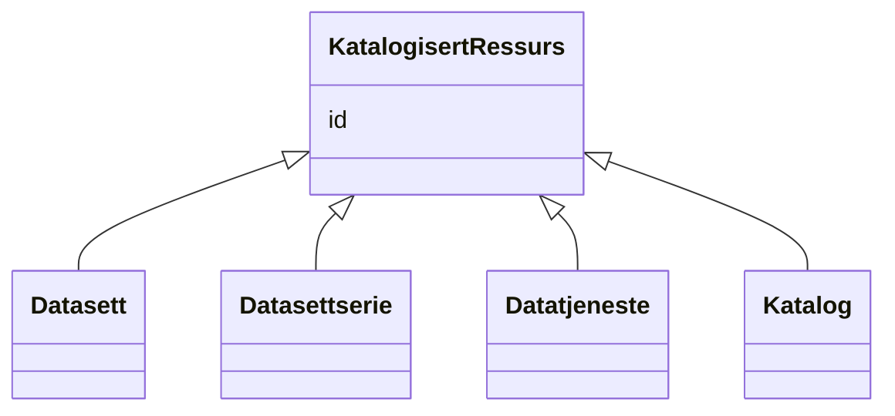

# Class: KatalogisertRessurs 


_Basisklasse for ressursar som kan katalogiserast._


* __NOTE__: this is an abstract class and should not be instantiated directly


URI: [dcat:Resource](http://www.w3.org/ns/dcat#Resource)





## Inheritance
* **KatalogisertRessurs**
    * [Datasett](datasett.md)
    * [Datasettserie](datasettserie.md)
    * [Datatjeneste](datatjeneste.md)
    * [Katalog](katalog.md)


## Class Properties

| Property | Value |
| --- | --- |
| Class URI | [dcat:Resource](http://www.w3.org/ns/dcat#Resource) |


## Eigenskapar


  
  


  
  


  
  


  
  
  
  
    
  


### Andre

| Namn | Kardinalitet og domene | Beskriving |
| --- | --- | --- |
| [id](id.md) | 1 <br/> [Uriorcurie](uriorcurie.md) | URI-identifikator for ressursen |


## Usages

| used by | used in | type | used |
| ---  | --- | --- | --- |
| [Katalogpost](katalogpost.md) | [primaertema](primaertema.md) | range | [KatalogisertRessurs](katalogisertressurs.md) |


## Identifier and Mapping Information


### Schema Source


* from schema: https://example.no/ontology/samt-bu-skole


## Mappings

| Mapping Type | Mapped Value |
| ---  | ---  |
| self | dcat:Resource |
| native | samtbuskole:KatalogisertRessurs |


## LinkML Source

<!-- TODO: investigate https://stackoverflow.com/questions/37606292/how-to-create-tabbed-code-blocks-in-mkdocs-or-sphinx -->

### Direct

<details>
```yaml
name: KatalogisertRessurs
description: Basisklasse for ressursar som kan katalogiserast.
from_schema: https://example.no/ontology/samt-bu-skole
abstract: true
slots:
- id
class_uri: dcat:Resource

```
</details>

### Induced

<details>
```yaml
name: KatalogisertRessurs
description: Basisklasse for ressursar som kan katalogiserast.
from_schema: https://example.no/ontology/samt-bu-skole
abstract: true
attributes:
  id:
    name: id
    description: URI-identifikator for ressursen.
    from_schema: https://example.no/ontology/samt-bu-skole
    rank: 1000
    identifier: true
    alias: id
    owner: KatalogisertRessurs
    domain_of:
    - Spraak
    - Mediatype
    - Konsept
    - Begrepssamling
    - KatalogisertRessurs
    - Aktor
    - Kontaktopplysning
    - Tidsrom
    - RegulativRessurs
    - Identifikator
    - Rettighetserklaring
    - Sjekksum
    - Gebyr
    - Relasjon
    - Distribusjon
    - Datasett
    - Katalogpost
    - Kvalitetsdimensjon
    - Kvalitetsmaal
    - Kvalitetsmerknad
    - Kvalitetsmaaling
    - Standard
    - Tekstdel
    range: uriorcurie
    required: true
class_uri: dcat:Resource

```
</details>