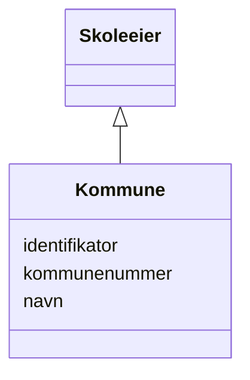

# Class: Kommune 


_En kommune er et geografisk avgrenset område som utgjør en egen politisk og administrativ enhet innen en statsdannelse._


URI: [samtbuskole:Kommune](https://example.no/ontology/skole#Kommune)





## Inheritance
* [Skoleeier](skoleeier.md)
    * **Kommune**


## Eigenskapar


  
  


  
  


  
  


  
  
  
  
    
  


### Andre

| Namn | Kardinalitet og domene | Beskriving |
| --- | --- | --- |
| [kommunenummer](kommunenummer.md) | 0..1 <br/> [String](string.md) | Kommunenummer er en nummerrekke som identifiserer kommuner eller kommunefrie ... |


### Arva

| Namn | Kardinalitet og domene | Beskriving | Frå |
| --- | --- | --- | --- || [identifikator](identifikator.md) | 1 <br/> [Uriorcurie](uriorcurie.md) | Global identifikator (CURIE/URI) | [Skoleeier](skoleeier.md) |
| [navn](navn.md) | 0..1 <br/> [String](string.md) | Namn på ressursen | [Skoleeier](skoleeier.md) |


## Usages

| used by | used in | type | used |
| ---  | --- | --- | --- |
| [Containerklasse](containerklasse.md) | [kommuner](kommuner.md) | range | [Kommune](kommune.md) |


## Identifier and Mapping Information


### Schema Source


* from schema: https://example.no/ontology/samt-bu-skole


## Mappings

| Mapping Type | Mapped Value |
| ---  | ---  |
| self | samtbuskole:Kommune |
| native | samtbuskole:Kommune |
| exact | org:Organization |


## LinkML Source

<!-- TODO: investigate https://stackoverflow.com/questions/37606292/how-to-create-tabbed-code-blocks-in-mkdocs-or-sphinx -->

### Direct

<details>
```yaml
name: Kommune
description: En kommune er et geografisk avgrenset område som utgjør en egen politisk
  og administrativ enhet innen en statsdannelse.
from_schema: https://example.no/ontology/samt-bu-skole
exact_mappings:
- org:Organization
is_a: Skoleeier
slots:
- kommunenummer

```
</details>

### Induced

<details>
```yaml
name: Kommune
description: En kommune er et geografisk avgrenset område som utgjør en egen politisk
  og administrativ enhet innen en statsdannelse.
from_schema: https://example.no/ontology/samt-bu-skole
exact_mappings:
- org:Organization
is_a: Skoleeier
attributes:
  kommunenummer:
    name: kommunenummer
    description: Kommunenummer er en nummerrekke som identifiserer kommuner eller
      kommunefrie områder.
    from_schema: https://example.no/ontology/samt-bu-skole
    close_mappings:
    - skos:notation
    rank: 1000
    slot_uri: dcat:identifier
    alias: kommunenummer
    owner: Kommune
    domain_of:
    - Kommune
    range: string
  identifikator:
    name: identifikator
    description: Global identifikator (CURIE/URI).
    from_schema: https://example.no/ontology/samt-bu-skole
    rank: 1000
    identifier: true
    alias: identifikator
    owner: Kommune
    domain_of:
    - Containerklasse
    - Skole
    - Skoleeier
    - Basisgruppe
    - Person
    range: uriorcurie
    required: true
  navn:
    name: navn
    description: Namn på ressursen.
    from_schema: https://example.no/ontology/samt-bu-skole
    rank: 1000
    alias: navn
    owner: Kommune
    domain_of:
    - Skole
    - Skoleeier
    - Basisgruppe
    - Person
    range: string

```
</details>