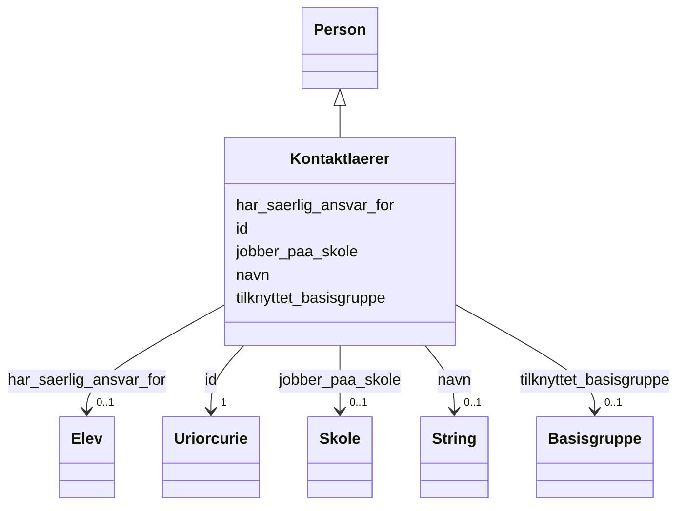

# Class: Kontaktlaerer 


_En lærer med ansvar for ei basisgruppe og er skolens kontaktpunkt for elevane i basisgruppa_


URI: [samtbuskole:Kontaktlaerer](https://example.no/ontology/skole#Kontaktlaerer)





## Inheritance
* [Person](person.md)
    * **Kontaktlaerer**


## Eigenskapar


  
  

  
  

  
  


  
  

  
  

  
  


  
  

  
  

  
  


  
  
  
  
    
  

  
  
  
  
    
  

  
  
  
  
    
  


### Andre

| Namn | Kardinalitet og domene | Beskriving |
| --- | --- | --- |
| [tilknyttet_basisgruppe](tilknyttet_basisgruppe.md) | 0..1 <br/> [Basisgruppe](basisgruppe.md) | Basisgruppe kontaktlærer er tilknyttet |
| [har_saerlig_ansvar_for](har_saerlig_ansvar_for.md) | 0..1 <br/> [Elev](elev.md) | Elev kontaktlæreren har særlig ansvar for |
| [jobber_paa_skole](jobber_paa_skole.md) | 0..1 <br/> [Skole](skole.md) | Skolen kontaktlæreren jobber på |


### Arva

| Namn | Kardinalitet og domene | Beskriving | Frå |
| --- | --- | --- | --- || [id](id.md) | 1 <br/> [xsd:anyURI](http://www.w3.org/2001/XMLSchema#anyURI) | URI-identifikator for ressursen | [Person](person.md) |
| [navn](navn.md) | 0..1 <br/> [xsd:string](http://www.w3.org/2001/XMLSchema#string) | Namn på ressursen | [Person](person.md) |


## Usages

| used by | used in | type | used |
| ---  | --- | --- | --- |
| [Containerklasse](containerklasse.md) | [kontaktlaerere](kontaktlaerere.md) | range | [Kontaktlaerer](kontaktlaerer.md) |
| [Kontaktlaerer](kontaktlaerer.md) | [tilknyttet_basisgruppe](tilknyttet_basisgruppe.md) | domain | [Kontaktlaerer](kontaktlaerer.md) |
| [Kontaktlaerer](kontaktlaerer.md) | [har_saerlig_ansvar_for](har_saerlig_ansvar_for.md) | domain | [Kontaktlaerer](kontaktlaerer.md) |
| [Kontaktlaerer](kontaktlaerer.md) | [jobber_paa_skole](jobber_paa_skole.md) | domain | [Kontaktlaerer](kontaktlaerer.md) |


## See Also

* [https://data.norge.no/concepts/59c7126f-7189-30f7-8dee-650cc9aa8762](https://data.norge.no/concepts/59c7126f-7189-30f7-8dee-650cc9aa8762)


## Identifier and Mapping Information


### Schema Source


* from schema: https://example.no/ontology/samt-bu-skole


## Mappings

| Mapping Type | Mapped Value |
| ---  | ---  |
| self | samtbuskole:Kontaktlaerer |
| native | samtbuskole:Kontaktlaerer |
| close | schema:Teacher |


## LinkML Source

<!-- TODO: investigate https://stackoverflow.com/questions/37606292/how-to-create-tabbed-code-blocks-in-mkdocs-or-sphinx -->

### Direct

<details>
```yaml
name: Kontaktlaerer
description: En lærer med ansvar for ei basisgruppe og er skolens kontaktpunkt for
  elevane i basisgruppa
from_schema: https://example.no/ontology/samt-bu-skole
see_also:
- https://data.norge.no/concepts/59c7126f-7189-30f7-8dee-650cc9aa8762
close_mappings:
- schema:Teacher
rank: 1000
is_a: Person
slots:
- tilknyttet_basisgruppe
- har_saerlig_ansvar_for
- jobber_paa_skole

```
</details>

### Induced

<details>
```yaml
name: Kontaktlaerer
description: En lærer med ansvar for ei basisgruppe og er skolens kontaktpunkt for
  elevane i basisgruppa
from_schema: https://example.no/ontology/samt-bu-skole
see_also:
- https://data.norge.no/concepts/59c7126f-7189-30f7-8dee-650cc9aa8762
close_mappings:
- schema:Teacher
rank: 1000
is_a: Person
attributes:
  tilknyttet_basisgruppe:
    name: tilknyttet_basisgruppe
    description: Basisgruppe kontaktlærer er tilknyttet
    from_schema: https://example.no/ontology/samt-bu-skole
    close_mappings:
    - schema:teaches
    rank: 1000
    domain: Kontaktlaerer
    alias: tilknyttet_basisgruppe
    owner: Kontaktlaerer
    domain_of:
    - Kontaktlaerer
    range: Basisgruppe
  har_saerlig_ansvar_for:
    name: har_saerlig_ansvar_for
    description: Elev kontaktlæreren har særlig ansvar for
    from_schema: https://example.no/ontology/samt-bu-skole
    rank: 1000
    domain: Kontaktlaerer
    alias: har_saerlig_ansvar_for
    owner: Kontaktlaerer
    domain_of:
    - Kontaktlaerer
    range: Elev
  jobber_paa_skole:
    name: jobber_paa_skole
    description: Skolen kontaktlæreren jobber på
    from_schema: https://example.no/ontology/samt-bu-skole
    close_mappings:
    - schema:worksFor
    - org:memberOf
    rank: 1000
    domain: Kontaktlaerer
    alias: jobber_paa_skole
    owner: Kontaktlaerer
    domain_of:
    - Kontaktlaerer
    range: Skole
  id:
    name: id
    description: URI-identifikator for ressursen.
    from_schema: https://data.norge.no/linkml/common-ap-no
    identifier: true
    alias: id
    owner: Kontaktlaerer
    domain_of:
    - KatalogisertRessurs
    - Aktor
    - Kontaktopplysning
    - Tidsrom
    - RegulativRessurs
    - Identifikator
    - Rettighetserklaring
    - Sjekksum
    - Gebyr
    - Relasjon
    - Distribusjon
    - Datasett
    - Katalogpost
    - Mediatype
    - Konsept
    - Begrepssamling
    - Kvalitetsdimensjon
    - Kvalitetsmaal
    - Kvalitetsmerknad
    - Kvalitetsmaaling
    - Standard
    - Tekstdel
    - Containerklasse
    - Skole
    - Skoleeier
    - Basisgruppe
    - Person
    range: uriorcurie
    required: true
  navn:
    name: navn
    description: Namn på ressursen.
    from_schema: https://example.no/ontology/samt-bu-skole
    rank: 1000
    alias: navn
    owner: Kontaktlaerer
    domain_of:
    - Skole
    - Skoleeier
    - Basisgruppe
    - Person
    range: string

```
</details>