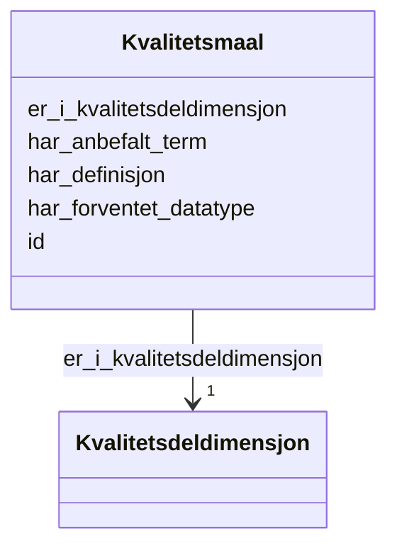

# Class: Kvalitetsmaal 


_Eit kvalitetsmål som operasjonaliserer ein kvalitetsdeldimensjon._


URI: [dqv:Metric](http://www.w3.org/ns/dqv#Metric)





<!-- no inheritance hierarchy -->

## Class Properties

| Property | Value |
| --- | --- |
| Class URI | [dqv:Metric](http://www.w3.org/ns/dqv#Metric) |


## Eigenskapar


  
  

  
  
    
  

  
  

  
  

  
  


### Obligatorisk

| Namn | Kardinalitet og domene | Beskriving |
| --- | --- | --- |
| [er_i_kvalitetsdeldimensjon](er_i_kvalitetsdeldimensjon.md) | 1 <br/> [Kvalitetsdeldimensjon](kvalitetsdeldimensjon.md) | Kvalitetsdeldimensjonen dette målet operasjonaliserer |


  
  

  
  

  
  
    
  

  
  
    
  

  
  
    
  


### Anbefalt

| Namn | Kardinalitet og domene | Beskriving |
| --- | --- | --- |
| [har_forventet_datatype](har_forventet_datatype.md) | 0..1 <br/> [Uriorcurie](uriorcurie.md) | Forventa XSD-datatype for verdien av ei kvalitetsmåling |
| [har_anbefalt_term](har_anbefalt_term.md) | * <br/> [LangString](langstring.md) | Føretrekt term/namn for dimensjonen eller målet |
| [har_definisjon](har_definisjon.md) | * <br/> [LangString](langstring.md) | Definisjon av dimensjonen eller målet |


  
  

  
  

  
  

  
  

  
  


  
  
  
  
    
  

  
  
  
    
      
    
      
    
      
    
  
  

  
  
  
    
      
    
      
    
      
    
  
  

  
  
  
    
      
    
      
    
      
    
  
  

  
  
  
    
      
    
      
    
      
    
  
  


### Andre

| Namn | Kardinalitet og domene | Beskriving |
| --- | --- | --- |
| [id](id.md) | 1 <br/> [Uriorcurie](uriorcurie.md) | URI-identifikator for ressursen |


## Usages

| used by | used in | type | used |
| ---  | --- | --- | --- |
| [Kvalitetsmaaling](kvalitetsmaaling.md) | [er_kvalitetsmaaling_av](er_kvalitetsmaaling_av.md) | range | [Kvalitetsmaal](kvalitetsmaal.md) |


## Identifier and Mapping Information


### Schema Source


* from schema: https://example.no/ontology/samt-bu-skole


## Mappings

| Mapping Type | Mapped Value |
| ---  | ---  |
| self | dqv:Metric |
| native | samtbuskole:Kvalitetsmaal |


## LinkML Source

<!-- TODO: investigate https://stackoverflow.com/questions/37606292/how-to-create-tabbed-code-blocks-in-mkdocs-or-sphinx -->

### Direct

<details>
```yaml
name: Kvalitetsmaal
description: Eit kvalitetsmål som operasjonaliserer ein kvalitetsdeldimensjon.
from_schema: https://example.no/ontology/samt-bu-skole
slots:
- id
- er_i_kvalitetsdeldimensjon
- har_forventet_datatype
- har_anbefalt_term
- har_definisjon
slot_usage:
  er_i_kvalitetsdeldimensjon:
    name: er_i_kvalitetsdeldimensjon
    in_subset:
    - Obligatorisk
    required: true
  har_forventet_datatype:
    name: har_forventet_datatype
    in_subset:
    - Anbefalt
  har_anbefalt_term:
    name: har_anbefalt_term
    in_subset:
    - Anbefalt
  har_definisjon:
    name: har_definisjon
    in_subset:
    - Anbefalt
class_uri: dqv:Metric

```
</details>

### Induced

<details>
```yaml
name: Kvalitetsmaal
description: Eit kvalitetsmål som operasjonaliserer ein kvalitetsdeldimensjon.
from_schema: https://example.no/ontology/samt-bu-skole
slot_usage:
  er_i_kvalitetsdeldimensjon:
    name: er_i_kvalitetsdeldimensjon
    in_subset:
    - Obligatorisk
    required: true
  har_forventet_datatype:
    name: har_forventet_datatype
    in_subset:
    - Anbefalt
  har_anbefalt_term:
    name: har_anbefalt_term
    in_subset:
    - Anbefalt
  har_definisjon:
    name: har_definisjon
    in_subset:
    - Anbefalt
attributes:
  id:
    name: id
    description: URI-identifikator for ressursen.
    from_schema: https://example.no/ontology/samt-bu-skole
    rank: 1000
    identifier: true
    alias: id
    owner: Kvalitetsmaal
    domain_of:
    - Containerklasse
    - Skole
    - Skoleeier
    - Basisgruppe
    - Person
    - KatalogisertRessurs
    - Aktor
    - Kontaktopplysning
    - Tidsrom
    - RegulativRessurs
    - Identifikator
    - Rettighetserklaring
    - Sjekksum
    - Gebyr
    - Relasjon
    - Distribusjon
    - Datasett
    - Katalogpost
    - Mediatype
    - Konsept
    - Begrepssamling
    - Kvalitetsdimensjon
    - Kvalitetsmaal
    - Kvalitetsmerknad
    - Kvalitetsmaaling
    - Standard
    - Tekstdel
    range: uriorcurie
    required: true
  er_i_kvalitetsdeldimensjon:
    name: er_i_kvalitetsdeldimensjon
    description: Kvalitetsdeldimensjonen dette målet operasjonaliserer.
    in_subset:
    - Obligatorisk
    from_schema: https://example.no/ontology/samt-bu-skole
    rank: 1000
    slot_uri: dqvno:inSubDimension
    alias: er_i_kvalitetsdeldimensjon
    owner: Kvalitetsmaal
    domain_of:
    - Kvalitetsmaal
    range: Kvalitetsdeldimensjon
    required: true
  har_forventet_datatype:
    name: har_forventet_datatype
    description: Forventa XSD-datatype for verdien av ei kvalitetsmåling.
    in_subset:
    - Anbefalt
    from_schema: https://example.no/ontology/samt-bu-skole
    rank: 1000
    slot_uri: dqv:expectedDataType
    alias: har_forventet_datatype
    owner: Kvalitetsmaal
    domain_of:
    - Kvalitetsmaal
    range: uriorcurie
  har_anbefalt_term:
    name: har_anbefalt_term
    description: Føretrekt term/namn for dimensjonen eller målet.
    in_subset:
    - Anbefalt
    from_schema: https://example.no/ontology/samt-bu-skole
    rank: 1000
    slot_uri: skos:prefLabel
    alias: har_anbefalt_term
    owner: Kvalitetsmaal
    domain_of:
    - Kvalitetsdimensjon
    - Kvalitetsmaal
    range: LangString
    multivalued: true
  har_definisjon:
    name: har_definisjon
    description: Definisjon av dimensjonen eller målet.
    in_subset:
    - Anbefalt
    from_schema: https://example.no/ontology/samt-bu-skole
    rank: 1000
    slot_uri: skos:definition
    alias: har_definisjon
    owner: Kvalitetsmaal
    domain_of:
    - Kvalitetsdimensjon
    - Kvalitetsmaal
    range: LangString
    multivalued: true
class_uri: dqv:Metric

```
</details>