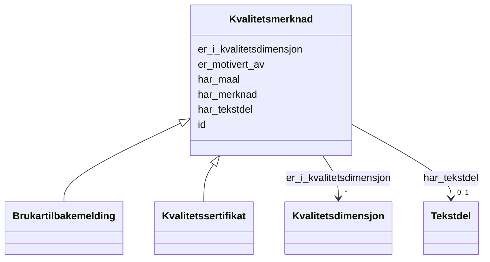

# Class: Kvalitetsmerknad 


_Ein merknad om kvaliteten til eit datasett._


URI: [dqv:QualityAnnotation](http://www.w3.org/ns/dqv#QualityAnnotation)





## Inheritance
* **Kvalitetsmerknad**
    * [Brukartilbakemelding](brukartilbakemelding.md)
    * [Kvalitetssertifikat](kvalitetssertifikat.md)


## Class Properties

| Property | Value |
| --- | --- |
| Class URI | [dqv:QualityAnnotation](http://www.w3.org/ns/dqv#QualityAnnotation) |


## Eigenskapar


  
  

  
  
    
  

  
  

  
  

  
  

  
  


### Obligatorisk

| Namn | Kardinalitet og domene | Beskriving |
| --- | --- | --- |
| [er_motivert_av](er_motivert_av.md) | 1 <br/> [Uriorcurie](uriorcurie.md) | Motivasjonen bak kvalitetsmerknaden (t |


  
  

  
  

  
  
    
  

  
  
    
  

  
  

  
  


### Anbefalt

| Namn | Kardinalitet og domene | Beskriving |
| --- | --- | --- |
| [er_i_kvalitetsdimensjon](er_i_kvalitetsdimensjon.md) | * <br/> [Kvalitetsdimensjon](kvalitetsdimensjon.md) | Refererer til kvalitetsdimensjon(ar) som kvalitetsmerknaden gjeld |
| [har_tekstdel](har_tekstdel.md) | 0..1 <br/> [Tekstdel](tekstdel.md) | Tekstleg innhald i merknaden |


  
  

  
  

  
  

  
  

  
  
    
  

  
  
    
  


### Valgfri

| Namn | Kardinalitet og domene | Beskriving |
| --- | --- | --- |
| [har_merknad](har_merknad.md) | * <br/> [LangString](langstring.md) | Fritekstmerknad (rdfs:comment) |
| [har_maal](har_maal.md) | 0..1 <br/> [Uri](uri.md) | Ressursen merknaden gjeld |


  
  
  
  
    
  

  
  
  
    
      
    
      
    
      
    
  
  

  
  
  
    
      
    
      
    
      
    
  
  

  
  
  
    
      
    
      
    
      
    
  
  

  
  
  
    
      
    
      
    
      
    
  
  

  
  
  
    
      
    
      
    
      
    
  
  


### Andre

| Namn | Kardinalitet og domene | Beskriving |
| --- | --- | --- |
| [id](id.md) | 1 <br/> [Uriorcurie](uriorcurie.md) | URI-identifikator for ressursen |


## Usages

| used by | used in | type | used |
| ---  | --- | --- | --- |
| [Containerklasse](containerklasse.md) | [kvalitetsmerknader](kvalitetsmerknader.md) | range | [Kvalitetsmerknad](kvalitetsmerknad.md) |
| [Datasett](datasett.md) | [har_kvalitetsmerknad](har_kvalitetsmerknad.md) | range | [Kvalitetsmerknad](kvalitetsmerknad.md) |


## Identifier and Mapping Information


### Schema Source


* from schema: https://example.no/ontology/samt-bu-skole


## Mappings

| Mapping Type | Mapped Value |
| ---  | ---  |
| self | dqv:QualityAnnotation |
| native | samtbuskole:Kvalitetsmerknad |


## LinkML Source

<!-- TODO: investigate https://stackoverflow.com/questions/37606292/how-to-create-tabbed-code-blocks-in-mkdocs-or-sphinx -->

### Direct

<details>
```yaml
name: Kvalitetsmerknad
description: Ein merknad om kvaliteten til eit datasett.
from_schema: https://example.no/ontology/samt-bu-skole
slots:
- id
- er_motivert_av
- er_i_kvalitetsdimensjon
- har_tekstdel
- har_merknad
- har_maal
slot_usage:
  er_motivert_av:
    name: er_motivert_av
    in_subset:
    - Obligatorisk
    required: true
  er_i_kvalitetsdimensjon:
    name: er_i_kvalitetsdimensjon
    in_subset:
    - Anbefalt
  har_tekstdel:
    name: har_tekstdel
    in_subset:
    - Anbefalt
  har_merknad:
    name: har_merknad
    in_subset:
    - Valgfri
  har_maal:
    name: har_maal
    in_subset:
    - Valgfri
class_uri: dqv:QualityAnnotation

```
</details>

### Induced

<details>
```yaml
name: Kvalitetsmerknad
description: Ein merknad om kvaliteten til eit datasett.
from_schema: https://example.no/ontology/samt-bu-skole
slot_usage:
  er_motivert_av:
    name: er_motivert_av
    in_subset:
    - Obligatorisk
    required: true
  er_i_kvalitetsdimensjon:
    name: er_i_kvalitetsdimensjon
    in_subset:
    - Anbefalt
  har_tekstdel:
    name: har_tekstdel
    in_subset:
    - Anbefalt
  har_merknad:
    name: har_merknad
    in_subset:
    - Valgfri
  har_maal:
    name: har_maal
    in_subset:
    - Valgfri
attributes:
  id:
    name: id
    description: URI-identifikator for ressursen.
    from_schema: https://example.no/ontology/samt-bu-skole
    rank: 1000
    identifier: true
    alias: id
    owner: Kvalitetsmerknad
    domain_of:
    - Spraak
    - Mediatype
    - Konsept
    - Begrepssamling
    - KatalogisertRessurs
    - Aktor
    - Kontaktopplysning
    - Tidsrom
    - RegulativRessurs
    - Identifikator
    - Rettighetserklaring
    - Sjekksum
    - Gebyr
    - Relasjon
    - Distribusjon
    - Datasett
    - Katalogpost
    - Kvalitetsdimensjon
    - Kvalitetsmaal
    - Kvalitetsmerknad
    - Kvalitetsmaaling
    - Standard
    - Tekstdel
    range: uriorcurie
    required: true
  er_motivert_av:
    name: er_motivert_av
    description: Motivasjonen bak kvalitetsmerknaden (t.d. oa:assessing).
    in_subset:
    - Obligatorisk
    from_schema: https://example.no/ontology/samt-bu-skole
    rank: 1000
    slot_uri: oa:motivatedBy
    alias: er_motivert_av
    owner: Kvalitetsmerknad
    domain_of:
    - Kvalitetsmerknad
    range: uriorcurie
    required: true
  er_i_kvalitetsdimensjon:
    name: er_i_kvalitetsdimensjon
    description: 'Refererer til kvalitetsdimensjon(ar) som kvalitetsmerknaden gjeld.

      '
    in_subset:
    - Anbefalt
    from_schema: https://example.no/ontology/samt-bu-skole
    rank: 1000
    slot_uri: dqv:inDimension
    alias: er_i_kvalitetsdimensjon
    owner: Kvalitetsmerknad
    domain_of:
    - Kvalitetsmerknad
    - Standard
    range: Kvalitetsdimensjon
    required: false
    multivalued: true
  har_tekstdel:
    name: har_tekstdel
    description: Tekstleg innhald i merknaden.
    in_subset:
    - Anbefalt
    from_schema: https://example.no/ontology/samt-bu-skole
    rank: 1000
    slot_uri: oa:hasBody
    alias: har_tekstdel
    owner: Kvalitetsmerknad
    domain_of:
    - Kvalitetsmerknad
    range: Tekstdel
  har_merknad:
    name: har_merknad
    description: Fritekstmerknad (rdfs:comment).
    in_subset:
    - Valgfri
    from_schema: https://example.no/ontology/samt-bu-skole
    rank: 1000
    slot_uri: rdfs:comment
    alias: har_merknad
    owner: Kvalitetsmerknad
    domain_of:
    - Kvalitetsmerknad
    - Kvalitetsmaaling
    - Standard
    range: LangString
    multivalued: true
  har_maal:
    name: har_maal
    annotations:
      gyldige_verdier:
        tag: gyldige_verdier
        value: dcat:Resource
    description: Ressursen merknaden gjeld.
    in_subset:
    - Valgfri
    from_schema: https://example.no/ontology/samt-bu-skole
    rank: 1000
    slot_uri: oa:hasTarget
    alias: har_maal
    owner: Kvalitetsmerknad
    domain_of:
    - Kvalitetsmerknad
    range: uri
class_uri: dqv:QualityAnnotation

```
</details>