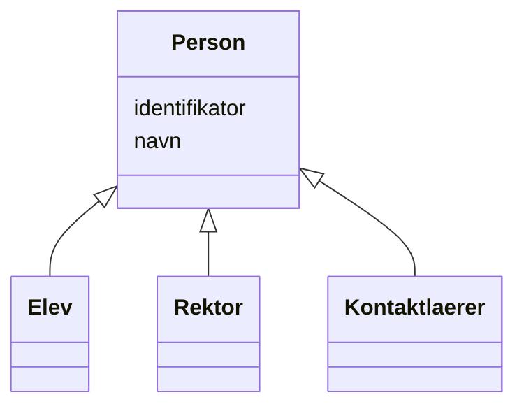

# Class: Person 


_Eit menneske individ_


* __NOTE__: this is an abstract class and should not be instantiated directly


URI: [samtbuskole:Person](https://example.no/ontology/skole#Person)





## Inheritance
* **Person**
    * [Elev](elev.md)
    * [Rektor](rektor.md)
    * [Kontaktlaerer](kontaktlaerer.md)


## Eigenskapar


  
  

  
  


  
  

  
  


  
  

  
  


  
  
  
  
    
  

  
  
  
  
    
  


### Andre

| Namn | Kardinalitet og domene | Beskriving |
| --- | --- | --- |
| [identifikator](identifikator.md) | 1 <br/> [Uriorcurie](uriorcurie.md) | Global identifikator (CURIE/URI) |
| [navn](navn.md) | 0..1 <br/> [String](string.md) | Namn på ressursen |


## Identifier and Mapping Information


### Schema Source


* from schema: https://example.no/ontology/samt-bu-skole


## Mappings

| Mapping Type | Mapped Value |
| ---  | ---  |
| self | samtbuskole:Person |
| native | samtbuskole:Person |
| exact | foaf:Person |


## LinkML Source

<!-- TODO: investigate https://stackoverflow.com/questions/37606292/how-to-create-tabbed-code-blocks-in-mkdocs-or-sphinx -->

### Direct

<details>
```yaml
name: Person
description: Eit menneske individ
from_schema: https://example.no/ontology/samt-bu-skole
exact_mappings:
- foaf:Person
abstract: true
slots:
- identifikator
- navn

```
</details>

### Induced

<details>
```yaml
name: Person
description: Eit menneske individ
from_schema: https://example.no/ontology/samt-bu-skole
exact_mappings:
- foaf:Person
abstract: true
attributes:
  identifikator:
    name: identifikator
    description: Global identifikator (CURIE/URI).
    from_schema: https://example.no/ontology/samt-bu-skole
    rank: 1000
    identifier: true
    alias: identifikator
    owner: Person
    domain_of:
    - Containerklasse
    - Skole
    - Skoleeier
    - Basisgruppe
    - Person
    range: uriorcurie
    required: true
  navn:
    name: navn
    description: Namn på ressursen.
    from_schema: https://example.no/ontology/samt-bu-skole
    rank: 1000
    alias: navn
    owner: Person
    domain_of:
    - Skole
    - Skoleeier
    - Basisgruppe
    - Person
    range: string

```
</details>