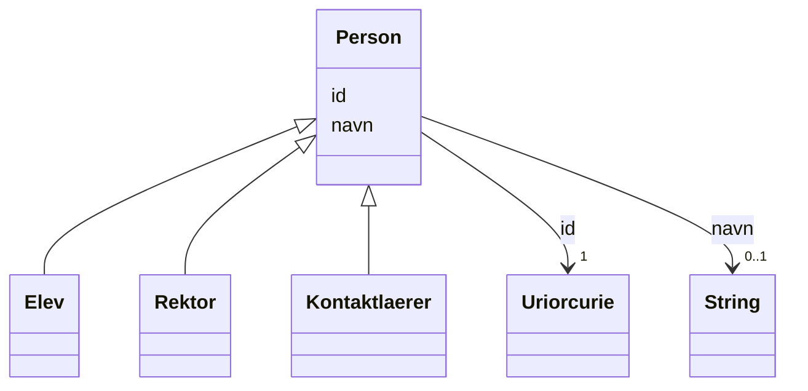

# Class: Person 


_Eit menneske individ_


* __NOTE__: this is an abstract class and should not be instantiated directly


URI: [samtbuskole:Person](https://example.no/ontology/skole#Person)





## Inheritance
* **Person**
    * [Elev](elev.md)
    * [Rektor](rektor.md)
    * [Kontaktlaerer](kontaktlaerer.md)


## Eigenskapar


  
  

  
  


  
  

  
  


  
  

  
  


  
  
  
  
    
  

  
  
  
  
    
  


### Andre

| Namn | Kardinalitet og domene | Beskriving |
| --- | --- | --- |
| [id](id.md) | 1 <br/> [xsd:anyURI](http://www.w3.org/2001/XMLSchema#anyURI) | URI-identifikator for ressursen |
| [navn](navn.md) | 0..1 <br/> [xsd:string](http://www.w3.org/2001/XMLSchema#string) | Namn på ressursen |


## See Also

* [https://data.norge.no/concepts/9adf3e97-c9c2-3ee7-bc97-8f2a7e7fa69e](https://data.norge.no/concepts/9adf3e97-c9c2-3ee7-bc97-8f2a7e7fa69e)


## Identifier and Mapping Information


### Schema Source


* from schema: https://example.no/ontology/samt-bu-skole


## Mappings

| Mapping Type | Mapped Value |
| ---  | ---  |
| self | samtbuskole:Person |
| native | samtbuskole:Person |
| exact | foaf:Person |


## LinkML Source

<!-- TODO: investigate https://stackoverflow.com/questions/37606292/how-to-create-tabbed-code-blocks-in-mkdocs-or-sphinx -->

### Direct

<details>
```yaml
name: Person
description: Eit menneske individ
from_schema: https://example.no/ontology/samt-bu-skole
see_also:
- https://data.norge.no/concepts/9adf3e97-c9c2-3ee7-bc97-8f2a7e7fa69e
exact_mappings:
- foaf:Person
rank: 1000
abstract: true
slots:
- id
- navn

```
</details>

### Induced

<details>
```yaml
name: Person
description: Eit menneske individ
from_schema: https://example.no/ontology/samt-bu-skole
see_also:
- https://data.norge.no/concepts/9adf3e97-c9c2-3ee7-bc97-8f2a7e7fa69e
exact_mappings:
- foaf:Person
rank: 1000
abstract: true
attributes:
  id:
    name: id
    description: URI-identifikator for ressursen.
    from_schema: https://data.norge.no/ap-no/common-ap-no
    identifier: true
    owner: Person
    domain_of:
    - KatalogisertRessurs
    - Aktor
    - Kontaktopplysning
    - Tidsrom
    - RegulativRessurs
    - Identifikator
    - Rettighetserklaring
    - Sjekksum
    - Gebyr
    - Relasjon
    - Distribusjon
    - Datasett
    - Katalogpost
    - Mediatype
    - Konsept
    - Begrepssamling
    - Kvalitetsdimensjon
    - Kvalitetsmaal
    - Kvalitetsmerknad
    - Kvalitetsmaaling
    - Standard
    - Tekstdel
    - SamtBuContainer
    - Skole
    - Skoleeier
    - Basisgruppe
    - Person
    range: uriorcurie
    required: true
  navn:
    name: navn
    description: Namn på ressursen.
    from_schema: https://example.no/ontology/samt-bu-skole
    rank: 1000
    owner: Person
    domain_of:
    - Skole
    - Skoleeier
    - Basisgruppe
    - Person
    range: string

```
</details>