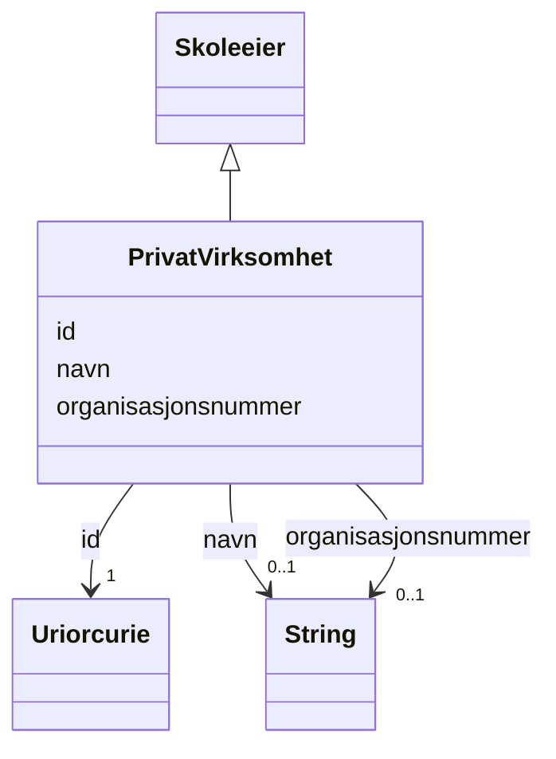

# Class: PrivatVirksomhet 


_Virksomhet, eller foretak, er betegnelser for en juridisk person eller en organisasjon som produserer varer eller tjenester._


URI: [samtbuskole:PrivatVirksomhet](https://example.no/ontology/skole#PrivatVirksomhet)





## Inheritance
* [Skoleeier](skoleeier.md)
    * **PrivatVirksomhet**


## Eigenskapar


  
  


  
  


  
  


  
  
  
  
    
  


### Andre

| Namn | Kardinalitet og domene | Beskriving |
| --- | --- | --- |
| [organisasjonsnummer](organisasjonsnummer.md) | 0..1 <br/> [xsd:string](http://www.w3.org/2001/XMLSchema#string) | Organisasjonsnummer er i Norge et ni-sifret registreringsnummer som tildeles ... |


### Arva

| Namn | Kardinalitet og domene | Beskriving | Frå |
| --- | --- | --- | --- || [id](id.md) | 1 <br/> [xsd:anyURI](http://www.w3.org/2001/XMLSchema#anyURI) | URI-identifikator for ressursen | [Skoleeier](skoleeier.md) |
| [navn](navn.md) | 0..1 <br/> [xsd:string](http://www.w3.org/2001/XMLSchema#string) | Namn på ressursen | [Skoleeier](skoleeier.md) |


## Usages

| used by | used in | type | used |
| ---  | --- | --- | --- |
| [Containerklasse](containerklasse.md) | [private_virksomheter](private_virksomheter.md) | range | [PrivatVirksomhet](privatvirksomhet.md) |


## Identifier and Mapping Information


### Schema Source


* from schema: https://example.no/ontology/samt-bu-skole


## Mappings

| Mapping Type | Mapped Value |
| ---  | ---  |
| self | samtbuskole:PrivatVirksomhet |
| native | samtbuskole:PrivatVirksomhet |
| exact | org:Organization, schema:Organization |


## LinkML Source

<!-- TODO: investigate https://stackoverflow.com/questions/37606292/how-to-create-tabbed-code-blocks-in-mkdocs-or-sphinx -->

### Direct

<details>
```yaml
name: PrivatVirksomhet
description: Virksomhet, eller foretak, er betegnelser for en juridisk person eller
  en organisasjon som produserer varer eller tjenester.
from_schema: https://example.no/ontology/samt-bu-skole
exact_mappings:
- org:Organization
- schema:Organization
rank: 1000
is_a: Skoleeier
slots:
- organisasjonsnummer

```
</details>

### Induced

<details>
```yaml
name: PrivatVirksomhet
description: Virksomhet, eller foretak, er betegnelser for en juridisk person eller
  en organisasjon som produserer varer eller tjenester.
from_schema: https://example.no/ontology/samt-bu-skole
exact_mappings:
- org:Organization
- schema:Organization
rank: 1000
is_a: Skoleeier
attributes:
  organisasjonsnummer:
    name: organisasjonsnummer
    description: Organisasjonsnummer er i Norge et ni-sifret registreringsnummer som
      tildeles av Enhetsregisteret ved Brønnøysundregistrene for en organisasjon (foretak,
      idrettslag og lignende).
    from_schema: https://example.no/ontology/samt-bu-skole
    exact_mappings:
    - adms:identifier
    rank: 1000
    slot_uri: dct:identifier
    alias: organisasjonsnummer
    owner: PrivatVirksomhet
    domain_of:
    - PrivatVirksomhet
    range: string
  id:
    name: id
    description: URI-identifikator for ressursen.
    from_schema: https://data.norge.no/linkml/common-ap-no
    identifier: true
    alias: id
    owner: PrivatVirksomhet
    domain_of:
    - KatalogisertRessurs
    - Aktor
    - Kontaktopplysning
    - Tidsrom
    - RegulativRessurs
    - Identifikator
    - Rettighetserklaring
    - Sjekksum
    - Gebyr
    - Relasjon
    - Distribusjon
    - Datasett
    - Katalogpost
    - Mediatype
    - Konsept
    - Begrepssamling
    - Kvalitetsdimensjon
    - Kvalitetsmaal
    - Kvalitetsmerknad
    - Kvalitetsmaaling
    - Standard
    - Tekstdel
    - Containerklasse
    - Skole
    - Skoleeier
    - Basisgruppe
    - Person
    range: uriorcurie
    required: true
  navn:
    name: navn
    description: Namn på ressursen.
    from_schema: https://example.no/ontology/samt-bu-skole
    rank: 1000
    alias: navn
    owner: PrivatVirksomhet
    domain_of:
    - Skole
    - Skoleeier
    - Basisgruppe
    - Person
    range: string

```
</details>